# Cannabis Symptoms & Deficiencies Guide (High-Res)
*Scraped and compiled from Grow Weed Easy*

## Complete List of ALL Cannabis Growing Problems

**This is everything we've got in one long list!**

Cannabis deficiencies and other cannabis leaf symptoms can be a headache for any grower. Luckily, many weird weed leaf spots, marijuana leaves turning yellow, the whole marijuana plant turning yellow, and other strange cannabis leaf deficiencies can be fixed by getting a good nutrient system that is formulated for plants like the tomato.

Although cannabis nutrient deficiencies can be prevented with good cannabis-friendly nutrients ([learn which nutrients work for preventing marijuana deficiencies](https://www.growweedeasy.com/nutrients)) it's also important to [maintain a proper pH](https://www.growweedeasy.com/ph) in order to prevent marijuana nutrient deficiencies and weed leaf symptoms. If you're using good cannabis nutrients but you're still seeing cannabis leaves with spots or cannabis leaves turning yellow, it's probably the pH so act immediately!

View **pictures** and **descriptions** below of all the common **marijuana nutrient deficiencies, marijuana problems** and other **weed leaf deficiencies**. Don't let weed growing problems hurt your plants, get the solutions!

## Accidental Re-Vegging

by Nebula Haze

## What Makes Cannabis Plants Grow Smooth Leaves? Re-vegging.

What does it mean to accidentally "re-veg" a cannabis plant? "Re-veg" is short for "re-vegetation" and refers to what happens if a plant that has started flowering re-enters the vegetative stage. The majority of cannabis plants are photoperiod strains, which need long nights in order to make flowers/buds (indoor growers typically give [12 hours of uninterrupted darkness a day](https://www.growweedeasy.com/light-schedules)). If the plant starts getting light during its night time it responds by re-vegging.

Sometimes even just a little light like a blinking LED in your grow tent, or checking on plants during lights-off is all it takes to interrupt your plant's beauty sleep. For outdoor growers, the light from a street lamp or window can be the culprit.

**Re-vegging happens when flowering plants get light during their 12-hour dark period. A few interrupted nights or even a small light leak can start a re-veg!**

[

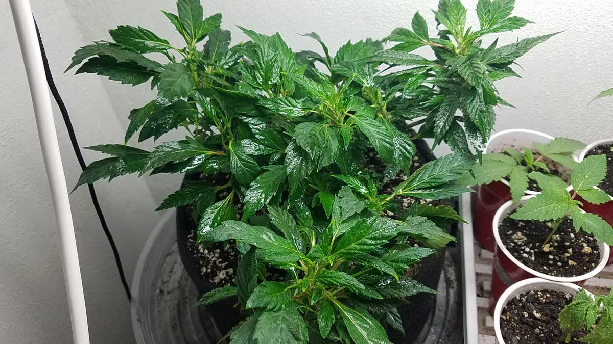

](https://www.growweedeasy.com/wp-content/uploads/2017/06/example-monstercropped-plant-getting-bushy-GDTRFB95.jpg)

Re-vegging cannabis plants show odd leaf symptoms such as:

* smooth leaf edges
* buds stop developing
* long leaves or new stems grow out of bud sites
* main stem sprouts 1-point leaves (just one "finger" per leaf instead of the typical 7 or 9 for adult cannabis leaves)
* curling leaves (may look like heat stress)
* wrinkled, twisted, or unusual growth

This plant was put outside too early in the Spring season, which caused it to start flowering due to the short nights. As Spring progressed the nights grew shorter and it began revegging, growing these oddly smooth leaves directly out of the center stem.

[

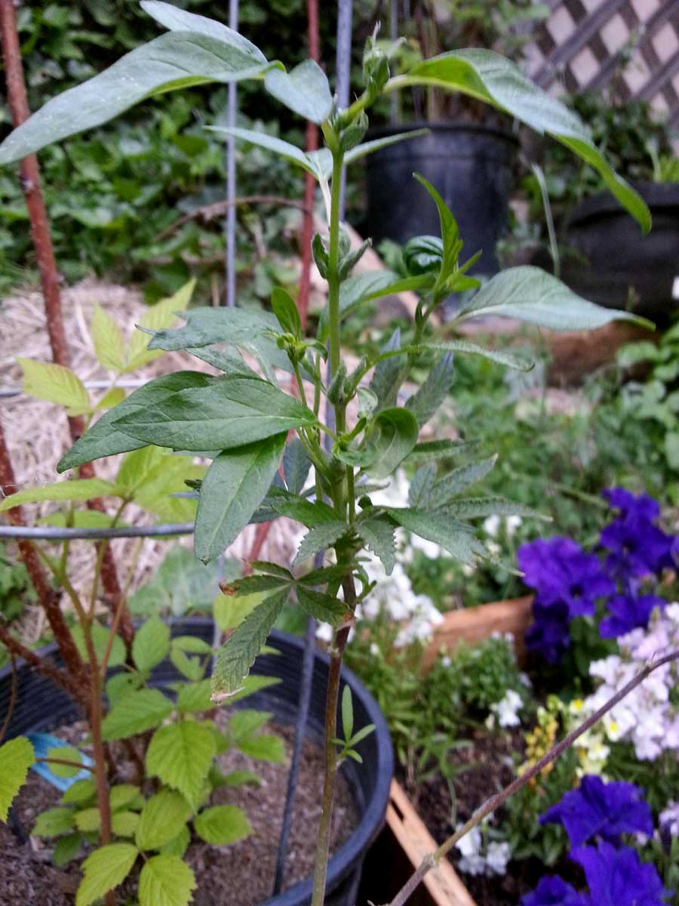

](https://www.growweedeasy.com/wp-content/uploads/2015/12/re-veg-monster-crop.jpg)

Unusual single-point leaves started growing out of the developing buds of this plant in the middle of the flowering stage. The grower didn't realize that turning the light on for a few moments during the dark period could cause a problem. If the plant is getting light at night, it only takes a few days to "flip the switch" and initiate the re-vegging process!

**[

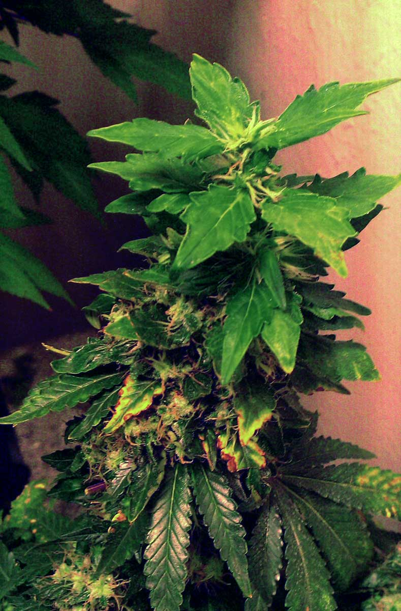

](https://www.growweedeasy.com/wp-content/uploads/2015/12/re-veg-almost-done-flowering.jpg)**

Some revegging symptoms include wrinkling, curling, or twisted leaves. These symptoms may be confused for watering, heat problems, or even [broad mites](https://www.growweedeasy.com/cannabis-plant-problems/broad-mites), when they're actually a sign the plant is going through major internal changes. Notice the wrinkled leaves in this picture are more smooth around the edges than typical leaves. That's a key sign this plant is re-vegging.

[

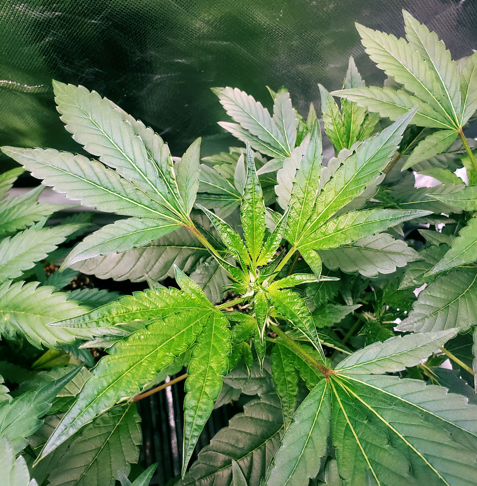

](https://www.growweedeasy.com/wp-content/uploads/2018/07/re-vegging-plant-wrinkled-leaves-look-like-heat-stress.jpg)

This plant was already flowering indoors, but when it was brought outside in the spring, the short nights caused it to start re-vegging almost immediately.

[

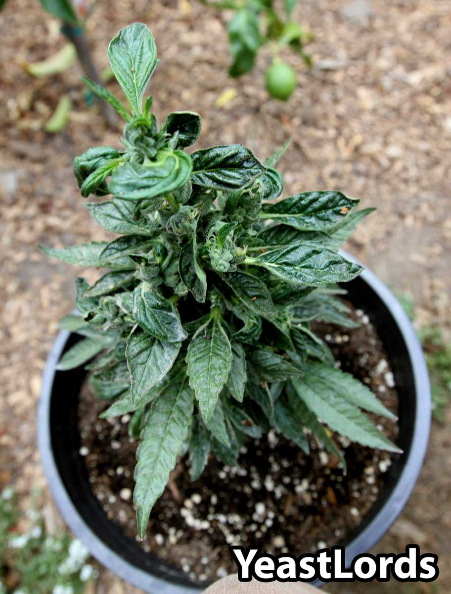

](https://www.growweedeasy.com/wp-content/uploads/2015/12/unhappy-reveg.jpg)

These clones were recently taken from a flowering plant and have started re-vegging, causing odd growth and some smooth-edged leaves. Like many of the other cases of re-vegging, you can also see several single-point leaves among the new growth.

[

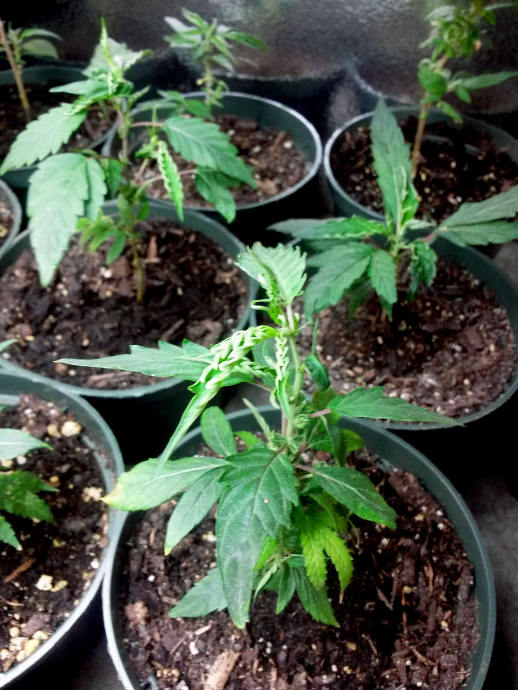

](https://www.growweedeasy.com/wp-content/uploads/2018/07/monstercrop-clones-just-transplanted-to-soil.jpg)

This outdoor cannabis plant started re-vegging, resulting in odd, twisted growth as well as smooth single-point leaves with long stems. It started revegging because it was growing near a window in the house that was shining light on the plant.

[

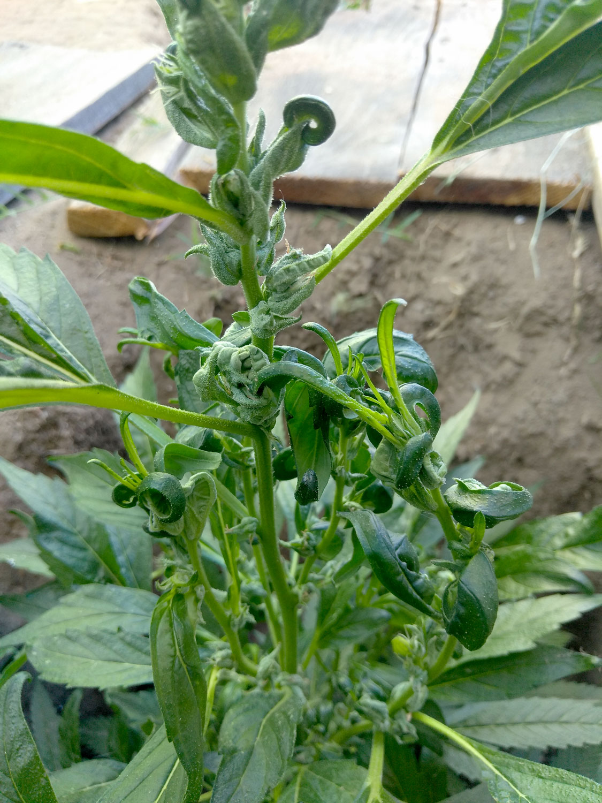

](https://www.growweedeasy.com/wp-content/uploads/2018/07/twisted-growth-smooth-single-point-leaves-are-signs-of-revegging.jpg)

This plant was given a [12/12 light schedule after germination](https://www.growweedeasy.com/12-12-from-seed) and buds (white hairs) started to form. The grower realized he wanted a bigger plant so he switched to a 20/4 light schedule so the plant would re-veg. Buds stopped developing and single-point leaves started growing out of the buds. Although you can still see a few white hairs, it is almost fully back into the vegetative stage at this point.

[

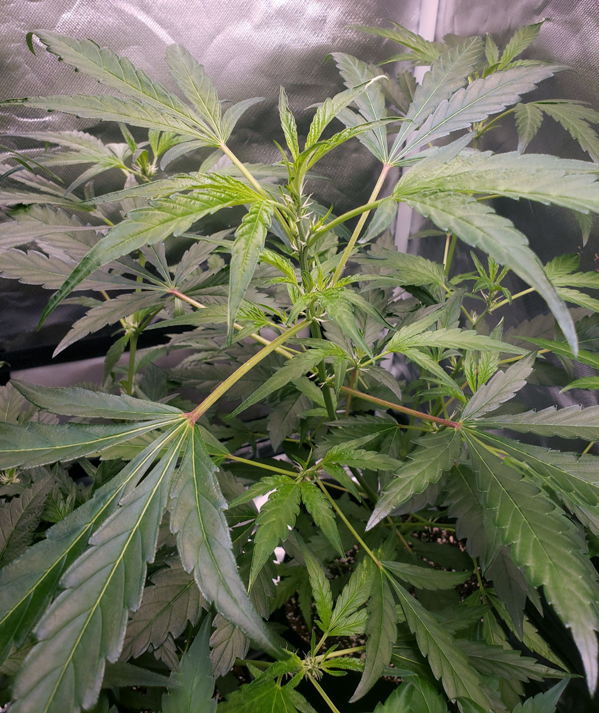

](https://www.growweedeasy.com/wp-content/uploads/2018/07/re-vegging-cannabis-plant-sm.jpg)

The leaves of a re-vegging plant may look different depending on the environment and particular strain. Ultimately, you know it's the symptoms of re-vegging when the leaves appear more smooth than typical leaves. There really aren't any other cannabis problems that cause that particular symptom.

[

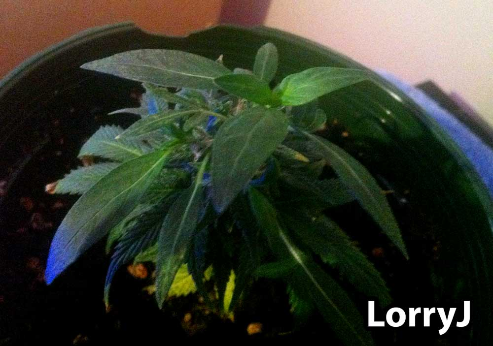

](https://www.growweedeasy.com/wp-content/uploads/2015/12/clone-of-budding-plant-reveg.jpg)

Each cannabis plant expresses re-vegging a little differently!

[

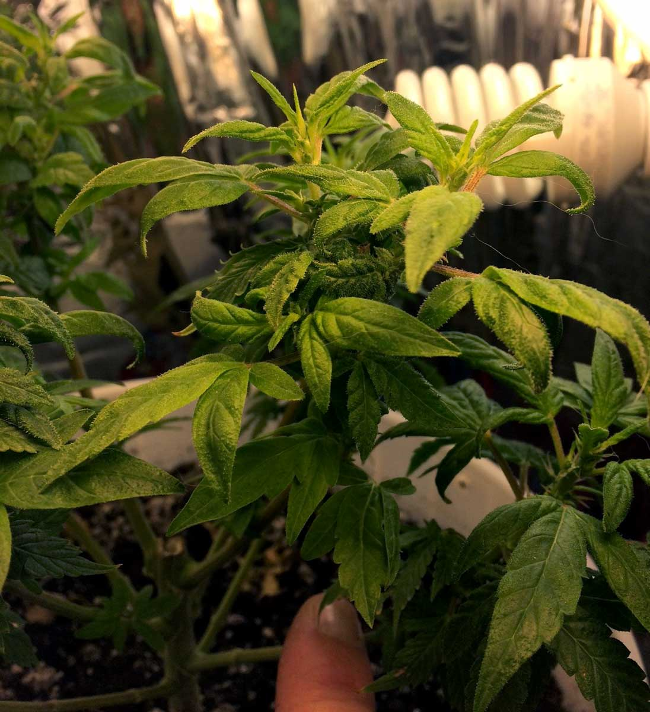

](https://www.growweedeasy.com/wp-content/uploads/2015/12/cannabis-re-veg-after-harvest-odd-round-leaves.jpg)

Sometimes marijuana growers choose to re-veg their plants purposely, for example [monstercropping](https://www.growweedeasy.com/monstercropping-cannabis-tutorial) (taking a marijuana clone from a plant in the flowering phase in order to change the clone's initial growth patterns) or to [harvest a plant for a second time](https://www.growweedeasy.com/re-veg-monstercropping#re-harvest-cannabis-plant) (put it back into the vegetative stage and grow the whole plant out again after harvest, sometimes used by outdoor growers in warm climates to get a second harvest in a year).

Unfortunately, most of the time a grower sees the tell-tale leaves of a re-vegging plant, it's an unwelcome sight!

## What to Do About Accidental Re-Vegging

When a plant is revegging, you basically only have two choices.

* Let it re-vegetate completely if you actually want the plant to be in the vegetative stage, or&#8230;
* Correct the light periods by getting rid of any possible light leaks and giving plants 12 hours of interrupted darkness a day (to get them to go back into the flowering stage).

Plants that are far in the flowering stage can take a month or more to re-veg, while a plant that has only just started flowering re-vegs much faster. That goes both ways. If a plant has been re-vegging for a long time, it may take a few weeks to get the plant back to flowering and developing buds.

Luckily, a little time and proper care will get your plant growing normally again!

This cutting was taken off a flowering marijuana plant and put in a cloning device so it would re-develop roots and grow into a new plant. After a few days of growing, it started producing the typical rounded leaves of a re-veg.

[

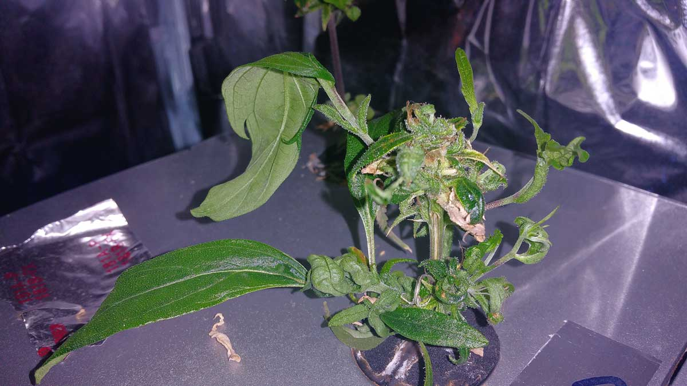

](https://www.growweedeasy.com/wp-content/uploads/2015/12/cannabis-re-veg-bud-clone.jpg)

About two weeks later, the plant is growing (mostly) normal leaves. Cannabis plants tend to grow a lot of stems and get bushy immediately after a re-veg, which can be seen heree. Although the growth patterns were odd at first, from this point on, the plant usually has relatively typical growing patterns.

[

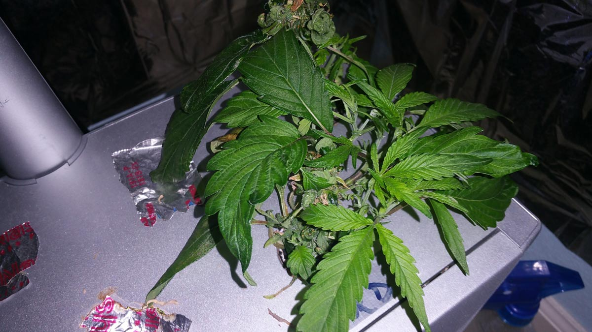

](https://www.growweedeasy.com/wp-content/uploads/2015/12/recovering-reveg-clone-monstercrop.jpg)*Re-vegging cannabis pictures by Don B*

If you see your cannabis plant re-vegging, don't panic! Figure out whether you want your plant to be in the vegetative or flowering stage and act accordingly. A little time is all it takes after that to get your plant in tip-top shape again.

## Beet Curly Top Virus

by Nebula Haze

This article on beet curly top virus in cannabis plants is largely based on the invaluable contributions of [**Whitney Cranshaw**](https://agsci.colostate.edu/old-agbio/people-button/emeritus-faculty/whitney-cranshaw/). Cranshaw has built an extensive repository on [hemp pests](https://agsci.colostate.edu/hempinsects/hemp-insects-text/) (*note:* hemp and high-THC cannabis are the same species of plant, and experience the same pests) and generously offers [pest pictures and information](https://www.forestryimages.org/browse/autimages.cfm?aut=5062) to the cannabis-growing and scientific communities.

I would also like to thank Dr. Punya Nachappa, Judith Chiginsky, and Bob Hammon for contributing online resources on beet curly top virus in cannabis plants to help create a comprehensive information sheet [[PDF](https://www.growweedeasy.com/wp-content/uploads/2023/02/Curly-Top-Beet-Leafhopper-2020.pdf)] on the subject. For further reading, Colorado State University offers more [excellent cannabis pest information sheets](https://agsci.colostate.edu/hempinsects/hemp-insects-text/).

## Pictures of Cannabis Plants with Beet Curly Top Virus

Some cannabis plants get yellow and stunted, but may not show the "curly top" symptoms. First, the "curly top" everyone's talking about:

"Leaf curling associated with infection of hemp by beet curly top virus." ~Whitney Cranshaw

[

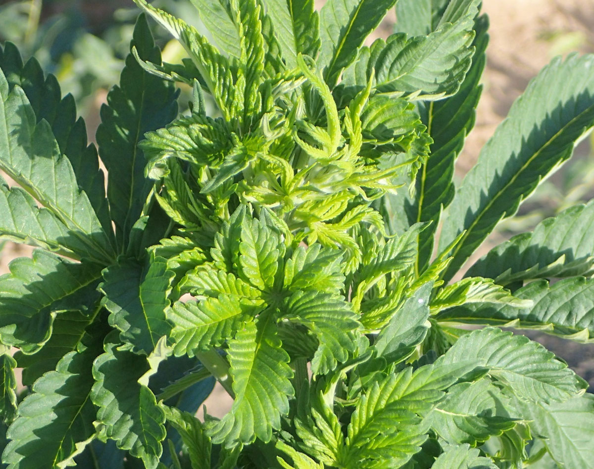

](https://www.growweedeasy.com/wp-content/uploads/2023/09/beet-curly-top-virus-cannabis-symptoms-Leaf-curling-associated-with-infection-of-hemp-by-beet-curly-top-virus-by-Whitney-Cranshaw-of-Colorado-State-University.jpg)

[

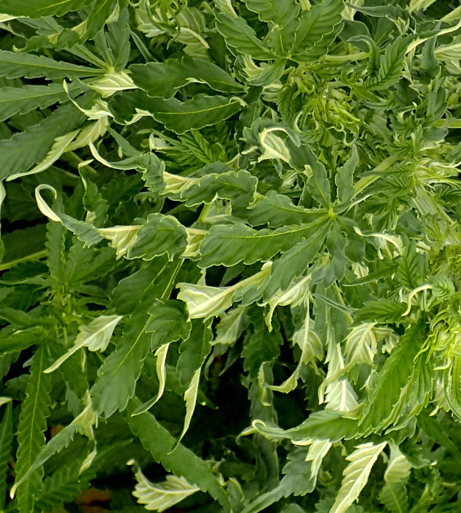

](https://www.growweedeasy.com/wp-content/uploads/2023/09/closeup-of-beet-curly-top-virus-cannabis-symptoms-Leaf-curling-associated-with-infection-of-hemp-by-beet-curly-top-virus-by-Whitney-Cranshaw-of-Colorado-State-University.jpg)

[

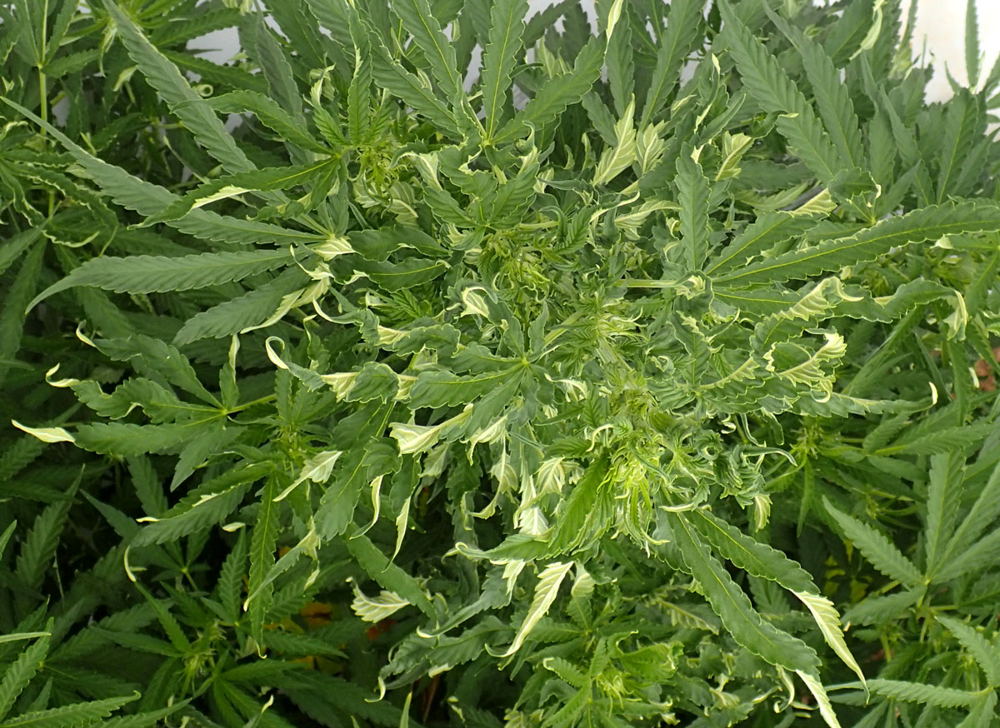

](https://www.growweedeasy.com/wp-content/uploads/2023/09/example-of-beet-curly-top-virus-cannabis-symptoms-Leaf-curling-associated-with-infection-of-hemp-by-beet-curly-top-virus-by-Whitney-Cranshaw-of-Colorado-State-University.jpg)

"&#8216;Classic' symptoms of beet curly top virus infection of hemp, with generalized yellowing of the plant, without leaf distortion, and stunting." ~ Whitney Cranshaw

[

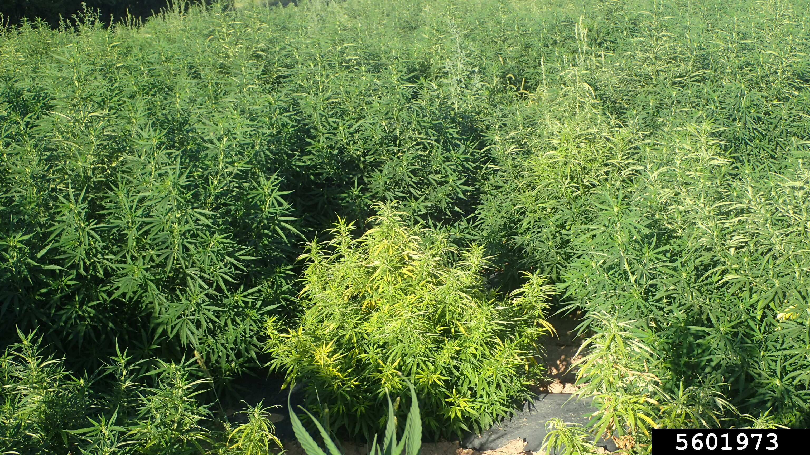

](https://www.growweedeasy.com/wp-content/uploads/2023/09/beet-curly-top-virus-BCTV-Hybrigeminivirus-Beet-curly-top-virus-Leaf-curling-associated-with-infection-of-cannabis-hemp-by-beet-curly-top-virus-by-Whitney-Cranshaw-of-Colorado-State-University-9.jpg)

[

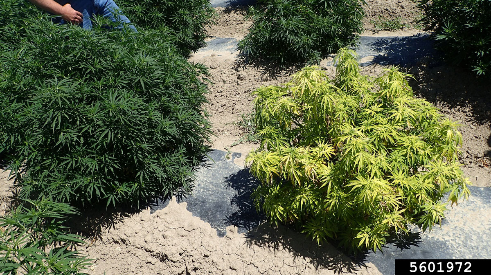

](https://www.growweedeasy.com/wp-content/uploads/2023/09/beet-curly-top-virus-BCTV-Hybrigeminivirus-Beet-curly-top-virus-Leaf-curling-associated-with-infection-of-cannabis-hemp-by-beet-curly-top-virus-by-Whitney-Cranshaw-of-Colorado-State-University-8.jpg)

[

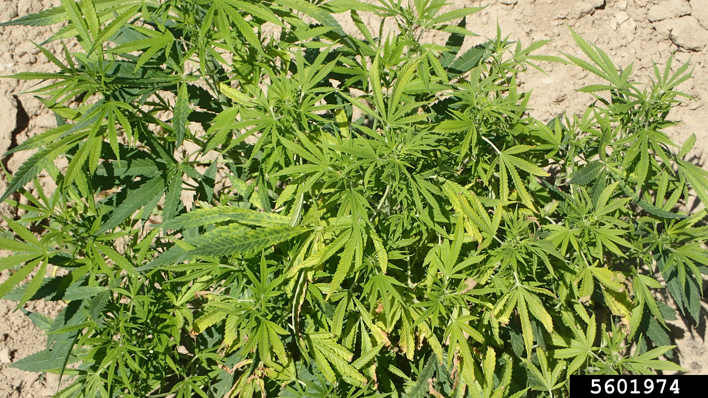

](https://www.growweedeasy.com/wp-content/uploads/2023/09/beet-curly-top-virus-BCTV-Hybrigeminivirus-Beet-curly-top-virus-Leaf-curling-associated-with-infection-of-cannabis-hemp-by-beet-curly-top-virus-by-Whitney-Cranshaw-of-Colorado-State-University-6.jpg)

## Leafhoppers Spread Beet Curly Top Virus!

Check out the [full page on leafhoppers](https://www.growweedeasy.com/cannabis-plant-problems/leafhoppers) (one of the leading vectors for beet curly top virus in cannabis plants).

The beet leafhopper is a host for Beet Curly Top Virus, and easily spreads the disease while feeding. Photographer: [A.C. Magyarosy](https://www.forestryimages.org/browse/detail.cfm?imgnum=0454052)

[

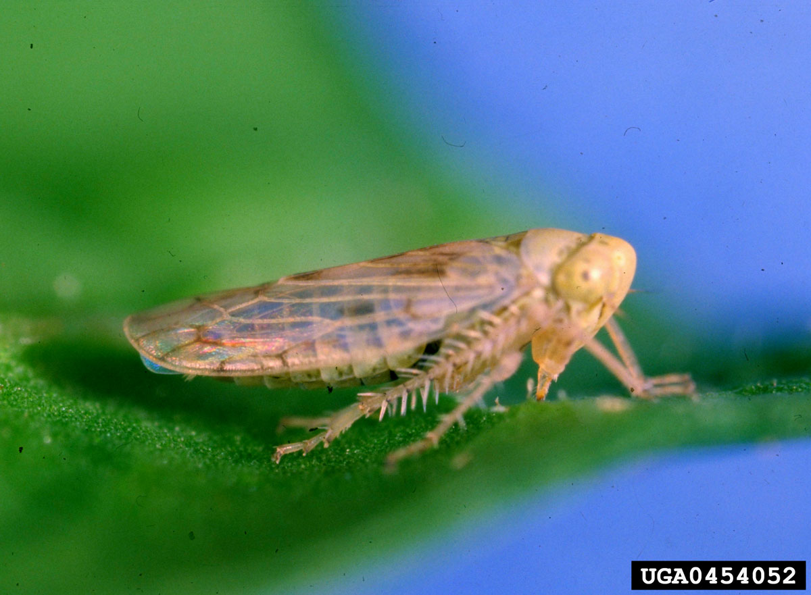

](https://www.growweedeasy.com/wp-content/uploads/2023/09/beet-leafhopper-Neoaliturus-tenellus-by-AC-Magyarosy-Adult-Neoaliturus-tenellus-the-leafhopper-vector-of-beet-curly-top-geminivirus.jpg)

It is possible other types of leafhoppers, or other insects, could be spreading the virus among marijuana plants, though more information is needed.

## What is Beet Curly Top Virus and How Does it Infect Cannabis Plants?

Beet Curly Top Virus (BCTV) is a cannabis plant disease that is transmitted by the beet leafhopper (Neoaliturus *tenellus*) and possibly other forms of transmission (other bugs, transferring the virus from one plant to another during handling, etc).

Beet Curly Top Virus (BCTV) can infect a wide variety of host plants, including sugar beets, tomatoes, beans, spinach, and cannabis (hemp) plants. I heard about beet curly top virus at the [Cannabis Business Conference in 2022](https://www.growweedeasy.com/i-went-to-the-cannabis-conference-2022-so-you-dont-have-to), though it initially was identified in cannabis plants in 2020 or earlier.

"Beet curly top virus infection showing both yellowing and strong leaf curling." ~Whitney Cranshaw

[

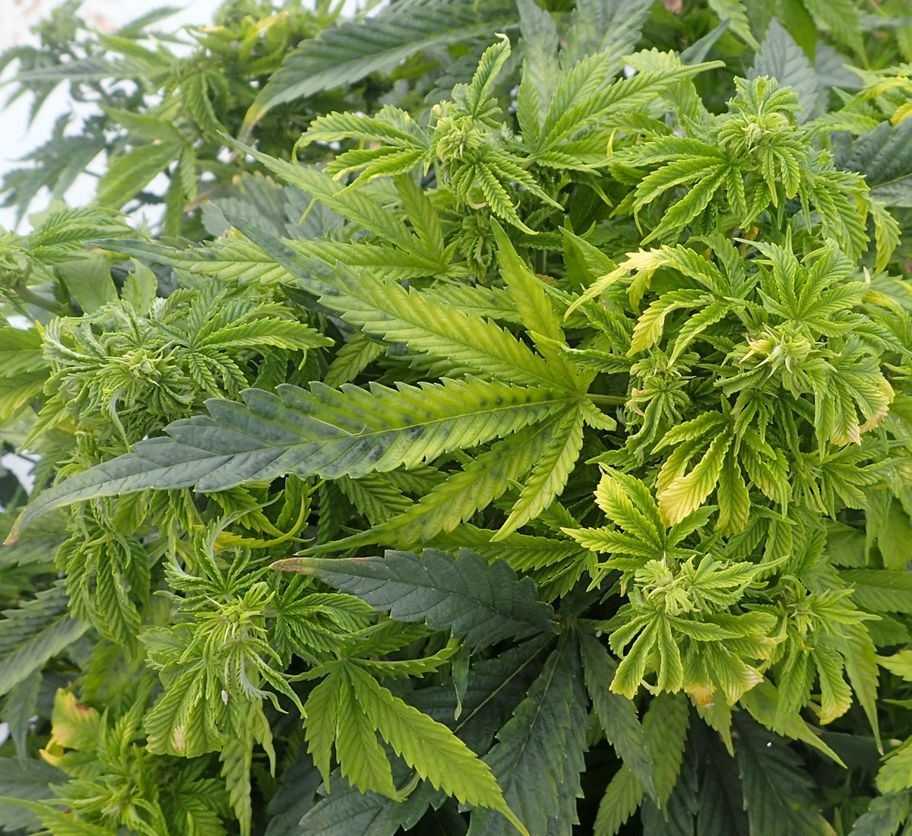

](https://www.growweedeasy.com/wp-content/uploads/2023/09/Beet-curly-top-virus-infection-showing-both-yellowing-and-strong-leaf-curling-by-Whitney-Cranshaw-of-Colorado-State-University-1.jpg)"Closer view of a hemp shoot exhibiting leaf curling and twisting due to Beet curly top virus" Credit: [pnwhandbooks.org](https://pnwhandbooks.org/plantdisease/host-disease/hemp-cannabis-sativa-curly-top)

[

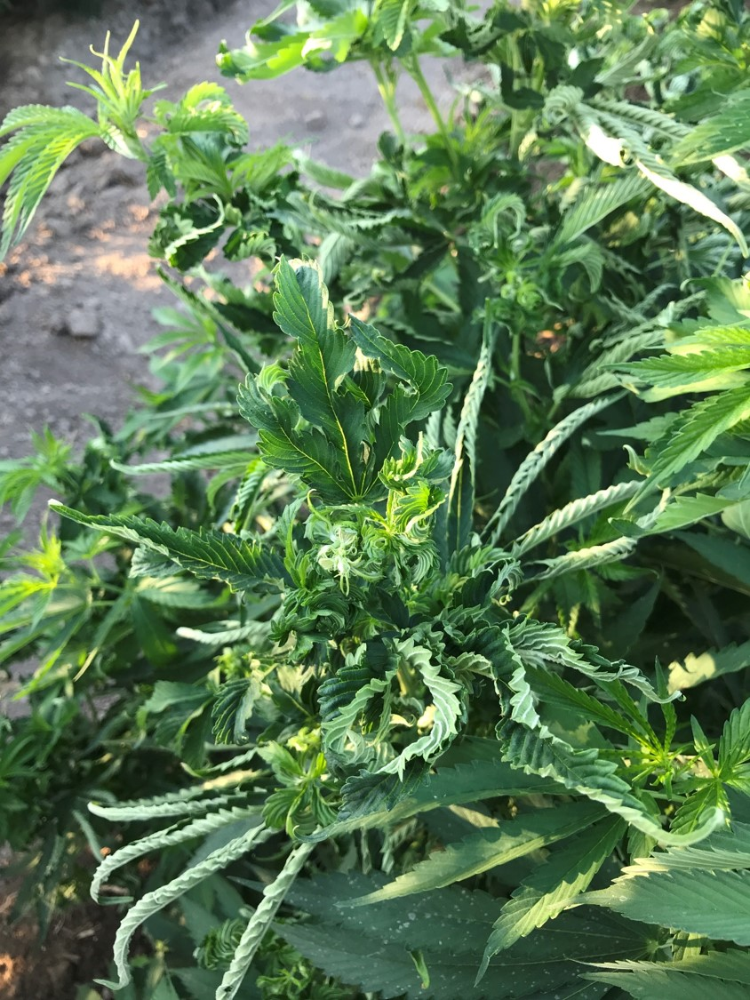

](https://www.growweedeasy.com/wp-content/uploads/2023/09/hempbctv.jpg)

## How the Virus Spreads to Cannabis Plants

Most commonly, the disease is spread through leafhoppers (a common cannabis pest), which feed on infected plants and then spread the virus to a clean plant on its next feeding.

So far, the Worland (BCTV-Wor) and Colorado (BCTV-CO) strains of the beet curly top virus have been identified in Colorado, but there are likely other strains affecting cannabis plants in different parts of the world.

## Symptoms of Beet Curly Top Virus in Cannabis Plants

BCTV can cause a wide variety of symptoms, though the curling of new growth ("curly tops") is the most striking.

* **Twisting of new growth ("curly tops")** - New growth on the plant may display a strong twisting or curling pattern. This new growth may remain green or turn yellow. Leaves tend to curl upwards
* **Stunted size** - Slow growth is common, and plants may stay small or act like "runts" even if they don't show other symptoms.
* **Leaf yellowing or mottling** - Early stages of infection may produce light yellowing or mottling, mostly at the base of a leaf. Over time, this yellowing may become more pronounced and eventually whole plays may become pale yellow and stunted
* **Localized symptoms** - Some plants may only have symptoms on certain spots, while the rest of the growth appears normal. For instance, the original stem might develop curly top symptoms, while side branches that develop later have typical growth patterns.

The total effects (overall health, yield, and other potential issues) of beet curly top virus on cannabis plants are still not fully understood, because the virus' ability to affect cannabis plants was discovered relatively recently.

Some hemp or cannabis plants infected with the virus can outgrow most of these symptoms, but it's still a good idea to get rid of them anyway to prevent future transmission. We need to do more research to discover all the strains affecting cannabis, and how they differ from each other.

"&#8216;Bisymptomatic' hemp plant infected with beet curly top. In this condition, the original plant stem shows strong symptoms of infection, including yellowing and leaf distortion. On the same plant, side shoots develop that appear symptom free." ~Whitney Cranshaw.

[

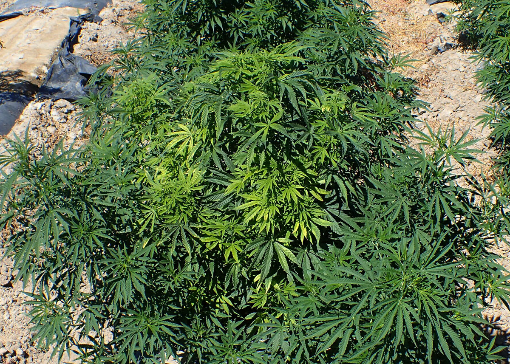

](https://www.growweedeasy.com/wp-content/uploads/2023/09/Bisymptomatic-hemp-plant-infected-with-beet-curly-top-by-Whitney-Cranshaw-of-Colorado-State-University-1.jpg)

## How to Treat Beet Curly Top Virus (Prevention)

Unfortunately, because there is no cure for beet curly top virus, the best thing for a cannabis grower to do is get rid of all cannabis plants known to be infected by BCTV.

*Note:* It is possible to [use plant tissue culture](https://www.growweedeasy.com/live-plant-cannabis-tissue-culture) to grow a clone of the infected plant (typically done in a lab by experts), which gives you a clean uninfected plant with the same genetics. However, there is no way to cure a plant that already has the virus. Even if it outgrows its symptoms (which occasionally happens), it will still be able to infect other plants. Therefore it's highly recommended to carefully dispose of infected plants.

* **Carefully get rid of infected plants** - If you suspect your plant has beet curly top virus, separate it immediately from your other plants, and consider throwing it away to prevent the potential spread of the virus to other plants.
* **Get rid of leafhoppers** (if any) - If you suspect your cannabis got infected due to leafhoppers, then a preventative step is to [control the local leafhopper population](https://www.growweedeasy.com/cannabis-plant-problems/leafhoppers).
* **Clean entire grow area** - Outdoors, clean the area around the plants (rake up any leaves, treat for bugs, etc.). Indoors, it's a good idea to sterilize any part of the grow space that may have touched infected plant matter.
* **Take care when touching plants** - Until you're during the virus is gone, take extra care whenever you're touching one plant and then another. For example, if you're defoliating or cutting off parts of the plant, make sure to change gloves before you start on another plant. You don't want the juices from the inside of one plant to touch the inside of another plant.
* **Start with seeds** - Clones will typically carry the virus if the parent plant was infected, but cannabis plants grown from seeds are rarely infected (even if their parents were). Dip seeds briefly in a 10% hydrogen peroxide solution before germination to ensure the virus is not on the seed coat. This doesn't prevent the plant from catching the virus later, but starting with seeds helps give you a small amount of protection because, without any infected plants around, transmission is impossible.

Protect your cannabis plants from viruses so they can focus on producing amazing buds.

[

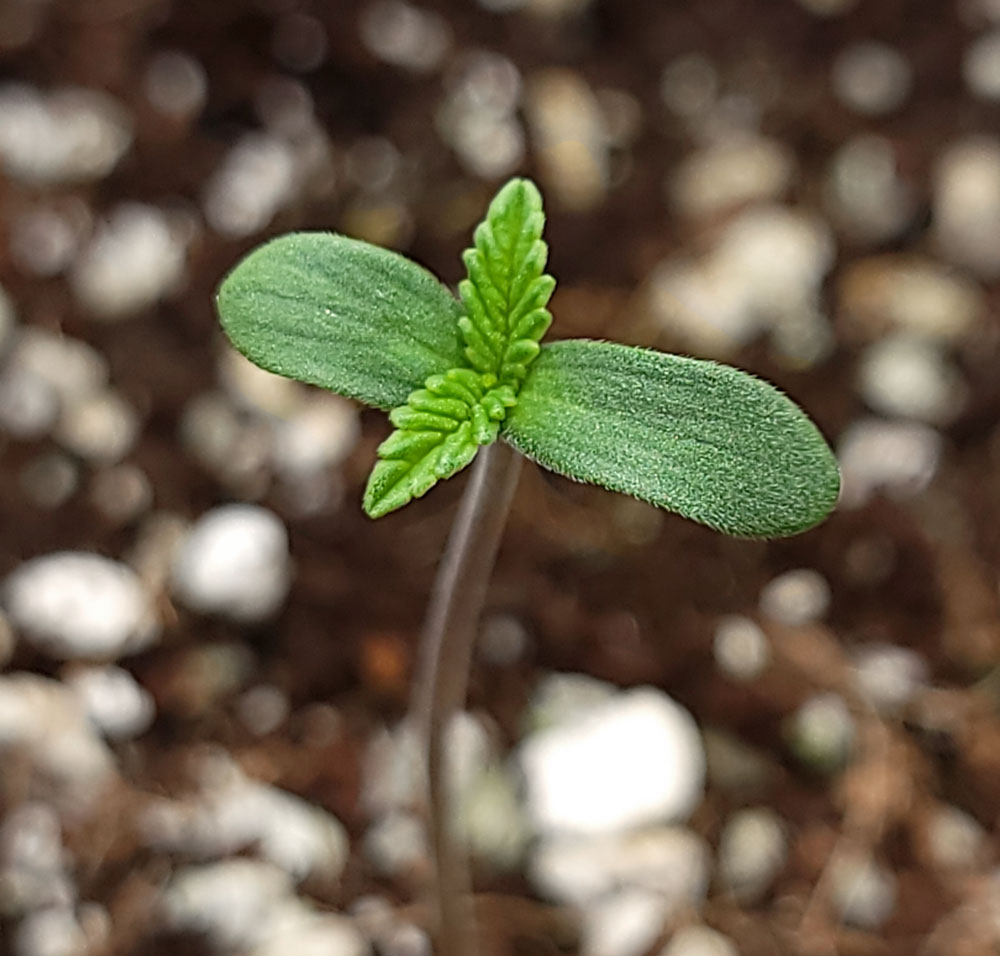

](https://www.growweedeasy.com/wp-content/uploads/2023/01/cannabis-seedling-baby-sm.jpg)

## Conclusion

In this tutorial, we've unearthed vital insights about the Beet Curly Top Virus (BCTV) and its bearing on cannabis plants. From its varied host plants to its symptoms and strains, BCTV is a formidable threat that requires keen observation and swift action.

**Key takeaways for cannabis growers**

* **Understand the Virus** - BCTV is a disease transmitted to cannabis plants by beet leafhoppers and possibly other means. Simply being aware of this and its many host plants prepares you to intervene swiftly when the first signs of infection appear.
* **Spot the Symptoms** - Identifying the symptoms of BCTV is crucial for early detection. Curling of new growth, stunted growth, leaf mottling or yellowing, and localized symptoms are key indicators of potential infection.
* **Transmission** - The primary transmission method is through leafhoppers or other mechanical damage (like pruning first an infected plant and then a healthy one without washing your hands between). Understanding how transmission works can guide you toward effective control measures, like carefully handling plants and managing leafhopper populations.
* **Management and Control **-  Although there is no cure for BCTV, there are practical strategies for managing an outbreak. Disposing of infected plants, eradicating leafhoppers, thoroughly cleaning the grow area, and minimizing plant-to-plant contact can help curb the spread of the virus. If you're concerned your current stock of genetics may have the virus, start your next grow with known clean plants (or seeds) to help ensure you have clean stock.

Remember, the best defense against BCTV is a strong offense. Stay vigilant, act quickly, and employ these strategies to safeguard healthy cannabis plants and yield. The journey to understanding and managing BCTV is ongoing, and your proactive efforts are a critical part of that process.

If you have pictures, information, or experience with beef curly top virus in cannabis plants, please don't hesitate to [contact us](https://www.growweedeasy.com/submit-trophy-pics) so we can help share the word!

## Boron Deficiency

**Problem:** A boron deficiency in cannabis is relatively rare unless a plant is underwatered or in a really dry environment, and is usually accompanied by other types of nutrient or pH problems that appear as problems with the leaves.

The first signs of a cannabis boron deficiency is abnormal or thick growth tips along with brown or yellow spotting on new leaves.

[

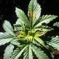

](https://www.growweedeasy.com/wp-content/uploads/2010/04/boron-deficiency.jpg)[

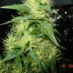

](https://www.growweedeasy.com/wp-content/uploads/2010/04/boron-deficiency2.jpg)

With a boron deficiency, upper cannabis leaves display abnormal and/or slowed growth. Growing tips may not grow properly, may display twisted growth, and may die off. New leaves may wrinkle or curl.

Plant roots can also be affected by a boron deficiency, showing unhealthy or slow growth. Stems may become rough or hollow. Boron deficiencies are more likely to appear when a plant is underwatered or experiencing very low humidity (very dry air).

A plant with a boron deficiency may look like it has a [calcium deficiency](https://www.growweedeasy.com/calcium-deficiency-cannabis) because boron is needed for the plant to properly use calcium. New growth is affected the most, and may look like it's been burnt or scorched. A boron deficiency is often accompanied by an apparent [potassium](https://www.growweedeasy.com/potassium-deficiency-cannabis) or [nitrogen](https://www.growweedeasy.com/nitrogen-deficiency-cannabis) deficiency, as these nutrients are needed for the plant to use boron.

**Solution for Boron Deficiency in Cannabis**

*Note: *Sometimes a cannabis boron deficiency (like all deficiencies) can be triggered by stressful conditions and may clear up on its own after the period of stress is over.

1.) Use Good Sources of Nutrients

Most cannabis growers don't need to add more nutrient. In fact, most growers have actually already given plenty of boron to their cannabis plants, whether they meant to or not. If you're using [quality soil](https://www.growweedeasy.com/organic-super-soil) or [cannabis-friendly nutrients](https://www.growweedeasy.com/nutrients), you probably don't need to worry about adding more boron. Boron deficiencies are generally more likely to appear when a grower is using heavily filtered or reverse osmisis (RO) water to feed plants, since boron is found in most tap water, but that's actually not the most common reason growers see boron deficiencies in their cannabis plants! As long as you're giving your plants a good source of nutrients, you probably need to&#8230;

2.) Adjust pH to Correct Range

But the reason most growers see boron deficiencies is because boron is best absorbed at lower pH ranges. When the pH gets too high, your plant may exhibit signs of a boron deficiency even if it's physically there near the roots.

[Learn how to manage your pH](https://www.growweedeasy.com/how-do-i-check-the-pH-of-my-water) when growing cannabis.

In **soil**, boron is best absorbed by the roots in the **6.0 - 6.5 pH** range (in soil, it's generally recommended to keep the pH between 6.0 - 7.0, but boron specifically tends to be best absorbed below 6.5).

In **hydro**, boron is best absorbed by the roots in the **5.5 - 6.2 pH** range (in hydro, it's generally recommended to keep the pH between 5.5 - 6.5, but boron specifically tends to be best absorbed below 6.2).

3.) Give Plants Enough Moisture

Boron is not absorbed well if there isn't enough moisture, for example if plant is [underwatered](https://www.growweedeasy.com/underwatering-cannabis) or humidity is very low (below 25% relative humidity in the air). [Proper watering practices](https://www.growweedeasy.com/how-often-water-marijuana) will help prevent underwatering, and a humidifier may be needed to achieve the best growth if your grow room is very dry.

4.) Watch Leaves for Recovery

If you suspect your growing cannabis plant has a boron deficiency, flush your system with clean, pH'd water that contains a regular dose of [cannabis-friendly nutrients](https://www.growweedeasy.com/best-marijuana-nutrients-review). Old damaged growth will likely not recover. Watch plant over next few days to make sure that the problem stops spreading to new growth.

If you cannot get rid of your boron deficiency, please consult our [7-Step Cure to 99% of Cannabis Growing Problems](https://www.growweedeasy.com/growing-marijuana-plant-problem-deficiency)

## Bud Rot or Mold

Bud Rot Caption: Example of cannabis bud rot.

by Nebula Haze

Cannabis bud rot (aka "Big Bud Disease" or "The Curse of the Successful Grower") attacks your fattest, biggest marijuana buds right as they start to approach harvest time.

*Too cruel&#8230;* Bud rot attacks and kills your biggest, thickest buds. Often the first sign of cannabis bud rot is the leaves on a big bud suddenly die or turn yellow often over the course of 1-2 days. The base of these discolored leaves is where the bud is rotting. If you investigate closer, you will often be able to see the mold.

[

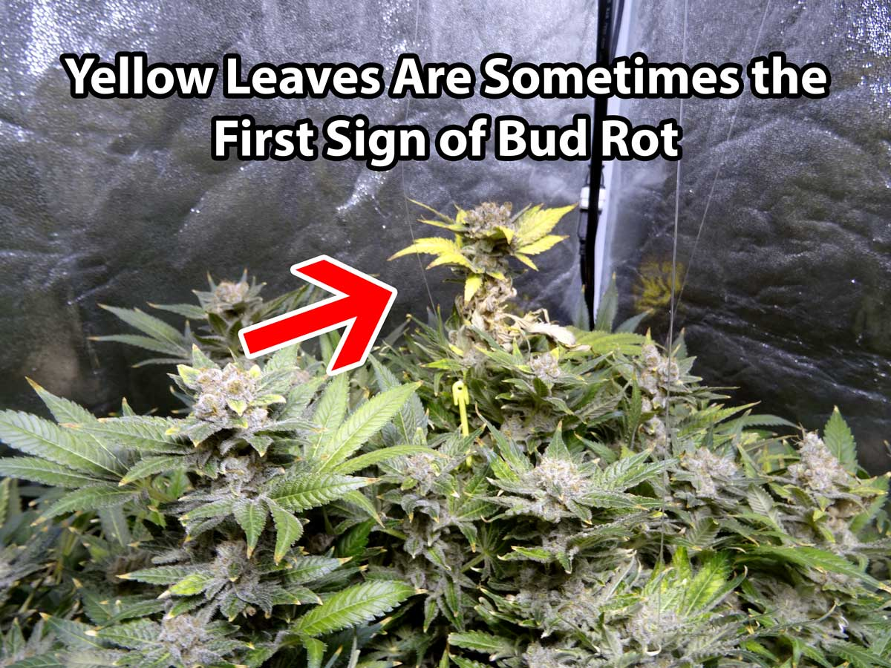

](https://www.growweedeasy.com/wp-content/uploads/2010/06/cannabis-bud-rot-mold-symtpom-is-yellow-dying-leaves.jpg)

by Nebula Haze

**How to Prevent & Stop Cannabis Bud Rot** (quick summary)

* 

**Avoid wet buds & high humidity **- Bud rot is a fungus, and like all fungi, its spores needs a wet, humid place to germinate and grow. About 40-50% RH is ideal for the cannabis flowering stage (both for dense buds and to prevent bud rot). A humidity above 60% RH puts you at major risk of bud rot and mold, especially if you have lot of thick buds. Don’t allow buds to sit in damp or [overly humid](https://www.growweedeasy.com/humidity) conditions for long. Indoor growers can use a strong [dehumidifier](https://www.amazon.com/s?k=dehumidifier&linkCode=ll2&tag=4200a7-20&linkId=97518132eb804ffc55da3b707a5afef7&language=en_US&ref_=as_li_ss_tl) to reduce humidity in the grow space if necessary. Outdoor growers can cover plants when it rains and shake them off when they're wet. Another strategy for outdoor growers is to get short-flowering (ex: [Pineapple Express](https://www.northatlanticseed.com/product/pineapple-express-f/ref/63951/)) or [auto-flowering](https://www.growweedeasy.com/autoflowering-vs-photoperiod) (ex: [Purple Punch Auto](https://seedsupreme.com/purple-punch-autoflower.html#grower)) strains so their plants are ready to harvest before the start of the local rainy season.

* 

**Great air circulation** - Air should be moving over the buds and leaves as well as through the plant. Fans are a huge help indoors, especially if you set up an exhaust fan to [vent hot humid air](https://www.growweedeasy.com/exhaust) away from your plants. Oscillating fans can help prevent humid spots but only blow air around so they can't lower the overall humidity. Outdoor growers can move potted plants to a breezier location but if plants are in the ground, unfortunately, there's not much you can do to increase air circulation.

* 

**Defoliate extremely bushy plants **- Each leaf is constantly adding water vapor to the air. That means removing leaves can help lower the humidity through and around the plant, especially in a small growing space. If you decide to defoliate because plants are covered in tons of leaves and the humidity is high, remove leaves that aren't getting much light (typically the middle and bottom of the plant) since they aren't making food for the plant anyway. 

* 

**Watch long, dense buds for signs of discoloration** - Almost like a cruel joke, bud rot usually attacks your biggest and most impressive colas 🙁 That's why cannabis bud rot is sometimes known as "The Curse of the Successful Grower".

* 

**Remove all buds affected by bud rot *immediately ***- Carefully remove and discard all buds with bud rot, as well as nearby buds. This is a fungus that can spread quickly. Don't let any of the dusty rot touch other parts of your plant to avoid spreading mold spores.

* 

**Consider harvesting early** - If you can't fix the environmental conditions that caused the bud rot (for example if it's wet or humid and you can't do anything about it), sometimes the best option is to harvest plants a little early to avoid further losses.

“When I had to throw away most of my plant due to bud rot, I cried a little, on the inside.”
 ~ Cannabis Grower

**Table of Contents**

[What Does Cannabis Bud Rot Look Like?](#bud-rot-cannabis-look-like)

[What Causes Bud Rot?](#what-causes-bud-rot)

* [How does the Botrytis fungus get to my plants?](#how-does-botrytis-fungus-plants)

[How Do I Control Bud Rot?](#how-to-control-bud-rot)

* [Prevention](#prevent-bud-rot)
* [Treatment](#how-to-stop-bud-rot)
* [Mold-Resistant Strains](https://www.growweedeasy.com/mold-resistant-cannabis-strains)

What Does Bud Rot Look Like?

Usually, a bud rot infection becomes visible on just certain parts of your cannabis plants. Indoors, it's often the bigger and denser buds that get affected first. Outdoors you may get patches all over the plant, even on smaller buds, especially after a few rainy days.

With bud rot, certain areas on the colas (buds, hairs and/or attached leaves) start dying, in stark contrast to the rest of the buds. The changes happen quickly, within just a day or two. Affected buds may appear strangely colorful, yellow, or brown. Buds often appear dried up.

[

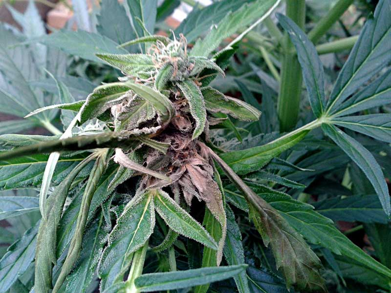

](https://www.growweedeasy.com/wp-content/uploads/2014/11/spot-bud-rot.jpg)

The deadened spots usually stand out and catch people's attention, even if growers don’t know *what’s* wrong, they often instinctively know that something is wrong since the spots don't look like the rest of the buds on the plant.

In addition to the rot itself, you may see white or gray fuzzy mold on the outside of the bud. With advanced bud rot, the bud will easily separate so you can see inside. When a bud with bud rot is inspected, it will be dark gray or brown on the inside, and possibly dusty (this "dust" is fungus spores).

Depending on the life stage or particular species of mold/fungi, bud rot can look…

* 

white and fluffy

* 

dark gray or brown (sometimes even dark purple)

* 

the buds can be full of dark speckled dust which easily blows away (fungus spores)

“I lost half my plants last year to bud rot…  After a couple of drizzly days, I noticed spots, and then I saw that i*t had spread to all my plants*.”
 ~ Cannabis Grower

Sometimes you might see a few yellow leaves appear suddenly on some of your biggest colas. It can feel like it happens overnight. That could be a sign that there's mold at the base of these leaves. Always investigate any cola with yellowing leaves ASAP. If there's mold you will be able to see the leaves are basically falling out, with mold or brown spots being revealed in the middle 🙁

[

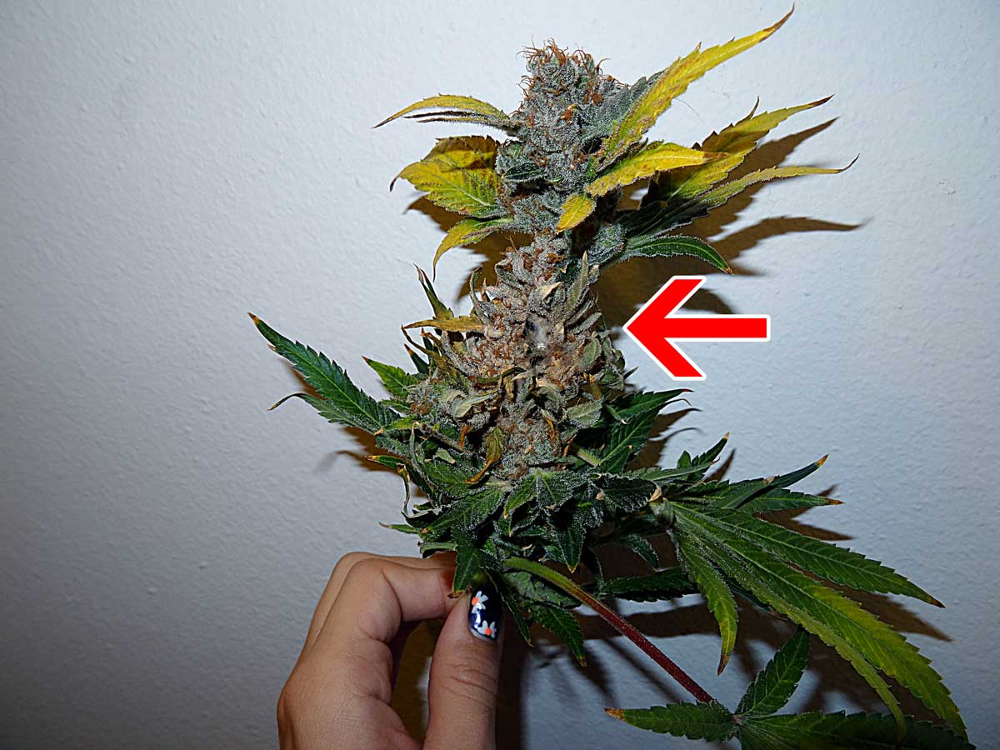

](https://www.growweedeasy.com/wp-content/uploads/2014/11/cannabis-bud-rot-mold-looks-mostly-normal-except-yellow-leaves.jpg)

Usually, the bud easily splits at the base of the sick leaves to reveal the rot inside. At this point, there was still white mold inside, but within a day it would have darkened and the inside would look brown or gray.

[

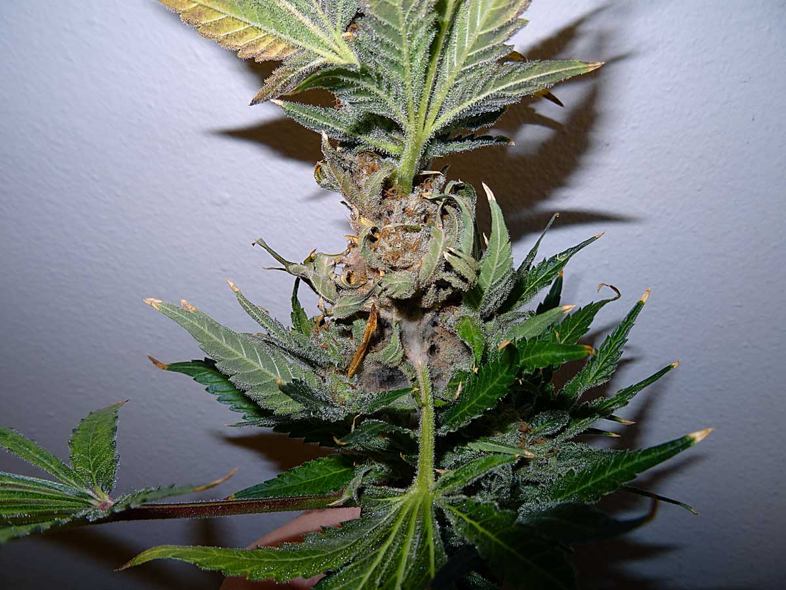

](https://www.growweedeasy.com/wp-content/uploads/2017/10/marijuana-bud-rot-see-mold-when-you-look-closer-sm.jpg)

Another example of marijuana bud rot from afar&#8230; (it's that brown dead patch on the bottom half)

[

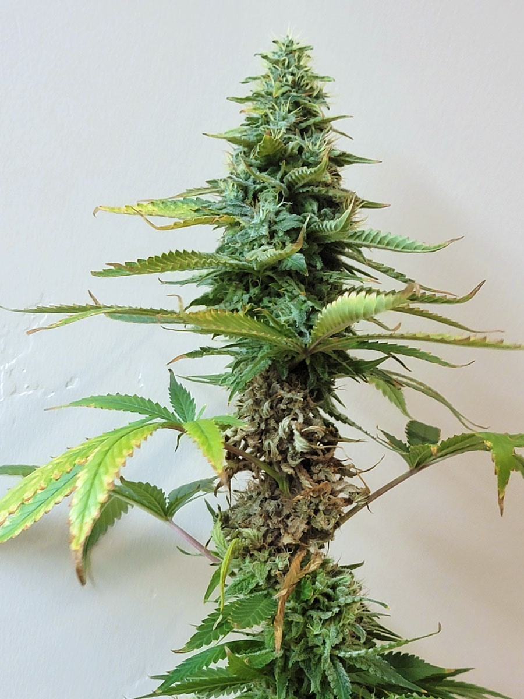

](https://www.growweedeasy.com/wp-content/uploads/2017/10/cannabis-bud-rot-aka-curse-of-the-successful-grower.jpg)

And here's that same bud rot up close.

[

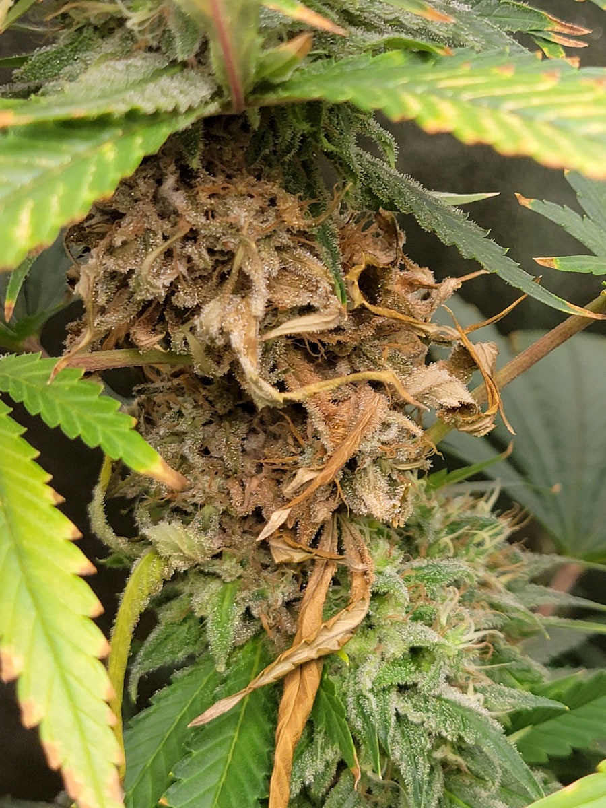

](https://www.growweedeasy.com/wp-content/uploads/2017/10/bud-rot-marijuana-bud-brown-dry-crispy.jpg)

Different Stages of Bud Rot - Catch it Early!

When plants are afflicted by cannabis bud rot, it may start as fluffy white growth in the middle or sides of buds. This white mold quickly darkens into gray or brown and burrows deep into dense buds as the fungus takes hold. Sometimes you'll see the initial stage on the sides of the buds, giving you a possible chance to catch the infection at an earlier stage.

The Botrytis fungus looks white and fluffy in its initial stage, but you'll probably never even see this stage before the mold quickly darkens and starts rotting the buds from the inside out

[

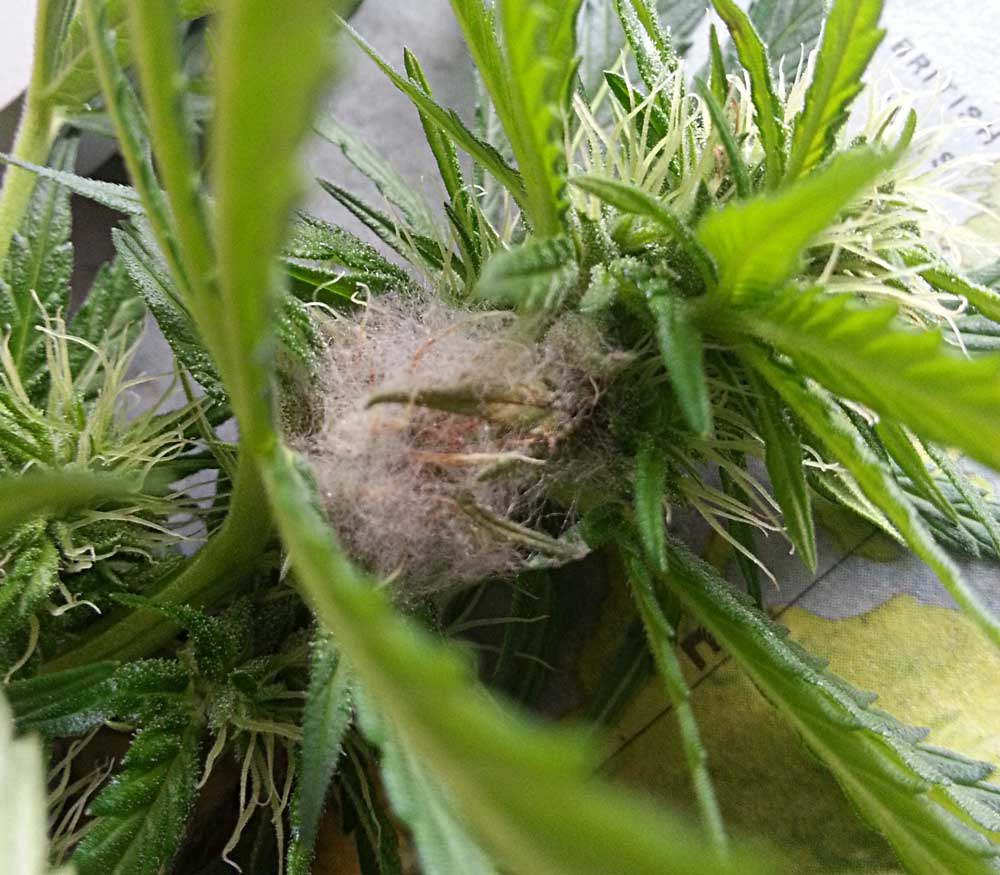

](https://www.growweedeasy.com/wp-content/uploads/2014/11/fluffy-white-bud-rot.jpg)

Once bud rot has taken hold over parts of a cannabis plant, the buds can sometimes look almost the same on the outside, *at first*, but they usually start looking like they're dying in patches. Often the area will dry out and easily pull apart. The inside of buds can turn brown, gray, or even purple.

"I noticed one brown sugar leaf and it came out unfortunately easily, exposing what was inside."
 ~ Cannabis Grower

[

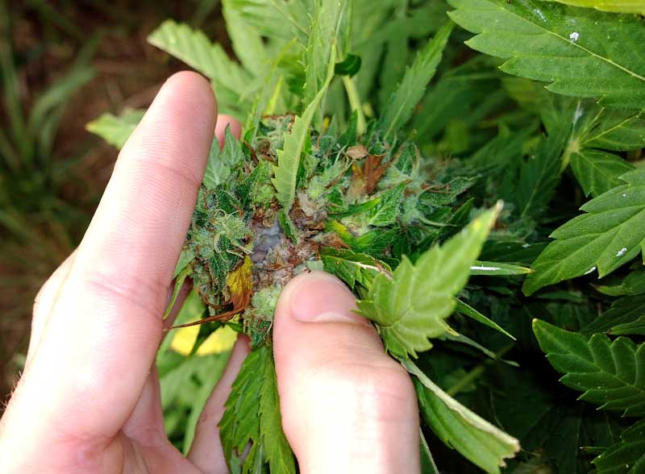

](https://www.growweedeasy.com/wp-content/uploads/2014/11/bud-rot-inside.jpg)

Some growers might think these drying spots mean that the plant is almost ready for harvest, but you know something is definitely wrong when just parts of the colas are being affected. Although many leaves turn yellow, sometimes they turn purple.

Here's another example of a bud where the leaves turned purple in response to bud rot.

[

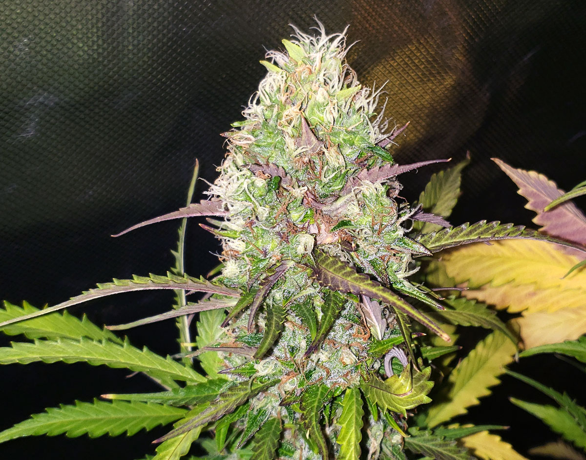

](https://www.growweedeasy.com/wp-content/uploads/2020/02/bud-rot-cola-the-day-after.jpg)

Upon closer investigation, the cannabis bud was rotting everywhere the leaves had turned purple.

[

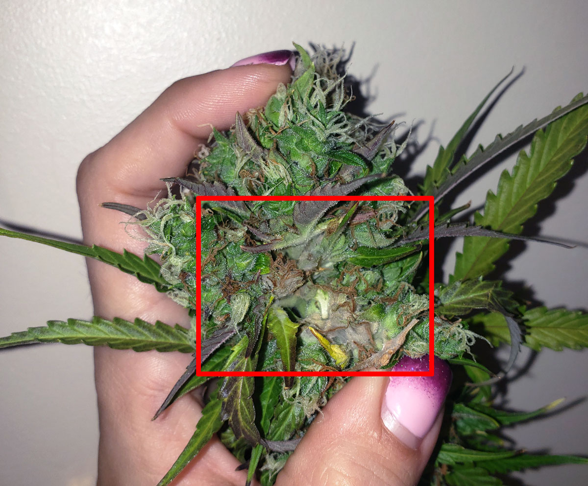

](https://www.growweedeasy.com/wp-content/uploads/2020/02/bud-rot-cola-the-day-after-closeup.jpg)

Another example of marijuana leaves turning purple on a bud that's rotting with bud rot.

[

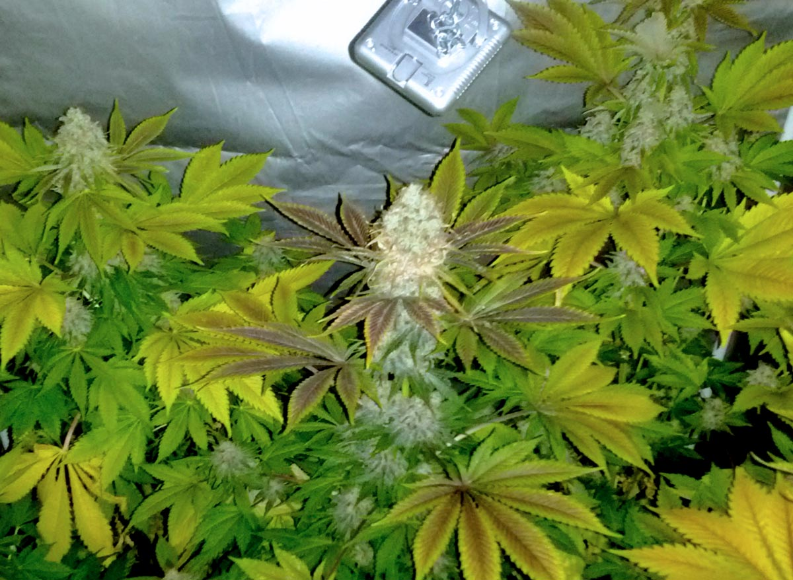

](https://www.growweedeasy.com/wp-content/uploads/2017/10/purple-leaves-bud-rot-center-cola.jpg)

Here's an example of advanced bud rot on an outdoor cannabis plant. You can see leaves on the buds are dying in big patches. These buds are completely rotten on the inside.

[

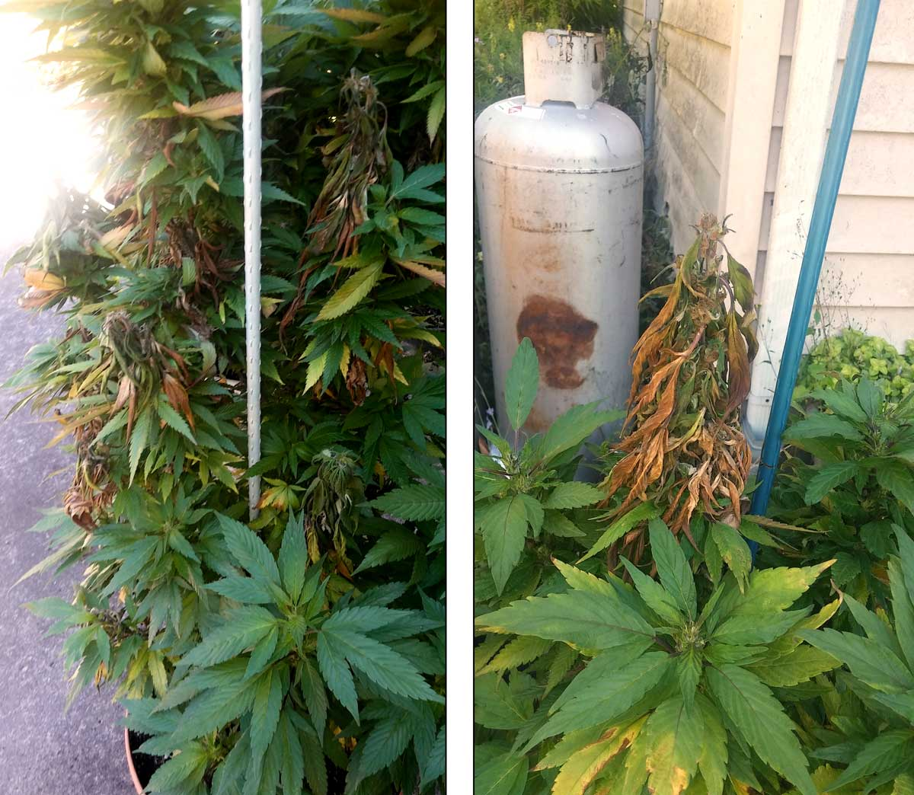

](https://www.growweedeasy.com/wp-content/uploads/2014/11/outdoor-cannabis-bud-rot.jpg)

What Causes Bud Rot?

Cannabis bud rot is caused by a type of fungus known as *Botrytis cinerea*. Sometimes you may get another type of fungus or mold that attacks the buds, but the cause, symptoms, and effects are usually similar.

In cannabis plants, Botrytis causes buds to rot out from the inside, hence the name “bud rot.” If you crack open an infected bud, the inside will be a moldy dark gray or brown.

[

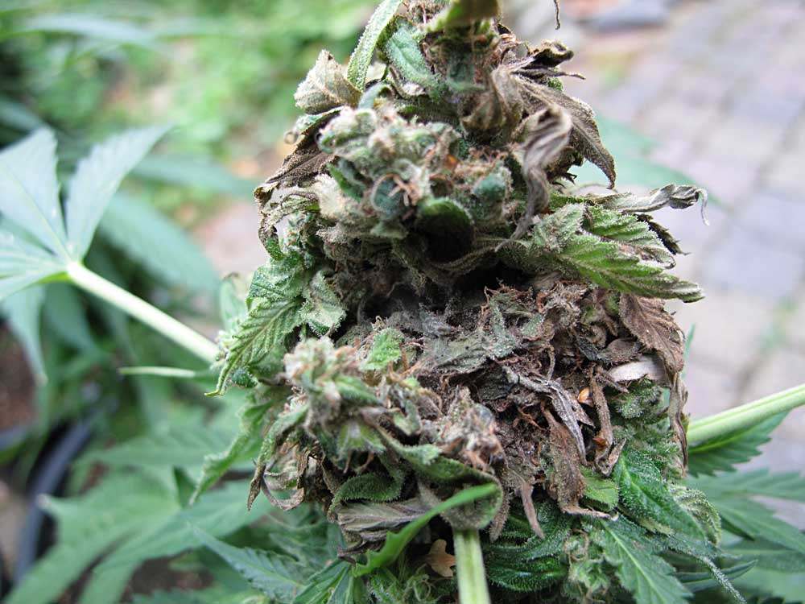

](https://www.growweedeasy.com/wp-content/uploads/2014/11/bud-rot-damage.jpg)

[

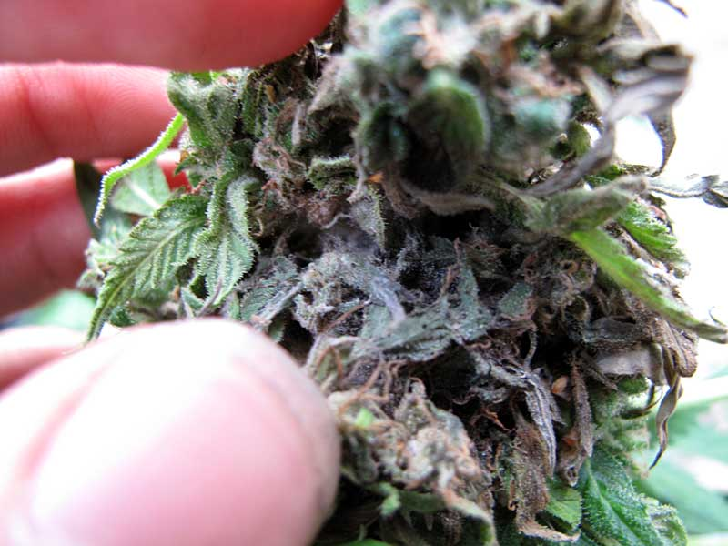

](https://www.growweedeasy.com/wp-content/uploads/2014/11/bud-rot-mold-damage.jpg)

Bud rot can cause different symptoms on different plants. For example, this cola (big main bud) responded to bud rot by turning purple and mushy. The leaves became crispy and started dying alongside the buds. This is what the grower came back to find after a few days of rain.

*Did you know? *In addition to cannabis bud rot, *Botrytis* causes problems for many different types of plants, including wine grapes, strawberries, and peonies.

The Botrytis fungus is sometimes referred to as "botrytis bunch rot," “botrytis blight,” “bud rot,” “grey mould” or “gray mold.” When it comes to cannabis, it is often only called “Bud Rot” since that’s the main symptom cannabis growers are worried about.

**Any part of the cannabis plant affected by bud rot should be discarded immediately! This helps prevent further infection and all buds touched by this toxic fungus should never be smoked or used.**

[

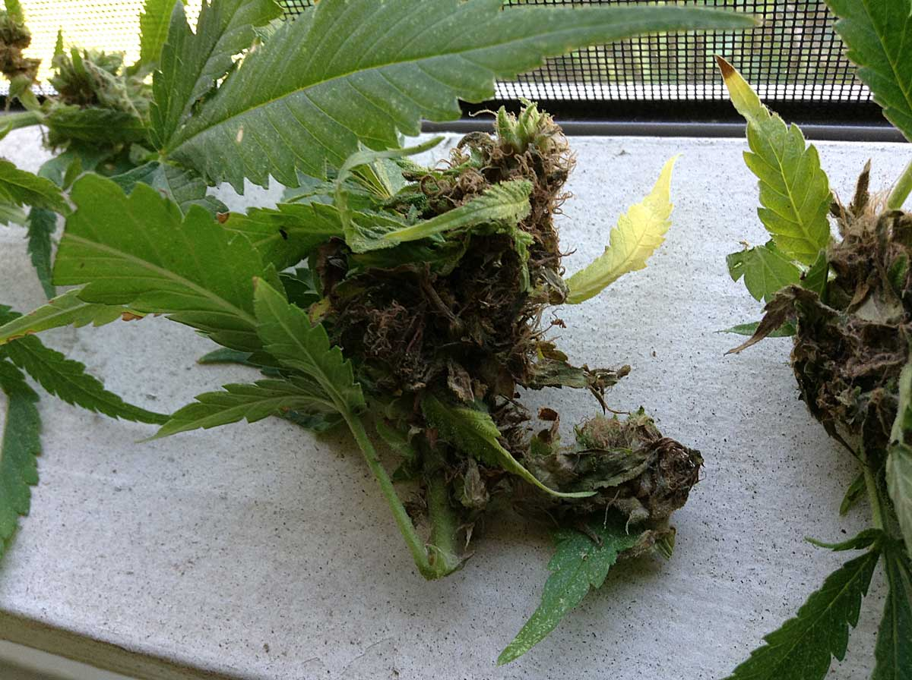

](https://www.growweedeasy.com/wp-content/uploads/2014/11/bad-case-bud-rot.jpg)

**Throw Away All Buds with *Any *Sign of Bud Rot! (brown is not a healthy bud color)**

[

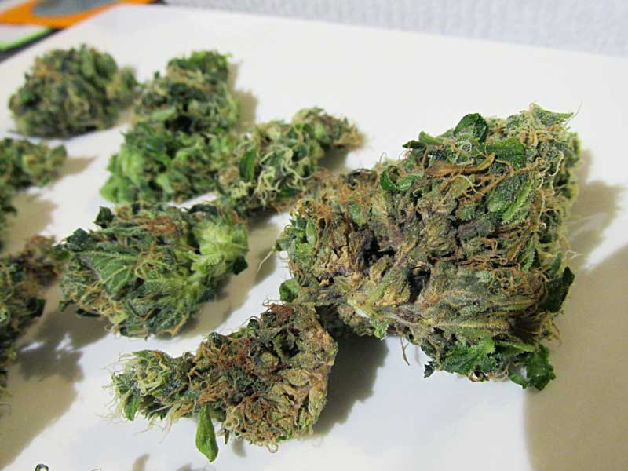

](https://www.growweedeasy.com/wp-content/uploads/2014/11/bud-rot-nugs.jpg)

**This is bud rot after the buds are broken apart. Not safe to consume.**

[

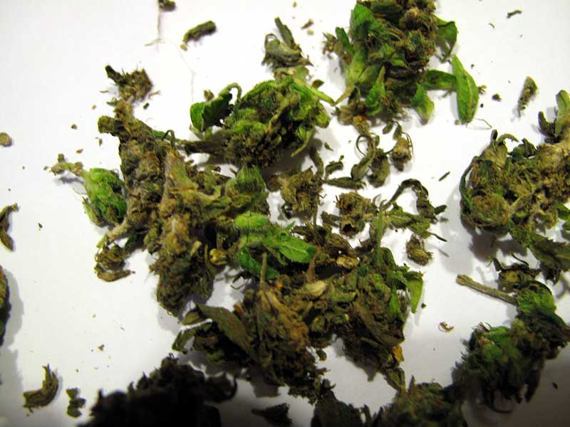

](https://www.growweedeasy.com/wp-content/uploads/2014/11/cut-off-bud-rot.jpg)

There are different stages of *Botrytis* as it matures and tries to release spores. An infection starts as fluffy white mold (or brown mold) and then spreads throughout the inside of vulnerable buds. The inside of those parts of the colas darken to gray or brown. Once that has settled in, the mold tries to reproduce. The insides become filled with dark speckled dust that easily floats and spreads if the bud is cracked open. These are the spores of the fungus, so be careful to avoid breathing in letting this speckled dust ever touch other parts of your plants.

Luckily, healthy cannabis plants will usually not develop bud rot unless exposed to stagnant air and wet conditions or high humidity for an extended period of time. Your plants are also more susceptible to bud rot, fungus, or mold when the temperature is hot or cold. Aim for a temperature of 75°F (24°C) in the late flowering stage if possible (this also helps produce the highest quality buds).

[

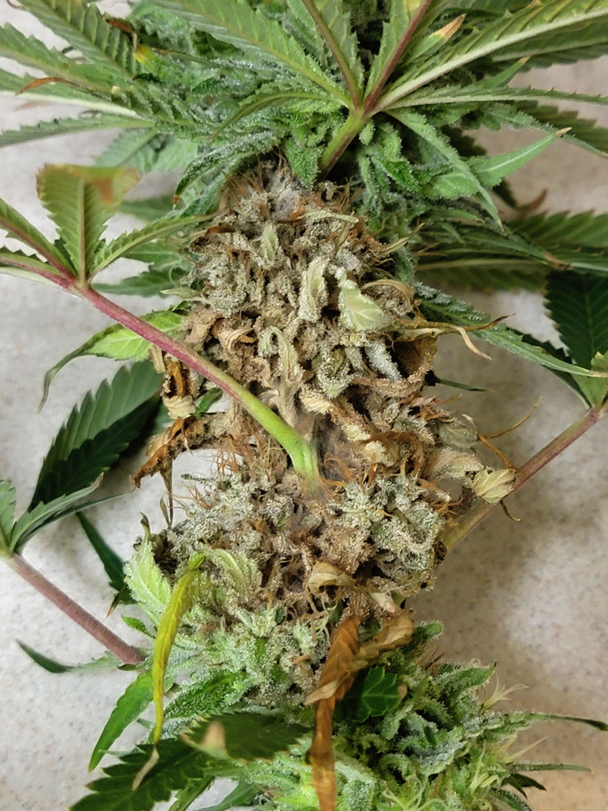

](https://www.growweedeasy.com/wp-content/uploads/2017/10/closeup-cannabis-bud-rot-brown-crispy-moldy-dying.jpg)

How does the Botrytis fungus get to my plants?

Bud rot is spread to plants by dusty gray spores, usually in wind or water. If your plants are never exposed to these spores, they will never get bud rot.

Unfortunately, the spores can easily be carried to your plant by a breeze, rain, from contact with animals, or even by clones from another grow room. Indoors they may be floating around the air. Dormant spores can survive in many conditions only to affect your crops another time. It's much more effective to try to prevent the conditions that allow bud rot to grow than to try to protect your buds from any contact with spores. That being said, infected buds can spread millions of spores and must be immediately and carefully moved away from your plants.

If you see rot like this, toss carefully so the rot can't spread millions of spores over your other buds.

[

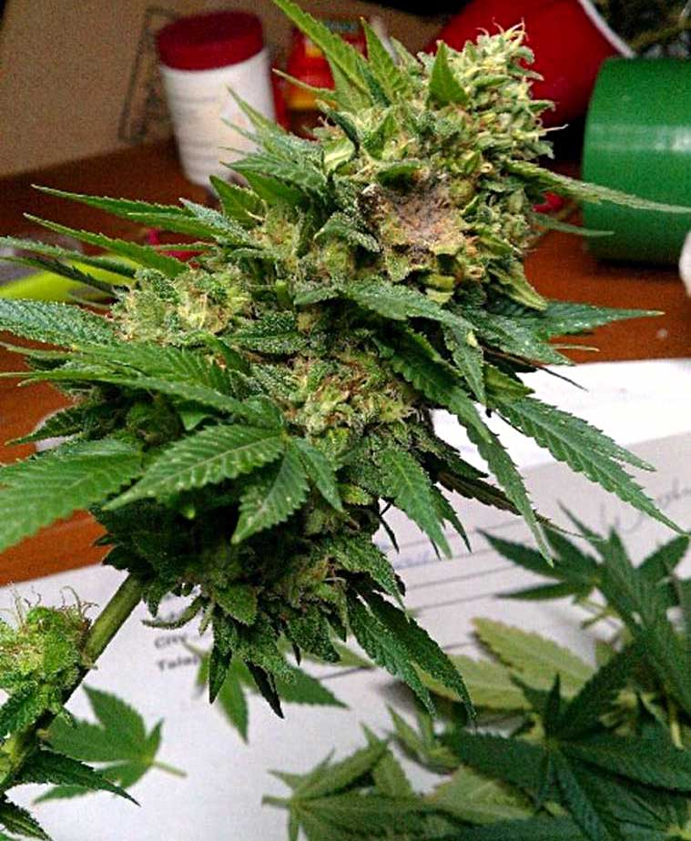

](https://www.growweedeasy.com/wp-content/uploads/2014/11/bud-rot-botrytis.jpg)

The fungus will never germinate if you keep buds in great environmental conditions. The spores are also more likely to take residence in your buds if there is some sort of "wound" on the plant. Possible wounds that can let Bud Rot fungus in include cracks in the stem from wind or over-training, damage from caterpillars, snails, worms, white powdery mildew, other pests, and larva. Any injury or weak point can be a good point of entry for bud rot spores into the plant.

Bud Rot needs wet or humid conditions to thrive. Even if your plant gets exposed to spores, you can usually prevent a bud rot infection by providing your cannabis with a moderate, dry, breezy environment (much easier indoors than outdoors).

[

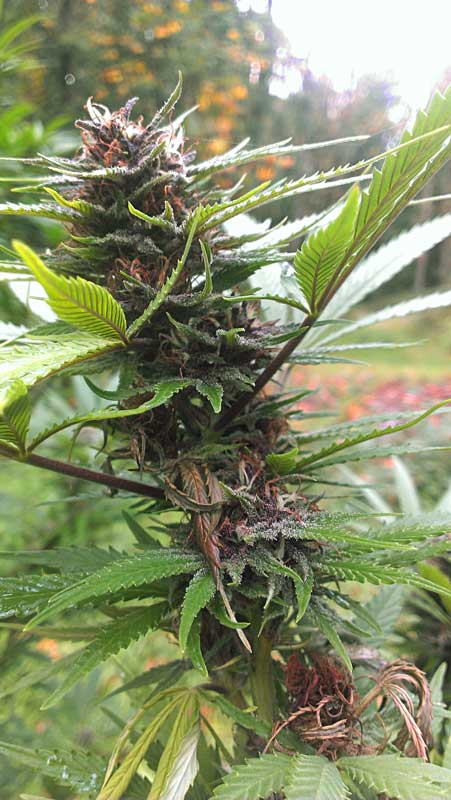

](https://www.growweedeasy.com/wp-content/uploads/2014/11/dying-bud-rot-cola.jpg)

What triggers spores to grow into a full-blown case of bud rot?

**Wetness or High Humidity <- MOST IMPORTANT FACTOR, DON'T IGNORE THIS!**

This is the most important factor. If you're suffering from bud rot or mold, even if you remove the affected buds, it will likely keep spreading until you fix the humidity and keep buds dry.

* High humidity (above 55-60% RH) is the biggest contributor to mold growth and bud rot
* Leaves should not be touching each other creating wet spots (defoliate plants that are too bushy)
* Any situation where buds remain wet or in humid air for several continuous hours can be a trigger for bud rot
* Great air circulation in the grow space helps prevent any mold or fungus from growing

Outdoor

* Bud rot is often triggered by rainy or humid weather, especially if it lasts for days in a row
* If outdoor plants collect dew during the night or get rained on, consider shaking plants to remove as much moisture as possible
* Frost can also trigger bud rot because it creates wet spots when it melts

**Cool Air Below 60°F (15°C) Can Trigger Bud Rot**

* The Botrytis fungus thrives in the 50-60°F (10-15°C) temperature range. So if you have a bunch of cool, rainy days, it creates the absolute perfect home for Botrytus to grow.

**Freezing Temperatures Can Trigger Bud Rot Outdoors**

* 

When temperatures fall, you may see frost on your leaves. The freezing temperatures are hard on your plants already, and then when the frost melts it creates an ideal environment for spore germination of the Botrytis fungus on outdoor plants. It's common to get bud rot outdoors if it's hitting freezing temperatures (or close to it), and causes freeze/melt cycles. Protect plants from frost in the flowering stage if at all possible. If you do get frost and it melts, make sure to shake the plants to get rid of excess moisture on the leaves or buds (just like you would after dew or rain). If the weather is not going to improve, it may be a good idea to harvest now.

**Heat Triggers Mold and Fungi When Combined with High Humidity**

* 

Many different types of mold can strike thick buds with symptoms similar to Botrytis, and warm temperatures are ideal for most other relevant species of mold that cause bud rot. Every degree above 75°F or 24°C tends to increase the chance of many kinds of mold especially in high humidity (mold typically won't grow below those temperatures indoors). Since botrytis can strike at lower temperatures, it's recommended to aim for a medium of about for 70-75°F or 20-24°C if possible if it's humid and you're worried about bud rot or mold in the late flowering stage.

**Bad Air circulation**

* 

Stagnant air invites bud mold. The lack of wind or air circulation over the top, underneath, and/or through the inside of the plant, helps provide fungus and mold a good place to grow

* 

Leafy plants tend to collect water in between leaves and create humid pockets of air. This can cause wet spots and prevent air circulation through the plant, which also makes a good environment for mold or fungus.

“My fan could not circulate the air behind those colas. I thought it would be okay, but then I noticed super white fuzzy areas. Next thing I knew, half the colas had dead spots.”
 ~  Cannabis Grower

**Big Fat Buds**

* 

Massive colas have moist conditions on the inside which don’t get exposed to air. This makes them a prime target for Botrytis bud rot or other types of mold.

* 

It's a cruel irony that you usually only get attacked by bud rot after producing lots of big buds. Bud rot has earned the moniker "Curse of the Successful Grower".

**Sick Plants**

* Many types of stress, including bud rot, are more likely to hit your cannabis plant if it's sick or suffering from nutrient deficiencies.

**Certain strains are more susceptible than others to bud rot**

* 

Some strains are very mold-resistant, while others have little defense.

* [Here's a list of a few mold-resistant strains](https://www.growweedeasy.com/mold-resistant-cannabis-strains)

How to Control Bud Rot (these are most important!)

Focus on keeping the humidity under 50-55% (most important!) and give plants plenty of air movement in a moderate environment.

How to Prevent Bud Rot

These are the most important points to remember&#8230;

* 

**Keep humidity under 50-55% RH (Most important!)** - This is the most important thing you can do to prevent bud rot from growing. It's extremely rare to see Botrytis in dry conditions. Learn how to [control the humidity](https://www.growweedeasy.com/temperature). If you don't fix high humidity, the bud rot will likely keep spreading even after you've removed all the affected buds.

* 

**Good air movement** - Create good [air circulation](https://www.growweedeasy.com/exhaust) and make sure there’s always plenty of air moving over all the buds and leaves. Make sure your plants are getting access to cool, fresh air.

* 

**Protect plants from heat/cold or big temperature swings** - [Controlling temperature](https://www.growweedeasy.com/temperature) and keeping the grow space from experiencing big temperature changes can go a long way. Aim for 75°F or 24°C when you're worried about bud rot, and avoid letting plants get overly hot or cool.

* 

**Avoid letting buds get exposed to wetness **- Don’t allow buds to sit in damp or overly humid conditions for long. Protect your plants from rain and shake them if you notice they're wet from rain or covered with dew.

* 

**Remove all affected buds immediately** - Carefully remove and discard any and all buds that have possibly been affected by bud rot. Don't let any rot touch other parts of your plant. This helps prevent bud rot from spreading, but it's not enough if you don't take care of the environment. Remember, the spores are always around, and it's just a matter of whether they get the right conditions to grow.

[

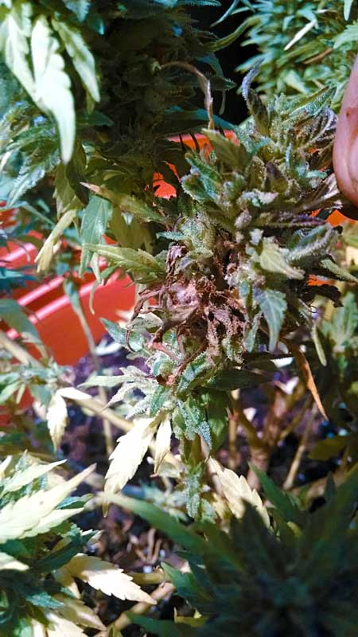

](https://www.growweedeasy.com/wp-content/uploads/2014/11/bud-rot-cannabis-cola.jpg)

Other tips to help prevent bud rot&#8230;

**Avoid plant wounds.** Avoid injuring your plants, especially in the flowering stage. Don’t leave open wounds to seep out water and nutrients. Instead, cover any open injuries with tape or some other “cast” until the injury closes up. Avoid pests like [caterpillars](https://www.growweedeasy.com/cannabis-plant-problems/caterpillars) or [broad mites](https://www.growweedeasy.com/cannabis-plant-problems/broad-mites) which burrow inside the plant, and overall try to keep plants healthy. A healthy plant is much less susceptible to all kinds of infections.

**Keep some space between big buds.** Cramming a bunch of plants with a lot of buds in a small space can increase the chance of bud rot. Buds should never be touching each other. Try to make sure every big bud has a little "breathing room" to itself.

**Defoliate leafy plants. **Remove some leaves on excessively leafy plants to help lower the humidity and overall moisture levels within the plant and around the buds. This is most effective indoors in a small space where the plant is greatly raising the humidity, but it can also be helpful outdoors. Remove any leaves are touching each other creating wet spots between them, or any big leaves that are covering or touching bud sites. Your plant won't "mind" if you only remove leaves from leafy areas.

**Watch out for symptoms of bud rot.** Watch plants closely for signs of bud rot in the late flowering stage, especially on large or dense buds, and *especially* after humid or wet weather. If you notice leaves dying in patches on your plants, don't wait. Investigate immediately.

*When growing outdoors&#8230;*

**Get a strain meant for your local climate**. If you live in a place with short summers and gets humid or rainy early in the fall, don't get a strain that was developed near the equator.

There are fast-flowering, [mold-resistant cannabis strains](https://www.growweedeasy.com/mold-resistant-cannabis-strains) that are designed for growing outdoors in more rainy climates. For example, many [auto-flowering strains](https://www.growweedeasy.com/autoflowering-vs-photoperiod) have quick lives; perfect for a short summer before the Autumn rain or frost.

A good outdoor strain for those worrying about bud rot might be  [Pineapple Express](https://www.northatlanticseed.com/product/pineapple-express-f/ref/63951/), an award-winning, mold-resistant strain that performs well outdoors. This strain is fast-flowering and ready to harvest only 50 days after it starts flowering.

[Purple Punch Auto](https://seedsupreme.com/purple-punch-autoflower.html#grower) is a great outdoor auto-flowering choice. Just plant seeds after the last frost in the Spring, then harvest about 2 months later (long before the rainy season in many climates).

[Purple Punch Auto](https://seedsupreme.com/purple-punch-autoflower.html#grower) is resistant to fungus like bud rot. This strain is quick to harvest and will grow in any climate that has (at least) 2 warm summer months before it starts getting cold or raining.

[

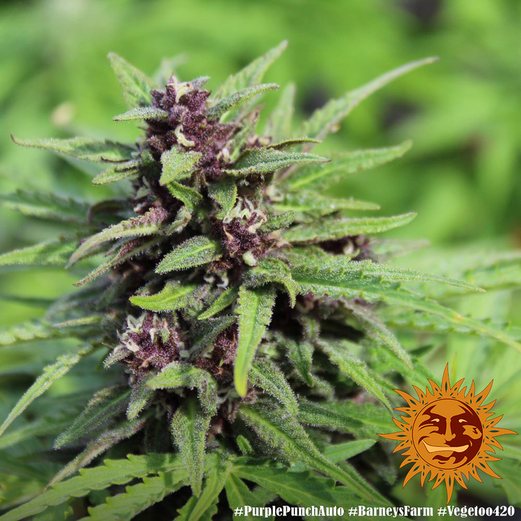

](https://www.seedsman.com/us-en/purple-punch-auto-feminised-seeds-fb-purpun-auto-fem?a_aid=536dc52ef2d64)

**Breezy location** - Try to put your plants in a grow spot with a breeze, but not too much wind. This can be tricky, and it may mean visiting the grow spot a few times before planting.

**Protect your buds from rain. **If you know there will be drizzly conditions, cover your plants with a tarp to protect them from most of the rain. Don't put tarp directly on plants or you'll hurt your buds. Install the tarp up above the plants, and make sure it's held up by the center part, that makes it so rain runs off the sides of the tarp instead of collecting in the middle.

**Shake plants. **Some growers shake their plants on dewy mornings or after rain, so any water drops that form on the leaves don't become breeding grounds for spores.

**Fungicides, Neem Oil & Burning Sulfur**

In the flowering stage, **never **use fungicides, spray affected buds with anything including Neem oil, or burn sulfur.

These common tactics are not effective at stopping bud rot and will make your buds taste, smell, and look terrible.

Some growers use fungicides made specifically for *Botrytis* in the vegetative stage. But when it comes to cannabis, fungicides can only be used as a preventative before any buds have formed.

If you already have bud rot and can't fix your environment (which is the best way to kill *Botrytis*), I highly recommend cutting your losses and taking down the plant.

* 

Most fungicides are not effective for bud rot. If you do plant to spray plants, it’s recommended to get one that’s specifically been developed to combat *Botrytis*.

* 

Any treatments for Bud Rot should be applied in the vegetative stage as a preventative.

* 

There's nothing you can spray on your plants after bud rot has already formed. Unfortunately, there aren't any effective fungicides or other treatments that are safe to use with cannabis in the flowering stage

How to Stop Bud Rot from Spreading

The inside of a dense bud provides a great place for Bud Rot spores to grow, and that’s the main place you’ll find developed Bud Rot on cannabis plants. Once you've spotted bud rot, it's important to act immediately.

As soon as even one part of a single bud starts showing signs of grey mold, the rot can spread to the rest of the cola and then to other buds on the plant. If triggering conditions (lack of airflow, wetness) have not improved, a single point of infection can quickly ruin the harvest of an entire plant.

Never Spray Your Buds with Anything!

**Bud Rot Removal**

* Immediately remove all rotted parts and nearby areas. The only way to stop the spread is to remove all signs of mold from the plant, then move plants to a cool, dry area with a nice breeze.
* Be extremely careful not to let any rot touch any part of the rest of your plant.

**What Happens Next?**

You can either&#8230;

* harvest the cannabis plant now
* let it continue to ripen, but only *if you fix the environment*

If your plant has been affected by bud rot, it means they need less dampness and air that's more dry. If you can improve the environment, you can allow the plant to continue ripening after you've removed the infected buds. However, if you don't fix the environment it will usually come right back, sometimes even attacking other buds overnight.

Here's how to fix the environment:

* add additional [air circulation](https://www.growweedeasy.com/exhaust)
* lower the [humidity](https://www.growweedeasy.com/humidity) (50% RH or lower is optimal if you've already seen bud rot, otherwise 55% should be low enough to prevent it)
* defoliate leafy plants (remove leaves covering bud sites, through the middle of the plant, and any leaves that aren't getting light anyway)
* prevent wet spots on plant

If you **can't **fix the environment, I highly recommend you cut your losses and harvest plants early. If you know that it's still going to be cool, humid, or wet for your plants, your goal is to prevent further buds from becoming infected. Buds harvested early are better than moldy buds.

Whenever you do harvest your healthy buds, be extremely careful during the drying process. Normally growers want to slow dry buds, but if you're worried about mold it's better to dry them with plenty of air circulation and movement.

*Jump to&#8230;*

[Cannabis Temperature Tutorial](https://www.growweedeasy.com/temperature)

[Controlling Humidity in the Grow Room](https://www.growweedeasy.com/humidity)

[Air Circulation & Exhaust Tutorial](https://www.growweedeasy.com/exhaust)

[Other Cannabis Pests, Bugs & Viruses](https://www.growweedeasy.com/bugs-pests-symptoms-marijuana-grow)

[

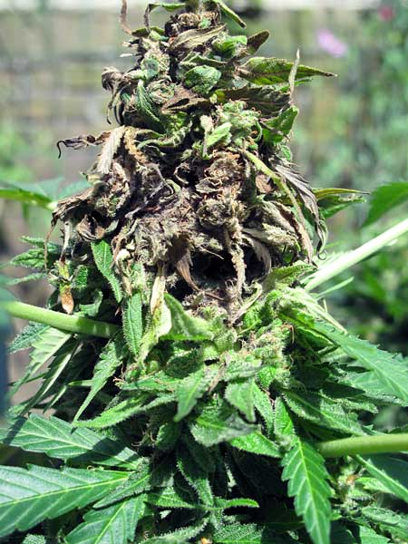

](https://www.growweedeasy.com/wp-content/uploads/2014/11/brown-crispy-bud-rot.jpg)

## Calcium Deficiency

[CaliMagic](https://www.amazon.com/General-Hydroponics-GH1772-CALiMAGic-Quart/dp/B00GZRKI40?keywords=calimagic&qid=1563486828&s=gateway&sr=8-1-spons&th=1&linkCode=ll1&tag=4200a7-20&linkId=da2896de4ad514ec4b819201dd807b3e&language=en_US&ref_=as_li_ss_tl) can help treat a cannabis calcium deficiency. Use at 1 tsp/gallon of water (1.3 mL/L). [Learn more](#cannabis-calcium-deficiency-solution-fix).

[

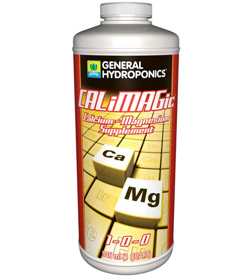

](https://www.amazon.com/General-Hydroponics-GH1772-CALiMAGic-Quart/dp/B00GZRKI40?keywords=calimagic&qid=1563486828&s=gateway&sr=8-1-spons&th=1&linkCode=ll1&tag=4200a7-20&linkId=da2896de4ad514ec4b819201dd807b3e&language=en_US&ref_=as_li_ss_tl)

by Nebula Haze & Sirius Fourside

**Problem:** Calcium is an important nutrient that helps provide structure to the cannabis plant and helps it withstand stress like heat. When your cannabis plant has a calcium deficiency, the main symptom that you'll be able to notice is brown or bronze splotches or spots on your leaves. It is also often associated with yellowing (though leaves don't always turn yellow). Calcium deficiencies are often caused from low pH at the roots, but also occasionally from growing in overly pure or filtered water.

A calcium deficiency causes brown patches or scorch marks on hardworking cannabis leaves.

[

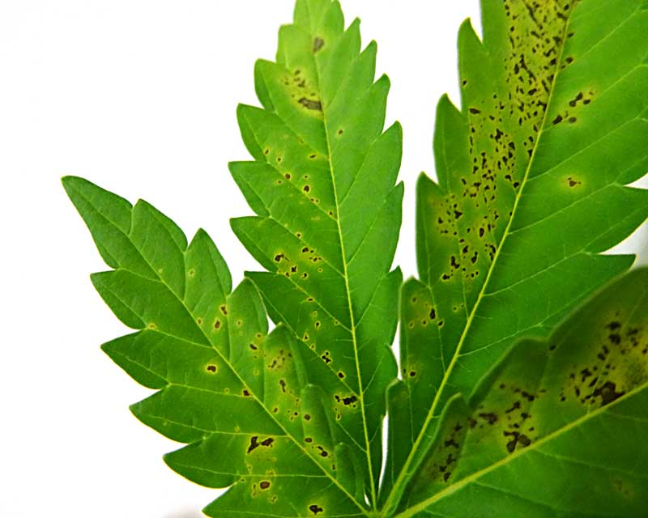

](https://www.growweedeasy.com/wp-content/uploads/2010/10/closeup-calcium-deficiency-leaf.jpg)

Calcium deficiencies are often associated with yellowing in addition to the brown spots, (though not always!). This is an example of the beginning of a calcium deficiency that has yellowing in addition to the brown spots.

[

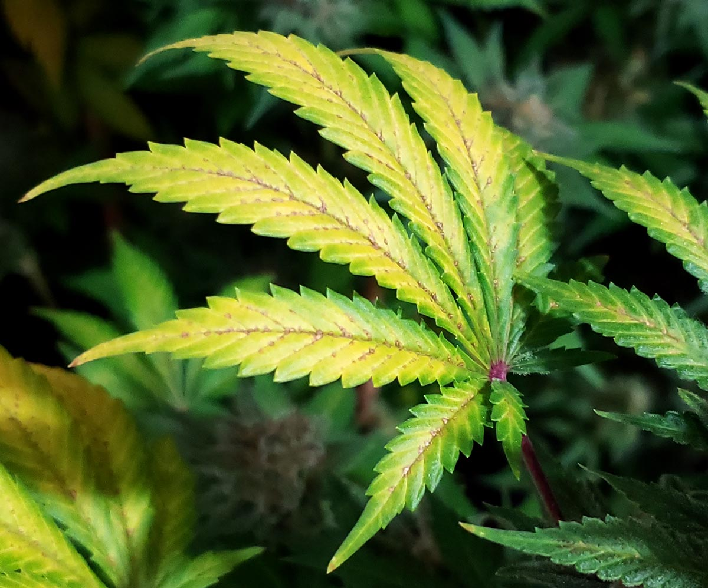

](https://www.growweedeasy.com/wp-content/uploads/2017/10/beginning-of-calcium-deficiency-from-low-ph.jpg)

Here's an example of a Calcium deficiency with just brown spots on the leaves, but no yellowing yet. This is sometimes misdiagnosed as a pest problem because the brown spots may look a bit like [bites from spider mites](https://www.growweedeasy.com/cannabis-plant-problems/how-to-get-rid-of-spider-mites). However, a key difference is a calcium deficiency always makes *brown* spots, while spider mite spots typically look pale or white at first. There's another clue if you check under the leaves and around the plant; with a calcium deficiency you'll never see tiny bugs, eggs, or webbing!

Brown spots from a Calcium deficiency, no yellowing (yet).

[

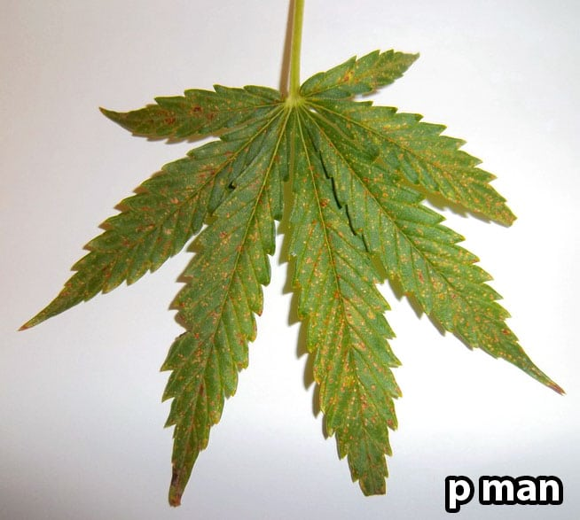

](https://www.growweedeasy.com/wp-content/uploads/2010/10/calcium-deficiency-leaf.jpg)

Calcium deficiencies are common when growing in coco or using soft or filtered water, but the most common reason to see a calcium deficiency is **low pH at the roots**.

[

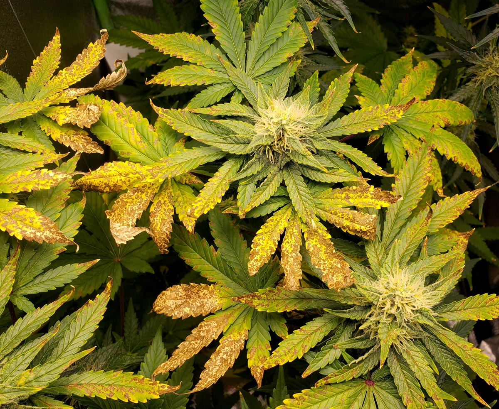

](https://www.growweedeasy.com/wp-content/uploads/2017/10/brown-burnt-spots-calcium-deficiency-low-ph.jpg)

Here's another example of a **calcium deficiency caused by low pH**. Symptoms are typically worse on the leaves at the top of the plant and close to the light.

[

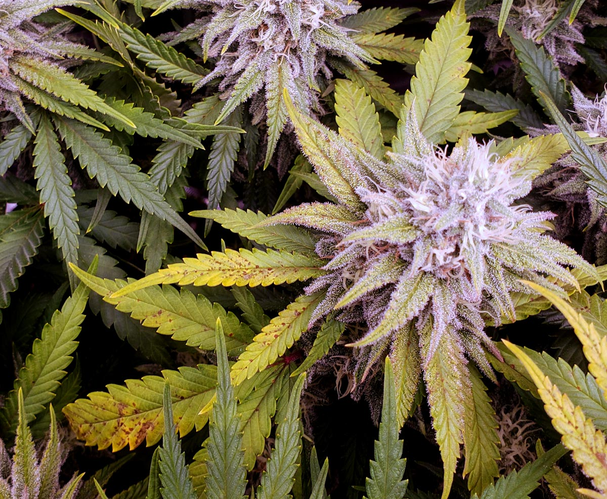

](https://www.growweedeasy.com/wp-content/uploads/2021/07/cannabis-calcium-deficiency-caused-by-low-ph.jpg)

These plants grown in soil are suffering from too low pH at the roots. Although cannabis calcium deficiencies are more common in coco, they can appear in soil and hydro, too. Occasionally the splotches may appear slightly purple, especially under LEDs.

 [

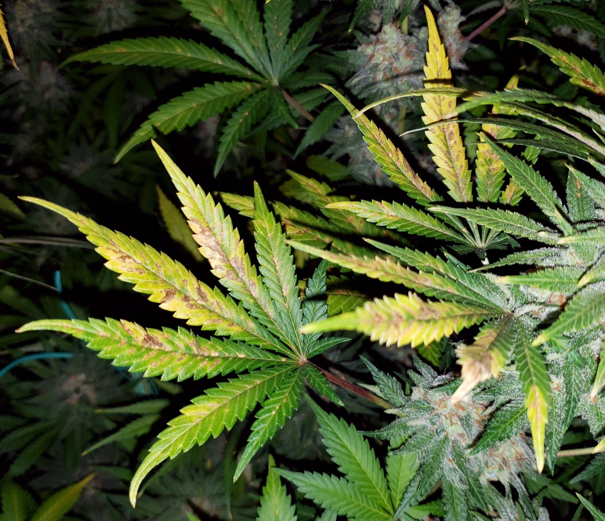

](https://www.growweedeasy.com/wp-content/uploads/2017/10/calcium-deficiency-caused-by-low-ph-at-roots.jpg)

A calcium deficiency is most common in the flowering stage after buds start forming (though you may see it any time).

[

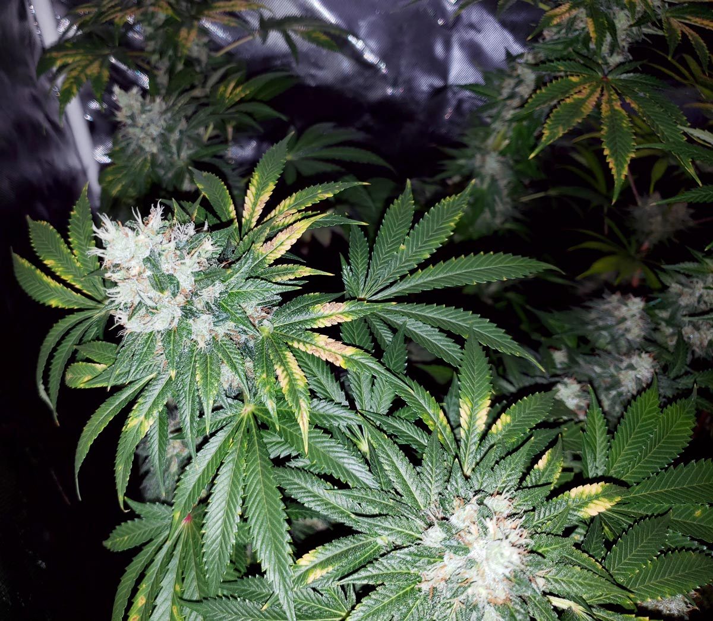

](https://www.growweedeasy.com/wp-content/uploads/2017/10/calcium-deficiency-flowering-caused-by-acidic-soil.jpg)

A cannabis calcium deficiency can sometimes be difficult to diagnose since calcium deficiencies are often accompanied by magnesium, iron, and/or other cannabis deficiencies.

[

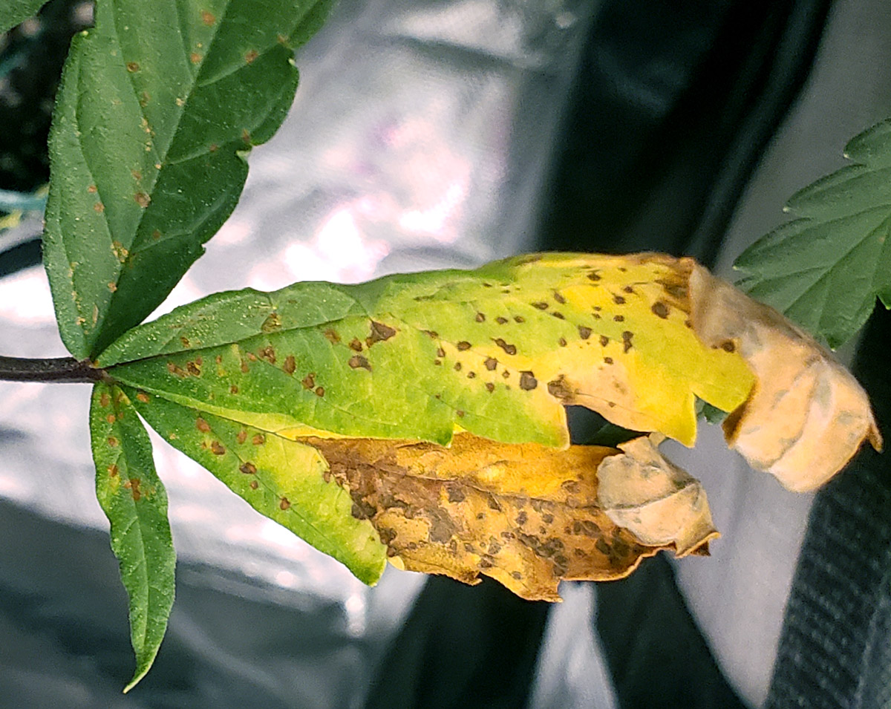

](https://www.growweedeasy.com/wp-content/uploads/2020/10/calcium-deficiency-caused-by-low-ph-flowering-stage-sm.jpg)

It can also be confusing because calcium deficiencies may look different on different strains.

[

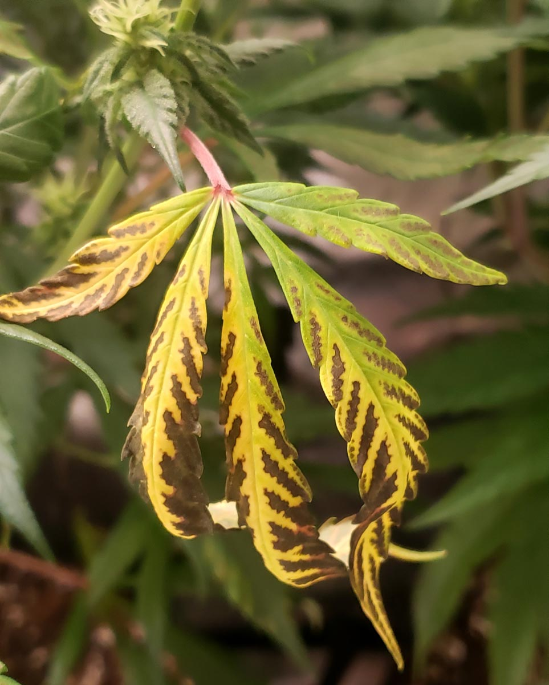

](https://www.growweedeasy.com/wp-content/uploads/2017/10/calcium-deficiency-caused-by-low-ph.jpg)

[Learn more about the relationship between calcium and other cannabis nutrient deficiencies](https://www.growweedeasy.com/common-nutrient-problems).

Calcium moves relatively slowly through the plant (it is a semi-mobile nutrient), which means it tends to "stay put" after it's been given to a leaf. It tends to show up on leaves that are actively growing and getting some amount of light.

Calcium deficiencies most often show up in the following places:

* Newer growth (upper leaves)
* Parts of fan leaves that have been exposed to the light

Found near the top of the cannabis plant under the grow light.

This lower fan leaf is mostly in the shade, but the calcium deficiency appears near the edges that are getting light. Calcium deficiencies often show up on parts of the leaf that are still actively growing.

[

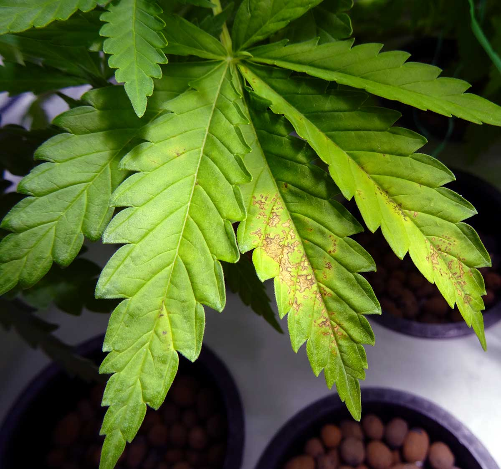

](https://www.growweedeasy.com/wp-content/uploads/2010/10/cannabis-calcium-deficiency-bottom-plant-lack-of-light.jpg)

**Calcium Deficiencies Appear on New or Actively Growing Leaves**

Calcium deficiencies tend to appear on newer or growing leaves, which means calcium deficiencies first appear on leaves where there's rapid vegetative growth.

Some of the most noticeable signs of a calcium deficiency will appear on **newer or growing leaves** which may display:

* Dead spots
* Crinkling
* Spotting / Mottling
* Small brown spots
* Stunted growth
* Small or distorted new leaves
* Curled tips
* Leaf die-off
* Affected leaves may appear green besides the spots

Here's a close-up of a calcium deficiency that appeared on leaves towards the top of a cannabis plant grown in coco coir:

[

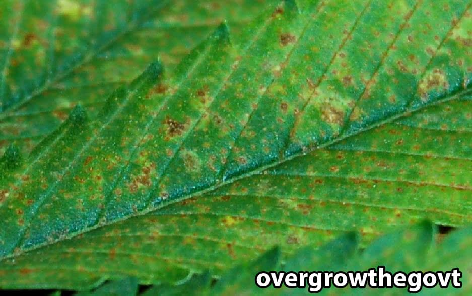

](https://www.growweedeasy.com/wp-content/uploads/2010/10/marijuana-calcium-deficiency.jpg)

**Other Symptoms of Calcium Cannabis Deficiency**

If a cannabis plant is affected by a calcium deficiency for too long, it may begin to show the following symptoms due to the lack of calcium.

* **Stems become weak** or flimsy and may crack easily
* **Stems become hollow **or show inner signs of decay
* Plant **does not stand up well to heat**
* Flowers/buds do not develop fully, or **development is slow**
* **Roots appear weak** or under-developed
* In severe calcium deficiencies, parts of **roots may even die off or turn brown**
* **Roots are more susceptible** to root problems like slimy [root rot](https://www.growweedeasy.com/root-rot-cannabis)

Cannabis tends to like high levels of calcium, so it is unusual to feed too much calcium when using normal amounts of nutrients and/or regular soil. There are not many known cases of cannabis calcium toxicity (too much calcium), however too much calcium *can* cause the plant to lock out other nutrients, so it's important not to go overboard..

**Calcium deficiencies are *more likely* to appear when&#8230;**

* Grower is using **filtered** or **reverse osmisis (RO) water** to feed plants - the amount of calcium found in tap water varies, but some tap water has enough calcium to prevent calcium deficiencies
* **PH is Too Low** - If grow medium is acidic (below 6.2 pH, Calcium can get locked out even if the Calcium is physically there)
* Growing cannabis in **hydroponics** or **coco coir** without supplementing extra Calcium (it's recommended to use a Calcium supplement in hydro or coco)
* When growing in **soil **that hasn't been supplemented with calcium (usually from dolomite lime)
* **Too much potassium** can also sometimes cause the appearance of a calcium deficiency
* **Outdoors **- calcium deficiency is more likely to appear in **acidic soil** (below 6.2 pH)

[

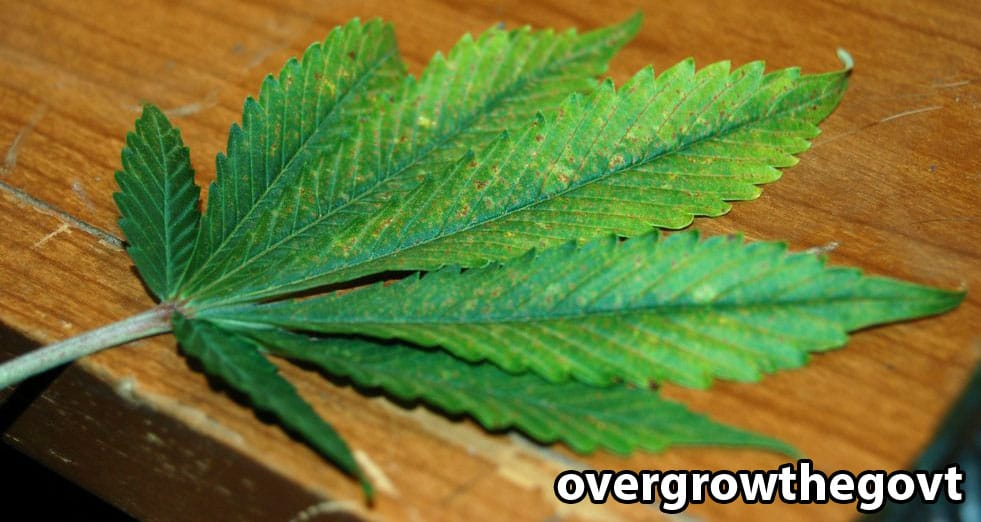

](https://www.growweedeasy.com/wp-content/uploads/2010/10/cannabis-calcium-deficiency.jpg)

Different strains of cannabis tend to have different nutrient problems. Some cannabis strains (or even specific plants) tend to use much higher levels of calcium than others, and so you may see calcium deficiency problems with one plant even when all the other plants (which are getting the same nutrients and environment) aren't showing any signs of deficiency.

**Solution For Calcium Deficiency in Cannabis** 

Your cannabis plant may show signs of a calcium deficiency if the **pH at the roots is too low.** That is because when the pH of your root zone is too acidic, your cannabis cannot properly absorb calcium through its roots. Therefore the first step is to ensure that you have the correct pH for your growth medium. [Learn more about pH and cannabis](https://www.growweedeasy.com/how-do-i-check-the-pH-of-my-water).

**Too low pH** is the MOST common reason for a calcium deficiency to appear

Please note: After a calcium deficiency is cleared up, the problem (brown spots and unhealthy new leaves) will stop appearing on new growth, usually within a week. Please note that leaves which have been damaged by a calcium deficiency will probably not recover or turn green, so you want to pay attention to new growth for signs of recovery.

* In **soil**, calcium is best absorbed by the roots in the **6.2 - 7.0 pH** range (in soil, it's generally recommended to keep the pH between 6.0 - 7.0, but calcium specifically tends to be best absorbed above 6.2)
* In **coco or ****hydro**, calcium is best absorbed by the roots in the **6.2 - 6.5 pH** range (in coco/hydro, it's generally recommended to keep the pH between 5.5 - 6.5, but calcium specifically tends to be best absorbed above 6.2)

**If you suspect your growing cannabis plant has a calcium deficiency,** flush your system with clean, pH'd water that contains a regular dose of [cannabis-friendly nutrients](https://www.growweedeasy.com/best-marijuana-nutrients-review) that includes calcium. This will remove any nutrient salts that may be affected the uptake of calcium and help restore pH to the proper levels.

Cal-Mag Supplement

**To supplement with *extra *Calcium&#8230; **(it's very rare to give a cannabis plant *too much* calcium, however, too much calcium can lock out other nutrients so don't go overboard)

Calcium and magnesium deficiencies often appear together in cannabis. Many growers decide to purchase some sort of Calcium-Magnesium (often called **Cal-Mag**) supplement for their grow room in case this common deficiency appears.

Listed below are common cannabis Calcium supplements, along with some general information about each one. After supplementing with Cal-Mag and correcting the pH, you should expect to see new healthy growth within a week. Remember, the old leaves will probably not recover, but new growth should be green and healthy.

**CaliMagic is Well Suited For Hydro, Coco Coir, or Soil**

[General Hydroponics CaliMagic](https://www.amazon.com/General-Hydroponics-GH1772-CALiMAGic-Quart/dp/B00GZRKI40?keywords=calimagic&qid=1563486828&s=gateway&sr=8-1-spons&th=1&linkCode=ll1&tag=4200a7-20&linkId=da2896de4ad514ec4b819201dd807b3e&language=en_US&ref_=as_li_ss_tl) is a calcium and magnesium plant nutrient supplement. General application is to mix 1 tsp (5ml) of CaliMagic into each gallon of water. I have used Calimagic several times with great results.

Dolomite Lime - For Soil Growers (Organic)

If you're looking for a way to supplement calcium in your organic or soil setup, I highly recommend a product called "Dolomite Lime."

Dolomite is a good source of calcium and magnesium and can be mixed with your soil. The great thing about dolomite is it works slowly over the course of a few months.

Dolomite has a neutral pH of about 7.0 and will help keep soil at the correct neutral pH range which is optimum for cannabis growth.

You can buy [Dolomite Lime](https://www.amazon.com/Dolomite-Magnesium-Calcium-Greenway-Biotech/dp/B00OEEGCHS?pd_rd_i=B00OEEGCHS&psc=1&linkCode=ll1&tag=4200a7-20&linkId=bde31a5080e85113a03d36b380243c78&language=en_US&ref_=as_li_ss_tl) online, but with shipping, it's almost always waaaay cheaper to pick up a bag at a home improvement or gardening store such as Lowes, Home Depot, gardening centers, etc.  If possible, try to get a finer grade of dolomite compared to something that is more coarse.

**How to Use Dolomite Lime for Cannabis:** When growing cannabis indoors, add 6-7 teaspoons of fine dolomite lime to each gallon's worth of soil. So if you're mixing enough soil to fill a 5 gallon container, you want to add 30-35 teaspoons (about 2/3 cup) of dolomite lime to the mix. Mix the dolomite lime and the dry soil thoroughly, then lightly water it with water that has been pH'ed to 6.5. After getting the soil wet, mix the soil well and wait a day or two to let the soil settle before checking the pH and adding plants. When growing in an outdoor garden, follow the dolomite lime manufacturers instructions.

If you cannot get rid of your calcium deficiency, please consult our [7-Step Cure to 99% of Cannabis Growing Problems](https://www.growweedeasy.com/growing-marijuana-plant-problem-deficiency)

## Copper Deficiency

**Problem:** A cannabis copper deficiency appears with leaf symptoms such as dark leaves that take on blue or even purple undertones. The tips and edges of leaves turn pale yellow or white in stark contrast to the rest of the leaves which have turned dark. In flowering it's important to correct a cannabis copper deficiency as soon as possible because buds may stop maturing if the plant isn't fixed up right away. Copper doesn't move easily through the plant and is considered "low-mobile" which means the yellowing leaves might not necessarily turn green again, but the problem should stop spreading to new marijuana leaves.

[

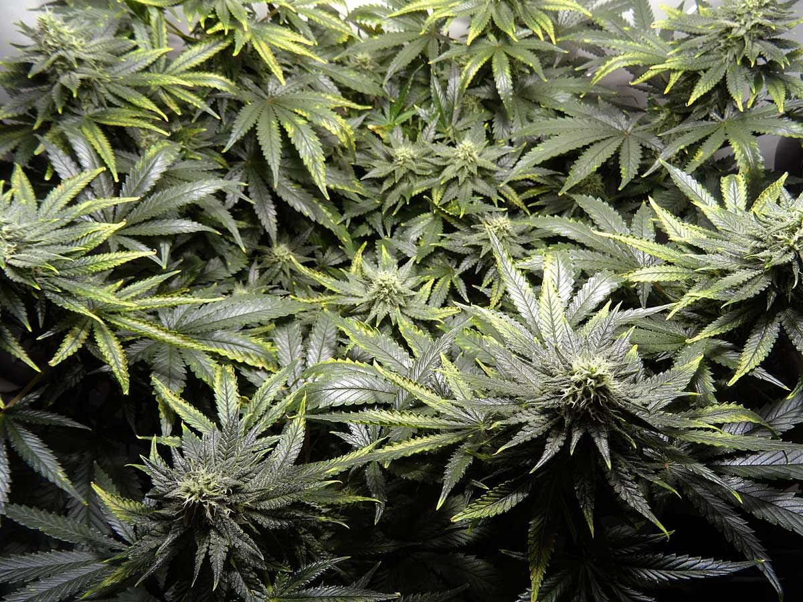

](https://www.growweedeasy.com/wp-content/uploads/2010/10/copper-deficiency-cannabis-flowering.jpg)

**Cannabis Copper Deficiency Symptoms**

* Leaves turn dark with blue or purple undertones
* Tips and edges of leaves turn bright yellow or white
* Shiny or metallic sheen on leaves
* Leaves may feel stiff and start turning under
* Tends to affect leaves directly under the light
* Buds do not ripen, or grow very slowly

The pale tips of a cannabis copper deficiency look a little different from [nutrient burn](https://www.growweedeasy.com/nutrient-burn-cannabis), which may start out with slighly yellow tips, but soon makes tips appear brown or burnt.

This is what the yellow leaf tips of a cannabis copper deficiency looks like. The most telling feature of a copper deficiency is that the rest of the leaf darkens and takes on a blue or purple cast which makes the yellow tips look bright in comparison. The leaves also often appear shiny and may feel stiff.

[

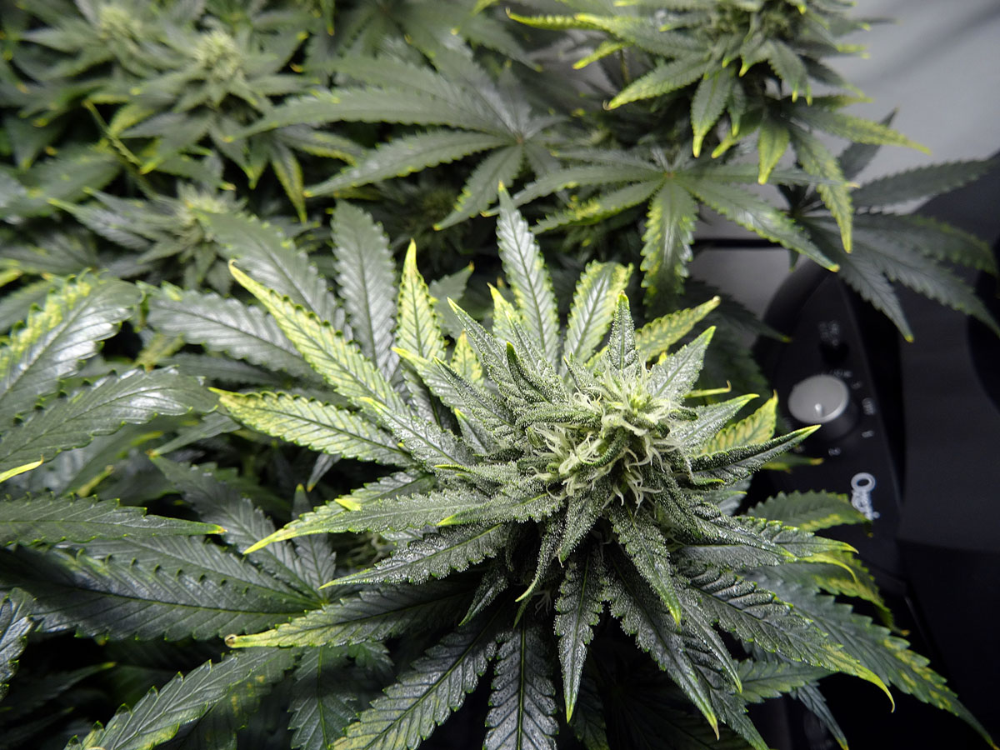

](https://www.growweedeasy.com/wp-content/uploads/2010/06/copper-deficiency-yellow-tips-leaves.jpg)

Some strains are prone to copper deficiencies in the flowering stage, which can create dark purple or reddish hues in the leaves directly under the lights. The following picture shows a Blue Widow plant where all the leaves under the light turned purple due to too-bright light and incorrect pH triggering a copper deficiency.

[

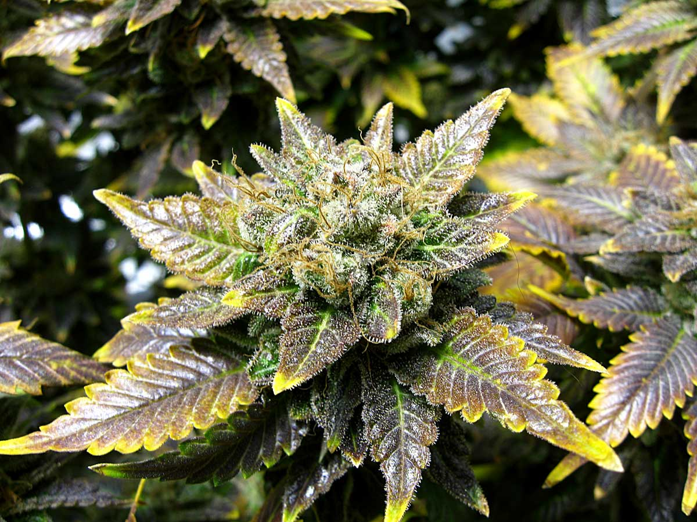

](https://www.growweedeasy.com/wp-content/uploads/2010/10/copper-deficiency-flowering.jpg)

A cannabis copper deficiency tends to affect the leaves directly under the light. If your grow light is close it may help to move lights a little further away.

A big problem with a major copper deficiency if it happens early in the flowering stage, is the affected leaves are not good at photosynthesis and won't provide nearly as much energy for the buds as they would if they were green. It's important to keep leaves near the buds healthy during the majority of the flowering stage to help ensure you get the best yields possible. While it's normal for leaves to start dying in the last week or two before harvest, you should react quickly if you're seeing unhealthy leaves earlier than that!

It is very unlikely that there is no copper available in your water or soil, so usually a copper deficiency in cannabis is caused by a pH problem at the roots that is restricting access to nutrients.

Copper toxicity (too much copper) in cannabis plants is rare, though a severe case of too much copper can cause a quick death to the plant.

**Solution For Cannabis Copper Deficiency**

1.) Adjust pH to Correct Range

The most common reason growers will see copper marijuana deficiencies is when the pH at the roots is not in the correct range. Copper tends to get locked at certain pH levels, and is better absorbed by the plant in a slightly acidic root environment.

**If you suspect your growing cannabis plant has a copper deficiency due to incorrect pH,** flush your system with clean, pH'd water that contains a regular dose of [cannabis-friendly nutrients](https://www.growweedeasy.com/best-marijuana-nutrients-review). This will remove any nutrient salts that may be affected the uptake of copper and help restore pH to the proper levels..

Watch to make sure that the problem starts to clear up within a couple of days. Old growth may not recover, but new growth should be healthy.

* In **soil**, copper is best absorbed by the roots in the **6.0 - 7.0 pH** range
* In **hydro**, copper is best absorbed by the roots in the** 5.5 - 6.5 pH** range

[Learn how to manage your pH](https://www.growweedeasy.com/how-do-i-check-the-pH-of-my-water) for growing cannabis.

2.) Give the Right Nutrients

The truth is, most cannabis growers **don't **need to add more copper in response to a copper deficiency!

In fact, most growers have actually already given plenty of copper to their cannabis plants since it is found abundantly in most tap water. If you're using [quality soil](https://www.growweedeasy.com/organic-super-soil) or [cannabis-friendly nutrients](https://www.growweedeasy.com/nutrients), you probably don't need to worry about adding more copper. In general, copper deficiencies are more likely to appear when a grower is using heavily filtered or reverse osmisis (RO) water to feed plants since any copper has been removed, but pH is a much more common reason growers see copper deficiencies in their cannabis plants.

3.) Take Good Care of the Roots

Copper deficiencies can show up with the plant is having [root problems](https://www.growweedeasy.com/cannabis-root-problems) or if the plant is [overwatered](https://www.growweedeasy.com/overwatering), even if the pH is right and the copper is there. [Proper watering practices](https://www.growweedeasy.com/how-often-water-marijuana) help plants grow healthy and avoid a host of problems!

4.) Watch for Leaf Recovery

After going through all the above steps, watch to make sure that the copper deficiency starts to clear up within a few days to a week or so. The damaged leaves may not completely recover all their green, but you know you're in the clear when you stop seeing symptoms appearing on new leaves.

If you cannot get rid of a cannabis copper deficiency, please consult our [7-Step Cure to 99% of Cannabis Growing Problems](https://www.growweedeasy.com/growing-marijuana-plant-problem-deficiency) with chart!

## Heat Stress

**Problem:** Your cannabis plant can only withstand a certain amount of heat and light. After a certain point, your cannabis will start exhibiting signs of stress on the leaves near the sources of light and/or heat. Your leaves will get yellow or brown brown spotting and may appear generally burnt in places when there's too much light. It's also common for leaves to curl up or down, fold inward like conoes or tacos, and for the serrated edges of leaves to start flipping up. [What else can cause dry, crispy marijuana leaves?](https://www.growweedeasy.com/what-causes-leaves-to-get-dry-or-crispy-and-how-do-I-fix-it)

This cannabis plant suffered from the grow light being too close along with major heat stress during a heatwave in Southern California

[

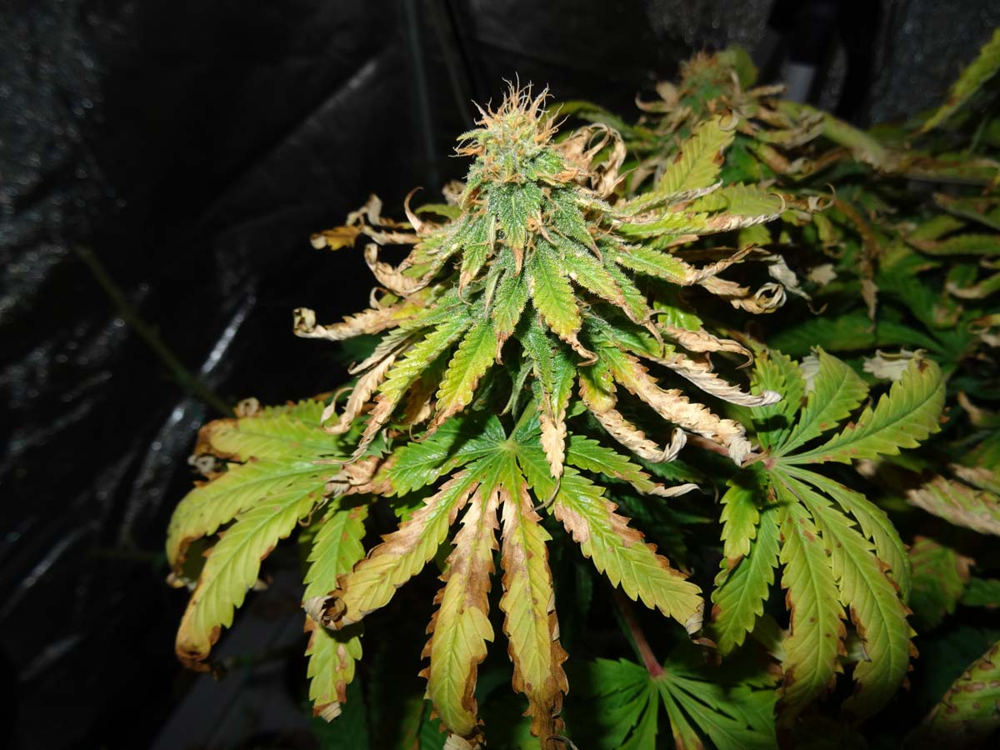

](https://www.growweedeasy.com/wp-content/uploads/2010/10/cannabis-heat-stress-light-burn-bleaching-plus-spots-on-leaves-symptoms.jpg)

**Important for Hydroponic Growers!** [High temps can trigger root rot](https://www.growweedeasy.com/root-rot-cannabis), a serious problem that can kill your plants.

Cannabis will also display heat stress when grown outdoors in hot, dry weather, especially when not given enough water.

When the heat gets too high, the edges of the serrated leaves will begin to curl up even if there are no burns or other signs of light stress.

[

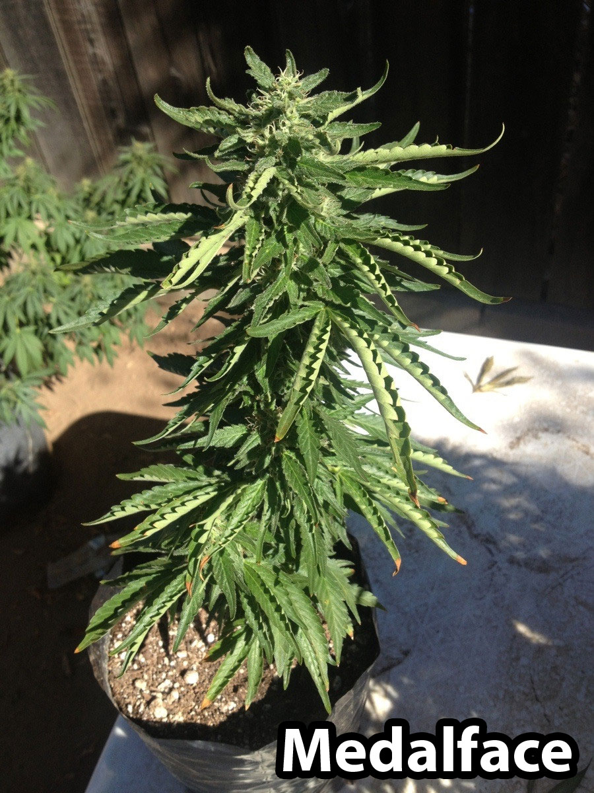

](https://www.growweedeasy.com/wp-content/uploads/2010/06/cannabis-heat-stress-thirsty.jpg)

When the heat gets too high, the edges of the leaves will begin to curl up and the leaves will begin to "cup."

**Heat Stress**

[

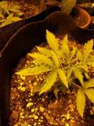

](https://www.growweedeasy.com/wp-content/uploads/2013/05/edges-curling-up.jpg)[

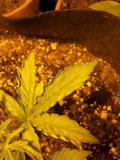

](https://www.growweedeasy.com/wp-content/uploads/2013/05/just-edges-curling-marijuana.jpg)

Very low humidity can make plants more likely to get stressed by the heat. Sometimes you'll get symptoms that look like heat stress even if it's not that hot, and the symptoms are worse because the plant is being affected by very low humidity! Dry, hot air will commonly tip up the edges of leaves like this:

[

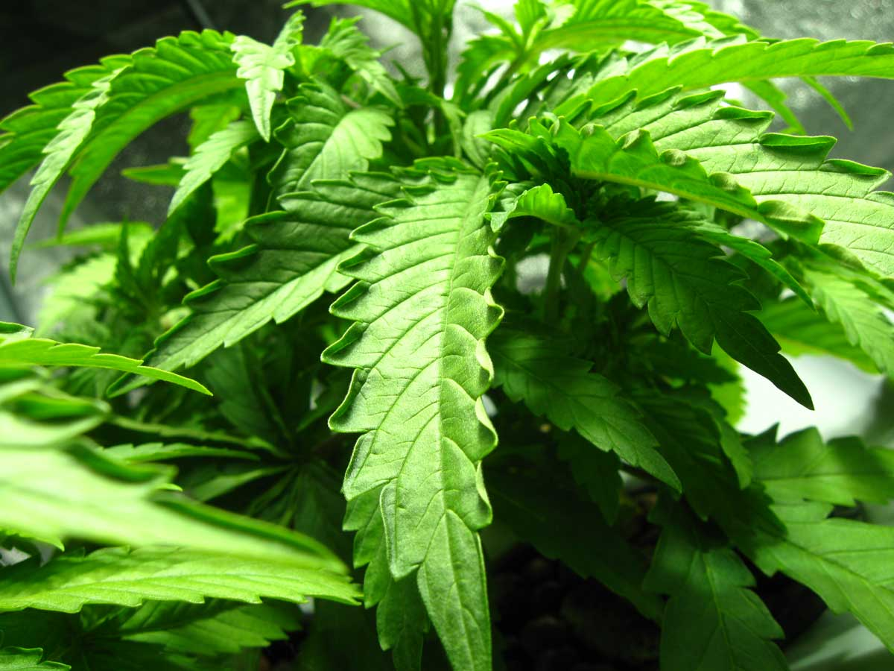

](https://www.growweedeasy.com/wp-content/uploads/2010/10/leaf-edges-tipped-up-from-heat.jpg)

Heat stress is even more damaging in the flowering stage since plant is no longer growing many new leaves. Indica-leaning strains are most prone to heat damage in the flowering stage. Heat damage during budding will reduce your yields by demolishing many of your most important leaves, while also causing buds to grow airy with ugly foxtails.

Even though the grow lights were turned off, this is what happened to an indica-leaning plant **overnight **after being exposed to 105°F (40°C) temperatures during a heat wave.

[

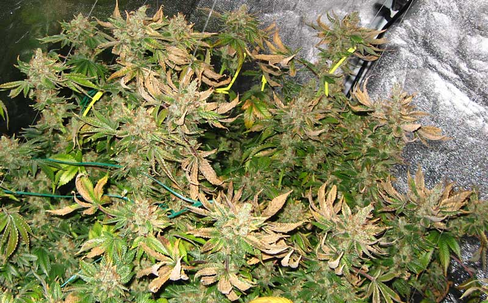

](https://www.growweedeasy.com/wp-content/uploads/2010/06/heat-burn-appear-overnight-flowering.jpg)

If flowering cannabis plants are grown under too-hot conditions for a long time, sometimes they respond by growing new buds on top of the old ones. When you see extensive growth on top of the buds closest to the grow lights, that's a sign that the grow light is too close or the temperature is too high. Some people call the new growth (which often grows in spires) "fox tails."

[

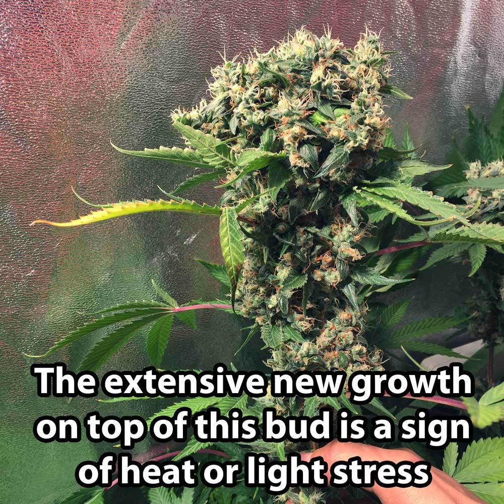

](https://www.growweedeasy.com/wp-content/uploads/2016/10/dont-look-at-foxtail-from-heat-when-deciding-when-to-harvest-marijuana.jpg)

If it seems like your cannabis plants are completely ready for harvest, but they keep putting out new white pistils at the top of the plant, it might just be heat. If that's the case, pay attention to the lower growth to decide [when to harvest](https://www.growweedeasy.com/harvest).

Heat during the flowering stage also causes fox-tails, which are airy and don't have much substance to them. It's basically the same response as growing new buds on top, it just looks a little different on some plants. The plant is basically "abandoning" the original heat-damaged bud to try to make a sad new one.

Example of unwanted "fox-tailing" caused by too much heat

[

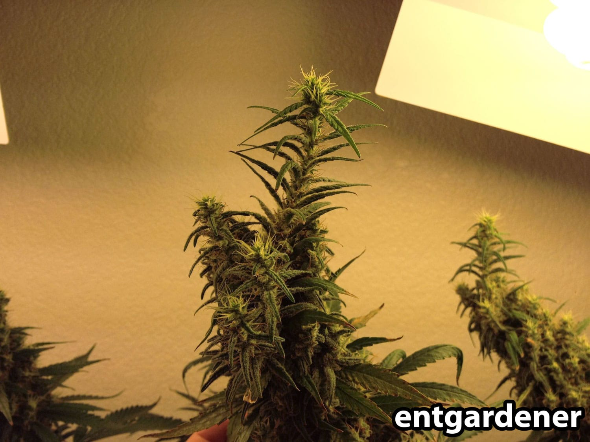

](https://www.growweedeasy.com/wp-content/uploads/2016/10/foxtail-caused-by-heat.jpg)

**Solution:** Get a way to monitor [temperature](https://www.growweedeasy.com/temperature). Control heat by whatever means necessary using the steps outlined below.

[Learn 5 secrets to controlling heat in the grow room](https://www.growweedeasy.com/5-secrets-cannabis-heat-control).

**Indoors**, find a way to lower the temperature and/or [increase the circulation](https://www.growweedeasy.com/exhaust) in the grow room or grow area if heat is the problem. Having a small fan blowing over the tops of your plants will help prevent hot spots from forming directly under your grow lights. [How far away should you keep your grow lights from your plants?](https://www.growweedeasy.com/how-far-grow-lights)

You may consider removing grow lights further away from the tops of the plants if heat is a problem.

When growing cannabis, it's best to try to keep things at a comfortable room temperature at all times for optimal growth. If it's too hot for you, it's probably too hot for your plants.

**Keep roots cool!**

If you can keep your roots cool, it will help your plant deal with heat affecting the top of the plant. If there's some way to protect the roots from heat, do it!

When cannabis plants are recovering from heat shock, some growers recommend using **seaweed kelp extract** (often available as a convenient [liquid fertilizer](https://www.amazon.com/Neptunes-Harvest-Liquid-Seaweed-Plant/dp/B000FQBBHK?ie=UTF8&th=1&linkCode=ll1&tag=4200a7-20&linkId=5cfd46765dd29eb5e494c40cd5aeb90d&language=en_US&ref_=as_li_ss_tl)) to help plants recover from the stress and possible even protect plants from heat stress in the future.

[

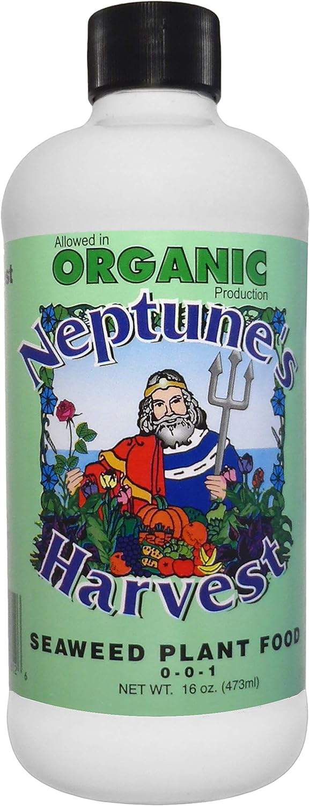

](https://www.amazon.com/Neptunes-Harvest-Liquid-Seaweed-Plant/dp/B000FQBBHK?ie=UTF8&th=1&linkCode=ll1&tag=4200a7-20&linkId=5cfd46765dd29eb5e494c40cd5aeb90d&language=en_US&ref_=as_li_ss_tl)

Many indoor setups will require that you vent out hot air using a fan and/or an [exhaust system](https://www.growweedeasy.com/exhaust). By creating good suction with an efficient exhaust system and adding a carbon scrubber, you can also pretty much scrub all smells from the grow room. [Learn more about controlling odors in the grow room](https://www.growweedeasy.com/how-to-control-smell-when-growing).

An oscillating fan will circulate air in the room as well as provide a gentle breeze for your plants, and a small one will cost less than $20.

[Learn everything you need to know about controlling temperature in the grow room](https://www.growweedeasy.com/temperature-growing-cannabis).

**Outdoors**, you have less options to reduce heat during a heat wave, but you are able to monitor your local weather via weather forecasts.

[Read the full tutorial on how to help outdoor cannabis plants in the heat](https://www.growweedeasy.com/dealing-with-heat-and-humidity-outdoors).

It is possible to partially shield your plants when you know the temperature is going to get hot. You can also adjust your watering schedule to make sure plants at least have plenty of water.

Some things to try when you know the weather outside is going to be hot or dry:

* **water plants in the evening or early morning** to help prevent water evaporation during the hottest hours
* **keep roots cool** - for example by putting your potted plant in a ceramic pot to help insulate the roots from the sun. I've also heard of growers digging a hole in the ground to place their potted plant inside, because the ground is usually cooler than the air when the temperature gets high
* **kelp extract for roots** - provide a small amount of liquid fertilizer that contains [seaweed kelp extract](https://www.amazon.com/Neptunes-Harvest-Liquid-Seaweed-Plant/dp/B000FQBBHK?ie=UTF8&th=1&linkCode=ll1&tag=4200a7-20&linkId=5cfd46765dd29eb5e494c40cd5aeb90d&language=en_US&ref_=as_li_ss_tl) (can help protect against heat stress)
* **increase shade** to reduce the heat experienced by plants - you can use an old sheet or other cloth as a short term solution, or get a professionally made "Sun Shade Sail" which is made particularly to create shade outdoors. It's important to remember that giving plants shade for more than a few days will make them less "hardened" to the sun, and you may need to reintroduce full sunlight back slowly to prevent them from getting shocked from the light intensity
* **move potted plants** - luckily with potted plants, it's usually easier to move them out of direct sunlight during a heat wave
* **take extra good care of heat-stressed plants** - when cannabis plants appear heat-stressed, try to baby them as best you can, and offer shade during the hottest days.

When growing cannabis outdoors, it can often take a few weeks for plant to recover after a hot or dry spell, so prevention is the best medicine for outdoor plants.

*Jump to&#8230;*

[Picking the right grow light](https://www.growweedeasy.com/grow-lights)

[Light-Stress & Light-Burn](https://www.growweedeasy.com/cannabis-light-burn)

[Air Circulation & Exhaust Tutorial](https://www.growweedeasy.com/exhaust)

[7 Tips to Growing Top-Shelf Buds](https://www.growweedeasy.com/7-tips-to-growing-top-shelf-buds)

## Hermies, Pollen Sacs &#038; Bananas

## Table of Contents

[Male vs Female: Why to Avoid Males, Hermies & Bananas](#male-vs-female-plants-intro)

[Seedy Buds Can Be Caused by Two Different Types of Hermies](#when-gender-isn)

* ["True" Hermaphrodite Plants](#hermaphrodite-plants)
* [Bananas ("Nanners")](#bananas)

[How to Avoid Causing Hermies or Bananas](#how-to-avoid-causing-hermies-bananas)

by Nebula Haze

**Remove plants with both male pollen sacs and female flowers (hermies) to avoid pollination/seeds!**

[

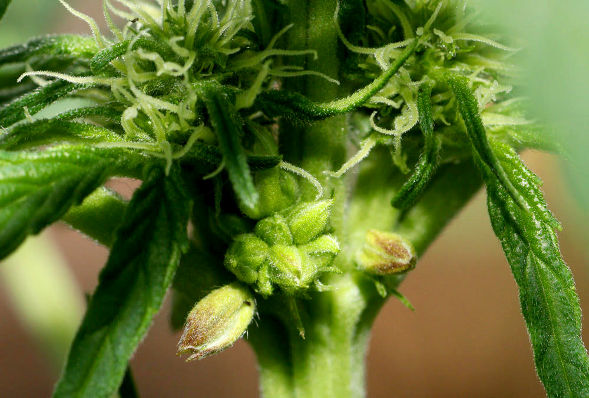

](https://www.growweedeasy.com/wp-content/uploads/2019/06/clear-hermie-pic.jpg)

You may also see yellow "bananas" (stamens) growing around the pistils/hairs of the buds. A stamen normally grows inside a male pollen sac but sometimes appear directly on female buds, especially in times of stress. A stamen produces pollen and doesn't even need to open up before it starts making seeds! Remove plants immediately if they start growing bananas (also referred to as "nanners") or your entire grow room may get pollinated. No one wants to be surprised by seedy buds after harvest.

This highly stressed plant (from heat and too much light) grew a banana in a last desperate attempt to make seeds

[

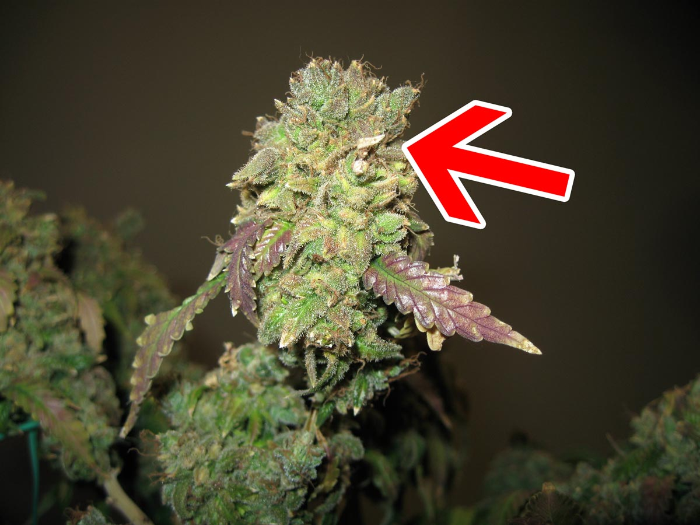

](https://www.growweedeasy.com/wp-content/uploads/2017/10/herm-marijuana-bud-burnt-by-heat-and-too-much-light-ready-to-harvest-immediately.jpg)

Certain cannabis plants will herm even if *healthy and unstressed*. This is a genetic trait carried by some strains and particular plants. That's part of why it's important to grow seeds from a trustworthy [breeder](https://www.growweedeasy.com/trusted-cannabis-breeders). For example, every clone of the following plant grew bananas in week 3 of the flowering stage, under no stress, in multiple different grow setups. When herming is part of a plant's genes, there's not much you can do.

These bananas weren't triggered by stress. Herming is simply part of this plant's genetics. The brown hairs are already pollinated.

[

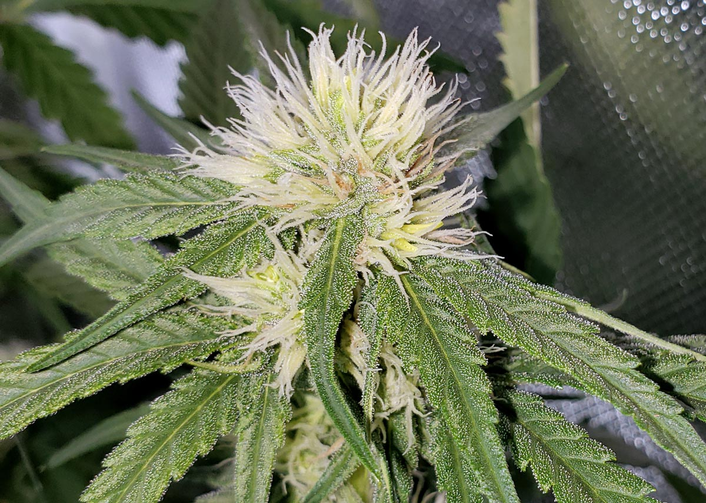

](https://www.growweedeasy.com/wp-content/uploads/2017/10/herm-banana-week-3-flowering-brown-pollinated-pistil.jpg)

Here's a closeup of a herm banana

[

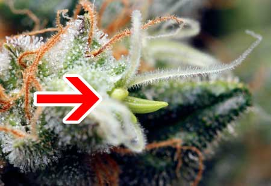

](https://www.growweedeasy.com/wp-content/uploads/2014/02/closeup-example-of-herm-cannabis-banana.jpg)

This poor hermie has male pollen sacs growing among the female flowers. It's recommended to immediately toss any plant that shows both male and female flowers!

[

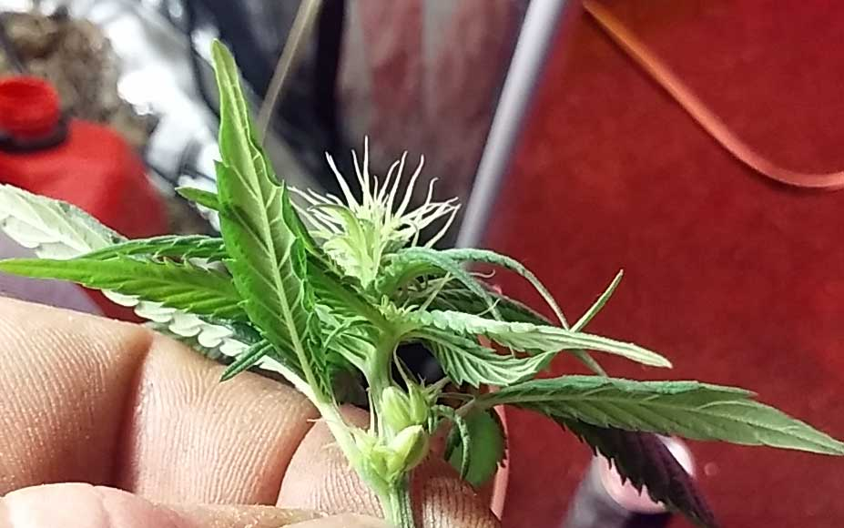

](https://www.growweedeasy.com/wp-content/uploads/2012/11/hermaphodite-hermie-pollen-sacs-partway-through-flowering.jpg)

## **Male vs Female Cannabis Plants: Introduction**

### Cannabis Life Stages and Sex

Did you know there are “male” and “female” cannabis plants? Cannabis plants are “dioecious” plants, which means each plant shows a particular sex, just like humans and many animals. There will occasionally be plants that show *mixed-sex* and these plants are often referred to as hermaphrodites or “hermies”, which I will explain in much greater detail below.

The sex of a particular plant matters quite a bit to growers. That's because only female cannabis plants produce buds. In fact, the "buds" that we smoke are actually the female flowers of the cannabis plant.

The highest quality bud is considered to be "sensimilla" and refers to female cannabis buds that have not been pollinated by a male cannabis plant. The word "sensimilla" actually comes from the Spanish phrase "sin semilla" which roughly translates to "without seeds."

[

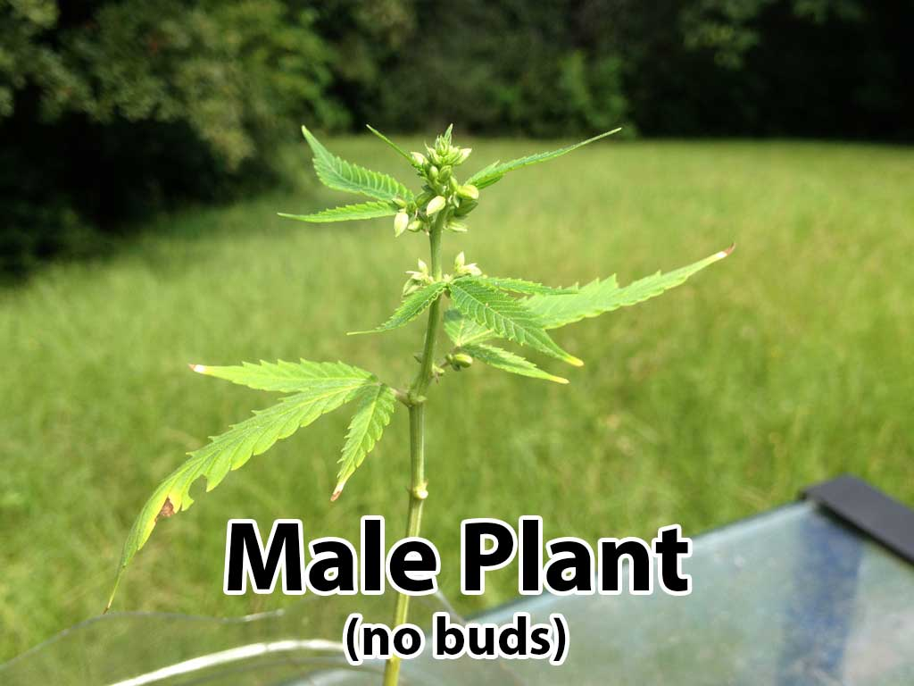

](https://www.growweedeasy.com/wp-content/uploads/2013/03/male-flowering-plant.jpg) [

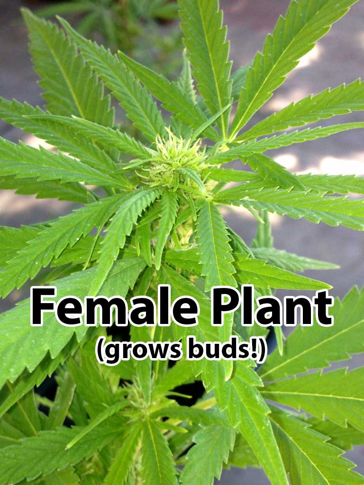

](https://www.growweedeasy.com/wp-content/uploads/2013/03/female-flowering-plant.jpg)

[Learn more about male vs female marijuana plants](https://www.growweedeasy.com/marijuana-boy-girl)

Regular marijuana seeds will *usually* be about 50% male, and 50% female. That means half of the seeds will be unusable as far as growing buds. Please note that some male cannabis plants (about 70% of male cannabis plants according to some estimates) may produce a small amount of useable THC via trichomes growing on the outside of the plant. Unless you've seen the males in your plant's family tree, there is no way to know for sure if a particular male plant is going to produce THC/trichomes. Even if it does it will be a much, much lower amount than a female cannabis plant producing buds.

If you have a male plant and you are trying to grow bud, I strongly, strongly recommend throwing the male plant away immediately and starting another seed or focusing on your other plants. It’s a waste of time to grow male plants for THC or other cannabinoids - they don’t grow buds!

Here's a picture of a male cannabis plant - no buds or trichomes, just pollen sacs!

[

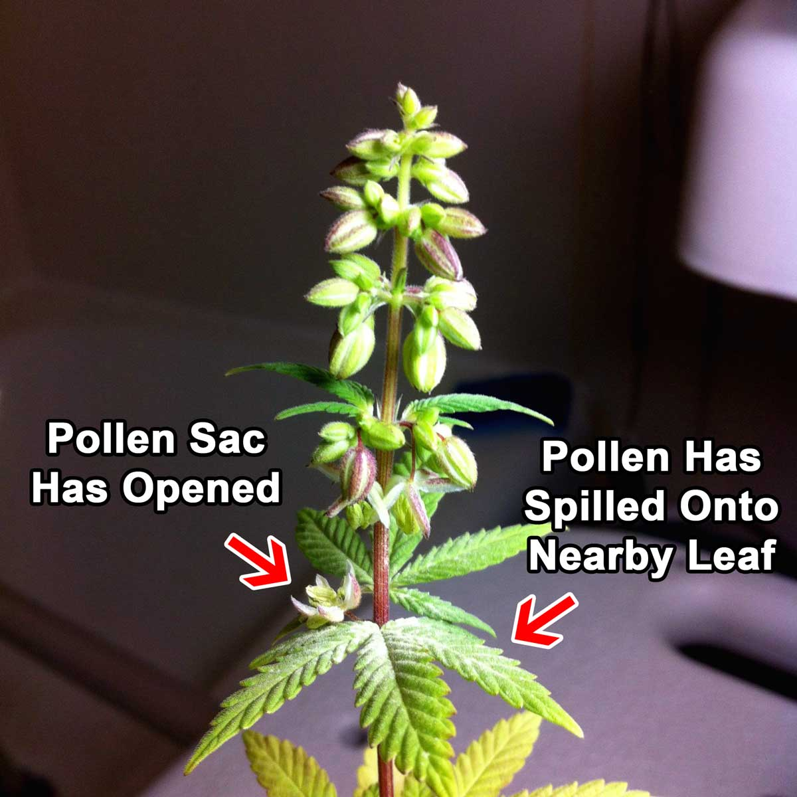

](https://www.growweedeasy.com/wp-content/uploads/2013/03/beautiful-male-plant-pollen.jpg)

*Quick Tip:* How do you make sure you only grow female plants so all your plants produce buds?

One way around the issue of having 50% male and 50% female plants is to purchase feminized seeds online. These seeds are available from all reputable online seedbanks, and the plants produced by these seeds are always female. Get your [questions about buying seeds online answered](https://www.growweedeasy.com/where-can-i-safely-buy-marijuana-seeds-online)! You can also [make your own feminized seeds](https://www.growweedeasy.com/how-to-feminized-cannabis-seeds-colloidal-silver), but you have to start with two known female cannabis plants.

### **
 It’s difficult to look at a young cannabis plant and know its sex**

For the first part of your cannabis plant’s life, it will be in the first stage of growth known as the “Vegetative Stage.” In this stage, your plant will only grow leaves and stems, but no buds or flowers. Think of this as the time when your plant is gaining size to prepare for the second stage of life.

A young vegetative cannabis plant is unlikely to [reveal its sex until it's at least 3-6 weeks old](https://www.growweedeasy.com/preflowers), and sometimes even later than that.

[

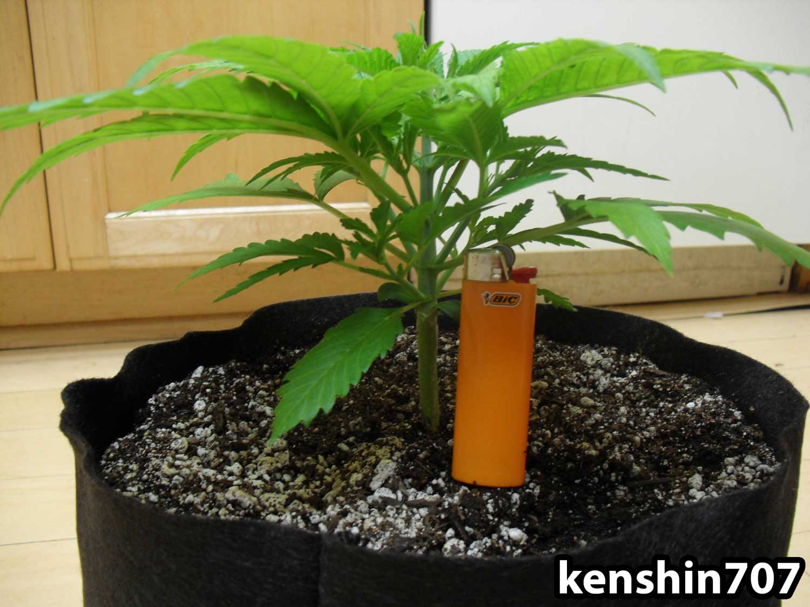

](https://www.growweedeasy.com/wp-content/uploads/2013/06/blackjack-seedling-2-weeks.jpg)

Unfortunately, it's difficult to determine the sex of a cannabis plant when it's a young seedling. Although there is [genetic testing](https://www.growweedeasy.com/preflowers#chemical-leaf-tests) that can be used on plants as young as 1 week old, most growers aren't going to go that route. At a certain point, most strains will "reveal" their sex via pre-flowers at the joints. This can occur as young as 3 weeks old with male plants, and around 4-6 weeks old for female plants. This is normal and is just a sign that your plant is fully mature and ready to start flowering. Learn more about [preflowers](https://www.growweedeasy.com/preflowers).

Another great option is to use clones. Cuttings (clones) taken from a female plant will always turn out to be female. Sometimes clones are showing preflowers by the time they're rooted as a clone. We also know that when you breed two female plants together, you end up with feminized (all-female) seeds.

So, unless you start with a known female clone or feminized seeds, there’s no way to know what sex your plant will turn out until it actually starts showing signs of sex organs. This happens in the second stage of your plant’s life, known as the “flowering stage.” The first sex organs that appear are often called “pre-flowers.”

### **
 When do cannabis plants reveal their sex?**

In addition to looking for [preflowers](https://www.growweedeasy.com/preflowers), all cannabis plants reveal their sex when they reach their second stage of life, known as the “Flowering Stage”.

The first sign of sex almost always appears at the “V” where new growth tips form from a stem, like this….

[

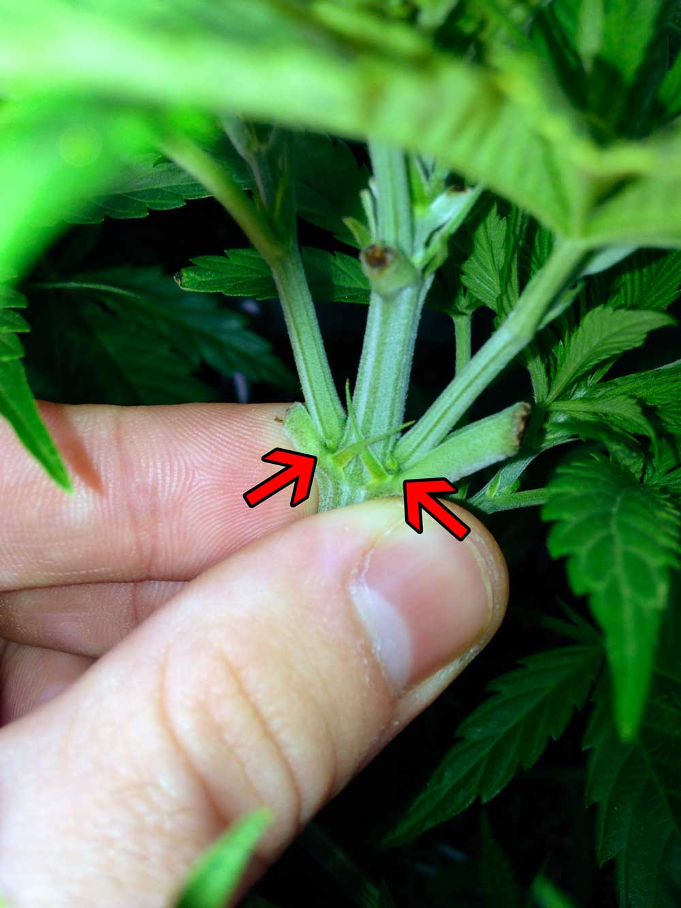

](https://www.growweedeasy.com/wp-content/uploads/2017/04/male-preflowers-cannabis.jpg)

See the little growths appearing at the "V" or "crotch" where the growth node meets the stem? These are the first sign of "[pre-flowers](#pre-flowers)". In this case, we can see the pre-flowers are forming, but it could be tough to tell whether this plant is going to turn into a boy or a girl quite yet. *(Note: It's a boy)*

Younger plants (that are less than 6 weeks old or haven't shown preflowers yet) tend to take a little longer to switch into the flowering stage compared to older, more mature plants that have been vegetating for a while. Other than that, you can pretty much force a cannabis plant to start flowering no matter the age, even 2-3 weeks after the seed was germinated.

Read the full article about male vs female cannabis plants (and learn how to use cloning to identify the sex of young plants while they’re still in the vegetative stage - advanced only!): [https://www.growweedeasy.com/marijuana-boy-girl](https://www.growweedeasy.com/marijuana-boy-girl)

[

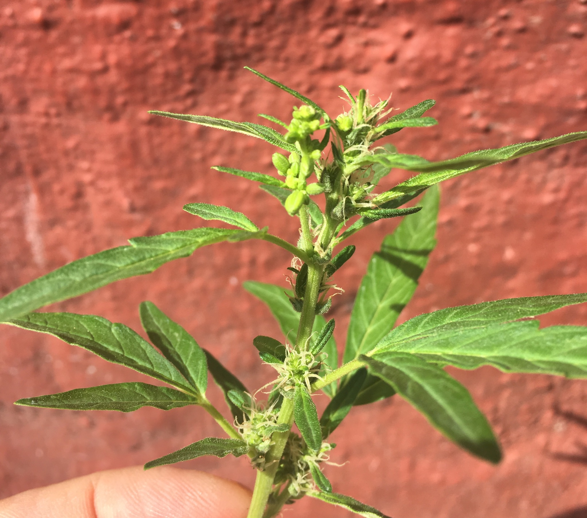

](https://www.growweedeasy.com/wp-content/uploads/2019/06/6E0C43F9-B8E7-4601-8F57-04CD6EDE466A.jpeg)

## 
 **When Sex Isn’t as Certain&#8230; Avoid Accidental Pollination!**

So now you know that most cannabis plants are normally considered to be either “male” and “female.” Yet sometimes you will run into plants that show both male and female characteristics, and these plants can accidentally self-pollinate, or pollinate your other female plants.

**A cannabis plant that shows both male and female parts is often referred to by growers as a hermaphrodite or “hermie.” These can pollinate your plants and cause seedy buds.**

There are a few different types of mixed-sex plants, and it’s important for a grower to understand some of the biggest differences so they make the best decision possible when faced with hermies.

*Important: *It's not advisable to breed mixed-sex plants to create seeds because their offspring are more likely to display hermie characteristics.

### 
 **Hermaphrodite Plants**

Although growers will refer to all mixed-sex plants as “hermies,” there are technically two different kinds: hermaphrodite cannabis plants, and mixed-sex buds (like buds with nanners). The only reason I bother to differentiate between the two is that true hermaphrodite plants are more predictable.

With a "true" hermaphrodite plant, the male and female parts will grow on different parts of the plant. They won't grow together in the same spot such as when nanners appear in the middle of buds.

Here is an example of a true hermaphrodite plant - notice how this hermie has both female pistils and fully formed male pollen sacs

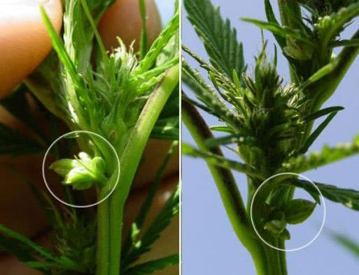

*What causes it?* Stress *can* trigger this type of hermaphroditism, but unlike bananas, this particular type of mixed-sex plant seems to be a little bit more stable based on the plant’s genetics. It usually doesn't take stress to cause these to appear. They're more like a natural trait of the strain. A clone of a true hermaphrodite plant will often also turn into a hermaphrodite, and offspring will often show the same traits even under perfect environmental conditions.

[

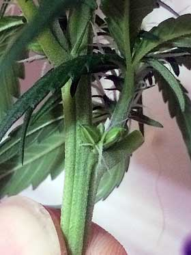

](https://www.growweedeasy.com/wp-content/uploads/2014/02/hermie-pollen-sacs-pistils.jpg)It is recommended to never breed a plant that shows hermaphrodite traits since this is a highly inheritable genetic trait. A good “breeding stock” mother will not show signs of hermaphroditism even when subjected to stress.

*What should the grower do?* It is recommended that you remove hermaphrodite plants from your grow room or grow area as soon as possible to prevent accidental pollination of the buds.

If pollen from a pollen sac is allowed to make contact with your buds, those buds will stop focusing on making more buds and will turn all their “effort” into making seeds. No one wants seedy buds and reduced yields!

Unlike bananas, hermaphrodite plants tend to be more predictable. Though it's not advisable, a grower who watches very closely can carefully pluck all pollen sacs before they’ve burst. However, this should only be done if it's the only plant you have! Don't do this if you have other female plants that can be pollinated!

Remember, while these pollen sacs can start appearing early, they may continue to appear throughout the flowering stage so stay vigilant!

The following type of hermaphrodite plant has mixed male and female parts, referred to in botany as “bisexual” flowers.

With mixed-sex buds you will see plants that grow a mix of pistils and pollen sacs together, like this&#8230;

[

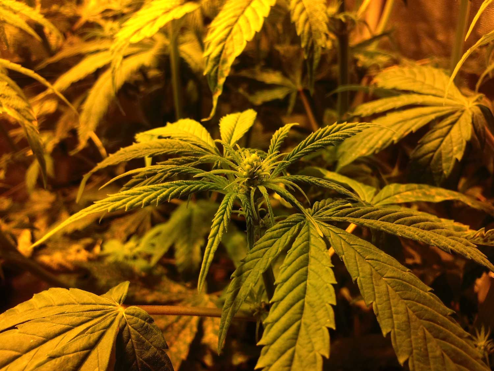

](https://www.growweedeasy.com/wp-content/uploads/2014/02/hermie-plant-pollen-sacs-pistils.jpg)

### 

### 
 **Bananas (“Nanners”)**

Another common type of mixed-sex buds is the type that produces “bananas” (sometimes called “nanners”) which grow from the middle of female buds.

Example of a “Banana” or "Nanner" growing among buds

[

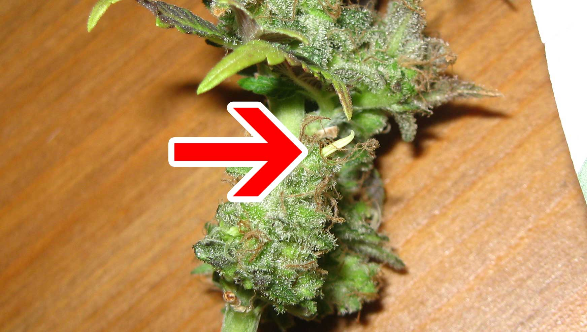

](https://www.growweedeasy.com/wp-content/uploads/2014/02/hermie-banana-nanner.jpg)

Bananas are rarely round and they don’t look like a normal pollen sac. Instead, they’re often elongated and yellow, which is where they get the nickname “banana”. They may grow together in bunches that can look like a bunch of bananas. Occasionally they appear more lime green than yellow.

Sometimes a banana appears lime green instead of yellow

[

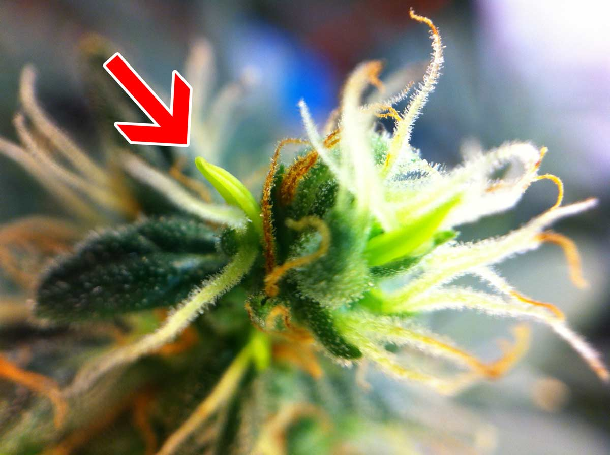

](https://www.growweedeasy.com/wp-content/uploads/2014/02/green-hermie-banana.jpg)
  picture by DW2

These can be a lot more difficult to control than actual pollen sacs, since they may start pollinating everything in the area as soon as they appear. A few bananas won't do much damage, but if you have a big banana problem it may be best to harvest the plants immediately and cut your losses. Seeds take some time to develop, so if a plant starts herming right around harvest time, it's less likely you'll end up with seeds.

Just like real bananas, they can appear in bunches

[

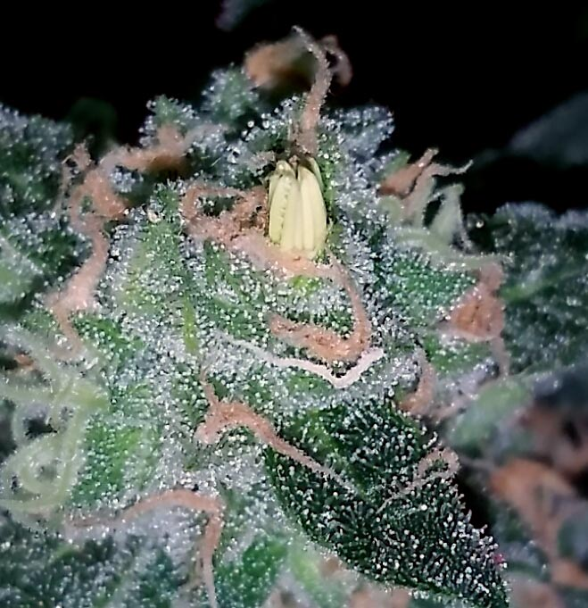

](https://www.growweedeasy.com/wp-content/uploads/2014/02/cannabis-hermie-yellow-nanner-banana.jpg)

*What are they? *Bananas are actually the exposed “male” parts of a pollen sac, called the “[stamen](http://en.wikipedia.org/wiki/Stamen)” which would normally be surrounded by a sac to hold all the pollen until it bursts open. If you open up a fully formed male pollen sac, you will see what looks like bananas (stamens) inside.

But when bananas appear on your plants, they don’t need to “burst” in order to spread pollen, they will immediately start making pollen and often will seed the buds that are close by even if bananas are removed right away, and sometimes the pollen can drift to other plants and pollinate them as well, too.

This banana appeared a few days after the grower used the bud back building technique (cutting off the top tip of all buds to try to get them to grow more fat and round). Apparently, the plant felt attacked

[

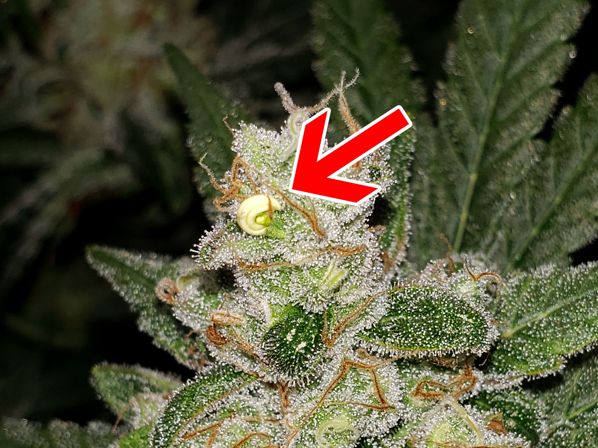

](https://www.growweedeasy.com/wp-content/uploads/2017/10/hermie-nanner-looking-all-like-a-banana.jpg)

This is what it looked like after being picked off

[

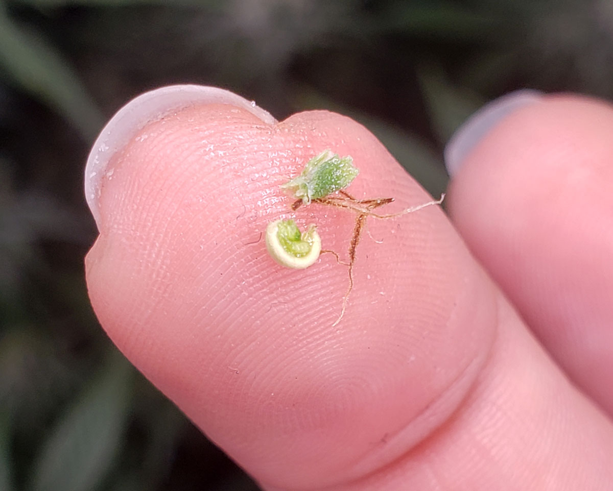

](https://www.growweedeasy.com/wp-content/uploads/2017/10/hermie-banana-on-finger.jpg)

It's possible that the pollen is sterile, and won't pollinate bud successfully&#8230;but don't rely on that happening!

The yellow bunches in this bud are bananas/stamens and will "try" to pollinate everything they can - they don't have to wait for a pollen sac to burst. It's possible that the pollen is sterile, but often you may find seeds.

[

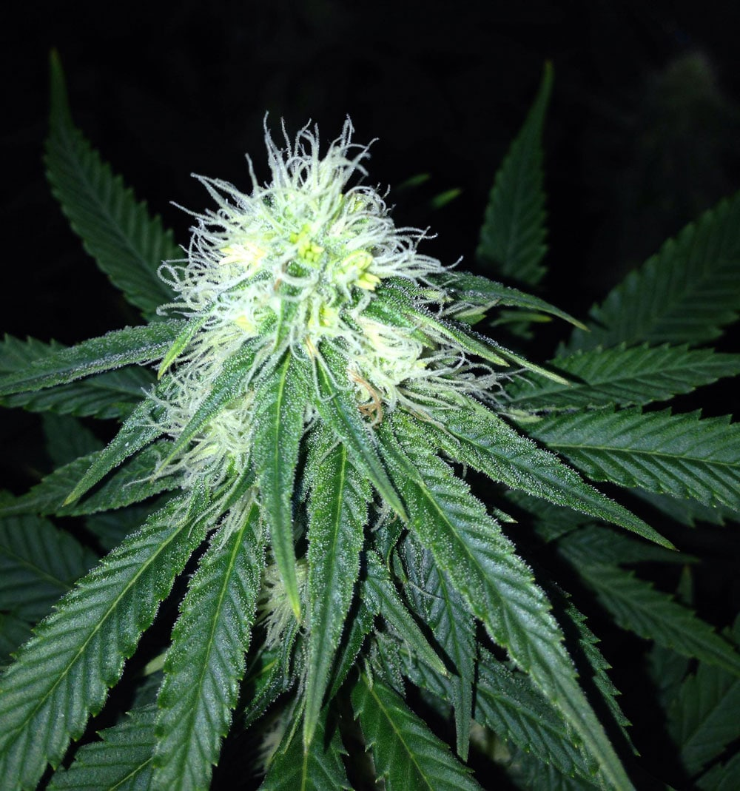

](https://www.growweedeasy.com/wp-content/uploads/2014/02/bananas-middle-bud.jpg)

If a female plant is allowed to go too long without being harvested or pollinated (allowed to go past the point of optimal harvest), she will sometime produce a bunch of bananas in her buds as a last-ditch attempt to self-pollinate and create seeds for the next year. This is sometimes known as [rhodelization](https://www.growweedeasy.com/how-to-make-feminized-marijuana-seeds). This is not as destructive as other types of hermies since it only happens after plants are already past the point of optimal harvest.

*What causes it? *While genetics are ultimate the cause of whether a plant is capable of producing bananas and mixed-sex buds, environmental stress is often a big component in causing bananas to form. Luckily if you stick with high-quality genetics, you are much less likely to run into bananas even if you do accidentally stress your plants. Not all bananas are "fertile" and you may see them without ever getting seeds.

Male hermie banana growing among the beautiful buds 🙁

[

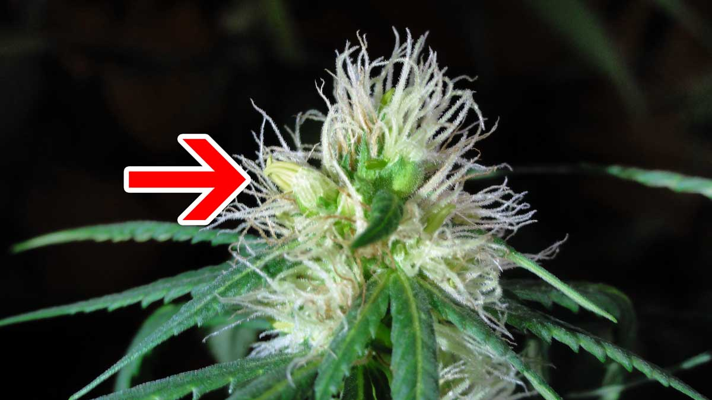

](https://www.growweedeasy.com/wp-content/uploads/2014/02/marijuana-hermie-banana-on-bud-with-pistils.jpg)

**
 What type of stress can trigger bananas to form on cannabis buds?**

* 

**Inconsistent Light Schedules & Light Leaks** - When plants don't get light at the same time each day, or if they're exposed to light during their dark period (light leak). For photoperiod plants, this might be the largest contributor to hermies.

* 

**Temperature **- When temps get too high, hermies and nanners often appear. Cold night temps, or just large temperature swings in general, are also known to trigger bananas for some strains.

* 

**Too-Bright Light** - Like too much heat, and/or light that is too bright can stress your plants and trigger hermies. This is most often caused by growers keeping their lights to close to their plants. You can [light-burn your plants](https://www.growweedeasy.com/cannabis-light-burn) even when the temperature is under control.

* 

**Major Plant Problems** - Major plant problems like [nutrient deficiencies](https://www.growweedeasy.com/cannabis-symptoms-pictures), [root rot](https://www.growweedeasy.com/fix-root-rot), [pH problems](https://www.growweedeasy.com/ph), [light-burn](https://www.growweedeasy.com/cannabis-light-burn) and [nutrient burn](https://www.growweedeasy.com/nutrient-burn-cannabis) can all trigger hermies to start growing.

* 

**Genetics **- While stress plays a big role in the formation of bananas, the tendency to form them is genetic. This tendency is very common in the seeds of a plant that hermied.  “Feminized” seeds, while always female, are much more likely to show the same herming traits as its parent. Growing seeds that were produced this way is naturally selecting to produce more buds that grow bananas. Only get [feminized seeds from a trusted breeder](https://www.growweedeasy.com/feminized-seeds-hermies).

*What should the grower do?* It is recommended that you remove plants showing bananas from your grow area immediately to prevent accidental pollination of buds. If the pollen being formed is allowed to make contact with your buds, those buds will stop focusing on making more buds and will turn all their “effort” into making seeds. If the plant self-pollinates, you will end up with a bunch of sub-par seeds that are likely to have the same problem.

Of the different types of “uncertain sex” cannabis plants, plants with mixed-sex buds (especially hermies with bananas) are the least predictable and this can make them more likely to cause unwanted pollination. This is partially because bananas may be hidden in the buds, and they don't have a pollen sac that needs to burst to pollinate buds - it will start pollinating almost immediately.

A grower who watches very closely can carefully pluck all bananas, but they are unlikely to be successful and will probably end up with at least a few seeds.

Trying to salvage a plant that has started producing tons of bananas is NOT recommended, because it's hard to get them all and you'll end up with seeds. Even worse, once a plant gets started, bananas can appear in huge bunches overnight especially when the plant is stressed. Harvest the plant as soon as you can, before seeds get a chance to start forming.

## 
 **How to Avoid Causing Hermies or Bananas**

This section will explain what you can do as a grower to reduce your chances of running into hermies or bananas in your grow room&#8230;

### **
 1.) Avoid Inconsistent Flowering Light Periods & Light Leaks**

* 

Keep indoor lights on timer, and avoid changing the light schedule during the flowering stage if possible.

* 

Prevent outdoor plants from being exposed to street lights, flood lights or other types of artificial lights during the night.

* 

Respect the dark period - In the flowering stage it's important to make sure all your plants (except [auto-flowering strains](https://www.growweedeasy.com/autoflowering-vs-photoperiod)) get at least 12 hours of uninterrupted darkness every night. Avoid shortened dark periods and light leaks!

No matter the strain, try to keep your plants on a *consistent *schedule throughout their lives, as this helps them set their circadian rhythms.

And for photoperiod plants in the flowering stage, do not interrupt the plant’s 12-hour dark period with light for **any reason**.

*Why?* During the dark period your plant is “counting” the hours until sunlight appears, and interrupting this process is one of the most common ways to stress the plant into producing bananas or hermies. It can also cause your plant to [revert back to the vegetative stage](https://www.growweedeasy.com/re-veg-monstercropping).

Along with the point above, make sure you do not have any **light leaks** in your grow space, which could allow outside light to sneak in during the dark period. During the dark period your plants like complete darkness.

If anything ever happens with your timer or power that causes your plant to get too much light or darkness, it’s important to correct your timer as soon as possible. But don’t worry about it too much if it happens just for one day. It's usually okay if it happens only once, but be careful not to let it happen again since messing up the light schedule can cause hermies. It's better for a plant to get a too-long day than a too-short night period in the flowering stage. So, for example, it's better for it to get an 18-hour day than a 6-hour night. Cannabis plants "count" the hours of the night period, so it's most important to make sure the night period is at least 12-hours long (longer is better than shorter for night periods).

### **
 2.) Maintain Proper Temperature Through Flowering Stage**

* 

Maintain a comfortable temperature in the flowering stage, between 65-85°F (18-30°C).

* 

Avoid big temperature swings - temps should be slightly cooler at night than during the day.

* Don't let the plant (and their roots) sit directly on a cold floor.

Always use “hand-test” to make sure it doesn’t feel too hot in the top canopy of buds under the light. Put one of your hands (palm facing down) under your grow lights where the top of your plants are located and wait 10 seconds - if it feels too hot for your hand it's too hot for the plants! Be careful of cold drafts at night in cool climates during the winter.

Learn more about temperature here: [https://www.growweedeasy.com/temperature-growing-cannabis](https://www.growweedeasy.com/temperature-growing-cannabis)

[

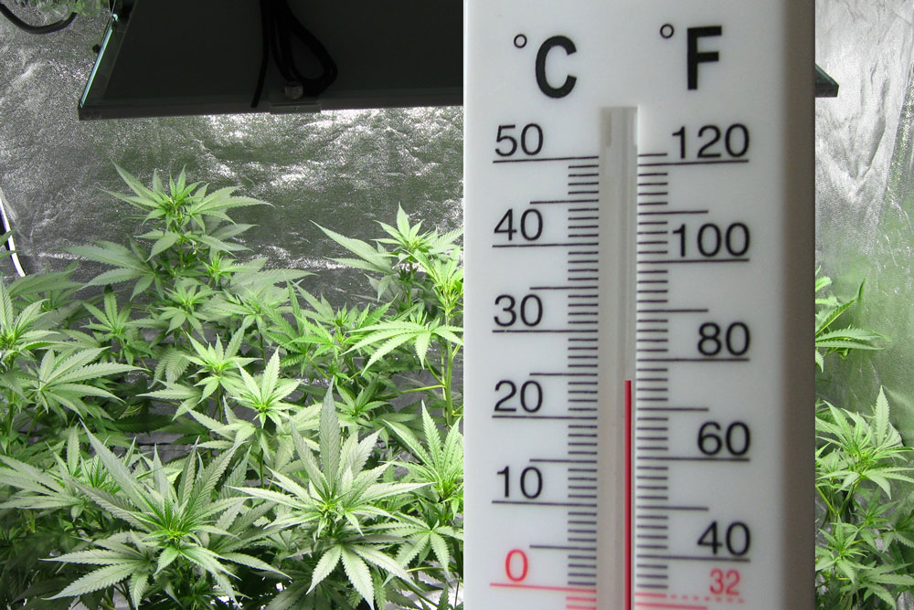

](https://www.growweedeasy.com/wp-content/uploads/2010/10/temperature-monitor-grow-room.jpg)

**
 3.) Don’t Give Your Plants Too Much Light (Light-Burn)**

While generally more light is better for your cannabis plants, very high power brightness can [light-burn](https://www.growweedeasy.com/cannabis-light-burn) your plants, which stresses plants, causes unwanted bleaching, and can trigger the plant to hermie on you.

With high power LED grow lights and big HID lights, make sure to always follow the manufacturer’s specifications as far as the minimum distance from the top of the plants!

Don’t keep your lights too close because even if the heat is under control, too much brightness can cause stress too.

Light-burn is only common with high power LEDs (3W chipsets and bigger, x-lens technology, COBs,  etc.) and big HIDs or perhaps multiple smaller HIDs (usually with an intense cooling system).

It is more difficult to “light-burn” your plants with fluorescent lights, CFLs, smaller HIDs, etc. - with these lights, you only need to worry about heat.

High Power [LEDs](https://www.growweedeasy.com/led-grow-lights) or [HID](https://www.growweedeasy.com/mh-hps-upgrade-guide) Grow Lights Will Light-Burn Plants When Kept Too Close
 (yes, even if the temperature is completely under control)

[Learn more about giving your plants too much light](https://www.growweedeasy.com/too-much-light)

**
 4.) Prevent Major Plant Problems**

Major stress to the plant can cause the plant to react in unpredictable ways, including producing bananas and male pollen sacs. Major stresses include&#8230;

* 

Major [nutrient deficiency](https://www.growweedeasy.com/cannabis-symptoms-pictures)

* 

[Nutrient Burn](https://www.growweedeasy.com/nutrient-burn-cannabis) - given too much nutrients

* 

[Pest infestation](https://www.growweedeasy.com/bugs-pests-symptoms-marijuana-grow)

* 

Total leaf loss (usually as the result of overzealous [defoliation](https://www.growweedeasy.com/defoliation) or bugs)

* 

Any other huge stress to the plant

Want to read about a real example?

The plant pictured to the right was subjected to cold temperatures and then grew directly into the grow light, putting it under a lot of stress.

From the grower [Saberabre](http://www.reddit.com/user/Saberabre): “So I left this girl (or what I thought was a girl, notice the pistils at the bottom calyx) over the weekend and came back to the plant up in the light getting burned. Yikes! I'm not too sure what happened here but it got pretty cold the last few days. I think it's a hermie&#8230;”

[

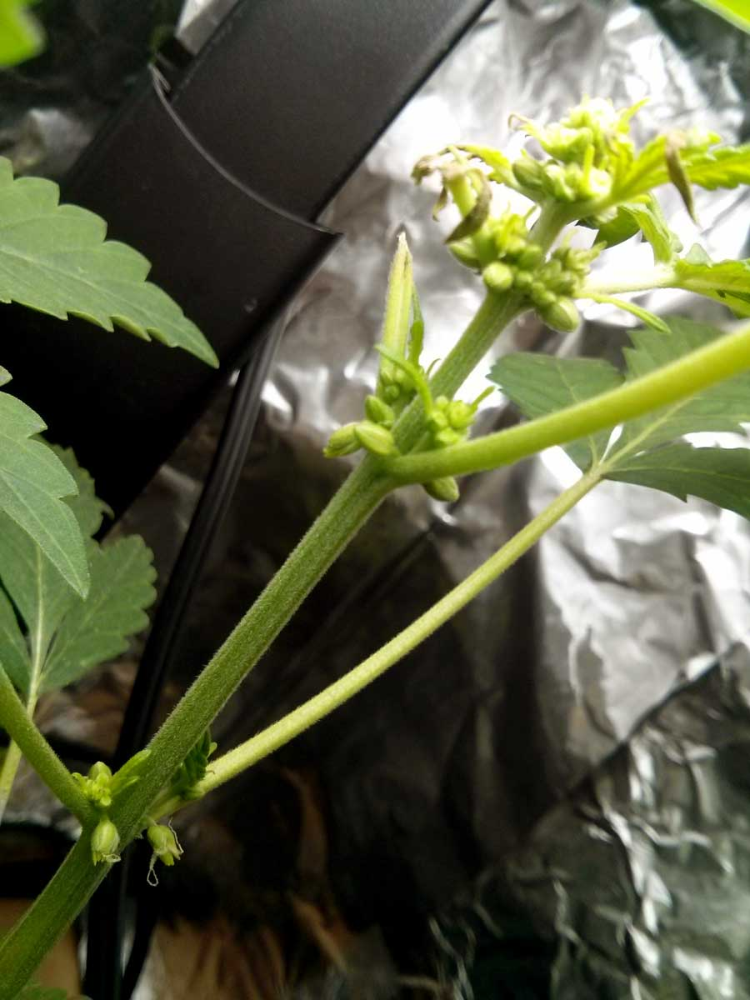

](https://www.growweedeasy.com/wp-content/uploads/2014/02/pistil-balls-hermie-cannabis.jpg)

A few days before this pic, the plant was just showing a few white pistils and appeared to be female.

After the stress that it went through, the grower came back to a plant that was completely covered in male pollen sacs, with the first few white pistils being the only sign of this plant is female.

**
 5.) Always Start with Trusted Genetics**

Hermaphroditism and mixed-sex buds seem to be more common when growing plants from bagseed (seeds that you find) or seeds from an unprofessional breeder.

[Do feminized seeds cause hermies?](https://www.growweedeasy.com/feminized-seeds-hermies)

The reason is that seedy buds are worth less than sinsemilla (unseeded buds). Therefore, if you find a seed in your bud, it likely was the result of either bad growing practices (male plants weren’t removed in time) or due to some type of problem (plants were stressed and self-pollinated, which means the next generation is most likely to do so).

When you’re buying seeds from a trusted breeder, they go to great lengths to prevent unintended pollination, and they specifically select for plants that don’t ever show mixed-sex traits.

[Which cannabis breeders can I trust?](https://www.growweedeasy.com/trusted-cannabis-breeders)

And remember… even if you do everything right, sometimes you will run into hermie plants - it’s just a fact of growing. Sometimes these things just happen, for example&#8230;

“I've always felt like seeded weed was not nearly as potent as sinsemilla and I do everything in my power to kill all males! Cannabis is so sneaky, though - last summer we had such wild weather that even a couple of clones turned out some male sex parts.”

*~ Experienced outdoor grower*

[

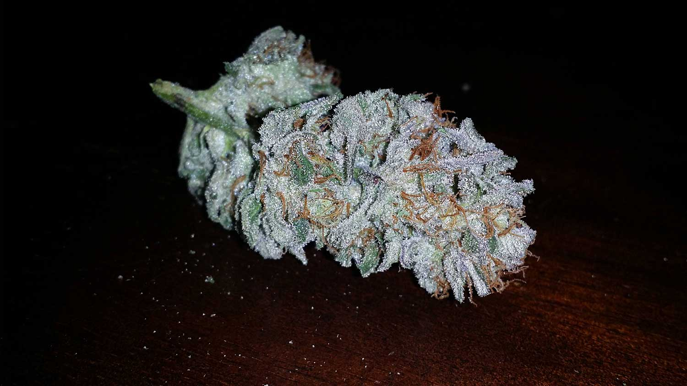

](https://www.growweedeasy.com/wp-content/uploads/2014/02/most-beautiful-nug-in-the-world.jpg)

*Jump to&#8230;*

[Male vs Female Cannabis Plants](https://www.growweedeasy.com/marijuana-boy-girl)

[What do I need to get started growing indoors?](https://www.growweedeasy.com/cannabis-supplies-get-started-growing)

[Take a look at cannabis grow journals](https://www.growweedeasy.com/cannabis-grow-journals)

[Where can I buy feminized seeds?](https://www.growweedeasy.com/seeds)

"Cannabis has both male and female plants. When both female and male flowers are in bloom, pollen from the male flower lands on the female flower, thereby fertilizing it. The male dies after producing and shedding all his pollen. Seeds form and grow within the female flowers. As the seeds are maturing, the female plant slowly dies. The mature seeds then fall to the ground and germinate naturally or are collected for planting the next spring. 

"Unpollinated, female cannabis flowers continue to swell and produce more resin while waiting for male pollen to successfully complete their life cycle. After weeks of heavy flower and cannabinoid-laden resin production, THC production peaks out in the unfertilized, frustrated sinsemilla!"

~Jorge Cervantes in [Indoor Marijuana Horticulture](https://www.amazon.com/dp/1878823299?tag=growwcom07-20&camp=0&creative=0&linkCode=as4&creativeASIN=1878823299&adid=1W4RF2KNCVZ8SK0NERP6&)

## Iron Deficiency

by Nebula Haze & Sirius Fourside

**Problem:**  A cannabis iron deficiency is usually seen first on bright yellow new leaves, and the symptoms of a cannabis iron deficiency can sometimes appear alongside other cannabis nutrient problems or deficiencies. An iron deficiency is usually caused by problems with pH, though sometimes a cannabis iron deficiency can be triggered by a stressful environment and may clear up on its own after the period of stress is over.

[

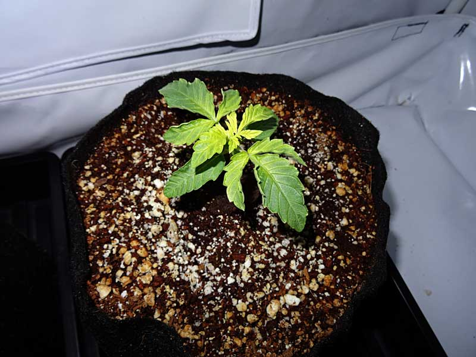

](https://www.growweedeasy.com/wp-content/uploads/2016/09/iron-deficiency-yellow-new-leaves.jpg)

The main symptoms of a cannabis iron deficiency are:

* Newest leaves are completely yellow when they first grow in
* The bright yellow (almost white looking) color on new growth is the signature sign of an iron deficiency.
* Sometimes the affected yellow leaves are so damaged they're beyond recovery. Other times the yellow parts of the leaves may begin to turn green as the plant continues to grow, starting from the tips and moving in toward the base of each leaf
* Eventually an entire leaf can become green and relatively healthy looking, even though it started out completely yellow from an iron deficiency. The ability of yellow leaves to eventually turn green is another signature of an iron deficiency, because for most other nutrient deficiencies any yellow leaves can't truly turn green again.

A cannabis iron nutrient deficiency can look similar to a [magnesium deficiency](https://www.growweedeasy.com/magnesium-deficiency-cannabis), but an iron deficiency will affect newer/upper/inner leaves, where a magnesium deficiency affects older/lower leaves.

The following severe iron deficiency was actually caused by an outdoor grower using too much pure chicken manure as a fertilizer. Any time you use manure to fertilize your plants, remember a little bit goes a long way! Chicken manure tends to raise the pH of soil, which is one of the prime triggers of an iron deficiency. In addition to changing the pH, the high level of nutrients contained in chicken manure may have interfered with iron uptake by the roots, causing further iron lock-out.

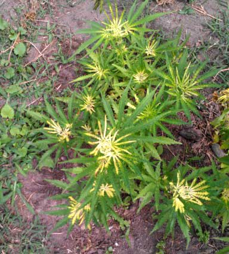

Immediately after adding chicken manure and watering, the plant started producing bright yellow, almost white leaves that immediately dried up and died from the damage. Even though this plant was showing the signs of an iron deficiency, the iron *was* available in the soil - the problem was that the plant just couldn't get access to the nutrients due to nutrient lock-out conditions. In this case, grower needs to dig up the manure (since that is the real cause of this problem) & replant with good soil.

**Solution For Cannabis Iron Deficiency**

*Note: *Sometimes a cannabis iron deficiency (like all nutrient deficiencies) can be triggered by stressful conditions, and the plant may recover on its own after the period of stress is over.

1.) Adjust pH to Correct Range

Easily the most common reason growers will see an iron deficiency is if the pH at the roots is too high. Iron tends to get locked at at higher pH levels, especially when the pH is above 7.0, and iron deficiencies are more commonly seen in soil or coco coir than in hydro.

**If you suspect your growing cannabis plant has a iron deficiency due to too-high pH,** flush your system with clean, pH'd water. This will remove any nutrient salts that may be affecting the uptake of iron and help restore pH to the proper levels..

* In **soil**, iron is best absorbed by the roots in the **6.0 - 6.5 pH** range (although it's generally recommended for soil growers to keep pH in the 6.0-7.0 range, iron tends to get locked out when the pH is higher, especially above 7.0)
* In **coco coir or hydro**, iron is best absorbed by the roots in the** 5.5 - 6.5 pH** range

[Learn how to manage your pH](https://www.growweedeasy.com/how-do-i-check-the-pH-of-my-water) for growing cannabis.

2.) Give the Right Nutrients

The truth is, most cannabis growers **don't **need to add more iron in response to an iron deficiency!

In fact, most growers have actually already given plenty of iron to their cannabis plants since it is found abundantly in most tap water. If you're using [quality soil](https://www.growweedeasy.com/organic-super-soil) or [cannabis-friendly nutrients](https://www.growweedeasy.com/nutrients), you probably don't need to worry about adding more iron.

Iron deficiency symptoms caused by true lack of iron are more likely to appear when a grower is using heavily filtered or reverse osmisis (RO) water to feed plants since any iron has been removed. There are other nutrient problems that can trigger the symptoms of an iron deficiency, for example problems with with [calcium](https://www.growweedeasy.com/calcium-deficiency-cannabis) and [magnesium](https://www.growweedeasy.com/magnesium-deficiency-cannabis), or an excess of copper can all lead to symptoms of an cannabis iron deficiency.

[

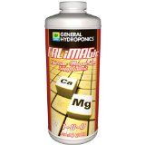

](https://www.amazon.com/gp/product/B00GZRKI40/ref=as_li_tl?ie=UTF8&camp=1789&creative=390957&creativeASIN=B00GZRKI40&linkCode=as2&tag=growwcom07-20&linkId=YCGB3OKNQKYVREDQ)If you suspect you have a iron deficiency even though the pH is correct, or if you believe your system is truly lacking in iron, you may want to consider flushing your system with clean, pH'd water (if on schedule, you can do this alongside a dose of your regular [nutrients](https://www.growweedeasy.com/best-marijuana-nutrients-review)) and add a supplement that contains **Iron**, **Calcium **and **Magnesium**.

Cannabis loves Calcium and Magnesium, and they work hand and hand with Iron. A Calcium-Magnesium supplement (often called "Cal-Mag" even though they also include iron) can help prevent all of these deficiencies from appearing.

Cal-Mag products are suitable for Hydro, Coco Coir and Soil (not organic, though). This may be a great choice because it also contains extra calcium and magnesium, which are deficiencies that are relatively common for cannabis, and often happen alongside an iron deficiency.

[CaliMagic by General Hydroponics](https://amzn.to/1JXYB0O) is the calcium, magnesium, and iron** **plant nutrient supplement that we use, though pretty much all other Cal-Mag products will work just as well for growing cannabis.

3.) Take Good Care of the Roots

Iron deficiencies can show up with the plant is having [root problems](https://www.growweedeasy.com/cannabis-root-problems) or if the plant is [overwatered](https://www.growweedeasy.com/overwatering), even if the pH is right and the iron is there. [Proper watering practices](https://www.growweedeasy.com/how-often-water-marijuana) help plants grow healthy and avoid a host of problems!

4.) Watch for Recovery

After going through all the above steps, watch to make sure that the iron deficiency starts to clear up within a week or so (try to be patient since iron moves relatively slowly through the plant). The yellow leaves from before may not recover completely, especially if there was a lot of damage, but when new growth is coming in green, you know you're good to go!

If you cannot get rid of a cannabis iron deficiency, please consult our [7-Step Cure to 99% of Cannabis Growing Problems](https://www.growweedeasy.com/growing-marijuana-plant-problem-deficiency)

## Leaf Septoria / Yellow Leaf Spot

by Nebula Haze

Stop Leaf Septoria (Yellow Leaf Spot) in Its Tracks!

Sometimes called "yellow leaf spot" or "leaf septoria," this condition is caused by a fungus (or sometimes a bacteria) that attacks cannabis plants and usually appears in warm, wet weather. The symptoms first appear on the bottom leaves of the plant.

The spots may have darkened borders and may have a hard growth in the middle like a little pimple, but the thing that makes the spots the most unique is they are often very uniform, like little circles. Each spot is the receptacle of a spore (ewwww) which look like tiny dark specks in the center of each spot.

Although the spots often appear yellow like in the picture below, they will start turning **brown **over time. So if you see round brown spots on your cannabis leaves it could also be caused by leaf septoria.

[

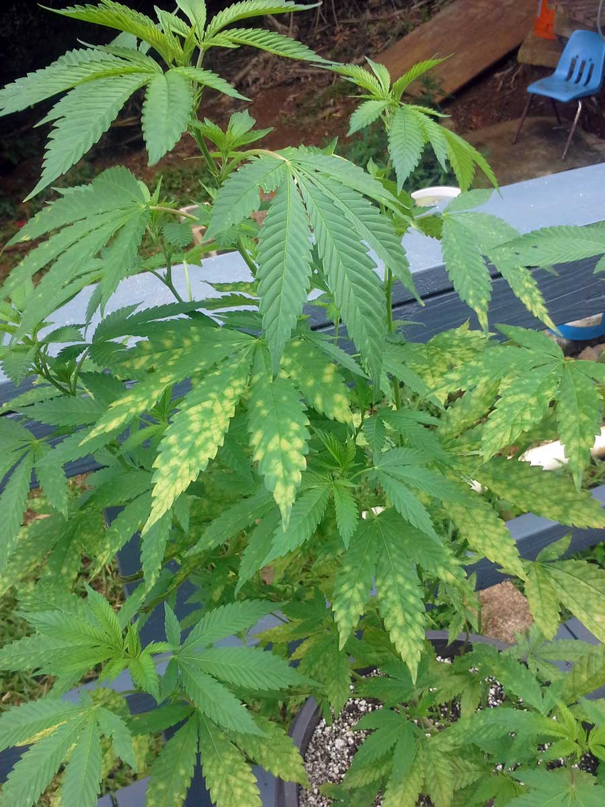

](https://www.growweedeasy.com/wp-content/uploads/2016/06/yellow-spots-tmv-or-weird-disease-virus-cannabis-yellow-leaf-spot-leaf-septoria-started-at-one-and-half-month-old.jpg)

Solution to Leaf Septoria

These fungus spores may stay in the soil over the winter, and attack your plants in the summer. Spores are also easily spread by wind and rain.

* Immediately (and carefully) remove all affected leaves to get rid of as many spores as possible.
* Prune any leafy parts of the plant to improve circulation through the plant
* Avoid getting water on the leaves or laying on top of each other - you want to avoid moisture
* Make sure to keep the ground under your plant clean. Rake away all leaves and vegetation. Adding mulch can also help prevent spores from spreading.
* Keep plants healthy, sicks plants are much more susceptible to leaf septoria than healthy plants
* One way to help prevent this fungus from attacking your plants is to rotate crop sites or move to a new location every year.
* A [copper based fungicide](https://www.amazon.com/Bonide-811-Copper-Fungicide-473ML/dp/B00BSULSHA/ref=as_li_ss_tl?ie=UTF8&qid=1525625796&sr=8-5&keywords=copper+based+fungicide&linkCode=ll1&tag=4200a7-20&linkId=52a63bddcfabbd9fab8e90549bc14524) or [Biofungicide](https://www.amazon.com/Bonide-Revitalize-Fungicide-Concentrate-Ounce/dp/B076HW6S9K?pd_rd_i=B076HW6S9K&psc=1&linkCode=ll1&tag=4200a7-20&linkId=410ea686b884e68c79598fb0d8e71332&language=en_US&ref_=as_li_ss_tl) may be effective at stopping the fungus from spreading though they are best used as a preventative.
* Depending on exactly what's causing your leaf spot, [Neem Oil](https://www.amazon.com/dp/B082MPZ8D1?psc=1&pd_rd_i=B082MPZ8D1&pd_rd_w=fPgwe&pf_rd_p=887084a2-5c34-4113-a4f8-b7947847c308&pd_rd_wg=mwHAR&pf_rd_r=4MF374AXYD6TW40HEP1Q&pd_rd_r=e3dc6818-935a-4b74-99da-997631dae687&spLa=ZW5jcnlwdGVkUXVhbGlmaWVyPUExREYyOUdLUzhBTTVTJmVuY3J5cHRlZElkPUEwNTI1MTYwMjFEQVZWWEdZSVhTWiZlbmNyeXB0ZWRBZElkPUEwMTUyODc5MUlYQzlRMDRNTTFLSCZ3aWRnZXROYW1lPXNwX2RldGFpbCZhY3Rpb249Y2xpY2tSZWRpcmVjdCZkb05vdExvZ0NsaWNrPXRydWU%3D&linkCode=ll1&tag=4200a7-20&linkId=25ba6c2070fd6ea3c0080b8573be77a8&language=en_US&ref_=as_li_ss_tl) may be used to help combat the problem. Neem Oil will leave an unpleasant taste/smell on buds when used to treat flowering plants, so don't let this stuff get near your buds! You will need a [mister](https://www.amazon.com/Chapin-1002-48-Ounce-Sprayer-Multi-purpose/dp/B00002N8OB/ref=as_li_ss_tl?_encoding=UTF8&pd_rd_i=B00002N8OB&pd_rd_r=W4A5MVZWMFWH74AT55F1&pd_rd_w=UPVXy&pd_rd_wg=EwzKa&psc=1&refRID=W4A5MVZWMFWH74AT55F1&linkCode=ll1&tag=4200a7-20&linkId=a2d7c98e205d36298c69fe10d350e28b) (also called a "One-Hand Pressure Sprayer") to spray all the leaves evenly, since neem oil and water can separate easily. Try spraying just a small part of the plant and see how it reacts first before spraying the whole thing.

A [copper based fungicide](https://www.amazon.com/Bonide-811-Copper-Fungicide-473ML/dp/B00BSULSHA?ie=UTF8&qid=1525625796&sr=8-5&keywords=copper+based+fungicide&linkCode=ll1&tag=4200a7-20&linkId=b3eaae9f5fc9dc40879766338fb265ae&language=en_US&ref_=as_li_ss_tl) or a [Biofungicide](https://www.amazon.com/Bonide-Revitalize-Fungicide-Concentrate-Ounce/dp/B076HW6S9K?pd_rd_i=B076HW6S9K&psc=1&linkCode=ll1&tag=4200a7-20&linkId=410ea686b884e68c79598fb0d8e71332&language=en_US&ref_=as_li_ss_tl) may help, but these are most effective as a preventative

           [

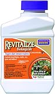

](https://www.amazon.com/Bonide-Revitalize-Fungicide-Concentrate-Ounce/dp/B076HW6S9K?pd_rd_i=B076HW6S9K&psc=1&linkCode=ll1&tag=4200a7-20&linkId=5719bd225c6118dea630e19140d4c3b9&language=en_US&ref_=as_li_ss_tl)

Spraying affected areas with [neem oil](https://www.amazon.com/dp/B082MPZ8D1?psc=1&pd_rd_i=B082MPZ8D1&pd_rd_w=fPgwe&pf_rd_p=887084a2-5c34-4113-a4f8-b7947847c308&pd_rd_wg=mwHAR&pf_rd_r=4MF374AXYD6TW40HEP1Q&pd_rd_r=e3dc6818-935a-4b74-99da-997631dae687&spLa=ZW5jcnlwdGVkUXVhbGlmaWVyPUExREYyOUdLUzhBTTVTJmVuY3J5cHRlZElkPUEwNTI1MTYwMjFEQVZWWEdZSVhTWiZlbmNyeXB0ZWRBZElkPUEwMTUyODc5MUlYQzlRMDRNTTFLSCZ3aWRnZXROYW1lPXNwX2RldGFpbCZhY3Rpb249Y2xpY2tSZWRpcmVjdCZkb05vdExvZ0NsaWNrPXRydWU%3D&linkCode=ll1&tag=4200a7-20&linkId=025dc3e0742f39e5e2be180d1ad51af8&language=en_US&ref_=as_li_ss_tl) can help (use a [mister](https://www.amazon.com/Chapin-1002-48-Ounce-Sprayer-Multi-purpose/dp/B00002N8OB/ref=as_li_ss_tl?_encoding=UTF8&pd_rd_i=B00002N8OB&pd_rd_r=W4A5MVZWMFWH74AT55F1&pd_rd_w=UPVXy&pd_rd_wg=EwzKa&psc=1&refRID=W4A5MVZWMFWH74AT55F1&linkCode=ll1&tag=4200a7-20&linkId=a2d7c98e205d36298c69fe10d350e28b)), but don't let it get near your buds!

[

](https://www.amazon.com/dp/B082MPZ8D1?psc=1&pd_rd_i=B082MPZ8D1&pd_rd_w=fPgwe&pf_rd_p=887084a2-5c34-4113-a4f8-b7947847c308&pd_rd_wg=mwHAR&pf_rd_r=4MF374AXYD6TW40HEP1Q&pd_rd_r=e3dc6818-935a-4b74-99da-997631dae687&spLa=ZW5jcnlwdGVkUXVhbGlmaWVyPUExREYyOUdLUzhBTTVTJmVuY3J5cHRlZElkPUEwNTI1MTYwMjFEQVZWWEdZSVhTWiZlbmNyeXB0ZWRBZElkPUEwMTUyODc5MUlYQzlRMDRNTTFLSCZ3aWRnZXROYW1lPXNwX2RldGFpbCZhY3Rpb249Y2xpY2tSZWRpcmVjdCZkb05vdExvZ0NsaWNrPXRydWU%3D&linkCode=ll1&tag=4200a7-20&linkId=25ba6c2070fd6ea3c0080b8573be77a8&language=en_US&ref_=as_li_ss_tl)    

[More Cannabis Pests, Bugs & Viruses](https://www.growweedeasy.com/bugs-pests-symptoms-marijuana-grow)

## Light Burn or Light Stress

**Problem:** Your cannabis plant can only withstand a certain amount of light. After a certain point, your cannabis will start turning yellow or otherwise exhibit signs of stress on the leaves near the sources of light and/or heat.

[How far away do I keep grow lights from my plants?](https://www.growweedeasy.com/how-far-grow-lights)

**Light burn usually causes yellow leaves at the top of the plant directly under the grow lights (though it can appear on older leaves that have been exposed for a long time).**

[

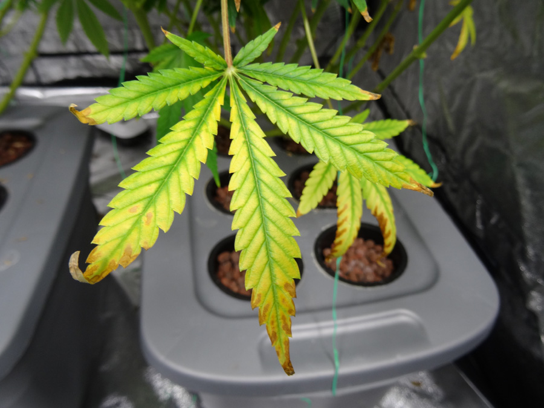

](https://www.growweedeasy.com/wp-content/uploads/2014/04/light-burn-leaf-cannabis.jpg)

Sometimes the **first sign** a plant is getting too much light is all the leaves start pointing up or "praying", like this (though sometimes you don't see any symptoms until the yellowing starts)

[

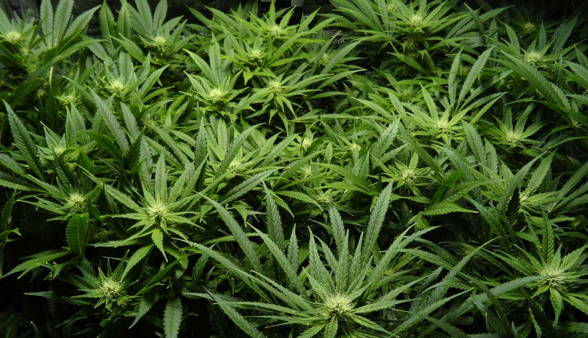

](https://www.growweedeasy.com/wp-content/uploads/2017/05/canopy-of-medical-marijuana-buds-flowering.jpg)

With light burn, often the inside veins stay green. Yellow leaves won't fall off or be plucked off easily, unlike a nitrogen deficiency where leaves fall off on their own.

[

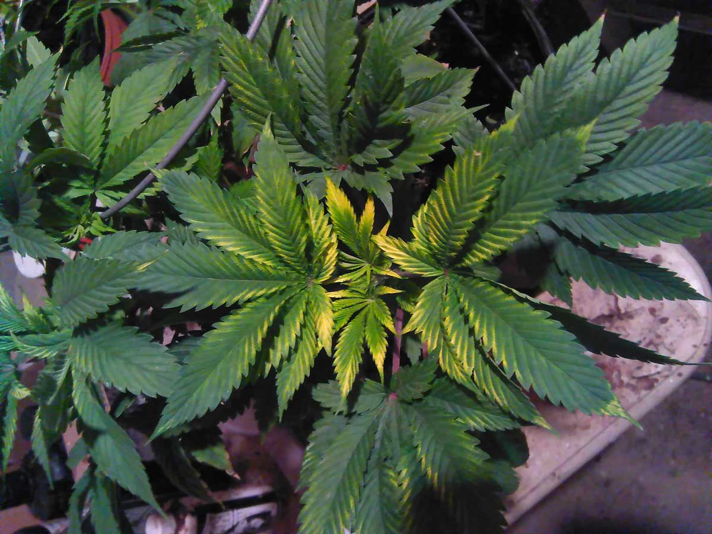

](https://www.growweedeasy.com/wp-content/uploads/2010/06/yellow-leaf-edges-cannabis-margins-symptoms-caused-by-light-burn.jpg)

The leaves closest to the light may appear much more pale than the rest of the plant, and tips may turn yellow.

[

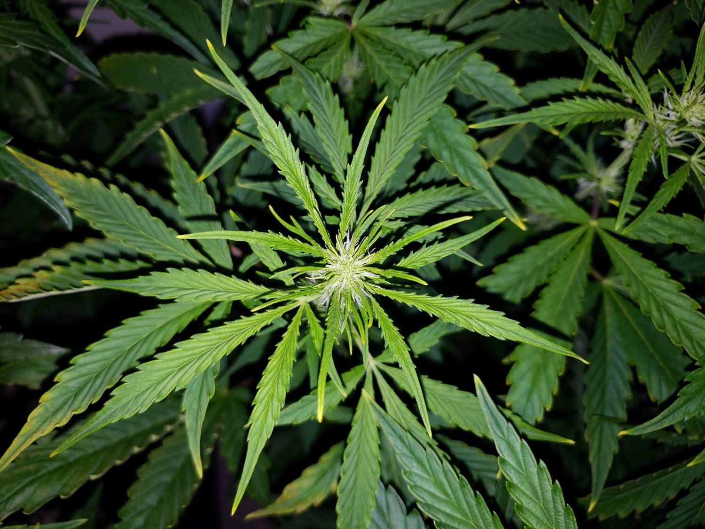

](https://www.growweedeasy.com/wp-content/uploads/2018/12/light-burn-yellow-tips.jpg)Another example of yellow tips from light burn

[

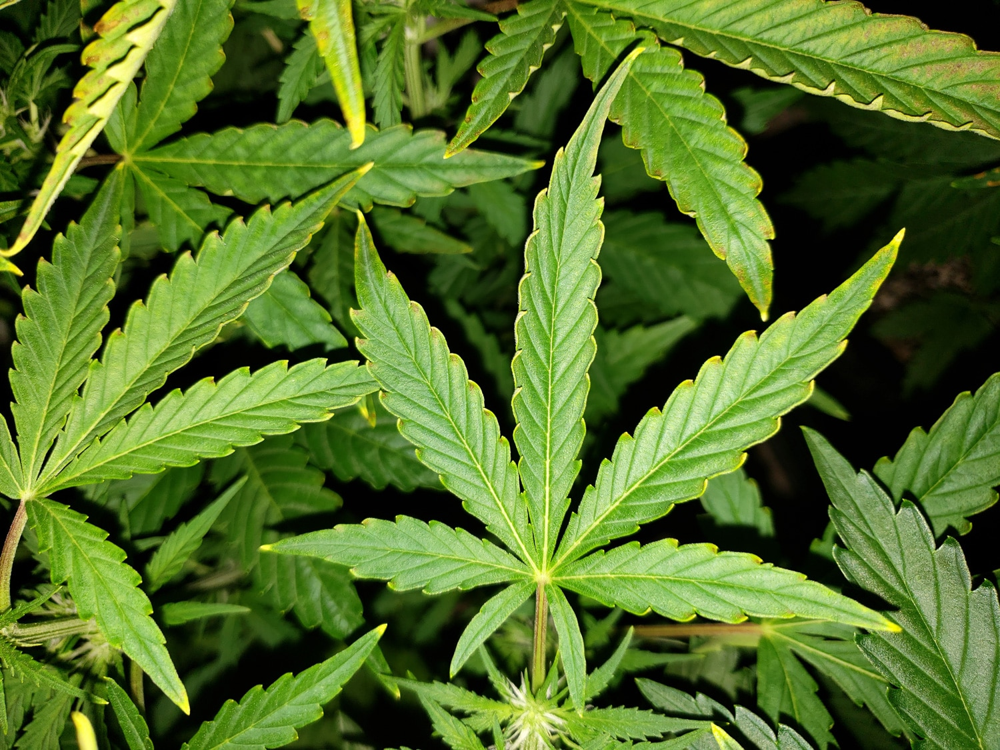

](https://www.growweedeasy.com/wp-content/uploads/2018/12/light-stress-on-leaves-edges-tipped-up.jpg)

Sometimes light burn causes edges of leaves to turn up. If it goes on a long time, the leaves also start to become crispy and can even break off if you try to bend them

[

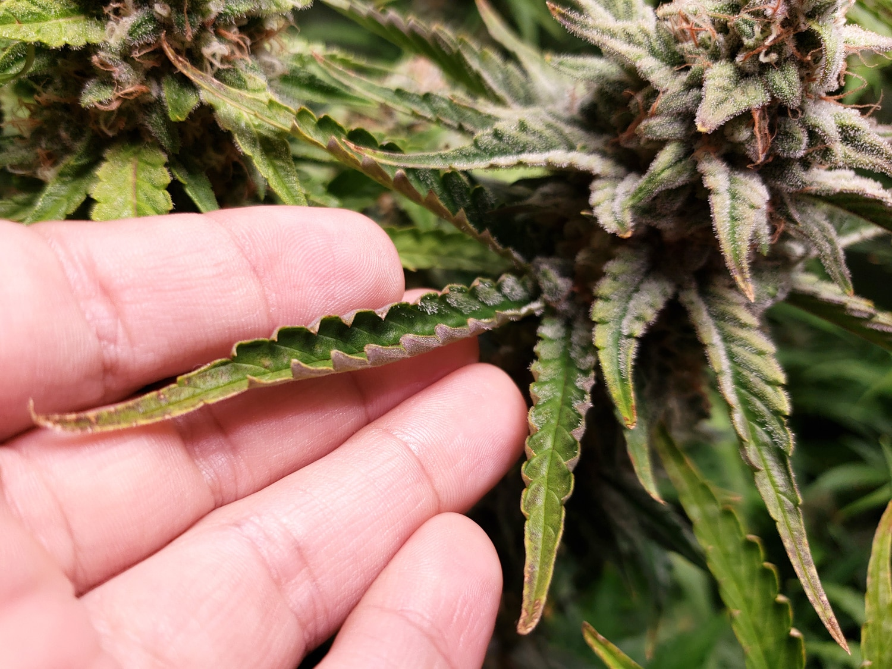

](https://www.growweedeasy.com/wp-content/uploads/2018/12/light-stressed-leaves-curled-up-on-edges.jpg)

You may noticed just the tallest colas getting droopy, which is sometimes a sign the light is too intense (though it could also be caused by[ root problems](https://www.growweedeasy.com/cannabis-root-problems) or [over/under watering](https://www.growweedeasy.com/drooping-over-water-cannabis-vs-under-water-cannabis))

[

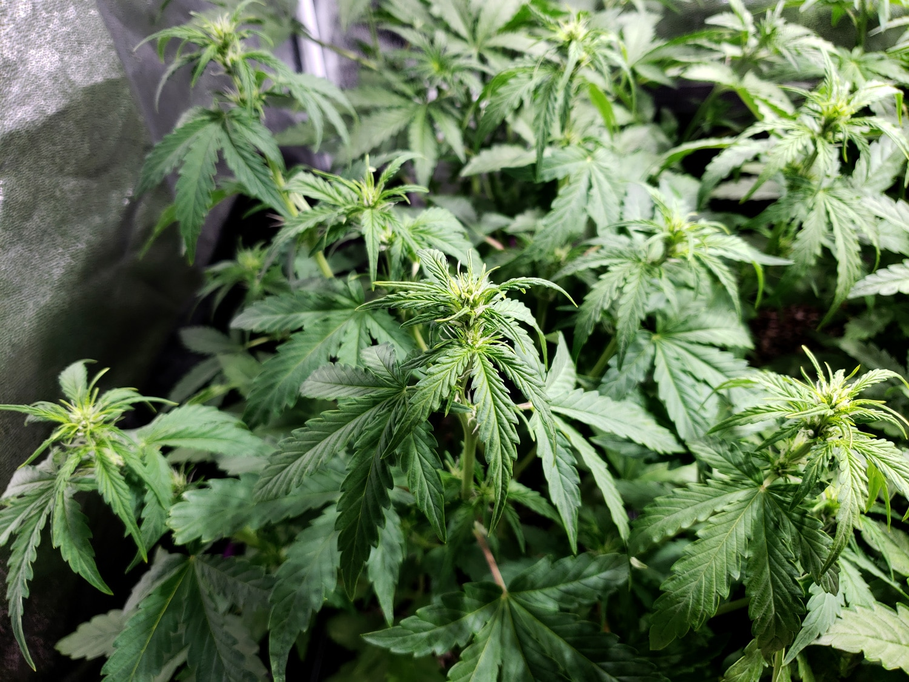

](https://www.growweedeasy.com/wp-content/uploads/2018/12/droopy-colas-from-grow-light-being-too-close.jpg)

Light burn is often mistaken for a **[Nitrogen deficiency](https://www.growweedeasy.com/nitrogen-deficiency-cannabis)** which makes *wilting *yellow* *leaves. Nitrogen-deficient leaves fall off on their own, while light-burned leaves are hard to pluck off. A nitrogen deficiency starts from the bottom of the plant and moves up, while light burn often is worse at the top of the plant.

Cannabis light burn usually affects the top leaves closest to the grow light

A [Nitrogen deficiency](https://www.growweedeasy.com/nitrogen-deficiency-cannabis) creates yellow leaves at the bottom of the plant as the Nitrogen is sucked out of the oldest leaves to feed the top of the plant. On the other hand, light burn produces yellow leaves at the **top **of the plant under the grow lights because the leaves have worked too hard and/or too long from the light being too close. The leaves aren't able to keep up with regular plant processes.

Imagine sitting outside all day under a scorching sun, possibly for days on end. Even if you could handle it for a day or two, it might wear you down over days or weeks.

[How can there be too much light if there's no heat? Read the full guide](https://www.growweedeasy.com/too-much-light)

It's probably light burn if mostly just the leaves closest to the lights are turning yellow

[

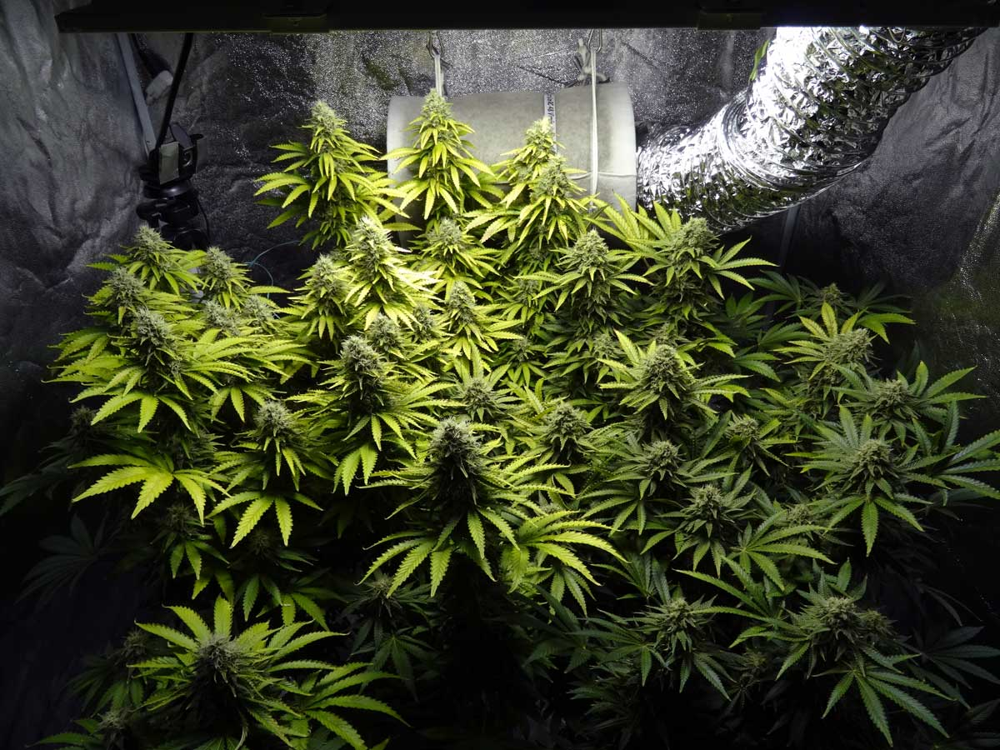

](https://www.growweedeasy.com/wp-content/uploads/2014/04/light-bleached-leaves.jpg)

With cannabis plants that have light burn, your leaves can sometimes become **yellow** or **red/purple**, possibly with brown spotting, often with burnt tips/edges and margins that stay green. Other problems, like [nutrient problems](https://www.growweedeasy.com/cannabis-symptoms-pictures), can trigger or make the symptoms of light burn a lot worse. Leaves may also appear generally burnt in places when there's too much light, especially when combined with heat or nutrient problems.

**Nutrient deficiencies make light burn worse!**

If you see light bleaching and unhealthy discoloration *only *on the parts of the plant directly under your grow light, or only on older leaves that are exposed to the light, it often means it's too bright for your plants and you should move your grow lights further away! If your plant is also having other problems, it is much more likely to be affected by light burn. A healthy plant can withstand higher light levels than a sick plant.

If the lights are only** slightly **too close, maybe just an inch or a few cm, the yellowing from light burn may happen **slowly** over the course of days (or even weeks!) because leaves are dying *early* instead of immediately. Because of that, light burn may first appear on somewhat **older leaves**, which can be confusing and make it hard to diagnose.

[

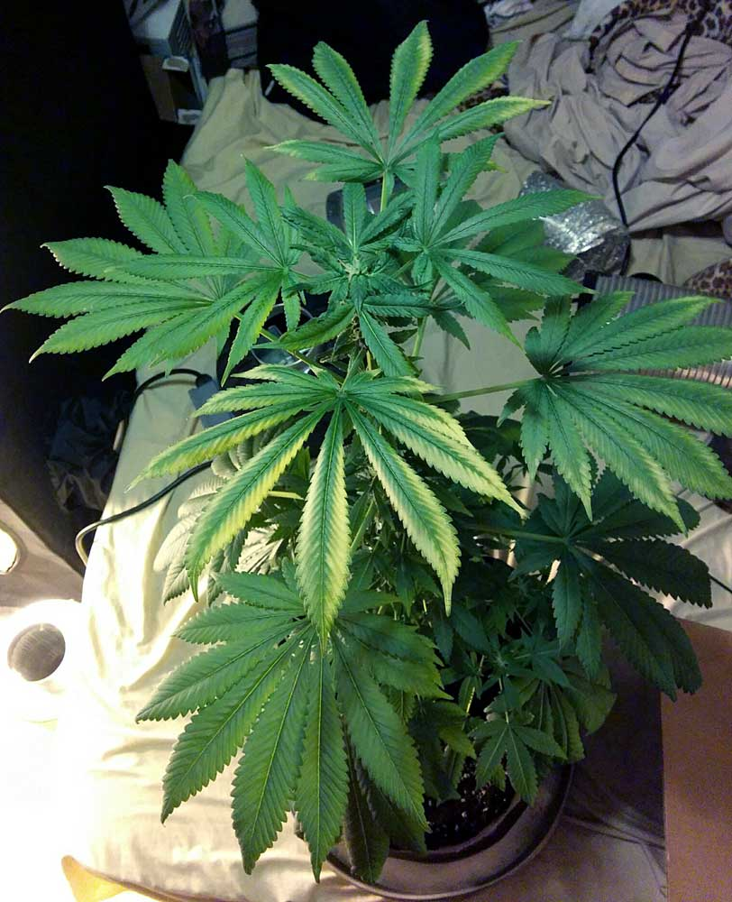

](https://www.growweedeasy.com/wp-content/uploads/2010/06/light-stressed-plants.jpg)

This cannabis seedling is being burned by too-close LED grow lights

[

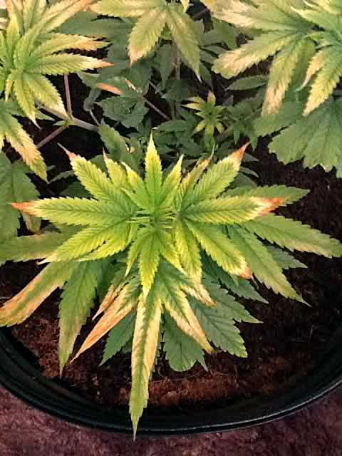

](https://www.growweedeasy.com/wp-content/uploads/2010/06/light-burned-leaves.jpg)

Another example of light burn from an LED grow light being kept too close to the plants

[

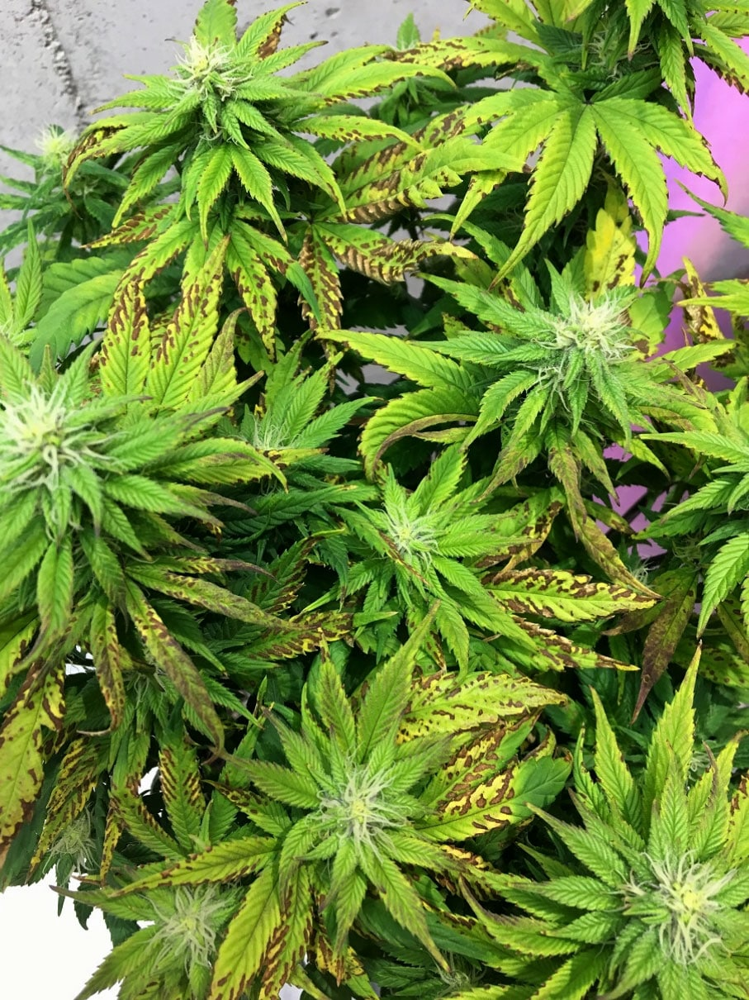

](https://www.growweedeasy.com/wp-content/uploads/2017/10/cannabis-led-light-burn-brown-spots-leaves.jpg)

These leaves of this LED-burnt plant started curling upwards

[

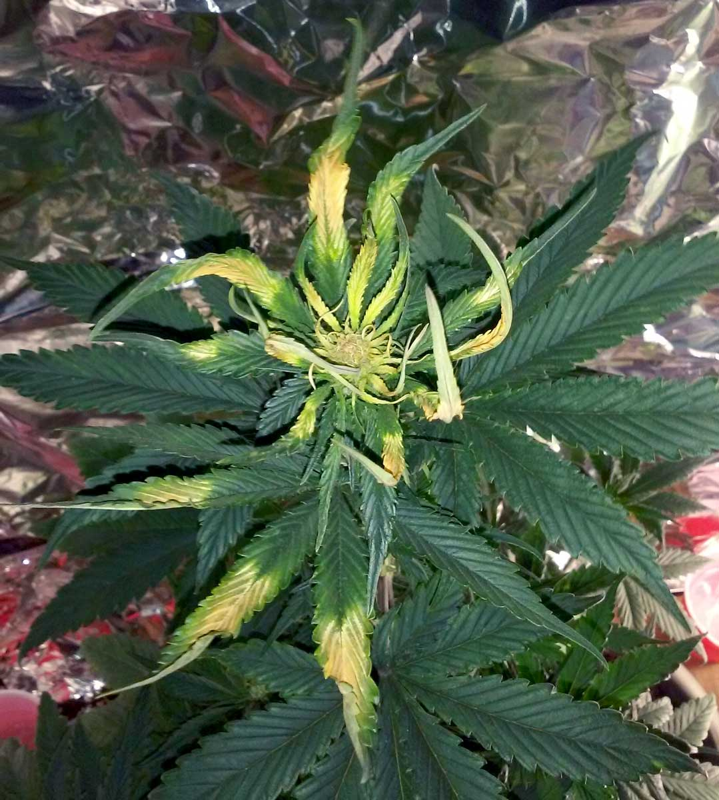

](https://www.growweedeasy.com/wp-content/uploads/2013/11/led-grow-light-burn-too-close-top-leaves-turn-yellow.jpg)

This cannabis seedling basically grew up *into *the grow light! The heat from the bulb caused massive burning everywhere it touched. If a plant's leaves directly touches the lights, it leaves "burns" from the heat of the bulbs.

[

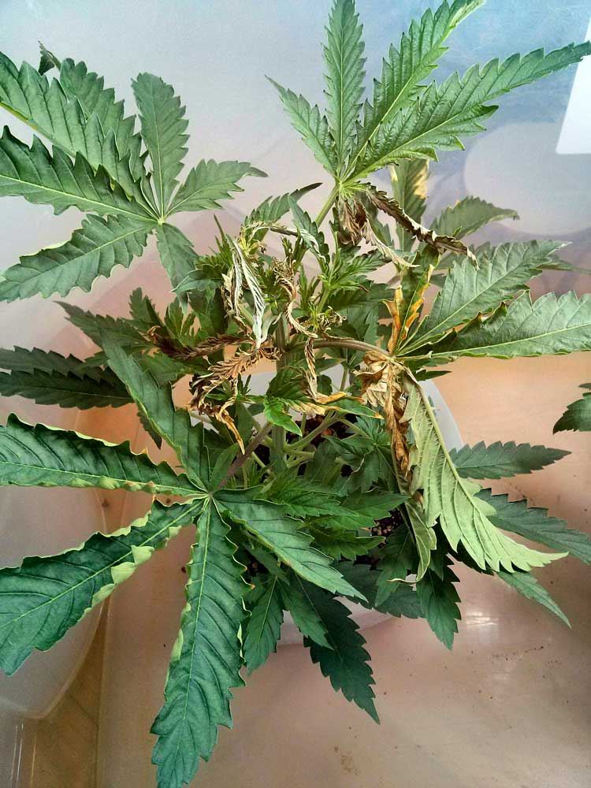

](https://www.growweedeasy.com/wp-content/uploads/2013/11/light-burned-top.jpg)

This plant was green and healthy through the vegetative stage under an LED grow light, but the leaves started dying soon after flowering started (even though that distance had been fine in the vegetative stage). The reason was the LED was too close. This is also very common with LED grow lights with just read and blue diodes, without any diodes in the green spectrum.

[

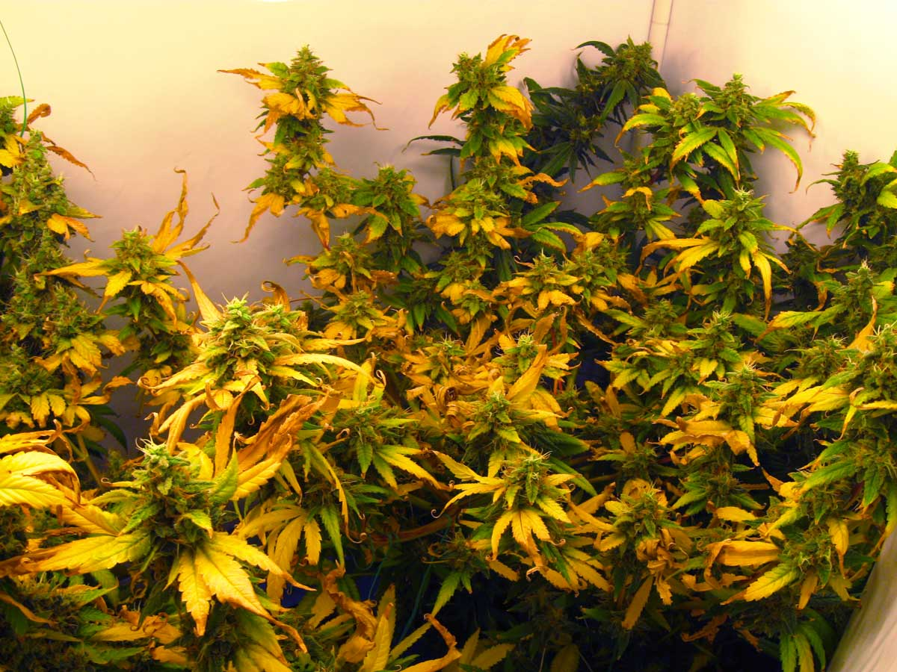

](https://www.growweedeasy.com/wp-content/uploads/2014/04/leds-burnt-to-extreme.jpg)

These plants seem apparently healthy, but the top leaves keep getting lighter and lighter, in this case from a 600W HPS that was kept just under a foot (30cm) away. The leaves slowly turned yellow over the course of a few weeks, getting light burn even though the temperature was a comfortable 75°F (24°C).

[

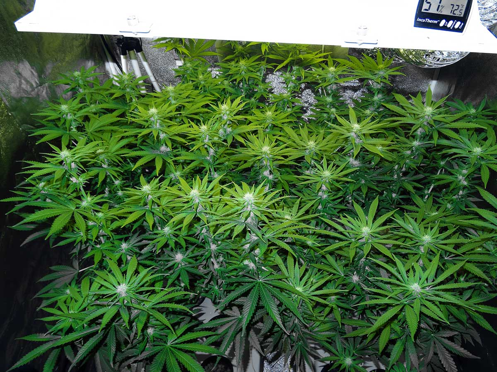

](https://www.growweedeasy.com/wp-content/uploads/2013/11/many-colas-canopy-due-to-marijuana-plant-training.jpg)

These yellow leaves were caused by an LED grow light that was too close. If you don't realize it's light burn, the symptoms are inexplicable!

[

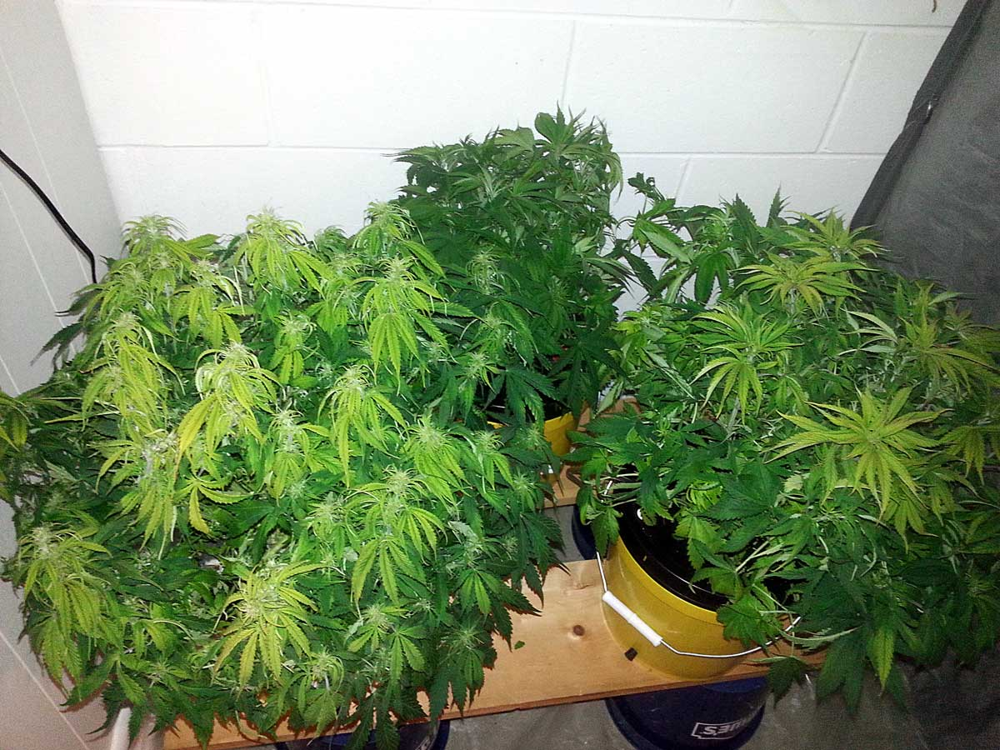

](https://www.growweedeasy.com/wp-content/uploads/2014/04/led-light-burn-top-leaves-yellow.jpg)

A mild case of marijuana light burn is often mistaken for a [nutrient deficiency](https://www.growweedeasy.com/cannabis-symptoms-pictures) or a [pH problem](https://www.growweedeasy.com/ph), but if you look closely, the symptoms are concentrated directly under the grow light.

[

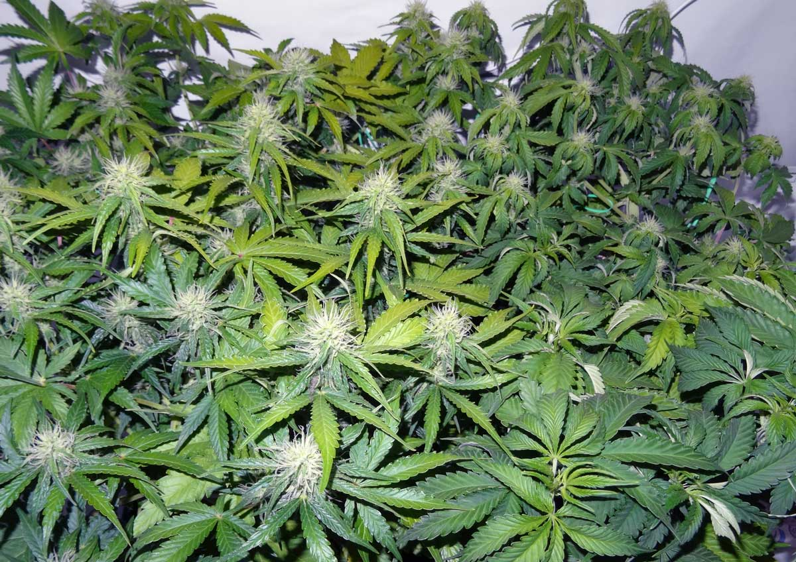

](https://www.growweedeasy.com/wp-content/uploads/2013/11/light-burn-top-leaves-yellowing.jpg)

**Light Bleached Cannabis Buds Sometimes Turn White**

This is how you get "albino" or white buds. Light bleaching is most common with high-power LEDs and HPS grow lights because these can be brighter than the sun. Basically, bud bleaching is what happens when buds get too much light, kinda like how hair can get bleached if you spend plenty of time in the sun. Except a "sun-burnt" bud is often less potent, and may have lost it's "cannabis" smell!

[

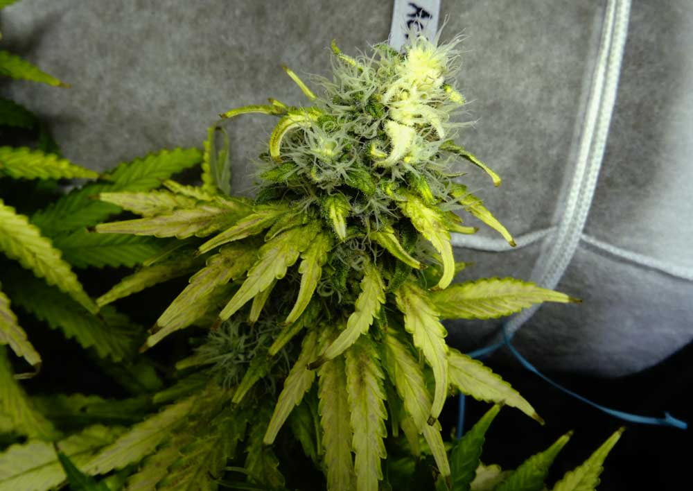

](https://www.growweedeasy.com/wp-content/uploads/2013/11/light-bleached-bud.jpg)

[

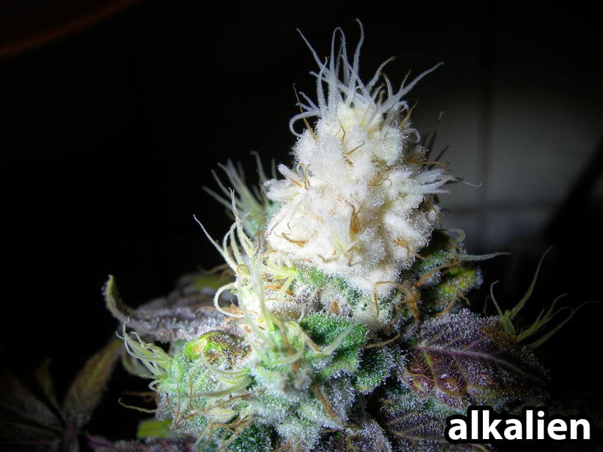

](https://www.growweedeasy.com/wp-content/uploads/2013/11/cannabis-light-bleaching-white-bud-tip.jpg)

[

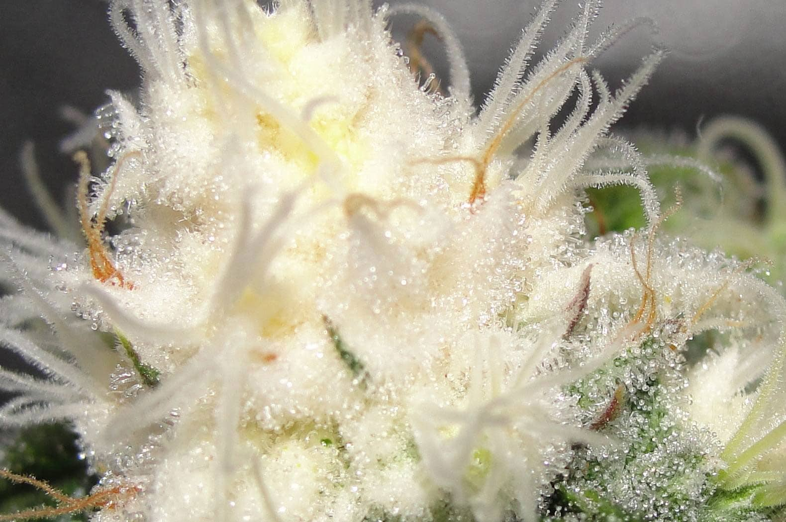

](https://www.growweedeasy.com/wp-content/uploads/2013/11/light-bleached-cola.jpg)

Buds which have been bleached tend to be low potency or even have no potency (no available THC or other cannabinoids). Therefore you should avoid light-bleaching your plants at all costs!

[

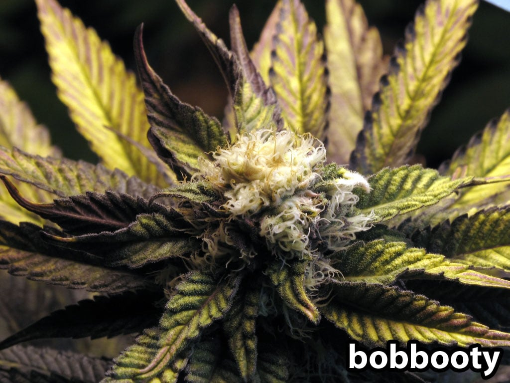

](https://www.growweedeasy.com/wp-content/uploads/2014/04/bleached-top-cannabis.jpg)

Sometimes light-bleached cannabis will get mis-labeled as “albino cannabis” or “white cannabis” but the truth is that the white color is not healthy, so this is not a desirable trait (even if it looks pretty cool).

**Most of the Time, Light-Burned Buds Appear Burnt**

Often though, light burned buds look like they've been burned.

LED-burnt cannabis buds - notice how all the tiny "sugar leaves" have turned yellow or brown

[

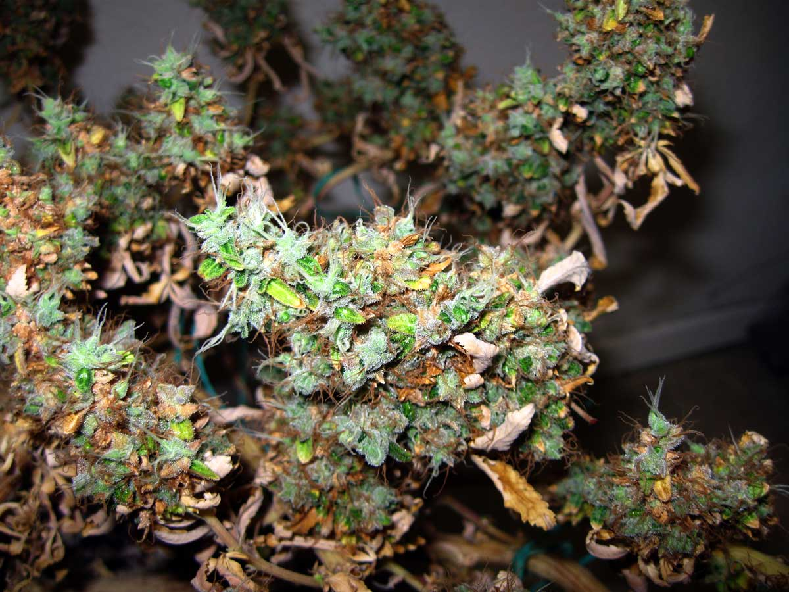

](https://www.growweedeasy.com/wp-content/uploads/2013/11/led-burnt-cannabis-bud-crispy.jpg)

In this case the LED-burn caused the leaves closest to the LED to turn red. Although the buds smoked pretty well anyway, they definitely weren't as pretty as they could have been!

[

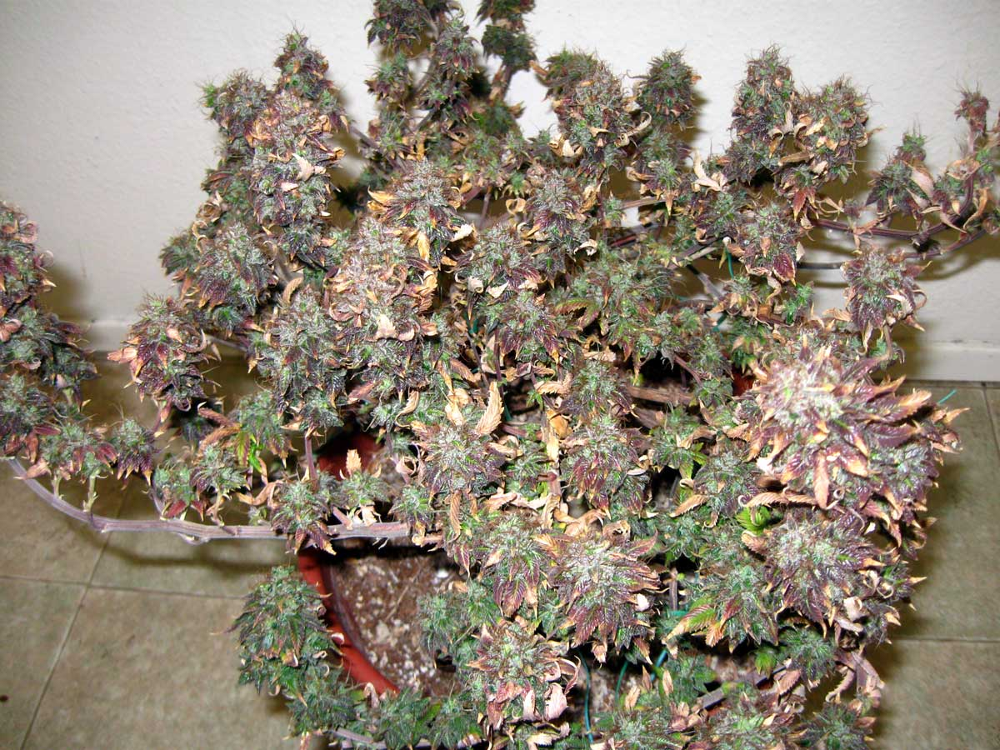

](https://www.growweedeasy.com/wp-content/uploads/2013/11/led-burnt-cannabis-buds-turned-red.jpg)

The leaves too close to the LED grow light turned yellow and wilted. For some reason, cannabis plants seem a lot more prone to light burn after they start flowering.

[

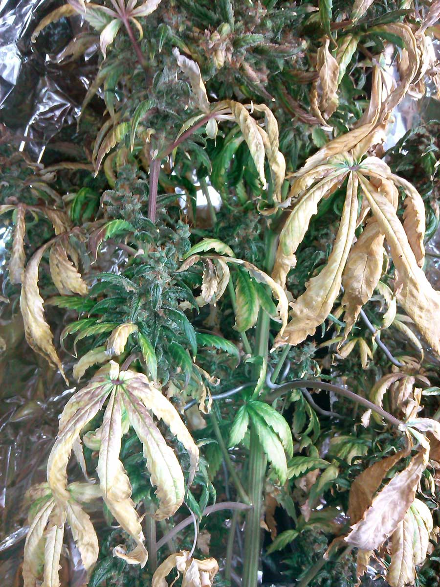

](https://www.growweedeasy.com/wp-content/uploads/2013/11/led-grow-light-burn-too-close-top-leaves-turn-yellow-wilted.jpg)

Another example of a bud that has light burn from a too-close LED

[

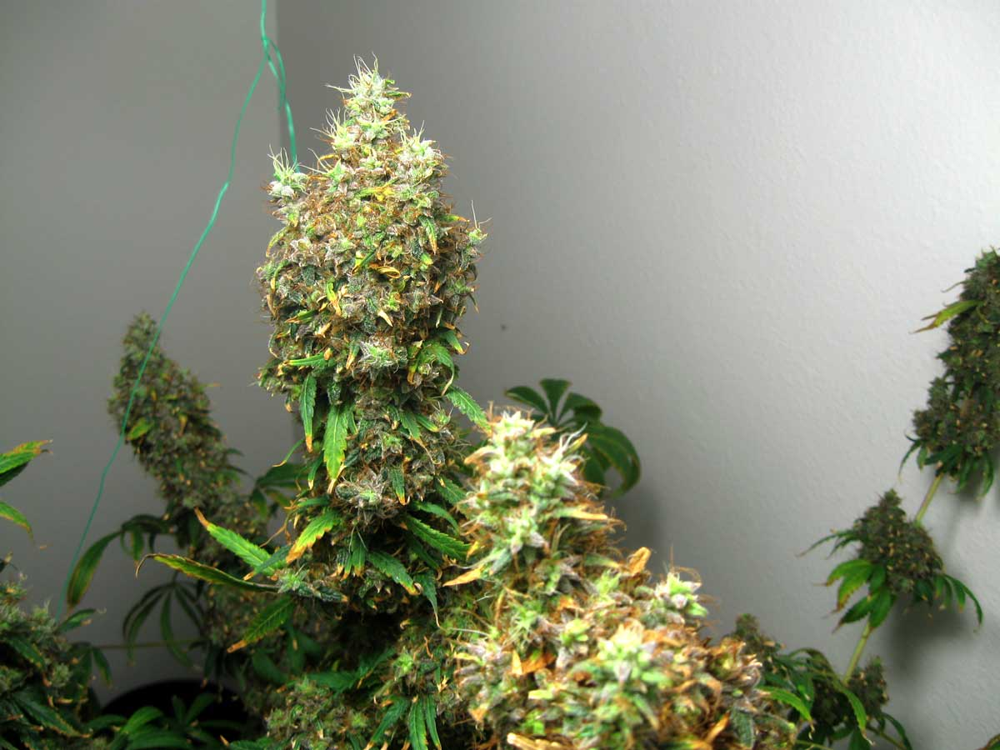

](https://www.growweedeasy.com/wp-content/uploads/2015/06/led-burnt-bud.jpg)

Light burned bud on top, healthy bud below

[

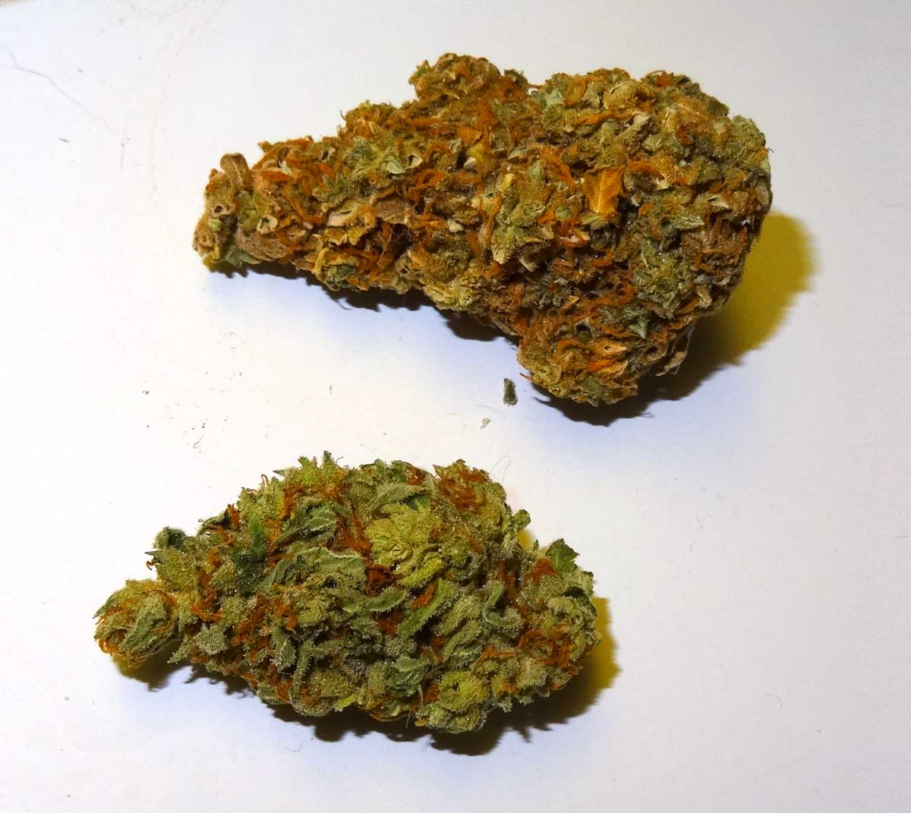

](https://www.growweedeasy.com/wp-content/uploads/2013/11/light-burn-bud-top-regular-bud-bottom.jpg)

**Solution:** If your marijuana plants are getting too much light, try removing some of the lights or moving your grow lights further away from the tops of the plants. If you can't move the light further away, [bend your plants over](https://www.growweedeasy.com/lst) so the tops are further away or if your plant is still in the vegetative stage you might even consider [cutting off the top of the plant](https://www.growweedeasy.com/topping-fiming) to remove some of that height.

**Reduce power of grow lights and/or move them further away from your plant**
 ([How far away do I keep grow lights from my plants?](https://www.growweedeasy.com/how-far-grow-lights))

It is unlikely for your plants to get "light-burned" from the sun when growing outdoors, and they definitely can't accidentally grow into the sun. Outdoor plants can show signs of light stress if plants were used to shady conditions and moved into direct sunlight without time to get accustomed to the brigher light levels. It also may be possible in extreme high light conditions if the plant is unprotected but in general cannabis plants like a lot of light.

When making changes to your plant's environment, it's best to make changes relatively slowly if possible. For example when moving a cannabis plant from indoors or outdoors you might consider giving the plant some shade for a few days before moving it into full sunlight.

Sometimes **[heat stress](https://www.growweedeasy.com/heat-light-stress) **can look like light stress. When learning how to grow cannabis, it's best to try to keep things at a [comfortable temperature](https://www.growweedeasy.com/temperature) at all times for optimal growth. If it's too hot for you, it's probably too hot for your plants. Outdoors, it's a lot harder to control temperature, but there are steps you can take to protect your outdoor plants from the heat including supplementing with sea kelp, partially covering them and making sure they're well watered.

[5 Ways to Deal with Heat When Growing Cannabis Indoors](https://www.growweedeasy.com/5-secrets-cannabis-heat-control)

*Jump to&#8230;*

[7 Step Fix to 99% of Cannabis Growing Problems](https://www.growweedeasy.com/5-step-solution-to-most-cannabis-growing-problems)

[Pictures of Cannabis Plant Problems](https://www.growweedeasy.com/cannabis-symptoms-pictures)

[What does pH have to do with nutrient deficiencies?](https://www.growweedeasy.com/ph)

[10-Step Quick Start Guide to Growing](https://www.growweedeasy.com/marijuana-quick-start-grow-guide)

## Magnesium Deficiency

**Problem**: A light green or yellow coloring will begin to show on the veins and edges of the lower & older leaves - this is one of the classic signs of cannabis magnesium deficiency. You may also see red stems.

Magnesium is a mobile nutrient, which means that the plant can move it from old leaves to new leaves.

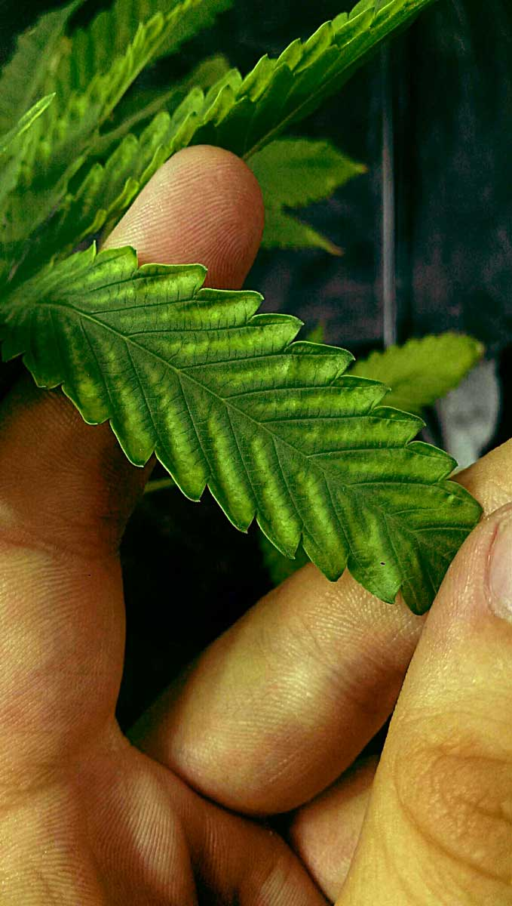

If you don't react to it promptly, a cannabis magnesium deficiency can spiral out of control and cause your plant to lose a lot of lower leaves quickly. The plant will pull magnesium out of older leaves and bring them to the newer leaves. That's why a magnesium deficiency usually appears towards the bottom of the plant and on older, less important leaves.

The edges of the leaves may become yellow or bright green and may start feeling crispy to the touch. This crispiness around the edges is different from [nutrient burn](https://www.growweedeasy.com/nutrient-burn-cannabis), which does not lighten the margins inside the leaves.

You may see red stems with a magnesium deficiency, though not always.

[

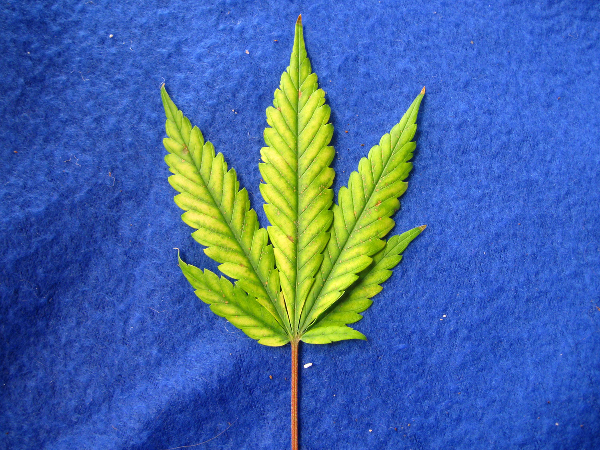

](https://www.growweedeasy.com/wp-content/uploads/2017/10/red-stem-magnesium-deficiency-yellowing.jpg)

Sometimes you will also get light brown spotting within the margins or along the edges if the problem continues to get worse, though this may be partially other deficiencies, which often happen alongside a magnesium deficiency.

Magnesium deficiencies are easy to prevent and fix once you know what to do. Read on below to learn how.

[

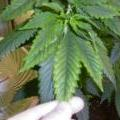

](https://www.growweedeasy.com/wp-content/uploads/2010/04/magnesium-deficiency.jpg)[

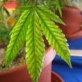

](https://www.growweedeasy.com/wp-content/uploads/2010/10/cannabis-magnesium-deficiency.jpg)[

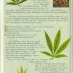

](https://www.growweedeasy.com/wp-content/uploads/2010/04/magnesium-info-marijuana.jpg)

[

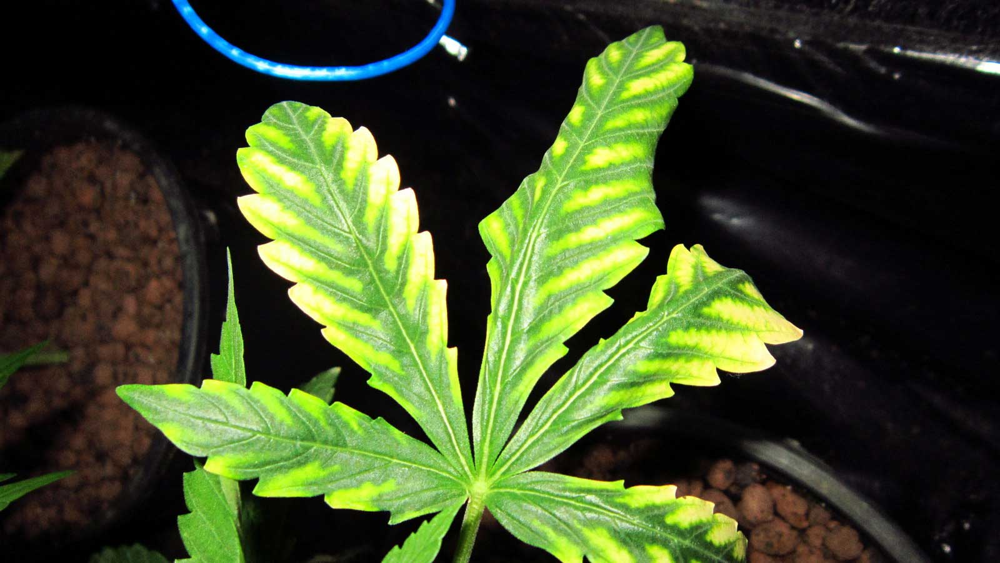

](https://www.growweedeasy.com/wp-content/uploads/2010/10/marijuana-magnesium-deficiency.jpg)

## **Solution For Magnesium Deficiency in Cannabis**

A magnesium deficiency sometimes happens after supplementing plants with something that contains calcium but not magnesium, such as agricultural lime (non-dolomite lime), egg shells, etc. This won't happen with [proper cannabis nutrients](https://www.growweedeasy.com/nutrients). If you're using good nutrients, cannabis plant may still show signs of a magnesium deficiency if the pH at the roots is too low, especially in hydro. That is because when the pH of your root zone is not in the correct range, your cannabis cannot properly absorb magnesium through the roots.

Often with this deficiency, the magnesium is present, but the roots cannot absorb the magnesium properly due to an improper pH. Therefore it is very important to [maintain the correct pH](https://www.growweedeasy.com/how-do-i-check-the-pH-of-my-water) (and make sure the pH **does not get too low / acidic**) in order to avoid a magnesium deficiency.

Growers using Coco Coir or Reverse Osmosis (RO) water usually need to supplement their plants with extra Calcium & Magnesium in addition to regular nutrients. Treating coco coir with Cal-Mag and supplying extra throughout your grow is recommended for growers in coco coir, or those using RO water.

Adding more magnesium to a system when there is a pH lock-out will probably not help because the plant will not be able to absorb any magnesium until the pH has been corrected. If there's already enough magnesium, adding more can cause other apparent deficiencies by locking out other nutrients from the plant.

***Please note: *Once a magneisum deficiency is cleared up, the problem (yellowing lower leaves) will stop spreading to other older leaves, usually within a few days. Please note that leaves which have been damaged by a magnesium deficiency will probably not recover or turn green, so you want to pay attention to other growth for signs of recovery.**

* In **soil**, magnesium is best absorbed by the roots in the **6.0 - 7.0 pH range** (some growers say a 6.5 - 7.0 pH is best if you suspect a magnesium deficiency)
* In **hydro**, magnesium is best absorbed by the roots in the** 6.0 - 6.5** pH range (in hydro, it's generally recommended to keep the pH between 5.5 - 6.5, but magnesium specifically tends to be best absorbed above 6.0)

**If you suspect your growing cannabis plant has a magnesium deficiency,** flush your system with clean, pH'd water that contains a regular dose of [cannabis-friendly nutrients](https://www.growweedeasy.com/best-marijuana-nutrients-review) that includes magnesium. This will remove any nutrient salts that may be affected the uptake of magnesium and help restore pH to the proper levels..

**To supplement with extra Magnesium&#8230; **

Calcium and magnesium deficiencies often appear together in cannabis. Many growers decide to purchase some sort of Calcium-Magnesium (often called Cal-Mag) supplement for their grow room in case one of these common deficiencies appear.

Listed below are common cannabis Calcium supplements, along with some general information about each one. After supplementing with Cal-Mag and correcting the pH, you should expect to see new healthy growth within a week. Remember, the old leaves will probably not recover, but new growth should be green and healthy.

**Cal-Mag is Well Suited For Hydro, Coco Coir, or Soil**

[General Hydroponics CaliMagic](https://www.amazon.com/General-Hydroponics-GH1772-CALiMAGic-Quart/dp/B00GZRKI40/ref=as_li_ss_tl?keywords=calimagic&qid=1563486828&s=gateway&sr=8-1-spons&psc=1&linkCode=ll1&tag=4200a7-20&linkId=8be88fc47dbfb1c625176fc0bfd88276&language=en_US) is a calcium and magnesium plant nutrient supplement. General application is to mix 1 tsp (5ml) of CaliMagic into each gallon of water. I have used Calimagic several times with great results.

**Organic Dolomite Lime - For Soil Growers**

If you're looking for a way to supplement magnesium in your organic or soil setup, I highly recommend a product called "Dolomite Lime."

Note: The finer the dolomite, the more quickly it will be available to nutrients

Dolomite is a good source of calcium and magnesium and can be mixed with your soil. The great thing about dolomite is it works slowly over the course of a few months.

Dolomite has a neutral pH of about 7.0 and will help buffer pH in soil so it's easier to maintain the correct neutral pH range which is optimum for cannabis growth, especially in acidic soils.

You can buy [Dolomite Lime](https://www.amazon.com/Down-Earth-Organic-Prilled-Dolomite/dp/B07N2X9BV2?pd_rd_i=B07N2X9BV2&psc=1&linkCode=ll1&tag=4200a7-20&linkId=b0ce7bb1ec6b06fc23f1c3314649f5c3&language=en_US&ref_=as_li_ss_tl) online, but with shipping, it's almost always waaaay cheaper to pick up a bag at a home improvement or gardening store such as Lowes, Home Depot, gardening centers, etc.  If possible, try to get a finer grade of dolomite compared to something that is more coarse.

**How to Use Dolomite Lime for Cannabis: **When growing cannabis indoors, add 6-7 teaspoons of fine dolomite lime to each gallon's worth of soil. So if you're mixing enough soil to fill a 5-gallon container, you want to add 30-35 teaspoons (about 2/3 cup) of dolomite lime to the mix. Mix the dolomite lime and the dry soil thoroughly, then lightly water it with water that has been pH'ed to 6.5. After getting the soil wet, mix the soil well and wait a day or two to let the soil settle before checking the pH and adding plants. When growing in an outdoor garden, follow the dolomite lime manufacturers instructions.

If watering plants by hand&#8230; Flush the system with properly pH'ed water that contains a full set of [proper nutrients](https://www.growweedeasy.com/best-marijuana-nutrients-review) that are suitable for growing cannabis. Make sure you are using the right nutrients for the stage your plant is in. Check the pH of your runoff water to ensure that nothing in the growing medium is throwing off the root pH.

If growing hydroponically&#8230; Check the pH and PPM of your reservoir water to make sure that pH is on target and nutrient levels are not lower than expected. If you do this and are still not certain what is causing the magnesium deficiency, it is recommended that you drain your reservoir and refill with a newly mixed reservoir with fresh nutrients which have been pH'ed.

Should I add extra Magnesium? Some growers will add 1 tsp of Epsom salt/gallon of water and water plants with this mixture in response to a magnesium deficiency (since Epsom salt is primarily made of magnesium).

As I mentioned, often a magnesium deficiency is actually caused by a mix of factors, such as pH being off. Even if the pH is on target, sometimes a magnesium deficiency appears when other important nutrients like iron or calcium are not present in the right quantities.

A great supplement that has all of 3 of these important nutrients is known as [Cal-Mag](https://www.amazon.com/dp/B004JKBMRW/ref=as_li_ss_til?tag=growwcom07-20&camp=0&creative=0&linkCode=as4&creativeASIN=B004JKBMRW&adid=1BNGYP600JZQVJFV1JZR&), as this contains Magnesium and Calcium, as well as a trace amount of iron.

Adding extra magnesium is often not necessary if you are using tap water. However, you will likely want to supplement Cal-Mag if you are using filtered or reverse osmosis (RO) water, since most tap water already contains some amount of all 3 of these cannabis nutrients. Cal-Mag also has a small amount or iron, which is another trace cannabis nutrient that is often missing in filtered water.

**How long until new growth looks better?** If you fix the root of the problem, further yellowing and discoloration of the leaves should stop almost immediately. Some of the affected leaves may recover somewhat, but what's most important is to make sure the problem isn't continuing to spread to other leaves on the plant.

I generally don't remove any discolored leaves until I know for sure that the problem is completely gone and is no longer spreading to new leaves (that way any possible further discoloration will happen to the leaves that have already been affected).

## Manganese Deficiency

**Problem:** Leaves may become yellow in between the veins, with mottled brown spots on the affected leaves. These brown dead patches may spread and eventually kill the leaf. Leaves may also shred and fall apart.

Overall growth of the marijuana plant may be stunted. With a manganese deficiency, the yellowing will begin at the base of the leaves and move outwards towards the tips.

**Solution for Manganese Deficiency in Cannabis**

Your plant may also exhibit signs of a manganese deficiency if the pH is too high, or if the plant is getting too much iron.

[Learn how to manage your pH](https://www.growweedeasy.com/how-do-i-check-the-pH-of-my-water) when growing cannabis.

***Please note:* After a manganese deficiency is cleared up, the problem (brown spots and yellowing leaves) will stop spreading to other growth usually within a week. Please note that leaves which have been damaged by a manganese deficiency will probably not recover or turn green, so you want to pay attention to other growth for signs of recovery.**

* In **soil**, manganese is best absorbed by the roots in the **6.0 - 7.0 pH** range (some growers recommend keeping the pH slightly lower, from 6.0 - 6.5, if you suspect a manganese deficiency in particular)
* In **hydro**, manganese is best absorbed by the roots in the **5.5 - 6.0 pH** range (in hydro, it's generally recommended to keep the pH between 5.5 - 6.5, but manganese specifically tends to be best absorbed below 6.0)

**If you suspect your growing cannabis plant has a manganese deficiency,** flush your system with clean, pH'd water that contains a regular dose of [cannabis-friendly nutrients](https://www.growweedeasy.com/best-marijuana-nutrients-review) that includes manganese. This will remove any extra iron or nutrient salts that may be affected the uptake of manganese, it will help restore pH to the proper levels, and will supply the plant with any missing nutrients.

You are looking to avoid higher pH ranges, as this is where manganese deficiencies are most likely to occur.

If you cannot get rid of your manganese deficiency, please consult our [7-Step Cure to 99% of Cannabis Growing Problems](https://www.growweedeasy.com/growing-marijuana-plant-problem-deficiency)

## Molybdenum Deficiency

**Problem:** The initial symptoms may appear similar to a nitrogen deficiency (yellowing of older, lower leaves). Leaves may become mottled or spotted. However, the tell-tale sign of a molybdenum deficiency is the leaves may start to display a unique orange, red  or pink color around the edges which will start to move toward the center of the leaf. Sometimes the color appears in the middle of the leaves as opposed to the edges.

[

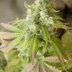

](https://www.growweedeasy.com/wp-content/uploads/2010/04/molybdenum-deficiency.jpg)[

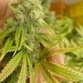

](https://www.growweedeasy.com/wp-content/uploads/2010/04/molybdenum-deficiency2.jpg)[

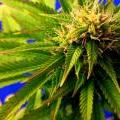

](https://www.growweedeasy.com/wp-content/uploads/2010/04/molybdenum-deficiency-cole-train.jpg)

**Solution**:

A real molybdenum deficiency in cannabis is rare, and even scientists did not realize this mineral is needed by most plants because it is often present in low concentrations all the time.

For cannabis plants, molybdenum tends gets locked out at lower pH ranges. Your cannabis plant may show signs of a molybdenum deficiency if the pH at the roots is too low, although it is likely that molybdenum is there. That is  because when the pH of your root zone is off, your cannabis cannot properly absorb molybdenum through its roots. Therefore the first step is to ensure that you have the correct pH for your growth medium. [Learn more about pH and cannabis](https://www.growweedeasy.com/how-do-i-check-the-pH-of-my-water).

***Please note:* After a molyndenum deficiency is cleared up, the problem (pink coloring and yellowing leaves) will stop appearing on other parts of the plant, usually within a week. Please note that leaves which have been damaged by a molybdenum deficiency will probably not recover or turn green, so you want to pay attention to other growth for signs of recovery.**

* In **soil**, molybdenum is best absorbed by the roots in the **6.0 - 7.0 pH** range (some growers recommend avoiding a soil pH of lower than 6.5 if you suspect a molybdenum deficiency)
* In **hydro**, molybdenum is best absorbed by the roots in the **5.5 - 6.5 pH** range

**If you suspect your growing cannabis plant has a molybdenum deficiency,** flush your system with clean, pH'd water that contains a regular dose of [cannabis-friendly nutrients](https://www.growweedeasy.com/best-marijuana-nutrients-review) that includes molybdenum. This will remove any nutrient salts that may be preventing the uptake of molybdenum and help restore pH to the proper levels..

If you cannot get rid of your molybdenum deficiency, please consult our [6-Step Cure to 99% of Cannabis Growing Problems](https://www.growweedeasy.com/growing-marijuana-plant-problem-deficiency)

## Nitrogen Deficiency

**Problem:**  A cannabis nitrogen deficiency will cause the **older, lower leaves **on your plant to turn yellow, wilt away and eventually die. The plant typically appears pale or lime-colored.

The yellow leaves of a nitrogen deficiency may show signs of brown, and they will usually become soft and sort of "fold" in, before possibly turning crispy but ultimately falling off on their own.

Example of cannabis Nitrogen deficiency - yellow bottom leaves. Almost all [plant nutrients](https://www.growweedeasy.com/nutrients) contain Nitrogen

[

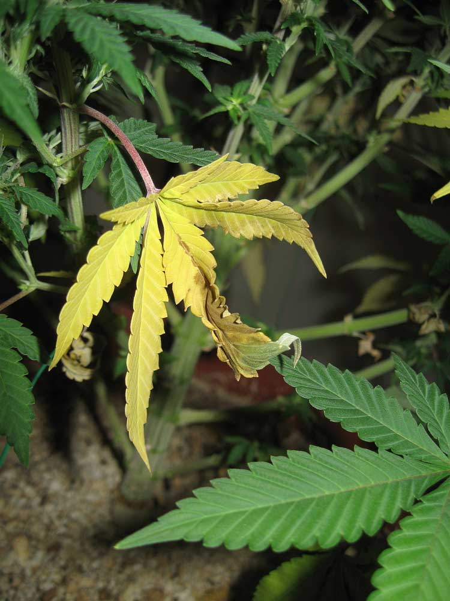

](https://www.growweedeasy.com/wp-content/uploads/2010/10/nitrogen-deficiency-wilted-leaf.jpg)

Nitrogen-deficient plants often appear pale or lime-colored. The leaves on this marijuana plant don't have obvious leaf symptoms like spots or markings, but they are pale all over the whole plant. Almost lime green. The light-colored leaves are a sign the plant needs more Nitrogen (and nutrients in general). On the flip side, plants that are receiving [too much Nitrogen](https://www.growweedeasy.com/nitrogen-toxicity-cannabis) turn dark.

**[

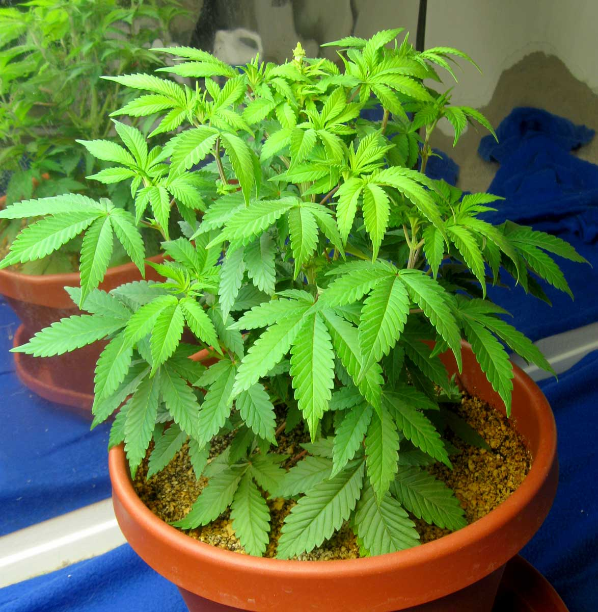

](https://www.growweedeasy.com/wp-content/uploads/2017/10/almost-nitrogen-deficiency-too-pale.jpg)**

*If the yellowing leaves are at the top of your plant or the yellow leaves are mostly new growth, then you probably don't have a nitrogen deficiency. Nitrogen deficiencies usually affect the** oldest, lowest leaves first**, or the entire plant becomes light colored.*

Nitrogen is a mobile nutrient, which means it can move throughout the plant as needed. Cannabis needs nitrogen to keep leaves green and make energy from light. All new leaves get plenty of nitrogen to make them green and help with photosynthesis. The leaves that get the most light are the newest, youngest leaves, so the plant "wants" to give those leaves priority for getting light.

If new leaves aren't getting enough nitrogen, the plant will start to "steal" nitrogen from the older, lower leaves, so that it can give it to newer leaves. This is what causes the yellowing and wilting of a nitrogen deficiency.

[

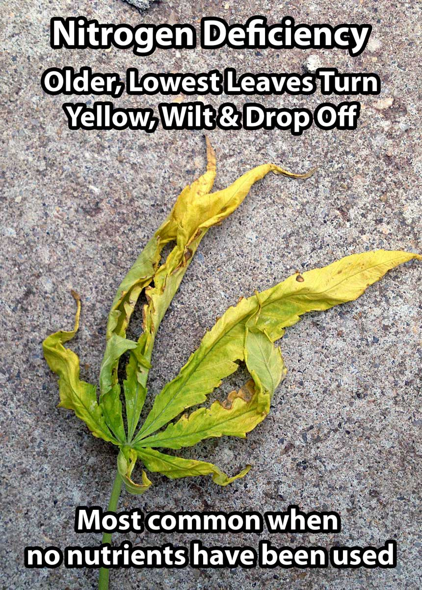

](https://www.growweedeasy.com/wp-content/uploads/2010/10/nitrogen-deficiency-yellow-leaf.jpg)

It's relatively normal for your cannabis plant's leaves to start turning yellow towards the end of your flowering cycle as the plant becomes nitrogen deficient while creating buds.

However, if your cannabis plant is losing lower leaves fast due to yellowing (if yellowing and dying leaves is "climbing" up the plant from the bottom), especially in the vegetative stage before plant is making buds, you have a problem that you will need to fix as soon as possible.

**You don't want a nitrogen deficiency in the vegetative stage!**

[

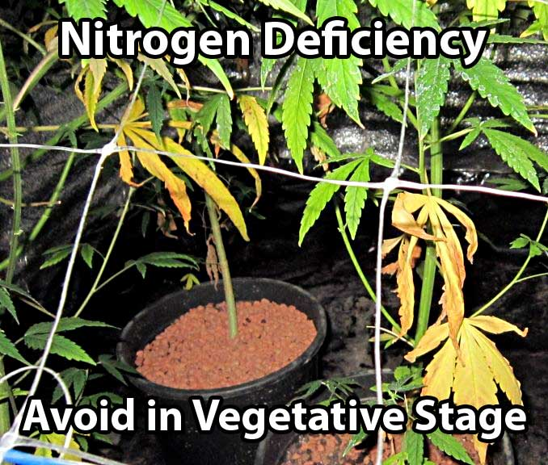

](https://www.growweedeasy.com/wp-content/uploads/2010/10/cannabis-nitrogen-deficiency-bottom.jpg)

If you notice your lower cannabis leaves turning yellow in the vegetative stage or in the beginning part of the flowering stage, your plant may be experiencing a nitrogen deficiency which will need to be treated.

It is not good if your cannabis plant is showing signs of an advanced nitrogen deificiency while still in the vegetative stage. It's normal to lose a few yellow leaves off the bottom of your plant here and there, especially with very big plants. But if you are losing a significant amount of yellow leaves, and the yellowing seems to be moving up the plant quickly, then you have a problem.

[

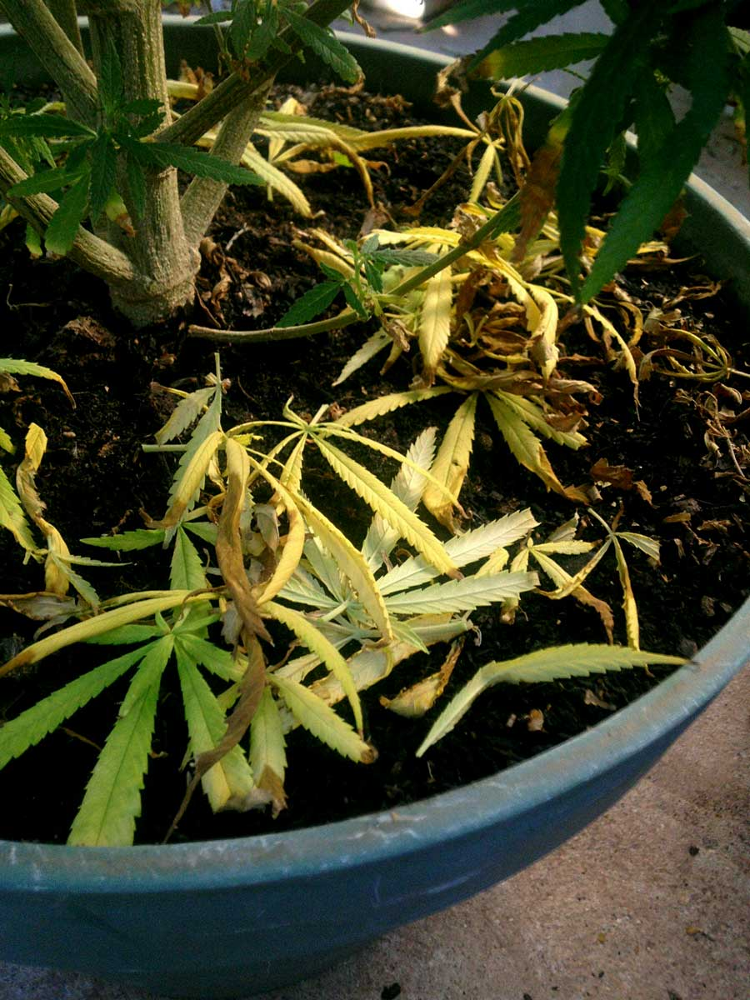

](https://www.growweedeasy.com/wp-content/uploads/2010/10/nitrogen-deficiency-yellow-leaves-piled.jpg)

As a grower, you're interested in how much nitrogen to give your plants at what time. The ratio of nitrogen to other nutrients has a huge effect on growth and bud formation.

**Vegetative Stage** - higher levels of Nitrogen (pretty much any plant food will do)

Most complete plant foods that you get at a gardening store contain high levels of nitrogen (N). These nutrient system tend to work well in the vegetative stage.

Some examples of cannabis-friendly one-part Vegetative nutrient systems&#8230;

* 

[Dyna-Gro “Foliage Pro”](https://www.amazon.com/Dyna-Gro-DYFOL008-Foliage-Pro-11/dp/B003SUT6VS/ref=as_sl_pc_ss_til?tag=growwcom07-20&linkCode=w01&linkId=DT6NRAAWQNT3PRBI&creativeASIN=B003SUT6VS)

* 

[General Hydroponics “FloraNova Grow”](https://www.amazon.com/Flora-Nova-Grow-Fertilizer-Size/dp/B000BNMXPG/ref=as_sl_pc_ss_til?tag=growwcom07-20&linkCode=w01&linkId=OA6STHNEEFVJKHZW&creativeASIN=B000BNMXPG)

* 

Pretty much any complete plant food

**Flowering Stage** - lower levels of Nitrogen (use "Bloom" or Cactus nutrients)

It’s extra important to find a nutrient system with lower levels of nitrogen for the last part of your plant’s life. Many “Bloom” or "Flowering" style base nutrients are just the ticket.

Some examples of good one-part Flowering nutrient systems&#8230;

* 

[Dyna-Gro “Bloom”](https://www.amazon.com/s/?_encoding=UTF8&camp=1789&creative=390957&field-keywords=dyna-Gro%20Bloom%20-grow&linkCode=ur2&rh=n%3A2972638011%2Ck%3Adyna-Gro%20Bloom%20-grow&tag=growwcom07-20&url=search-alias%3Dlawngarden&linkId=6OQTLBDQFZZR6BVJ)

* 

[General Hydroponics “FloraNova Bloom”](https://www.amazon.com/General-Hydroponics-GH1632-FloraNova-Bloom/dp/B000W7C87Y/ref=as_sl_pc_ss_til?tag=growwcom07-20&linkCode=w01&linkId=VU5BVKNEW3JID4FG&creativeASIN=B000W7C87Y)

* 

If you can’t order online and can't find a good one-part base Bloom formula locally, you do have other choices. Though not an ideal choice, most Cactus plant foods will contain good nutrient ratios for growing cannabis during the budding stage. So in a pinch, you can use the cactus nutrients that can be found at most gardening stores.

The first cannabis plant pictured below is showing signs of nitrogen deficiency late in flowering; nitrogen deficiency in late flowering is completely normal and even desired. The last picture is an infographic about nitrogen and your marijuana plant.

[

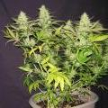

](https://www.growweedeasy.com/wp-content/uploads/2010/04/nitogen-deficient-flowering.jpg)[

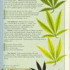

](https://www.growweedeasy.com/wp-content/uploads/2010/04/nitrogen-info-marijuana.jpg)

It's normal for plants to show signs of a nitrogen deficiency as the plant gets close to harvest. This is actually a good thing! Too much nitrogen can actually prevent proper budding, and can reduce the overall taste and smell of your plant. This is why all "bloom" and flowering nutrient formulas are relatively low in nitrogen.

**Don't worry about yellow leaves close to harvest! **It's normal to see a few Nitrogen-deficient leaves in the flowering stage. Nothing to worry about unless you see the yellowing leaves start climbing up the plant.

[

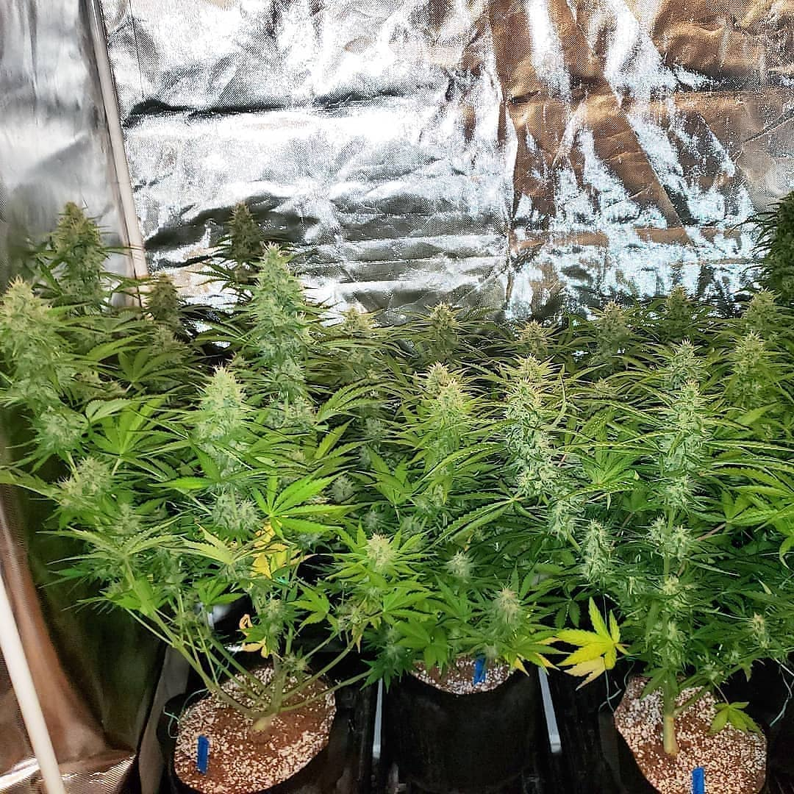

](https://www.growweedeasy.com/wp-content/uploads/2017/10/flowering-nitrogen-deficiency.jpg)

So don't sweat it if you see your cannabis show some signs of nitrogen deficiency late in the flowering stage! Relatively low levels of nitrogen in the late flowering stage help promote proper cannabis bud development and will increase your yields!

**Solution:** You can find many pre-mixed nutrients from the store which contain nitrogen or you could use nitrate of soda or organic fertilizer which are both good sources of nitrogen. In fact almost all plant nutrients of any kind will include nitrogen. If you haven't been providing any nutrient to your plants, try supplementing your regular nutrients with a bit more nitrogen and see if the plant starts recovering.

If you've already been using nutrients, then you probably don't have a nitrogen deficiency. If you're seeing the signs of spreading nitrogen deficiency even a week or two giving nitrogen to your plants through nutrients, then you need to figure out what else is causing the yellowing so you can stop it.

**More About Nitrogen and Your Marijuana Plants**

Sometimes you can get the signs of a cannabis nitrogen deficiency if the pH at the plant root zone is **too low**, even if the nitrogen is there. This is because when the pH at the roots is not right, your plant roots can't properly absorb nutrients. If you aren't sure about your root pH, learn more about [pH & growing cannabis plants](https://www.growweedeasy.com/how-do-i-check-the-pH-of-my-water) here.

Nitrogen is especially important during the vegetative stage of your cannabis plants. As your plants start flowering, they will need lower amounts of nitrogen.

Nitrogen is one of the 3 nutrients that is included in almost every kind of plant food.

When looking at plant nutrients, you'll almost always see 3 numbers listed, like 3-12-6 or 5-10-5. These numbers represent the percentage of Nitrogen (N), Phosphorous (P) and Potassium (K) contained in the bottle. Just about all plant life on Earth needs these 3 elements to grow.

The 3 numbers on the front of plant nutrient bottles list the amount of Nitrogen, Phosphorus, and Potassium.

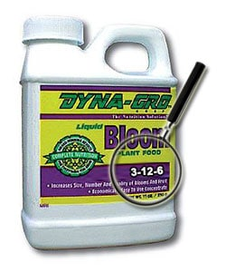

The very first number, "3" in the case of the picture to the right, always displays the proportion of nitrogen in this nutrient bottle compared to the other 2 nutrients (Phosphorus and Potassium respectively).

Nitrogen is in all plant nutrient formulations because it's vital to plant processes.

*Note: During the last few weeks before harvest, marijuana plants start pulling all the remaining nitrogen from her leaves as part of the bud-making process. This causes yellowing leaves starting towards the bottom of the plant. This is part of the natural flowering process and you don't need to fight it. You may notice that marijuana leaves are yellowing in almost all pictures of marijuana plants with big buds that are close to harvest. You tend to get smaller yields from nitrogen-toxic plants with dark green leaves at harvest.*

**Remember: It's Normal For Marijuana Leaves To Start Turning Yellow As Harvest Time Approaches**

[

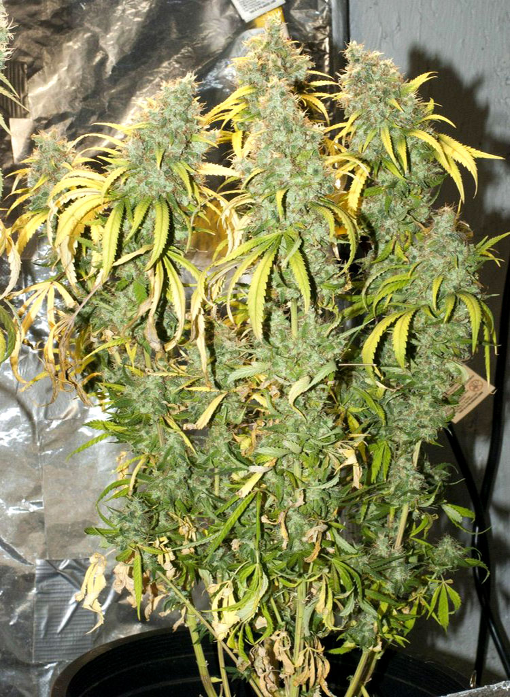

](https://www.growweedeasy.com/wp-content/uploads/2010/10/marijuana-day-before-harvest.jpg)[

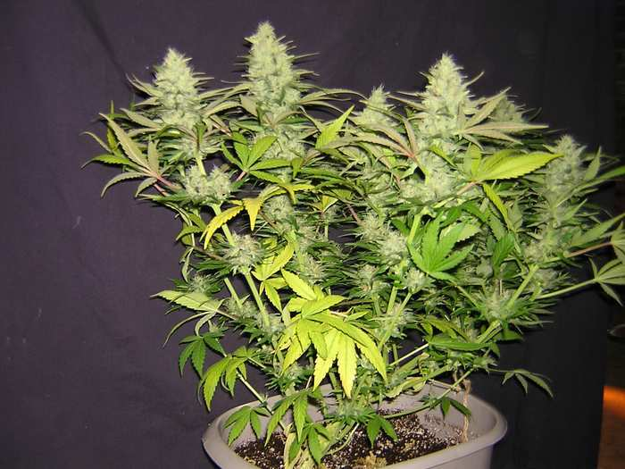

](https://www.growweedeasy.com/wp-content/uploads/2010/04/nitogen-deficient-flowering.jpg)

Occassionally a nitrogen toxicity is mistake for a deficiency. Could your plant actually be nitrogen toxic? (pictured below)

**This picture shows a [Nitrogen Toxicity](https://www.growweedeasy.com/nitrogen-toxicity-cannabis)**

[

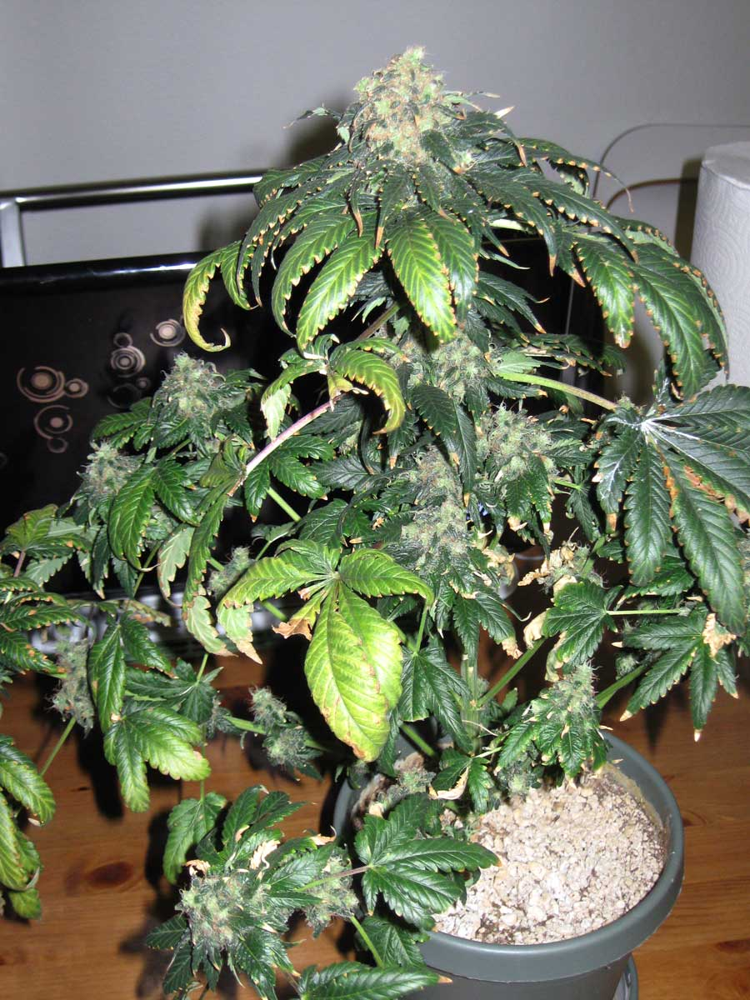

](https://www.growweedeasy.com/wp-content/uploads/2010/06/nitrogen-toxicity-flowering.jpg)​

## Nitrogen Toxicity

**Problem:** Dark green leaves, shiny leaves, clawing, weak stems, and overall slow growth. Marijuana leaves that are nitrogen toxic often get "The Claw" or talon-like leaves that are bent at the ends. They also do an odd curving (or cupping) that is often mistaken for overwatering, but is unique to nitrogen toxicity. You can see a "clawing" leaf in the pictures below (click each picture for a close-up).

Leaves that turn into claws often start turning yellow and dying if the nitrogen toxicity is not treated, much like a [nitrogen deficiency](https://www.growweedeasy.com/nitrogen-deficiency-cannabis), only the leaves will continue to get more and more clawed. Leaves eventually turn yellow or brown and fall off. You can tell if yellowing is caused by too much nitrogen because the rest of the plant will be dark green, and the yellowing leaves will turn into claws first.

The majority of times that growers encounter problems with nitrogen, it's from giving too much of it to their plants.

**Many new growers accidentally give their plants give too much Nitrogen, especially in the flowering stage. This results in dark, shiny, clawing leaves.**

​

Your plant needs a lot of nitrogen in the vegetative stage, and it's generally hard to give too much as long as you're not going completely overboard with nutrients. Nitrogen is a big part of what makes leaves green, and is incredibly important to the process of photosynthesis (making energy from light).

But cannabis plants need relatively low levels of Nitrogen in the second half of the flowering/budding stage. While your plants still need N (nitrogen) during flowering, too much N at this stage will prevent your plants from forming buds properly, resulting in lower yields, less potency and possibly inferior buds.

This is why it's important to avoid any type of "time-release" nutrients or soil (for example, standard Miracle-Gro soil) as they will keep giving your plant a lot of N even after its started flowering.

When it comes to nitrogen, this is what your plant needs:

**Vegetative Stage** - higher levels of Nitrogen (pretty much any plant food will do)

Most complete plant foods that you get at a gardening store contain high levels of nitrogen (N). These nutrient systems tend to work well in the vegetative stage.

Some examples of cannabis-friendly one-part Vegetative nutrient systems&#8230;

* 

[Dyna-Gro “Foliage Pro”](https://www.amazon.com/Dyna-Gro-DYFOL008-Foliage-Pro-11/dp/B003SUT6VS/ref=as_sl_pc_ss_til?tag=growwcom07-20&linkCode=w01&linkId=DT6NRAAWQNT3PRBI&creativeASIN=B003SUT6VS)

* 

[General Hydroponics “FloraNova Grow”](https://www.amazon.com/Flora-Nova-Grow-Fertilizer-Size/dp/B000BNMXPG/ref=as_sl_pc_ss_til?tag=growwcom07-20&linkCode=w01&linkId=OA6STHNEEFVJKHZW&creativeASIN=B000BNMXPG)

* 

Pretty much any complete plant food

**Flowering Stage** - lower levels of Nitrogen (use "Bloom" or Cactus nutrients)

It’s extra important to find a nutrient system with lower levels of nitrogen for the last part of your plant’s life. Many “Bloom” or "Flowering" style base nutrients are just the ticket.

Some examples of good one-part Flowering nutrient systems&#8230;

* 

[Dyna-Gro “Bloom”](https://www.amazon.com/s/?_encoding=UTF8&camp=1789&creative=390957&field-keywords=dyna-Gro%20Bloom%20-grow&linkCode=ur2&rh=n%3A2972638011%2Ck%3Adyna-Gro%20Bloom%20-grow&tag=growwcom07-20&url=search-alias%3Dlawngarden&linkId=6OQTLBDQFZZR6BVJ)

* 

[General Hydroponics “FloraNova Bloom”](https://www.amazon.com/General-Hydroponics-GH1632-FloraNova-Bloom/dp/B000W7C87Y/ref=as_sl_pc_ss_til?tag=growwcom07-20&linkCode=w01&linkId=VU5BVKNEW3JID4FG&creativeASIN=B000W7C87Y)

* 

If you can’t order online and can't find a good one-part base Bloom formula locally, you do have other choices. Though not an ideal choice, most Cactus plant foods will contain good nutrient ratios for growing cannabis during the budding stage. So in a pinch, you can use the cactus nutrients that can be found at most gardening stores.

Different strains react differently to nitrogen toxicity. Some plants get dark green leaves with no clawing. Some strains will get leaves that do the weird 90 degree bend at the tips, while other strains or individual plants start curling like claws and then turn yellow / brown and fall off like a deficiency. Yet these are all signs of too much nitrogen.

**Signs of Nitrogen Toxicity**

* [

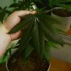

](https://www.growweedeasy.com/wp-content/uploads/2010/04/nitogen-too-much.jpg)Dark green leaves and foliage
* Leaf tips may turn down, without signs of overwatering.
* You may notice yellowing on the affected leaves or other signs of nutrient deficiencies as time goes on
* Nitrogen toxicity is often but not always accompanied by nutrient burn
* The Claw often seems random, affecting leaves here and there
* Heat and pH problems will make the clawing worse, as they stress out the plant and lower her defenses, and cause her to drink more water (and uptake more N)
* As time goes on, the claw leaves will eventually start turning yellow, getting spots, and dying

[

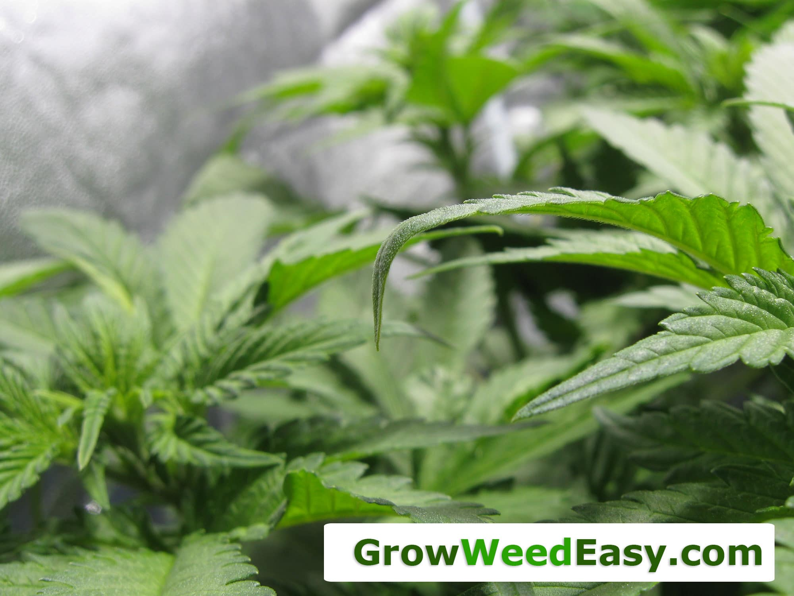

](https://www.growweedeasy.com/wp-content/uploads/2013/02/cannabis-leaves-tips-down.jpg)

[

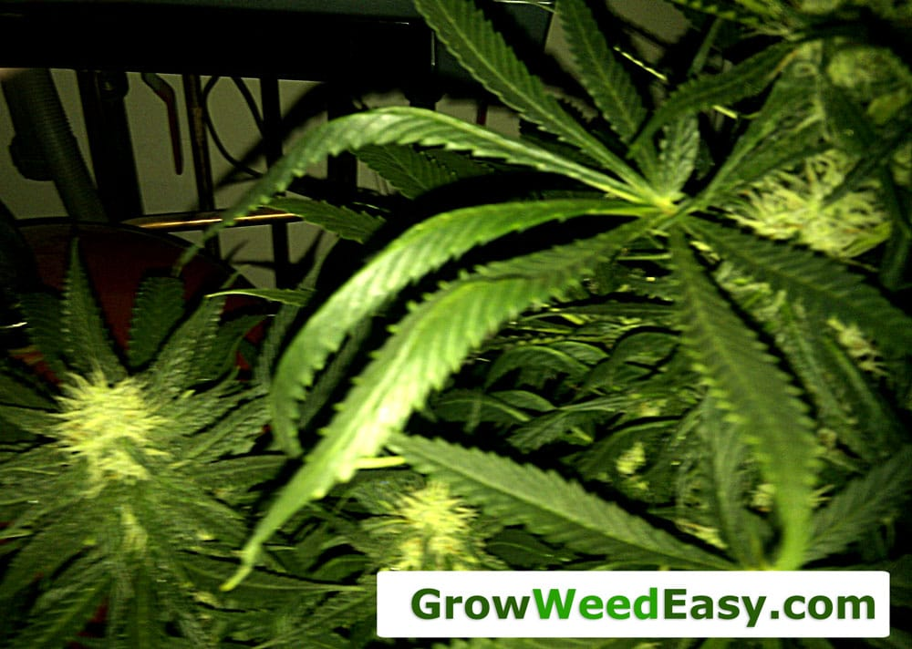

](https://www.growweedeasy.com/wp-content/uploads/2010/10/flowering-marijuana-leaf-curled-down-too-much-nitrogen.jpg)

[

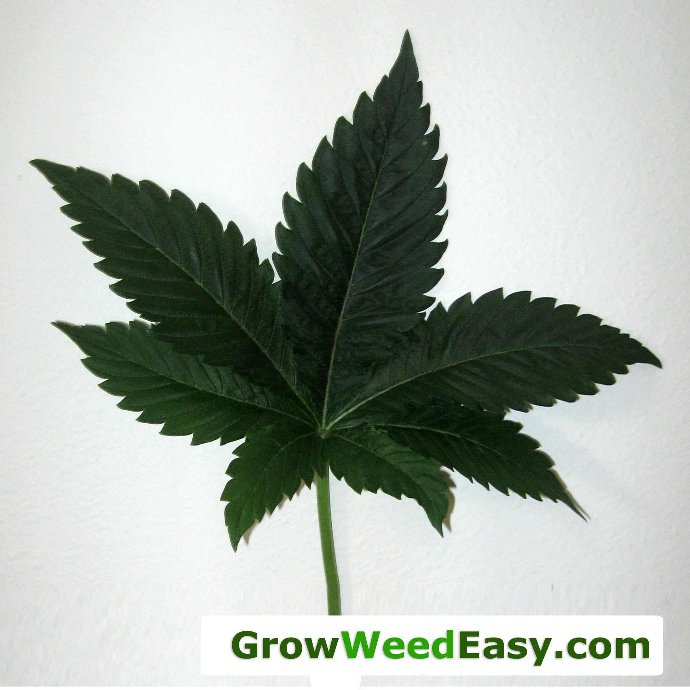

](https://www.growweedeasy.com/wp-content/uploads/2010/10/dark-green-leaves-nitrogen-toxic.jpg)

[

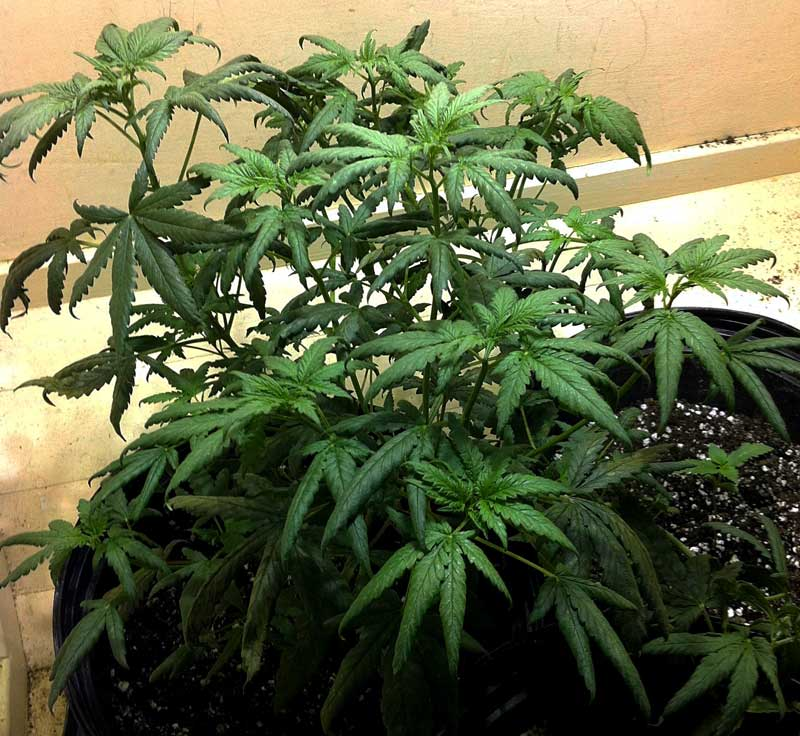

](https://www.growweedeasy.com/wp-content/uploads/2017/02/marijuana-droopy-leaves-nitrogen-toxic.jpg)

This cannabis seedling is dark because it was underwatered in a "hot" soil mix (too much Nitrogen), but after watering the plant as normal for a week or two, the plant started growing vigorously

[

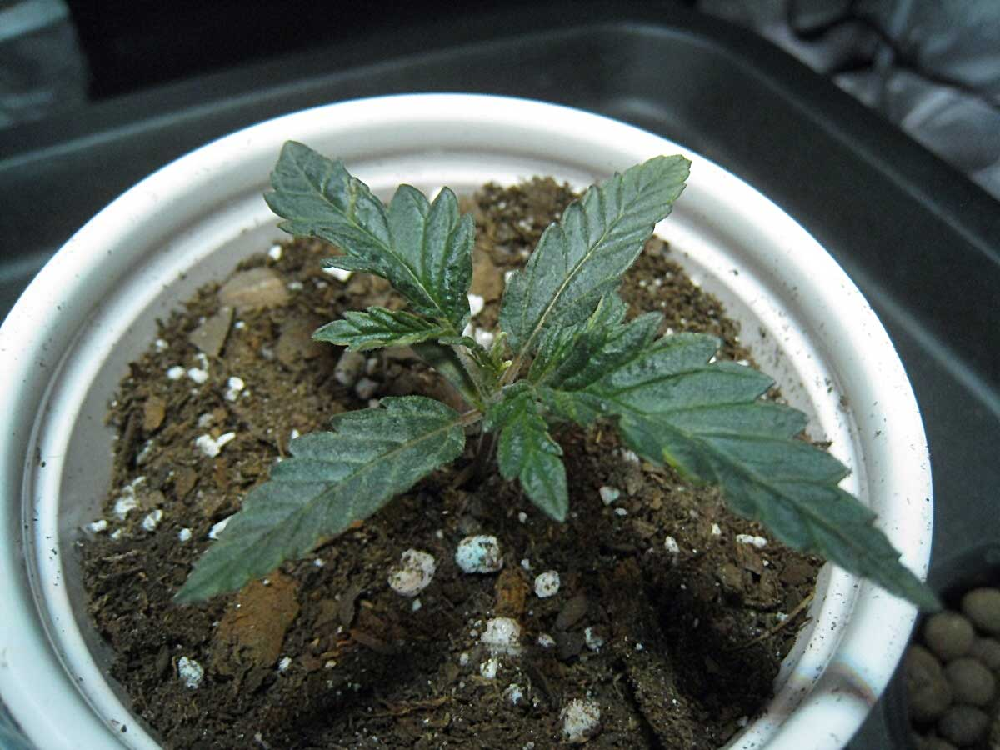

](https://www.growweedeasy.com/wp-content/uploads/2011/02/dry-soil-nitrogen-toxicity.jpg)

**Solution:** Reduce the Nitrogen your plant is getting!

Reduce the amount of nitrogen that is being fed to the plants. If you are feeding extra nutrients, cut down that amount. If you are in the flowering / budding stage, make sure you're using a formula that's specifically meant for flowering, or else it could have too much nitrogen.

If you are not feeding extra nutrients, you may have "hot" soil that has been giving your plants extra nutrients. In that case, flush your plants with filtered, pH'ed water to help clear out the extra nitrogen.

Effected leaves likely won't recover, but you should see the problem halt with no new leaves being affected.

**Wait! I'm not sure if it's Nitrogen toxicity!**

Ok, you ruled out [overwatering](https://www.growweedeasy.com/overwatering-cannabis), now what?

When I first got started growing, everyone kept telling me that this particular kind of leaf clawing was caused by under or overwatering my plants, pH problems, or heat problems.

Yet in my case, I knew that it wasn't over or under watering (I was growing in hydro, where roots grow directly in water and air stones are constantly adding oxygen). I knew it wasn't pH (my reservoir water had the right pH) and I knew it wasn't heat since the grow area was slightly cooler than room temperature.

So then what was really causing my claw leaves?

It's understandable that other growers were mistaken. It is true that many stresses will make any other problem worse.

Plus overwatering can cause a similar kind of leaf clawing (learn more below). And if you do have nitrogen toxicity, than heat or pH problems will make the problem much worse.

Now, you may or may not know that marijuana (or any plant) needs an element known as "Nitrogen" to grow.

In fact, nitrogen is one of the 3 nutrients that are included in almost every kind of plant food.

When looking at plant nutrients, you'll almost always see 3 numbers listed, like 3-12-6 or 5-10-5. These numbers represent the ratio of Nitrogen (N), Phosphorous (P) and Potassium (K) contained in the bottle. Just about all plant life on Earth needs these 3 elements to grow.

The very first number, "3" in the case of the picture to the right, always displays the proportion of nitrogen in this nutrient bottle compared to the other 2 nutrients (Phosphorus and Potassium respectively).

The reason nitrogen is in all plant nutrient formulations is because it's vital to plant processes.

For marijuana plants, when they don't get enough nitrogen, the bottom leaves start turning yellow and dying. Left unchecked, a [nitrogen deficiency](https://www.growweedeasy.com/nitrogen-deficiency-cannabis) can cause the whole plant to eventually die.

However, this time we're the dealing with the opposite problem: nitrogen toxicity, or too much nitrogen.

**Why You Should Treat And Prevent Nitrogen Toxicity**

* Marijuana plants that get too much Nitrogen in the vegetative stage don't grow as vigorously.
* Too much nitrogen is especially harmful in the flowering stage, because this will cause your plant to produce much smaller buds.
* If you react quickly and reduce your nitrogen levels at the first sign of toxicity, your plant will quickly recover.

***Note: Some strains with the word "Claw" in the name tend to do The Claw more easily than others.***

Problems with excess nitrogen are not common in the wild; it's a lot more common to see nitrogen toxicity on indoor plants, especially when overzealous growers go overboard with nutrients.

Occasionally you'll come across a strain or particular plant that likes lower levels of nutrients, and when this happens, it's important to realize the plant is showing signs of toxicity, even if all the other plants in your garden seem fine.

One of the most common signs off too-many-nutrients is "nutrient burn," or when the tips of your leaf appear brown or burned. Yet there are specific signals your plant will display when she's getting too much nitrogen&#8230;

**Recap: How You Know You Have a Nitrogen Toxicity**

* Dark green leaves and foliage
* Leaf tips turn down, without signs of overwatering.
* You may notice yellowing on the affected leaves or other signs of nutrient deficiencies as time goes on
* Nitrogen toxicity is often but not always accompanied by nutrient burn
* The Claw often seems random, affecting leaves here and there
* Heat and pH problems will make the clawing worse, as they stress out the plant and lower her defenses, and cause her to drink more water (and uptake more N)
* As time goes on, the claw leaves will eventually start turning yellow, getting spots, and dying

**Light and "The Claw"**

* The distance between the leaves to the lights or irregular light patterns from reflectors often seem to affect the condition, which is why many growers believe that light is somehow causing the problem.
* You may notice this clawing first appears on dark green leaves that aren't getting enough light (they aren't able to use up all their nitrogen and become nitrogen toxic).

**The Claw in the Flowering Stage**

* If you use vegetative plant nutrients during the flowering stage, then they'll deliver too much nitrogen. This is why you need to get special nutrients meant for the blooming / flowering stage. You'll notice that flowering nutrients always contain a smaller percentage of nitrogen  (the first number) compared to nutrients for the vegetative stage. [Learn more about marijuana nutrients here.](https://www.growweedeasy.com/best-marijuana-nutrients-review)
* Many growers mistakenly keep raising nutrient levels or adding additional nitrogen when they see yellow leaves in the flowering stage, not realizing that it's natural for plant leaves to start yellowing as harvest approaches. Adding too much nitrogen in the flowering stage can cause nitrogen toxicity even when you can see yellow lower leaves. Nitrogen toxicity in flowering results in smaller yields and airy cannabis buds, so make sure to watch out!

[

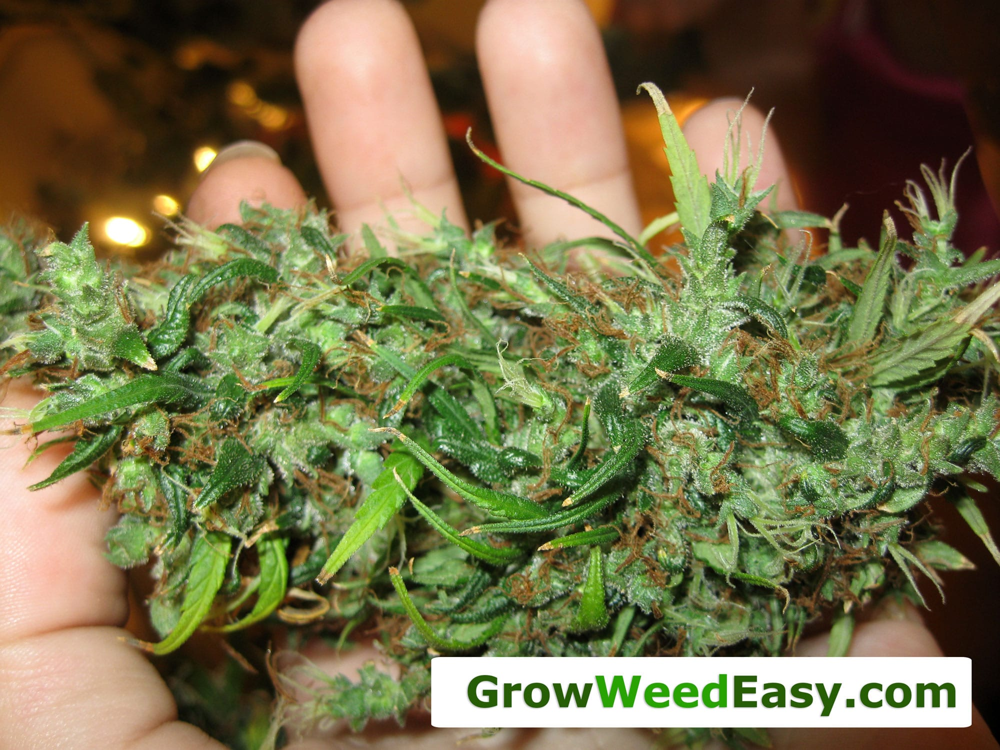

](https://www.growweedeasy.com/wp-content/uploads/2010/10/buds-bent-leaves-nitrogen-toxic2.jpg)[

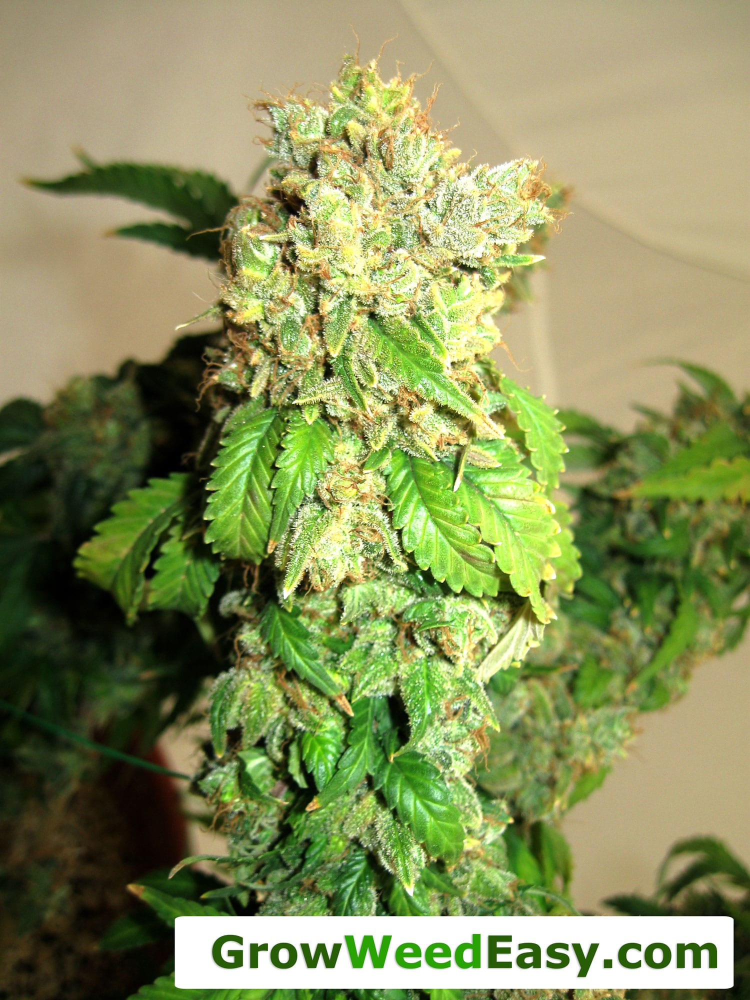

](https://www.growweedeasy.com/wp-content/uploads/2010/10/nitrogen-toxic-dark-leaves-flowering.jpg)[

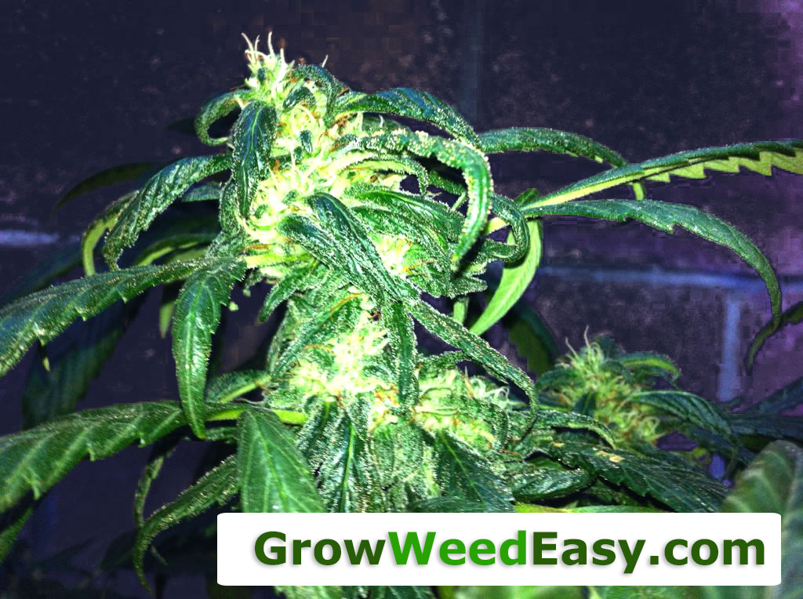

](https://www.growweedeasy.com/wp-content/uploads/2010/10/flowering-nitrogen-toxicicity-claw-leaves-marijuana.jpg)**[

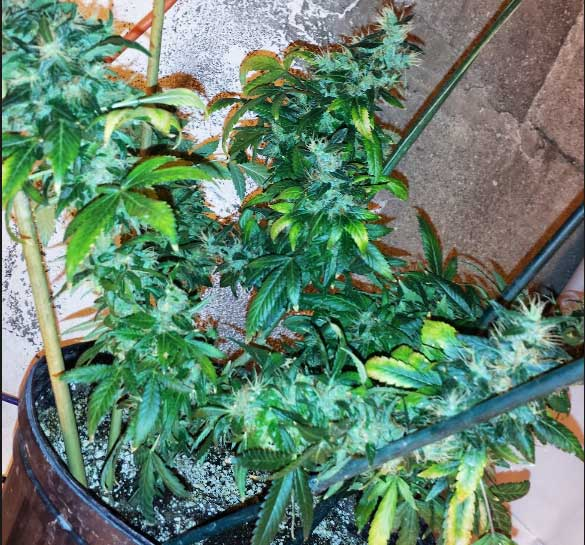

](https://www.growweedeasy.com/wp-content/uploads/2010/10/nitrogen-toxicity-cannabis.jpg)**

*Note: During the last few weeks before harvest, marijuana plants starts pulling all the remaining nitrogen from her leaves as part of the bud-making process. This causes yellowing leaves starting towards the bottom of the plant. This is part of the natural flowering process and you don't need to fight it. You may notice that marijuana leaves are yellowing in almost all pictures of marijuana plants with big buds that are close to harvest. You tend to get smaller yields at harvest from nitrogen-toxic plants with dark green leaves.*

**It's Normal For Marijuana Leaves To Start Turning Yellow As Harvest Time Approaches, Don't Keep Adding More Nitrogen!**

I know a lot of marijuana plant problems can look similar, but now that you're armed with the right information, you'll know exactly what to do if you see **Nitrogen Toxicity** affecting your marijuana plants.

## Nutrient Burn

by Nebula Haze

# Do Your Marijuana Leaves Have Nutrient Burn?

**Quick Summary:** Nutrient burn or fertilizer burn is one of the most common beginner cannabis growing problems. The yellow or brown leaf tips are caused by too-high levels of nutrients at the roots, which disrupts the flow of water through the plant and causes the symptom of burnt tips on leaves.

(Nutrient burn is often called "Nute Burn" in the cannabis growing community).

"Nutrient burn" causes cannabis leaf tips to turn brown and crispy.

[

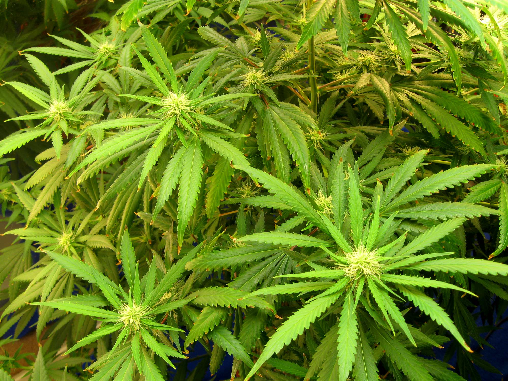

](https://www.growweedeasy.com/wp-content/uploads/2010/10/nute-burn-brown-tips-leaves.jpg)

When the roots take in more nutrients than a cannabis plant can use, the overabundance causes problem with water flow in the plant, triggering brown or bronze "burns" on the tips of your leaves. If nutrient levels are not lowered, the burnt tips start traveling inwards and the ends of leaves start becoming crispy and twisted.

[Take me straight to the solution for cannabis nute burn!](#solution-nute-burn)

As nutrient burn progresses, the tips start getting bronze, crispy, curled and sometimes twisted. Although you can stop nutrient burn from getting worse, the burnt appearance won't go away on the leaves that were already affected.

[

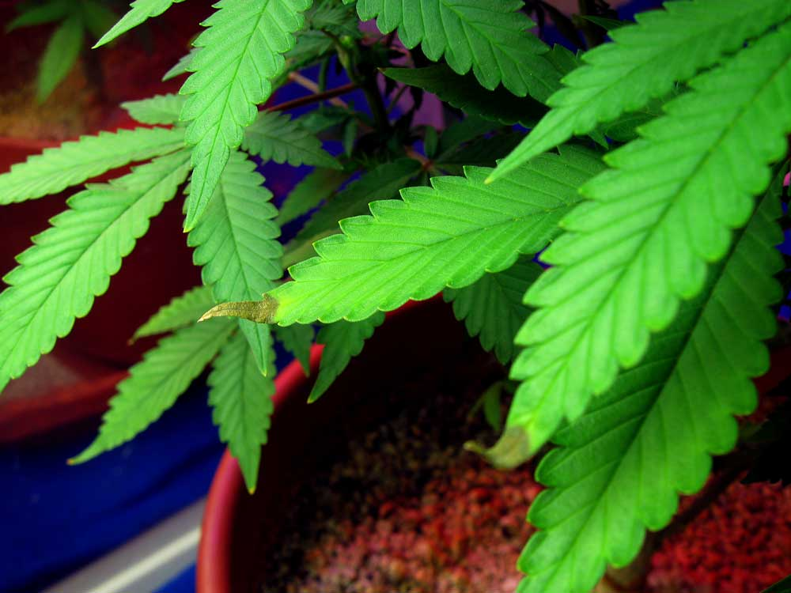

](https://www.growweedeasy.com/wp-content/uploads/2010/10/nutrient-burn-leaf-tips.jpg)

Nutrient burn is most common when feeding cannabis too-high levels of [bottled nutrients](https://www.growweedeasy.com/best-marijuana-nutrients-review) and especially chemical or mineral nutrients. This is what you'll find in most non-organic plant food.

Mineral-based nutrients can help increase cannabis growth rates and yields compared to organic-based nutrients due to the fact that these nutrients are so easily absorbed by the plant roots. The plant doesn't have to do any "work" to get the nutrients. The downside is your plant can easily take in more than it can use if the nutrient levels are too high.

Nutrient burn affects the tips of marijuana leaves. You may just see it on one or two leaves, or it can appear all over the plant.

[

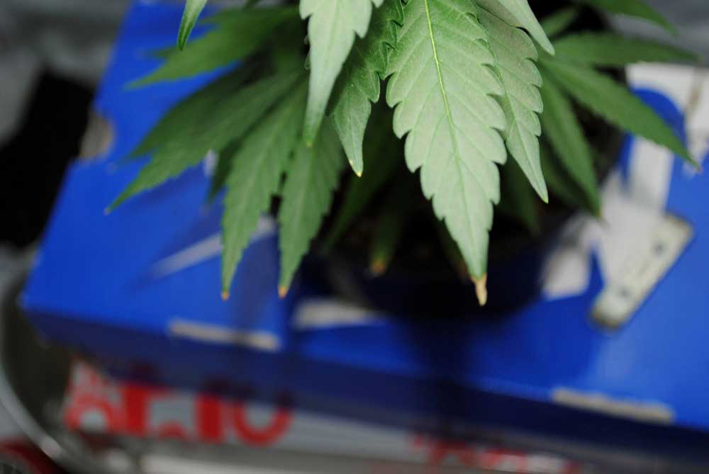

](https://www.growweedeasy.com/wp-content/uploads/2010/10/nutrient-tip-burn.jpg)

Nutrient burn can also happen when plants or seedlings are grown directly in soil that has a high level of nutrients (a "hot" soil or growing medium) such as fresh compost, manure or a nutrient-amended soil mix. This usually happens to young seedlings, and they will "grow out of it" as they begin to use up all the nutrients in the soil, as long as more nutrients are not added.

In general, plants use overall higher levels of nutrients as they get more light. Therefore plants in relatively low light conditions can get nutrient burn at lower levels of nutrient than the same plant would under bigger grow lights.

Each cannabis plant is different, so you might have just one out of many plants get nutrient burn! That is completely normal.

Sometimes you'll also see nutrient burn leaf tips also curl or "claw". The clawing can be caused by an overabundance of Nitrogen ([Nitrogen Toxicity](https://www.growweedeasy.com/nitrogen-toxicity-cannabis)), which is common for plants that are experiencing nutrient burn from overall high levels of nutrients.

[

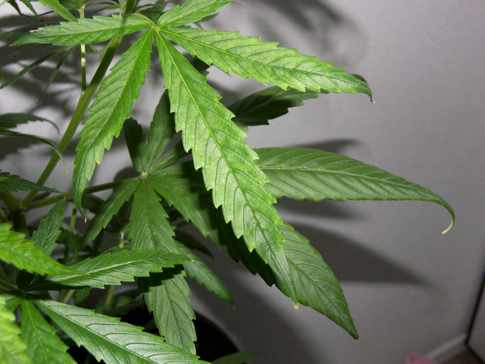

](https://www.growweedeasy.com/sites/growweedeasy.com/files/marijuana-nutrient-burn-tip-curled.jpg)

**Problem:** You will notice the tips of your marijuana leaves showing the first signs of nutrient burn by turning yellow, tan, gold or brown. A light case of nutrient burn will only affect the tips of your leaves.

The yellow tips will eventually turn rusty brown and crispy. If you do not correct the problem, you may also notice the burn slowly spreading from the tips to the whole leaf. At this point, if you haven't done so already, you should immediately treat your plant (directions below) before there's more damage.

[

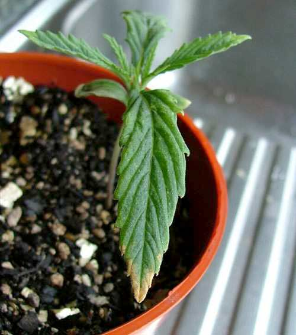

](https://www.growweedeasy.com/wp-content/uploads/2010/06/nute-burn-seedling.jpg)

Nutrient burn can also manifest itself as brown or bronze spotting around the edges of the leaf serrations (often when there's a problem with proper absorption of potassium), or with leaf tips curling downwards (tips pointing down is often associated with too much nitrogen).

Nutrient burn causes tips to start curling up if it gets bad enough[

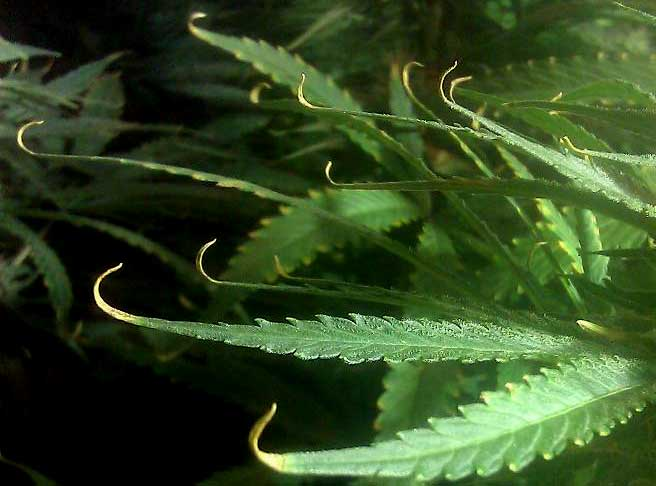

](https://www.growweedeasy.com/wp-content/uploads/2014/08/extreme-nutrient-burn-curling.jpg)

**These Are NOT Nutrient Burn!**

(Sometimes Mistaken for Nutrient Burn)

[Light Stress](https://www.growweedeasy.com/cannabis-light-burn) can cause yellow tips or edges, which can sometimes be confused with nutrient burn

[

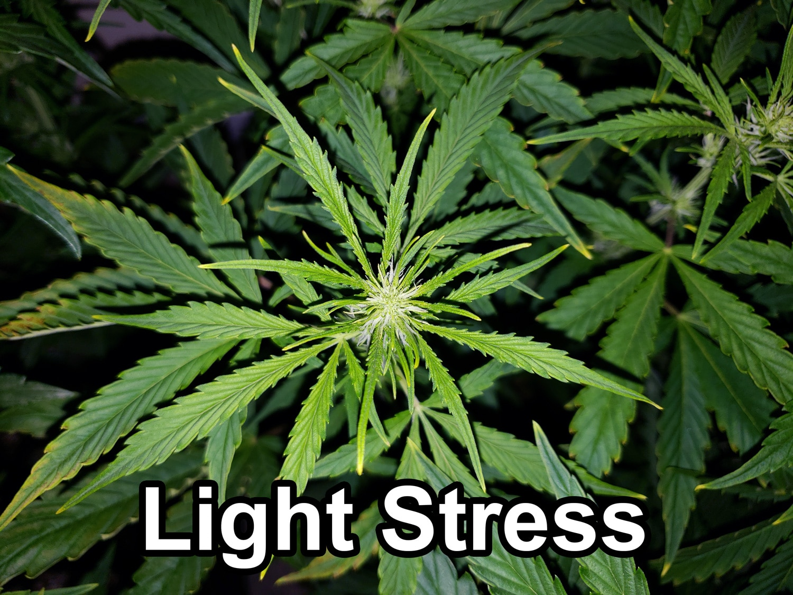

](https://www.growweedeasy.com/wp-content/uploads/2018/12/light-burn-yellow-tips-not-nutrient-burn.jpg)

This is actually a [Potassium Deficiency](https://www.growweedeasy.com/potassium-deficiency-cannabis), *not* nutrient burn!

[

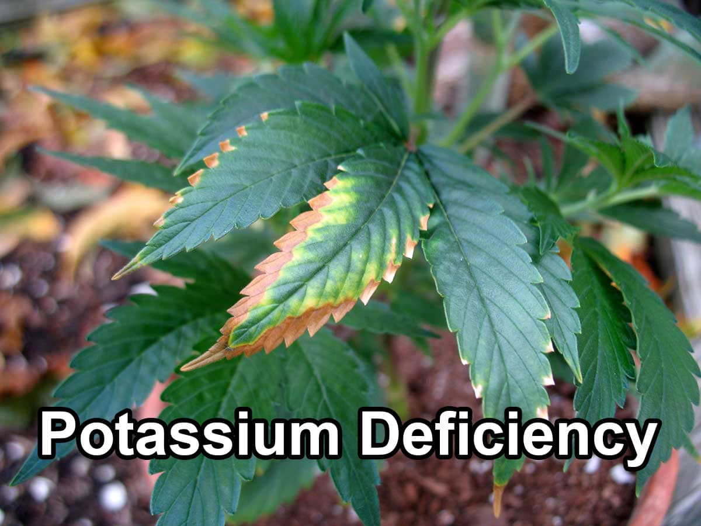

](https://www.growweedeasy.com/wp-content/uploads/2018/12/potassium-deficiency-yellow-brown-edges-not-nutrient-burn.jpg)

[pH Fluctuations

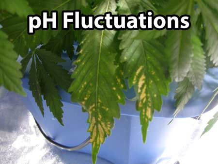

](https://www.growweedeasy.com/ph-fluctuations-cannabis)

See more examples: [Is this actually nutrient burn or something else?](https://www.growweedeasy.com/is-this-marijuana-nutrient-burn)

**Why Growers Should Try to Prevent Marijuana From Getting Nutrient Burn**

I have heard some growers say that a little nutrient burn is actually a good thing, because it means that you are giving your plant the highest level of nutrients it can use. A lot of growers have the mistaken idea that nutrients are somehow "food" for your cannabis plants, and so more food = more energy = bigger yields.

This is wrong, instead **nutrients are more like a multi-vitamin for your plant**. Just like you can't give a child 10 multivitamins a day to make them grow faster, you can't give your plants 10x the regular does of nutrients and expect anything good to happen.

The real "food" for your plant is **light**. Your plant produces energy from light through a process known as photosynthesis, which is most effective when the plant has healthy green leaves.

[Learn what yields to expect based on the type of grow light you have](https://www.growweedeasy.com/growing-cannabis-shopping-list)!

Your leaves are like solar panels, and the energy produced by the leaves is used as energy for the whole plant. You need the leaves to be in tip-top shape to get the most energy from the lights, so your plant has plenty of energy to grow and produce buds.

Therefore, **the biggest problem with nutrient burn** is the fact that you are losing leaf mass and overall leaf robustness on your cannabis plant.

A little nute burn won't slow down your plants much, if at all, but if nute burn is left out of control, you will begin to lose serious leaf mass and it will dramatically slow down plant growth and reduce your overall yields.

What's worse, if excess nutrients are not flushed out of the plant's system before harvest, the buds may contain trace amounts of extra nutrients, giving the buds an unpleasant chemical-like taste. Speaking of the flowering stage&#8230; ([Wait, what's the flowering stage?](https://www.growweedeasy.com/the-basics-of-growing-marijuana#flowering-stage-when-buds-start-growing))

**Nutrient Burn is More Serious in the Flowering Stage**

Cannabis plants spend the beginning part of their life in the [vegetative stage](https://www.growweedeasy.com/the-basics-of-growing-marijuana#vegetative). When cannabis plants enter the second part of their life, the [flowering stage](https://www.growweedeasy.com/the-basics-of-growing-marijuana#flowering-stage-when-buds-start-growing), they stop focusing on making leaves and stems, and put all their focus on making buds/flowers.

The flowering stage is the most vulnerable stage for cannabis plants, because they don't have much ability to bounce back from any problems.

The further you get into the flowering stage (and the closer you get to harvest), the less likely the plant will replace a leaf that is damaged or dies. By the time harvest is around the corner, your plant basically stops making any effort to recover from leaf damage, and its complete focus is on fattening buds.

That's why budding cannabis plants need extra care to thrive - in the flowering stage, a little bit of nutrient burn will probably be okay, but too much nutrient burn can seriously hurt yields because the plant will not be able to recover. If you are adding nutrients to your water, it can be very easy to burn your plants in the flowering stage (even with nutrient levels it was fine with before) as different strains have different needs throughout budding.

[

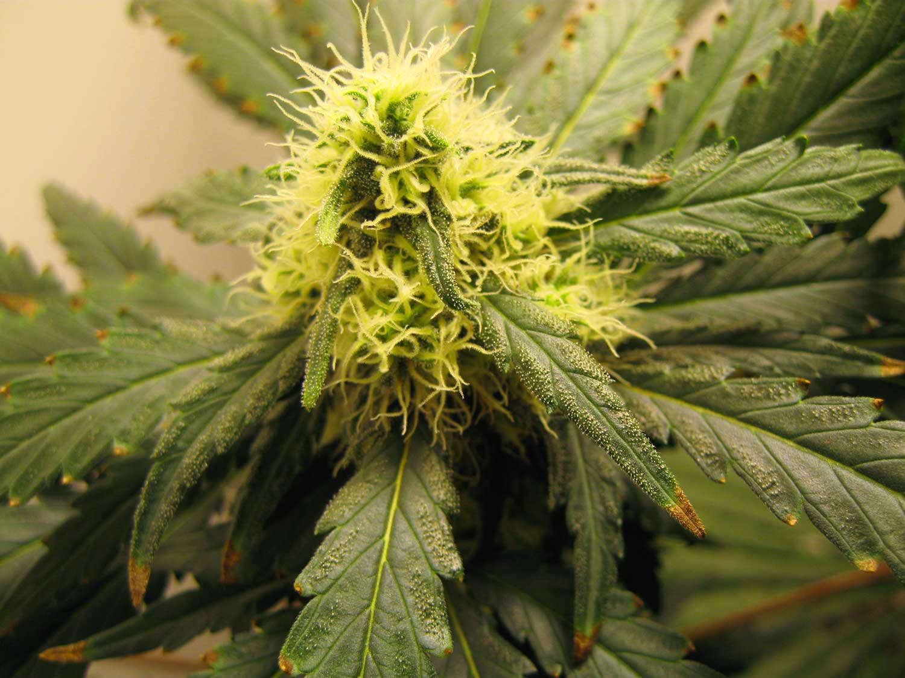

](https://www.growweedeasy.com/wp-content/uploads/2010/10/nutrient-burnt-tips.jpg)

# **Solution to Cannabis Nute Burn** 

If you are using bottled nutrients - Most people who get nute burn are feeding their plants extra nutrients in the water. First off, make sure you are using a quality set of nutrients that has been [specifically designed for cannabis](https://www.growweedeasy.com/best-marijuana-nutrients-review) plants. Any nutrient system designed for plants like a tomato will also work in a pinch. Also make sure you are feeding nutrients for the right growth stage - for example, all cannabis nutrient systems have you feed different nutrients for the vegetative and flowering stage. If you are feeding the wrong type of nutrients for the stage your plant is in, that is an easy way to give your plants lots of nutrient problems including nutrient burn.

If you are using the wrong type of nutrients for a plant like cannabis, you will eventually run into nutrient problems, one way or another.

Many nutrient systems come with instructions to feed your plant more nutrients than most plants actually need. It's good business for the nutrient companies if you use more nutrients. However, in my experience it's a good idea to view the feeding charts that come with any nutrient system as the *maximum* amount of nutrients and actually start with much lower levels. I tend to start with half the recommended amount, and slowly work my way up only if needed.

Hand-watered system - If you are growing in a hand watered system (like in soil or coco coir), flush your system with plain, pH'ed water if you notice the first signs of nutrient burn. ([Learn about pH](https://www.growweedeasy.com/how-do-i-check-the-pH-of-my-water)). If you are not adding any extra nutrients in your grow, then you simply need to wait until the plant uses all the excess nutrients in the soil - after the nutes have been used up, the plant will naturally get over the nute burn (old leaves won't recover, but leaves should no longer be getting new brown or burnt tips).

Hydro system - Reduce the overall levels of nutrients in your water reservoir by either adding plain pH'ed water to dilute the water, or you could also mix up a new set of nutrients (at lower levels) and completely change the water.

Be careful not to make big changes too fast, it's better to go relatively slowly in hydro.

In hydro, once you change the water and lower the nutrient levels to an appropriate level, you should immediately notice the nutrient burn stop spreading. Old leaves won't recover, but you shouldn't notice any leaves getting worse.

If you don't have a TDS meter to measure the levels of nutrients (and other extra stuff) in your water, I would normally start your plants with a fraction (perhaps 1/2) of the nutrients you were giving them before - and then work your way up to higher nutrient levels only if you notice the lower leaves are starting to yellow too quickly ([nitrogen deficiency](https://www.growweedeasy.com/nitrogen-deficiency-cannabis)). Even then, try to move up nutrient levels as slowly as you can. If you lose leaves to a nitrogen deficiency from slightly too-low nutrient levels, you will lose a few of the least important lower leaves. But if you raise nutrient levels to fast and get nutrient burn, all the leaves on the whole plant will be affected and never recover fully.

One of the things that can be frustrating about hydro is that different plants or strains will be okay with different amounts of nutrients. You can be giving 2 plants the exact same levels of nutrients, and one might get nutrient burn while the other plant is getting a deficiency at the same level. This is because different plants absorb the nutrients at different rates.

Plus, plants drink more or less water depending on the temperature and humidity of your grow area, so even if you're familiar with the nutrient levels of a particular strain, it can be hard to keep track of the exact right nutrient levels until you get familiar with your setup, unless&#8230;

Luckily, there is an awesome tool to make this much easier in hydro.

In hydro, it is very helpful to get a tool called a **TDS meter** to help you regulate the amount of nutrients in your water. A TDS meter will be able to tell you how much "stuff" is in the water, and whether the levels of nutrients are getting higher or lower each time you check. You can test your reservoir at any time to see if the levels of nutrients are rising, so you'll be able to stop nutrient burn before it even affects your plants.

I use the [HM Digital TDS-3 meter](https://www.amazon.com/HM-Digital-TDS-3-Handheld-Carrying/dp/B000VTQM70?crid=19OBQ7AYIQGS9&dib=eyJ2IjoiMSJ9.26wkR-MAlR9rRN_zEDQA5WsJOKYQhZrWS80N1rjoC07wy9xhA-vp-gCUZfbbBijWvxoF1b5E7SBOB1TaSp9kjygZean0q6H6Wv52vM4bb0Na2sWs1TUykSpNaiag9w4gtHyEE2sIwOIOr-d0MxMgcZa8w6Ae2aAfzGUrFujmoq006D_KNJFnzh1GZrwJRvtP9ehcoPHSwA-oP0TlWAOJJvQcX1gNWYBuz358mM78ipA.5BU1QRjmgB44iVMSZRngigTxjUOWwqlg8DgX5258A9M&dib_tag=se&keywords=HM+Digital+AP-1+TDS+meter.&qid=1739926237&sprefix=hm+digital+ap-1+tds+meter.%2Caps%2C154&sr=8-1&linkCode=ll1&tag=4200a7-20&linkId=0e0743fe6b63183bd34bf6b7ffd962de&language=en_US&ref_=as_li_ss_tl).

To find out more about using a TDS meter to measure nutrients in your water, check out our article: [PPM: What It Is and How To Track It](https://www.growweedeasy.com/ppm-what-it-is-and-how-to-track-it).

**Could your cannabis also be suffering from Nitrogen Toxicity? -** Nitrogen toxicity is common on cannabis plants with nutrient burn

Are the ends of leaves curling like a claw or pointing down like talons? If your plant is experiencing "the claw" and not just normal drooping like from [underwatering](https://www.growweedeasy.com/underwatering-cannabis) or [overwatering](https://www.growweedeasy.com/overwatering-cannabis), then you may have a [nitrogen toxicity](https://www.growweedeasy.com/nitrogen-toxicity-cannabis) (too much nitrogen).

**These Plants Are NOT Overwatered, These Leaves Show Signs of [Nitrogen Toxicity](https://www.growweedeasy.com/nitrogen-toxicity-cannabis)**

Learn more: [Nitrogen Toxicity](https://www.growweedeasy.com/nitrogen-toxicity-cannabis)
 ("The Claw", tips bent down, curling / clawing, dark green leaves)

Nitrogen toxicity is relatively common with plants experiencing nutrient burn.

 

**FOR SERIOUS GROWERS ONLY**

You've told me you're looking for a complete guide to growing marijuana that covers *everything*, from beginner to ultra-advanced.

If you want to learn ALL the secrets&#8230; Learn from the best!

**Invest in the most advanced Grow Bible Available: **[Growing Elite Marijuana](https://www.growweedeasy.com/growing-elite-marijuana)

Total care explained step-by-step&#8230; indoors&#8230; outdoors&#8230;

Monster cropping&#8230; supercropping&#8230; advanced growth control&#8230; bud production secrets&#8230; and much, much more&#8230;

**Over 700 pages of pictures, tutorials and advanced insider tips!**

Get **Instant Access** to It All Right Here: [GrowWeedEasy.com/growing-elite-marijuana](https://www.growweedeasy.com/growing-elite-marijuana)

*I thought I already knew it all, but after I went through this grow bible, I discovered that there were still lots of easy ways I could increase my yields and grow even more potent buds! I find myself going back to it again and again for new ideas.*

-Nebula

## Over-Watering

by Nebula Haze

**Problem:** After watering, your plants start drooping. Usually the droopy leaves will feel firm and appear curled down (the whole leaf will be curled, not just the tips, which is often a sign of [nitrogen toxicity](https://www.growweedeasy.com/nitrogen-toxicity-cannabis)). With overwatered cannabis plants, you may also notice Chlorosis (leaf yellowing that is similar to a [nitrogen deficiency](https://www.growweedeasy.com/nitrogen-deficiency-cannabis)).

Overwatered cannabis plants are droopy with leaves that curl down. As a result of overwatering, leaves often turn yellow or show other signs of [nutrient deficiencies](https://www.growweedeasy.com/cannabis-symptoms-pictures) (especially when it comes to younger plants and seedlings!)

[

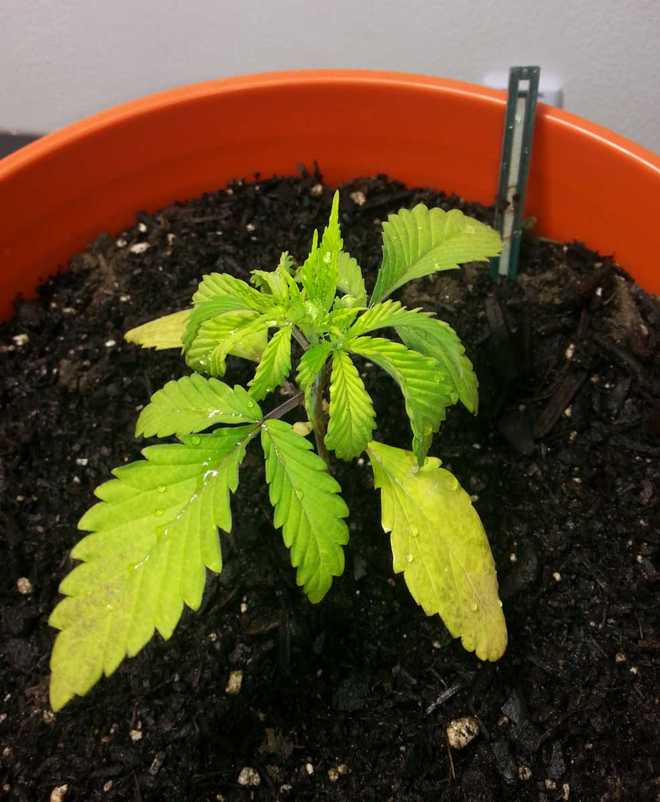

](https://www.growweedeasy.com/wp-content/uploads/2010/10/cannabis-seedling-that-has-been-over-watered.jpg)[

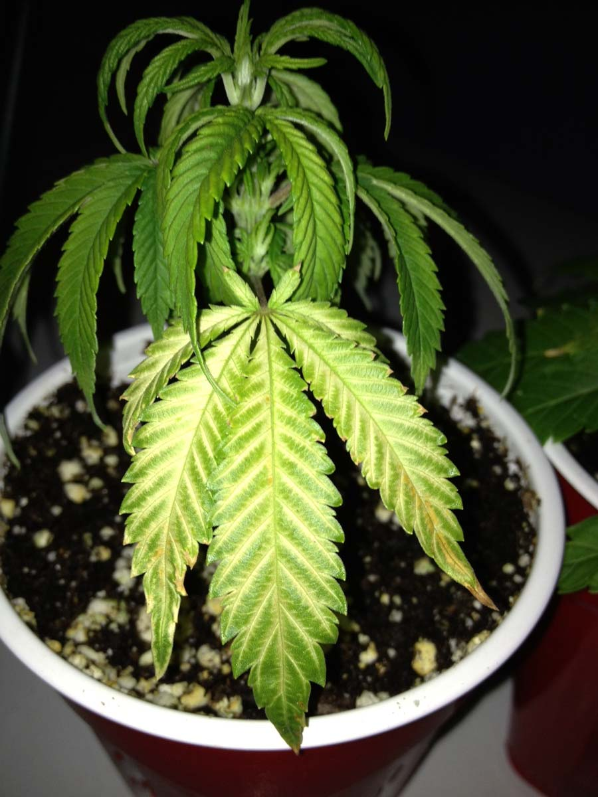

](https://www.growweedeasy.com/wp-content/uploads/2010/10/unhappy-seedling-overwatered-solo-cup-rootbound.jpg)

Overwatering does not always mean you've been giving the plant too much water. It can also mean that you've been giving the plant water** too often**, or growing plants in a growing medium that holds onto water without enough air, or doesn't have good drainage out the bottom.

[How Often Do I Water My Cannabis Plants?](https://www.growweedeasy.com/how-often-water-marijuana)

Cannabis plants use their roots to get oxygen, almost like they're breathing. Oxygen is dissolved in water, and there's also air pockets in their grow medium to provide a source of oxygen. When you water your plants too often, the roots end up sitting in stagnant water. The reason your plants droop is because basically their roots are starving for oxygen.

This sick marijuana seedling has several symptoms including droopiness and leaves with brown spots that appear to be a nutrient deficiency. Surprisingly, the true cause of **both** problems actually is the thick, wet, muddy soil.

The main sign of a cannabis plant being overwatered are the droopy leaves, though other symptoms often appear around the same time!

[

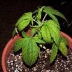

](https://www.growweedeasy.com/wp-content/uploads/2011/02/over-watering.jpg) [ 

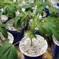

](https://www.growweedeasy.com/wp-content/uploads/2011/02/cannabis-drooping-overwatered.JPG) [ 

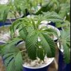

](https://www.growweedeasy.com/wp-content/uploads/2010/04/marijuana-drooping-overwatered.JPG)[

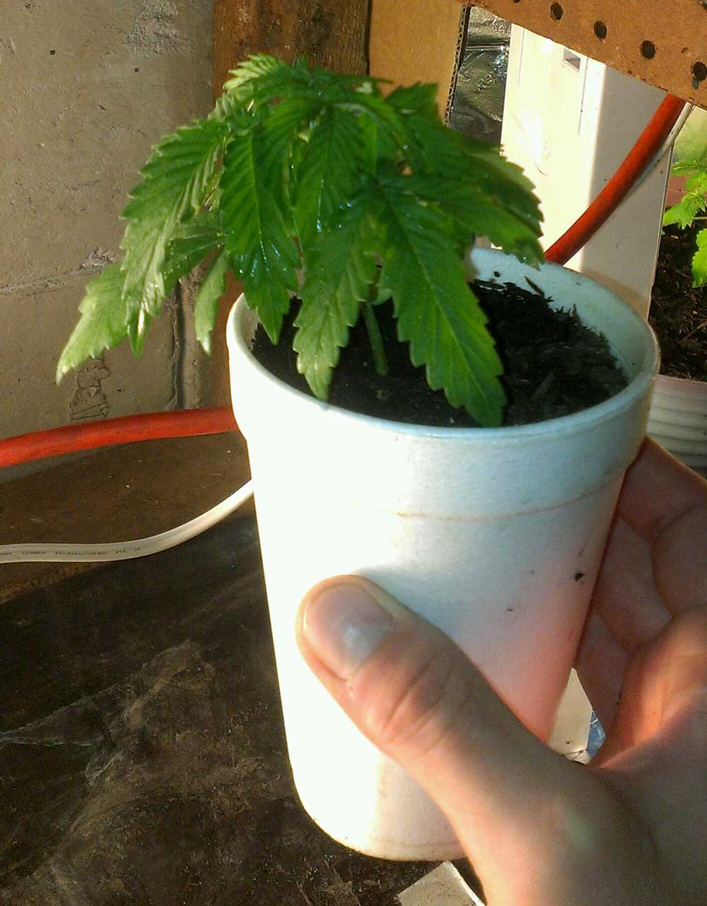

](https://www.growweedeasy.com/wp-content/uploads/2011/02/over-watered-marijuana-plant.jpg)

## **Overwatered Marijuana Plants**

* Drooping / Curling is the first sign of overwaterd marijuana plants
* Plants start drooping soon after watering
* Leaves are firm and curled down all the way from the stem to the leaf
* Will eventually lead to leaf yellowing and other signs of nutrient problems if not corrected

[

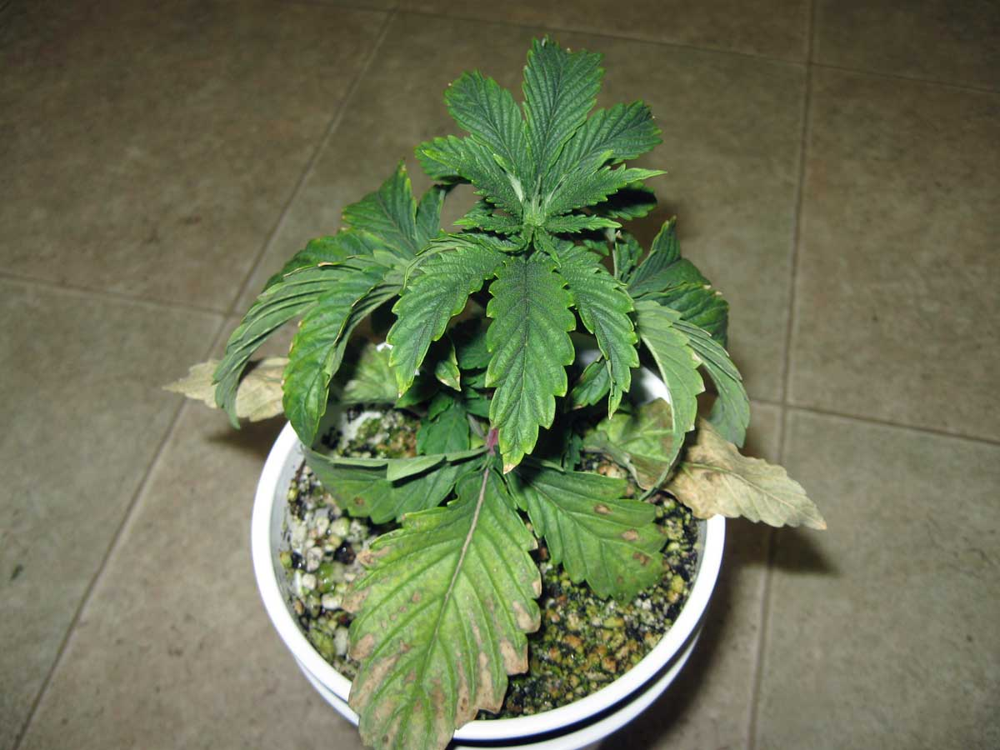

](https://www.growweedeasy.com/wp-content/uploads/2011/02/overwatered-marijuana-too-long.jpg) [

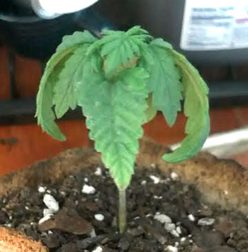

](https://www.growweedeasy.com/wp-content/uploads/2010/10/overwatered-marijuana-seedling.jpg)

[

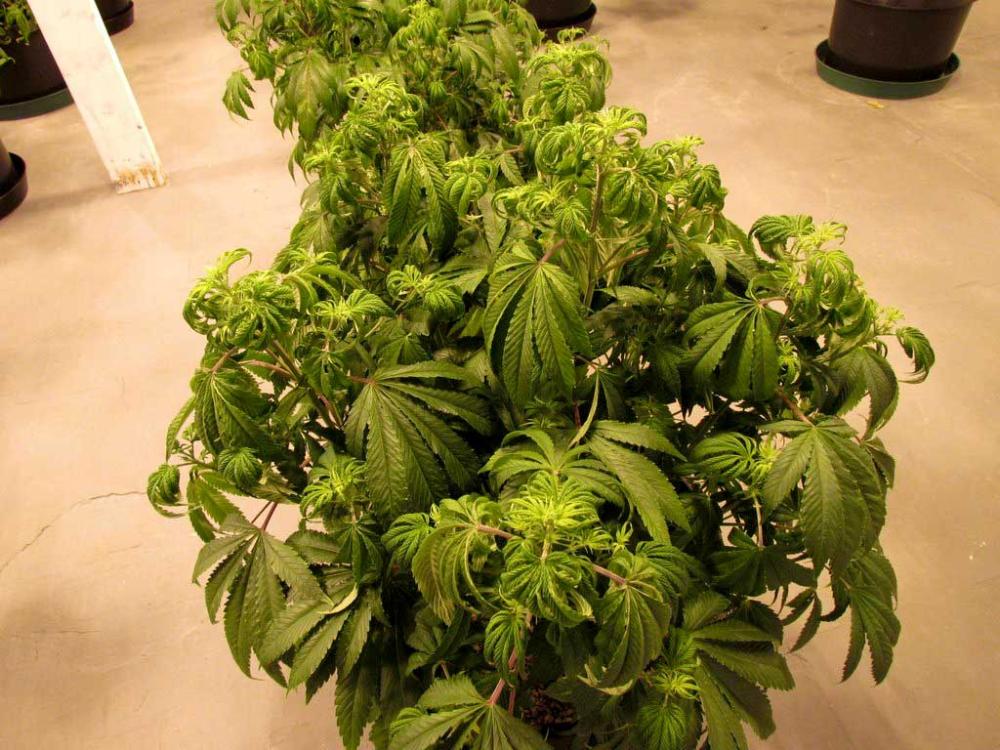

](https://www.growweedeasy.com/wp-content/uploads/2010/10/severely-overwatered-marijuana.jpg)

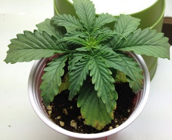

[

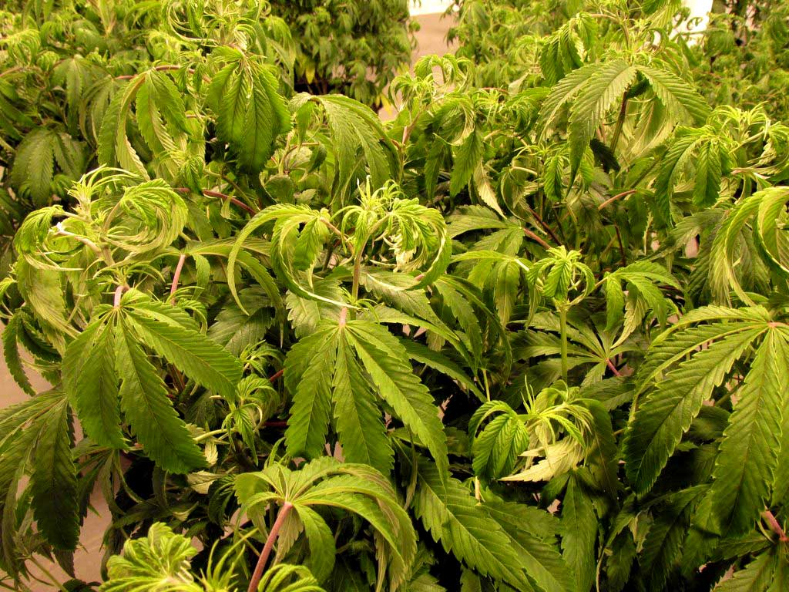

](https://www.growweedeasy.com/wp-content/uploads/2010/10/over-watered-cannabis.jpg)

The drooping cannabis plant **below **did not have drainage holes (water could not drain out the bottom of the pot). After watering the plant which appeared healthy the night before, the grower came back to this drooping plant the next day - this case of overwatering was caused by too much water being held near the roots due to lack of drainage:

[

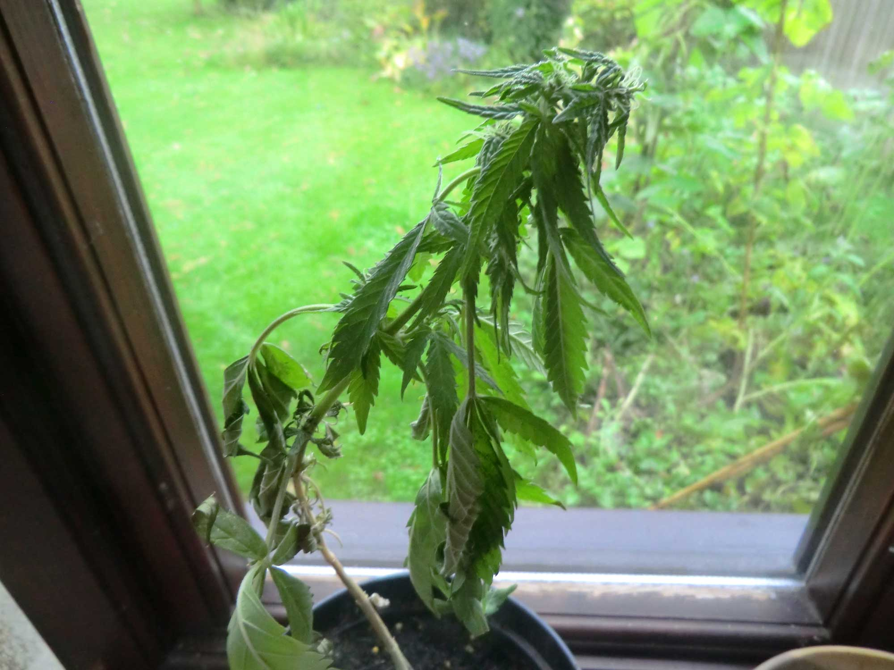

](https://www.growweedeasy.com/wp-content/uploads/2010/10/over-watered-no-drainage.jpg)

**Solution:** The best thing you can do for overwatered plants is give them time between waterings, and then start off watering slowly until things seem back to normal. Make sure that water is able to drain easily out the bottom of potted cannabis plants. Be extra careful with small plants in big containers.

**How to Water Cannabis Properly**

* 

Wait until the top of the growing medium is dry about an inch deep (up to your first knuckle).

* 

Add water until you see some at least 20% extra runoff water drain out the bottom of your pot. Go back to step 1.

* 

If top of growing medium stays wet for a long time, you may need to give your plants less water at a time, or improve your drainage.

* 

The goal is to be watering your plants every 2-3 days. If it needs longer to dry out, you should be giving less water at a time. If it's drying out too quickly it should get more water at a time (or may need to [move to a bigger pot](https://www.growweedeasy.com/transplant)).

**[Learn how to water your marijuana plants perfectly every time](https://www.growweedeasy.com/how-often-water-marijuana)**

Some growers also use the "lift the pot" method to decide when to water your plants (basically wait until your pot feels "light" since the plants have used up all the water). It's up to you to decide what's easier for you.

If your plant medium seems to stay wet for a long time (more than 4-5 days or so), you may need better drainage. This also can happen when growers put tiny plants in a pot that's way too big.

**[How to Water Cannabis Seedlings in a Too-Big Container](https://www.growweedeasy.com/seedling-problems#big-pot-small-seedling)**

This cannabis plant has green healthy leaves, but as a result of overwatering it's stunted and small even though its more than a month old.

[

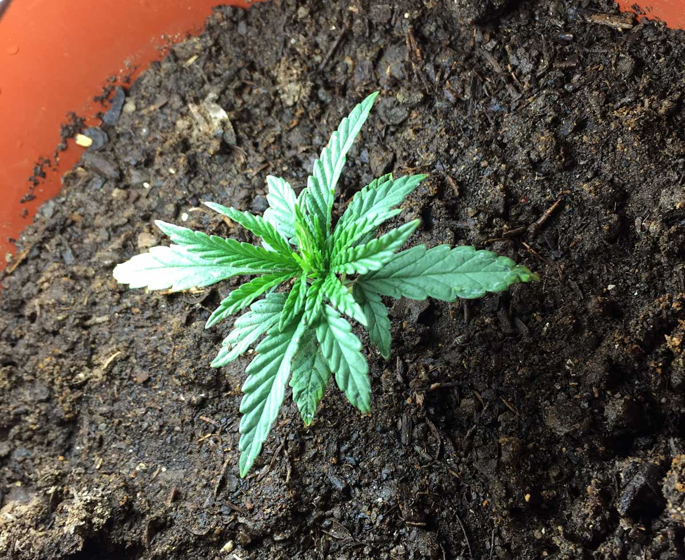

](https://www.growweedeasy.com/wp-content/uploads/2016/11/stunted-overpotted-overwatered-small-cannabis-plant.jpg)

Make sure that water drains freely from the bottom of your container (it's recommended that you provide enough water to get at least 20% extra runoff every time you water your plants as long as your plants are drinking well).

You should see water coming out the bottom within a minute or two after watering. Then don't water your plants again until the soil is dry up to your first knuckle.

If your plants are already overwatered, you can try to increase the temperature and airflow to help the water evaporate more quickly. You can also use a pencil to gently poke some air holes into the growing medium to provide extra aeration and oxygen to the roots.

Whenever a seedling has droopy leaves, it means that the roots are either not getting enough water (underwatered) or not getting enough oxygen (overwatered). This seedling has been chronically watered too often, preventing the roots from getting enough oxygen. As a result, the seedling has stayed small and mostly stopped growing.

[

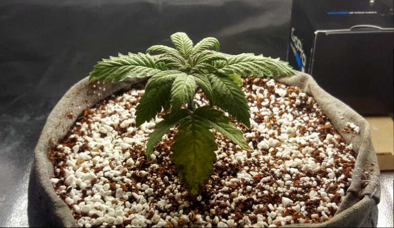

](https://www.growweedeasy.com/wp-content/uploads/2010/10/27-day-old-seedling-stunted-from-overwatering.jpg)

For your individual growing medium and environment, your watering method will vary, but if your plants are drooping and you've been feeding them a lot of water, it's a good idea to cut back and see if that helps.

Sometimes plants will be droopy no matter what you do, and the true cause is the plant is [rootbound](https://www.growweedeasy.com/transplant#when-to-transplant-marijuana) and needs a bigger container!

[

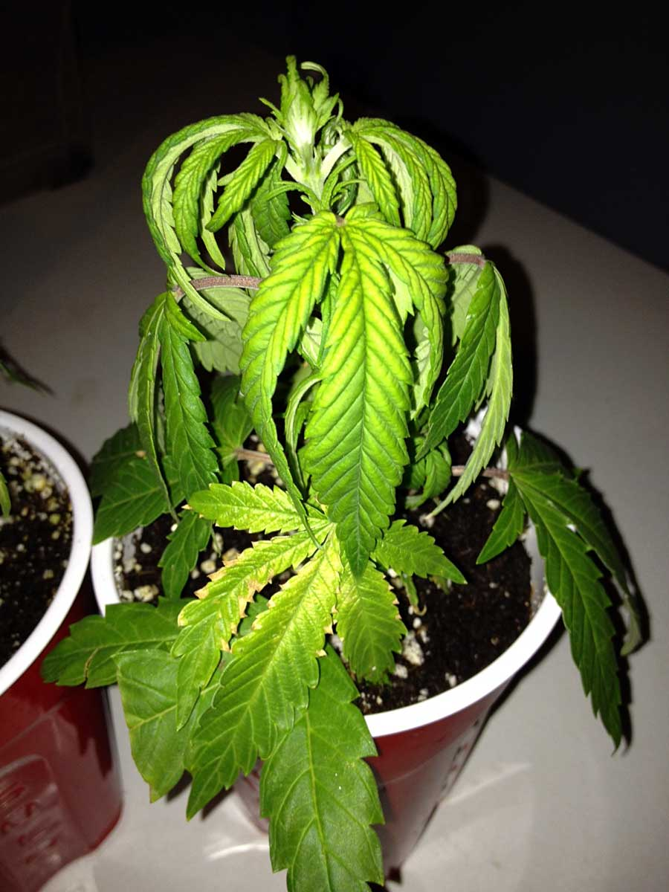

](https://www.growweedeasy.com/wp-content/uploads/2010/10/what-happens-late-to-transplant-cannabis-from-solo-cup.jpg)

If you're growing **hydroponically **with your marijuana roots directly in water and you see the signs of overwatering, that means you have a problem at your roots. Either your plants have [root rot ](https://www.growweedeasy.com/root-rot-cannabis)which is preventing them from getting oxygen at their roots, or you are not dissolving enough oxygen into the water (you can easily increase the dissolved oxygen in your water with a [quality air pump](https://www.amazon.com/dp/B002JPEVMC/ref=as_li_ss_til?tag=growwcom07-20&camp=0&creative=0&linkCode=as4&creativeASIN=B002JPEVMC&adid=17R3P0XW5VT0H1F34F6K&) and a few [air stones](https://www.amazon.com/dp/B00564IT5S/ref=as_li_ss_til?tag=growwcom07-20&camp=0&creative=0&linkCode=as4&creativeASIN=B00564IT5S&adid=1G75PGB1VP0BNVDJY1W2&)).

[How to Get Rid of Root Rot in Hydro](https://www.growweedeasy.com/root-rot)

**Need more help?**

If your plant is experiencing "the claw" and not just normal drooping (the ends of leaves are curling like a claw or pointing down like talons), then you may actually have a [nitrogen toxicity](https://www.growweedeasy.com/nitrogen-toxicity-cannabis) (too much nitrogen).

These Plants Are NOT Overwaterd, These Leaves Show Signs of "The Claw" which usually indicates a [Nitrogen Toxicity](https://www.growweedeasy.com/nitrogen-toxicity-cannabis)
 ("The Claw", tips bent down, curling / clawing, dark green leaves)

 

*Jump to&#8230;*

[Cannabis plant problems by picture](https://www.growweedeasy.com/cannabis-symptoms-pictures)

[7 Steps to Cure 99% of Cannabis Growing Problems](https://www.growweedeasy.com/growing-marijuana-plant-problem-deficiency)

[Am I under-watering my cannabis?](https://www.growweedeasy.com/underwatering-cannabis)

[Prevent nutrient problems by managing pH](https://www.growweedeasy.com/how-do-i-check-the-pH-of-my-water)

## pH Fluctuations

by Nebula Haze

**Quick Summary:** Managing pH is crucial for cannabis plants to be able to take up nutrients through their roots. When the pH around the roots jumps up and down, it can stress the plant and cause brown spots to appear on the leaves. Spotting on the leaves as a results of pH fluctuations is more common in hydroponic setups (where the pH tends to go up and down), but it is possible it can also happen in soil. This seems to often happen when the pH swings too high or low.

*Note:* You can also get these symptoms from [root problems](https://www.growweedeasy.com/cannabis-root-problems) or [root rot](https://www.growweedeasy.com/root-rot)!

**Problem:** Certain leaves on the middle or lower parts of the plant show tan or brown spotting, similar to these pictures:

[

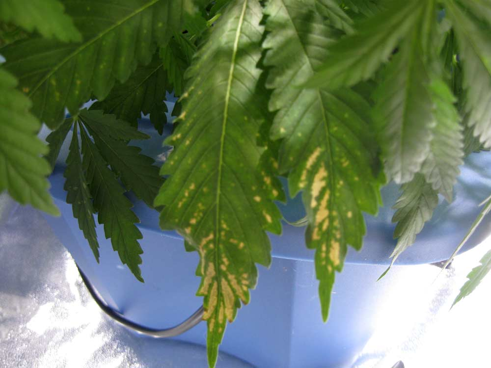

](https://www.growweedeasy.com/wp-content/uploads/2013/11/ph-fluctuations-marijuana.jpg)

[

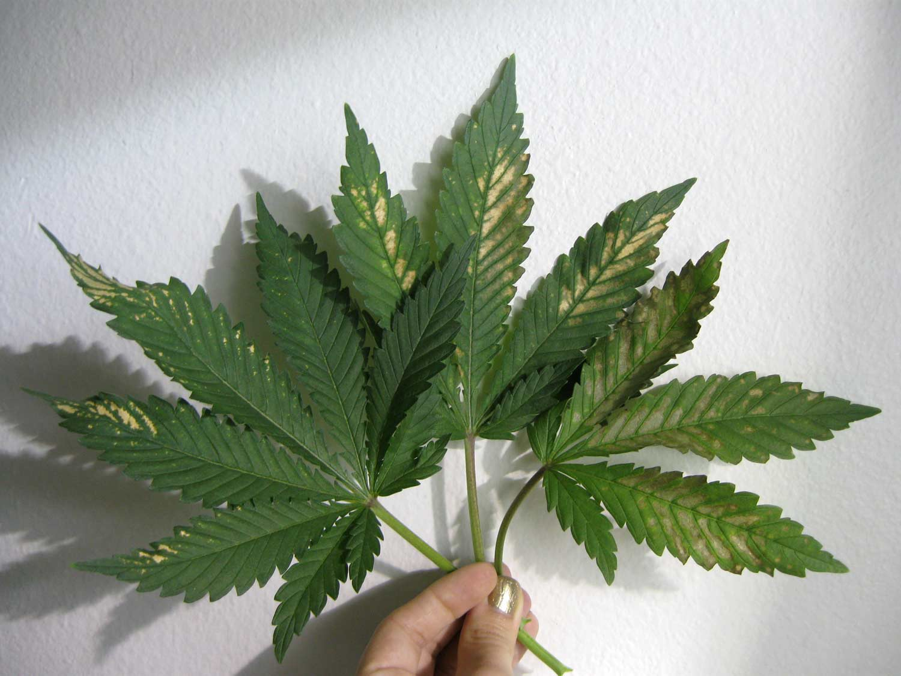

](https://www.growweedeasy.com/wp-content/uploads/2013/11/incorrect-ph-cannabis.jpg)

[

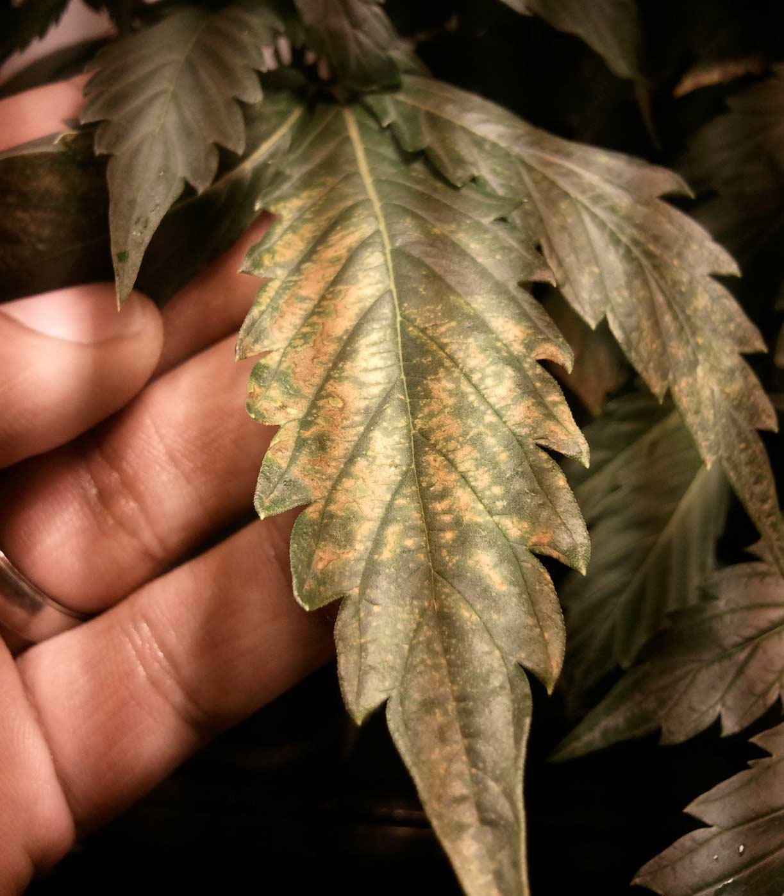

](https://www.growweedeasy.com/wp-content/uploads/2013/11/ph-fluctuations-cannabis.jpg)

**Solution:** The main way to fix this problem is to fix the pH problem that caused the spotting (more info below). The leaves that are effected will not recover, but once you fix the issue, the problem should stop spreading to other leaves.

[Learn how to manage your pH](https://www.growweedeasy.com/how-do-i-check-the-pH-of-my-water)

***Note:* You can also get similar symptoms from [root problems](https://www.growweedeasy.com/cannabis-root-problems)!**

## Phosphorus Deficiency

**Problem:** A cannabis phosphorus deficiency generally appears on leaves from the lower/older parts of the plant. The lower leaves may turn dark green *or* yellow, and start getting spots or big splotches that look brown, bronze or even a little blue. The leaves may thicken and curl, and the affected leaves feel stiff. Sometimes the stems of the plant turn bright red or purple, but not always.

Sometimes accompanied by a [Calcium deficiency](https://www.growweedeasy.com/calcium-deficiency-cannabis), as Phosphorus and Calcium interact with each other in the plant.

[

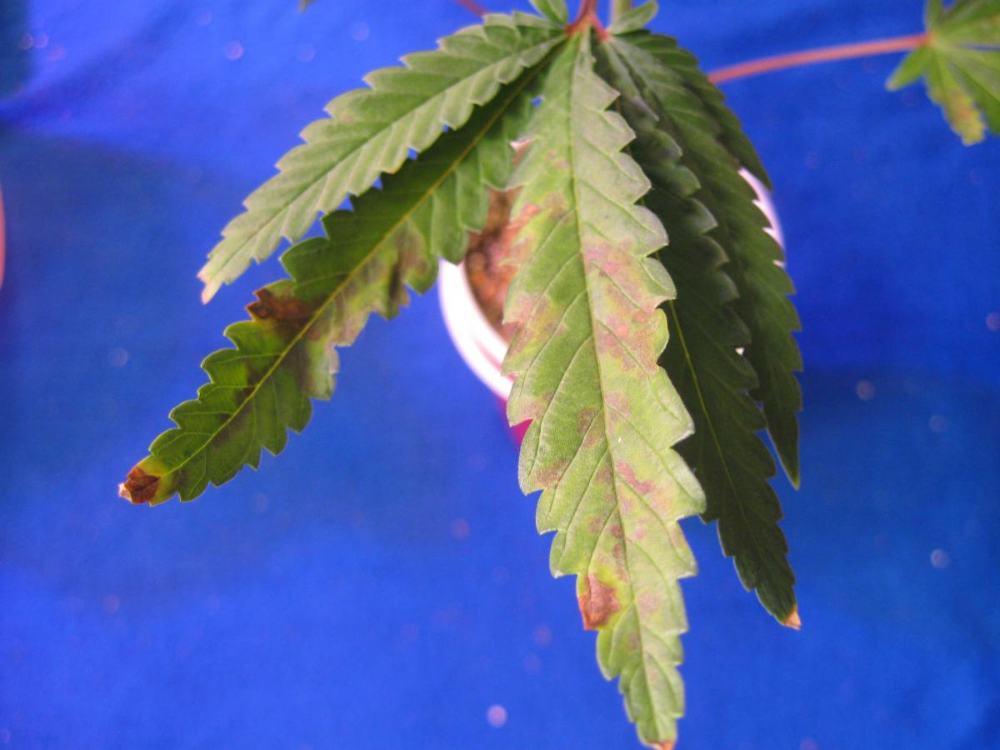

](https://www.growweedeasy.com/wp-content/uploads/2010/04/phosphorus-deficiency-bagseed-haze.jpg)

A cannabis phosphorus deficiency usually appears with some or all of the following symptoms:

* tends to affect the lower and older leaves of the plant
* sometimes a phosphorus deficiency is accompanied by bright red stems (though not always), though if you have red stems but no other symptoms, it's typically not something to worry about
* leaves darken (turning a dark green, blue or grayish color) and may appear shiny
* leaves may start turning yellow in places if the phosphorus deficiency is left untreated, or if the deficiency is combined with other nutrients deficiencies and/or pH problems. However, yellow leaves is typically not associated with the beginning of a phosphorus deficiency.
* leaves get bronze, purple or brown spots and splotches
* leaves thicken and may feel dry or stiff
* stems sometimes turn bright red or purple, but not always
* sometimes accompanied by a [Calcium deficiency](https://www.growweedeasy.com/calcium-deficiency-cannabis), as Phosphorus and Calcium interact with each other inside the plant
* this deficiency is more common after buds start forming, when the plant is using a lot of Phosphorus

Phosphorus deficiencies in the vegetative stage usually appear at the bottom of the plant on some of the oldest leaves, and will progressively climb up the plant if left unchecked.

The progression of a cannabis phosphorus deficiency

[

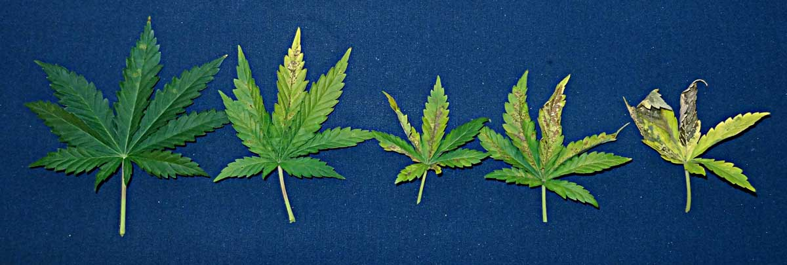

](https://www.growweedeasy.com/wp-content/uploads/2010/10/stages-of-phosphorus-deficiency.jpg)

A phosphorus deficiency tends to be more common after plants start making buds in the flowering stage. Cannabis plants tend to love phosphorus in the flowering/budding stage and it is unlikely for a cannabis plant to get too much phosphorus using [standard nutrients](https://www.growweedeasy.com/nutrients) formulated for a flowering plant like cannabis. Nearly all flowering nutrients will come with an abundance of phosphorus for your plants. So if you're seeing a cannabis phosphorus deficiency while using standard cannabis nutrients, chances are you actually have a root pH problem (explained below in the solution section)!

[

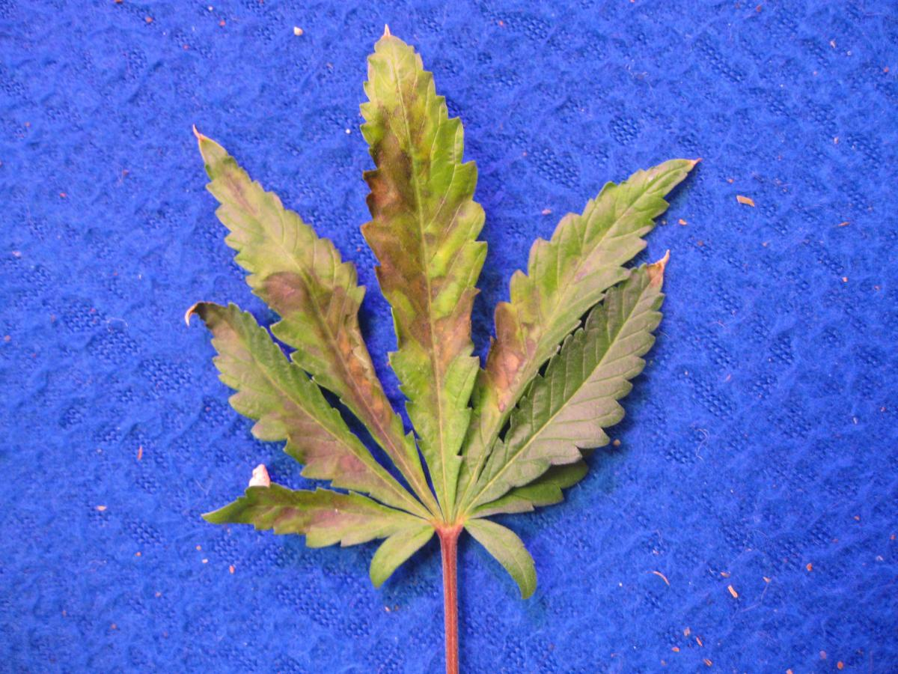

](https://www.growweedeasy.com/wp-content/uploads/2010/04/phosphorus-deficiency-bagseed-haze2.jpg)

Phosphorus (P) is used by your cannabis plant in all phases of growth. It is one of the 3 major nutrients (N-**P**-K) listed on the front of most nutrient bottles, and phosphorus will be represented by the second number that appears.

When there is a phosphorus deficiency, the lower (oldest) leaves turn dark green. Leaves occasionally get a bluish or bronze tinge, and may thicken or curl downward before exhibiting dark gray, bronze or purplish splotches. Sometimes the stems of the affected leaves will turn bright red or purplish, usually starting from underneath.

It's common to see a Phosphorus deficiency accompanied by the symptoms of a Calcium deficiency, as those nutrients interact with each other in the plant.

[

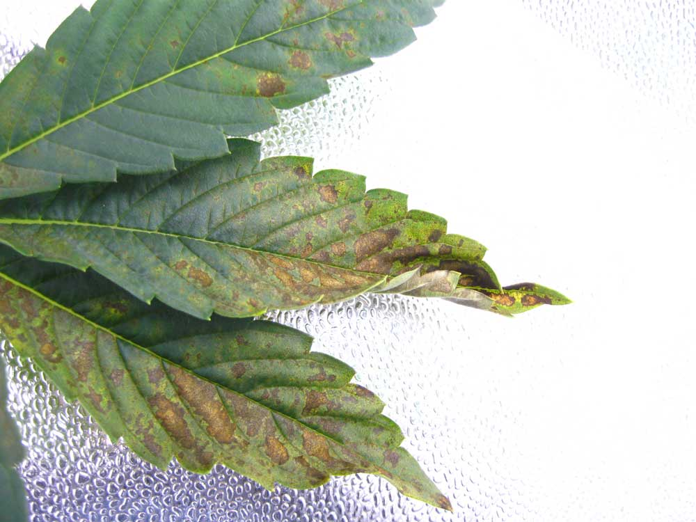

](https://www.growweedeasy.com/wp-content/uploads/2010/10/phosphorus-deficiency-leaf-curling.jpg)

Sometimes you will get a cannabis phosphorus deficiency, and the stems do not appear red or purple at all, or the coloring may not be pronounced.

[

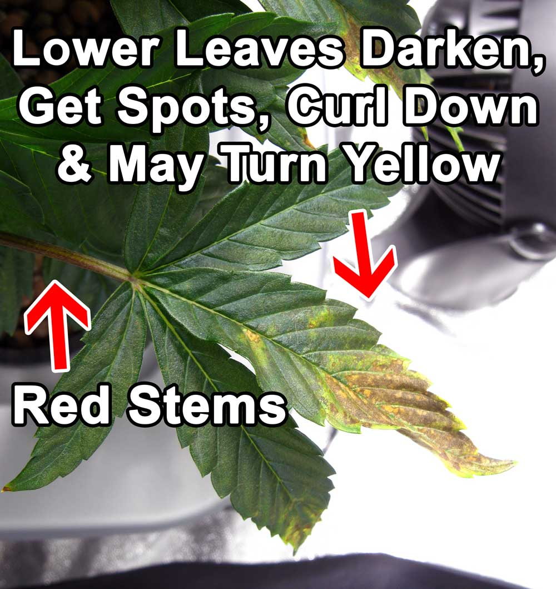

](https://www.growweedeasy.com/wp-content/uploads/2010/10/phosphorus-deficiency-vegetative.jpg)

The leaf below was at the bottom of the plant and turned dark green and shiny, with a bluish tinge. Cannabis phosphorus deficiencies usually appear on the lower/older parts of the plant. The leaf then started showing the spots of a phosphorus deficiency where it was being touched by light (the parts of the leaf working hardest). The leaf began to curl downwards and turn yellow.

Notice that the stems or veins never turned red or purple on this leaf, except for some parts that were actually affected by the phosphorus deficiency.

[

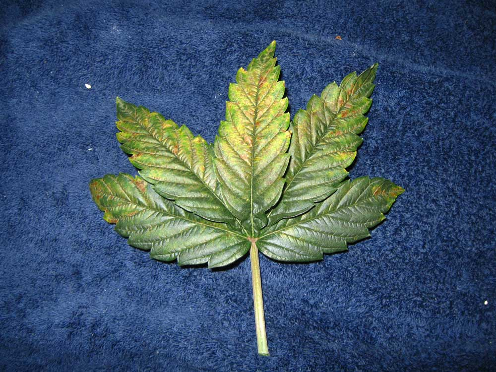

](https://www.growweedeasy.com/wp-content/uploads/2010/10/phosphorus-deficiency-leaf-spots-curling.jpg)

A common symptom of a cannabis phosphorus deficiency is bright red or purple stems, though it doesn't appear on all affected plants. Red stems can also be caused by direct light exposure (like a "tan")

[

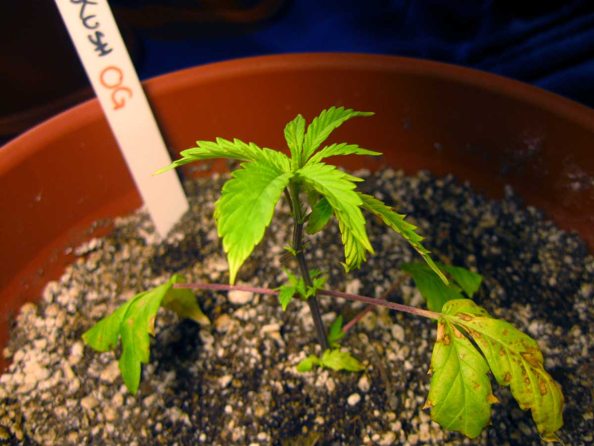

](https://www.growweedeasy.com/wp-content/uploads/2017/10/examples-clones-red-stem.jpg)

Another example of bright red stems that may be the result of a Phosphorus deficiency, or possibly direct light exposure.

[

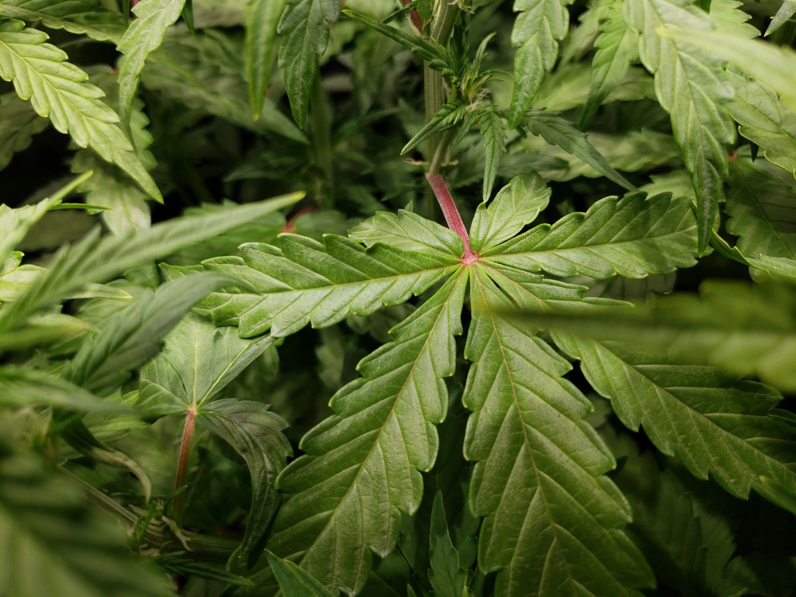

](https://www.growweedeasy.com/wp-content/uploads/2017/10/red-stems-may-be-first-sign-of-marijuana-phosphorus-deficiency.jpg)

It's important to remember that some cannabis strains **naturally grow with red or purple stems** even when all their nutrient needs are being fulfilled, so red or purple stems is not a symptom to worry about *on its own*.

Do not mistake **natural **reddish-purple colored stems for a phosphorous deficiency!

When you notice that stems are turning red or purple starting from underneath, it may be a sign of a phosphorus deficiency *only *if accompanied by other symptoms. If the only symptom shown by your plant is red or purple stems, and you are not seeing any other signs of splotches or unhealthy leaves, the red or purple stems are likely caused by the genetics of your plant. If that's the case, you have nothing to worry about.

[

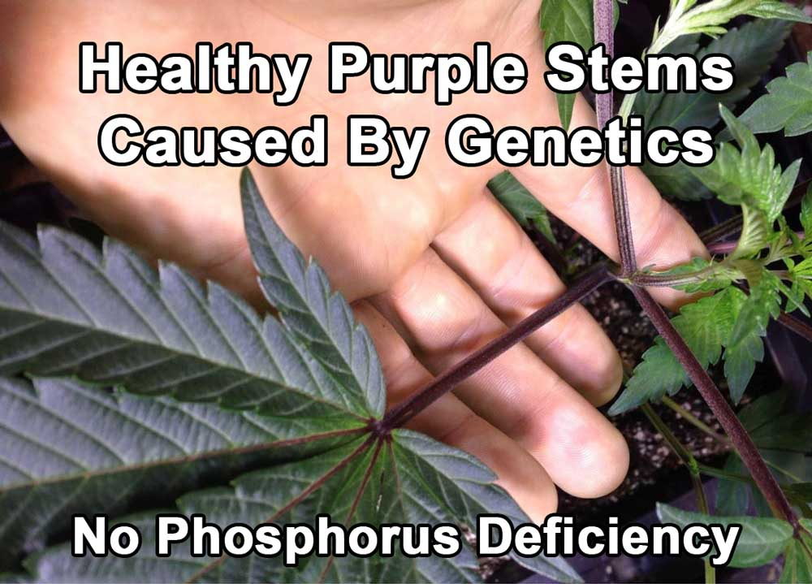

](https://www.growweedeasy.com/wp-content/uploads/2010/10/purple-stems-healthy-from-genetics.jpg)

Phosphorus is used heavily by cannabis plants in the flowering phase to produce buds, and is a crucial component of photosynthesis (turning light into energy for the plant).

Some strains of cannabis use much more phosphorus than others, or be more susceptible to a phosphorus deficiency, and you may have **many plants in the exact same setup with only some of the plants showing signs of a phosphorus deficiency**.

## **Solution For Cannabis Phosphorus Deficiency**

### 1.) Adjust pH to Correct Range

Your cannabis plant may show signs of a phosphorus deficiency if the pH at the roots is not in the right range. That is because when the pH of your root zone is off, your cannabis cannot properly absorb phosphorus through its roots. Therefore the first step is to ensure that you have the correct pH for your growth medium. [Learn more about pH and cannabis](https://www.growweedeasy.com/how-do-i-check-the-pH-of-my-water).

Phosphorus is best absorbed by cannabis in soil at a root pH of 6.2 - 7.0. Phosphorus is best absorbed by cannabis in hydro at a root pH of 5.5 - 6.2. If you believe you have a cannabis phosphorus deficiency, it's important to check the pH of your root zone to make sure the deficiency isn't caused by the pH being too high or too low.

**If you suspect your growing cannabis plant has a phosphorus deficiency,** flush your system with clean, pH'd water that contains a regular dose of [cannabis-friendly nutrients](https://www.growweedeasy.com/best-marijuana-nutrients-review) that includes phosphorus. This will remove any nutrient salts that may be affected the uptake of phosphorus and help restore pH to the proper levels.

* In **soil**, phosphorus is best absorbed by the roots in the **6.2 - 7.0 pH** range (in soil, it's generally recommended to keep the pH between 6.0 - 7.0, but phosphorus specifically tends to be best absorbed above 6.2 and below 7.0)
* In **hydro**, phosphorus is best absorbed by the roots in the **5.5 - 6.2 pH** range (in hydro, it's generally recommended to keep the pH between 5.5 - 6.5, but phosphorus specifically tends to be best absorbed below 6.2)

### 2.) Take Good Care of the Roots

Wet, compact soil or [overwatering](https://www.growweedeasy.com/overwatering-cannabis) can trigger a phosphorus deficiency to appear even when all other factors are perfect. So make sure you [water your plants properly](https://www.growweedeasy.com/how-often-water-marijuana) every time to help prevent a phosphorus deficiency.

### 3.) Provide the Right Temperature

Cooler temperatures lower than 60°F (15°C), as well as large temperature swings, can make it harder for the plant to absorb phosphorus. Cannabis plants are therefore more likely to show signs of a phosphorus deficiency when the temperature drops too low, or if they go through a cold spell.

Cannabis likes a comfortable room temperature (they like about the same temperatures as we do).

[Read the cannabis temperature tutorial](https://www.growweedeasy.com/temperature)

### 4.) Give the Right Nutrients

Most growers have actually already given plenty of phophorus to their cannabis plants since it is found abundantly in [quality soil](https://www.growweedeasy.com/organic-super-soil) and [cannabis-friendly nutrients](https://www.growweedeasy.com/nutrients). However, even if you are giving phosphorus, it's important to give your cannabis the right ratio of nutrients.

An excess of Fe and Zn may cause the symptoms of a phosphorus deficiency by preventing the plant from being able to absorb phosphorus properly. If you believe there may be a buildup of nutrient salts in your growing medium (or if you are growing in hydro and have not recently flushed or changed your reservoir) you should make sure it's not an excess of other nutrients that is actually causing the phosphorus deficiency to appear. Flush your plant thoroughly with properly pH'ed water containing a regular dose of cannabis nutrients including phosphorus, or completely change your reservoir if you believe that an excess of nutrient salts may be causing the phosphorus deficiency.

Sources of phosphorus:

* Bat guano (phosphorus is readily available, especially if made into a teat)

* 
Bone or blood meal (takes quite a bit of time to break down in soil unless made into a tea first)

* 
Worm castings or worm tea

* 
Soft Rock Phosphate

* 
Fish meal

* 
Crabshell

* 
Most cannabis-friendly "bloom" or "flowering" [nutrients](https://www.growweedeasy.com/best-marijuana-nutrients-review) contain high levels of phosphorus to aid in flower production, and phosphorus from a liquid nutrient is one of the most readily available forms of phosphorus you can provide to your cannabis plants

If you've tried everything else, then you may try adding a higher percentage of phosphorus to your feeding schedule and see if that helps clear up the problem for your plant. Cannabis plants love phosphorus, and therefore it is unlikely that you will give your cannabis too much phosphorus.

Most nutrient systems that are formulated for a plant like cannabis will carry and abundance of phosphorus, especially in **budding/flowering formulas**, so it is unlikely that you will see signs of a phosphorus deficiency before other nutrient problems when using nutrient systems formulated for cannabis (as long as you keep your root pH in the correct range and prevent the plants from getting cold or being overwatered). If you've got very high powered lights, or if your plants are growing in direct sunlight, they may be going through a lot more phosphorus in the flowering stage than average and may need you to provide extra phosphorus to make sure buds get as big as they could be.

Just remember that if there's no actual phosphorus deficiency currently appearing on your cannabis plant, adding more phosphorus is probbaly not going to help plants grow better or make bigger buds - in fact **adding too much phosphorus may actually hurt your plants** by preventing the uptake of other nutrients! While it's difficult to overdose your plants on phosphorus, adding too much compared to other nutrients will often cause other strange & unexpected deficiencies to appear.

### 5.) Take Good Care of the Roots

Phosphorus deficiencies can show up with the plant is having [root problems](https://www.growweedeasy.com/cannabis-root-problems) or if the plant is [overwatered](https://www.growweedeasy.com/overwatering), even if the pH is right and the phosphorus is there. [Proper watering practices](https://www.growweedeasy.com/how-often-water-marijuana) help plants grow healthy and avoid a host of problems!

### 6.) Watch for Recovery

After going through all the above steps, watch to make sure that the phosphorus deficiency starts to clear up within a few days to a week or so. After a phosphorus deficiency is cleared up, the problem (brown spots, unhealthy lower leaves, red/purple stems, etc) will stop appearing on new leaves, usually within a week.

Please note that leaves which have been damaged by a phosphorus deficiency will probably never recover or turn green, so you want to pay attention to other leaves for signs of recovery.

If you cannot get rid of your phosphorus deficiency, please consult our [7-Step Cure to 99% of Cannabis Growing Problems](https://www.growweedeasy.com/growing-marijuana-plant-problem-deficiency)

## Potassium Deficiency

by Nebula Haze

## What Does a Cannabis Potassium Deficiency Look Like?

**Leaf Problem / Symptoms**: With a marijuana potassium deficiency, you'll generally see symptoms on older leaves, but not always. Sometimes you'll see the symptoms at the top of the plant. Leaves with a potassium deficiency get yellow, brown, or burnt edges and tips. The burnt edges may look a little like nutrient burn, except the affected leaves also start turning yellow in the margins.

Example of a marijuana potassium deficiency with common leaf symptoms

[

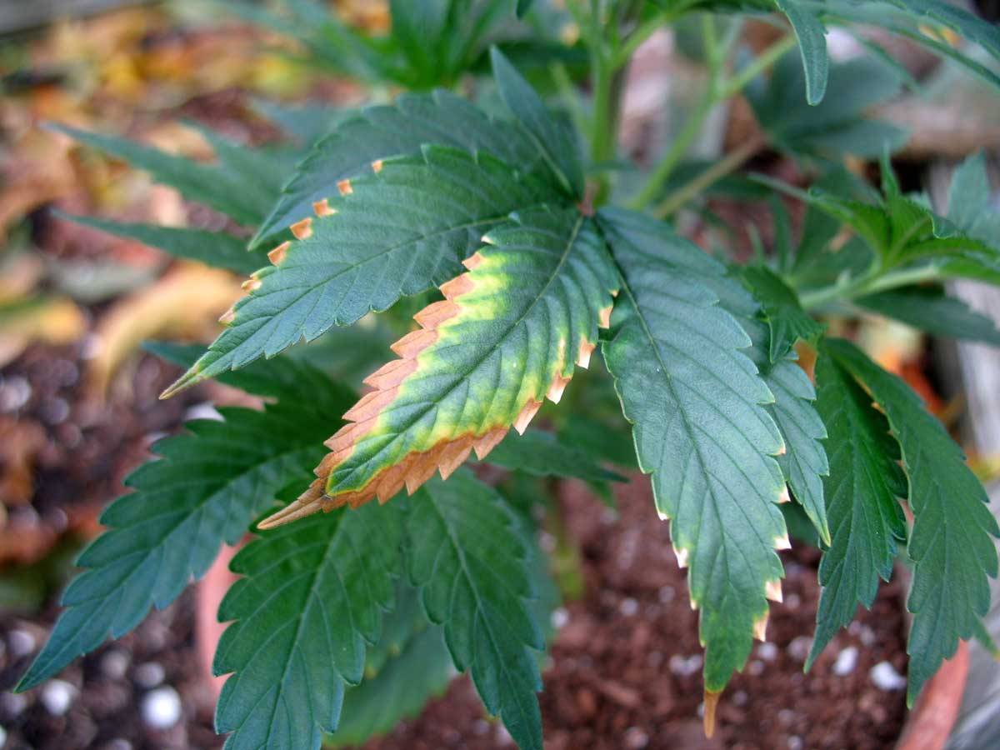

](https://www.growweedeasy.com/wp-content/uploads/2010/10/potassium-deficiency-weed-yellow-brown-edges.jpg)

You may see the brown burnt edges first, or you may see the yellowing first. When the leaf symptoms are both present, it's a good sign you have a potassium deficiency in your leaves.

Plants may stretch and stems may become weak, but leaf symptoms are more noticeable. The leaf symptoms appear somewhat similar to an iron deficiency in that they can turn bright yellow, but the tips of the leaves curl as the edges turn brown, burn and die.

[

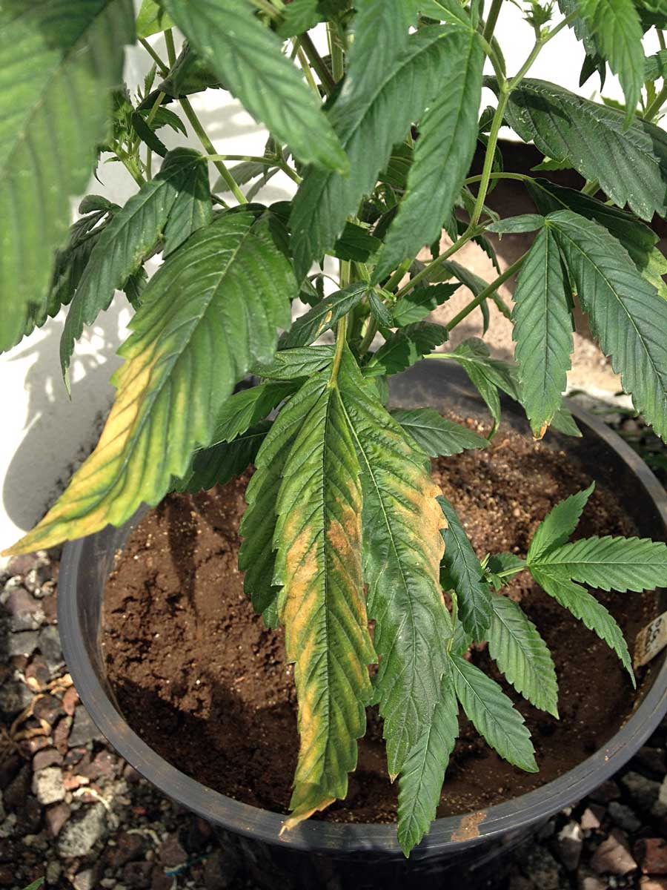

](https://www.growweedeasy.com/wp-content/uploads/2010/10/cannabis-potassium-deficiency-lower-leaves-yellow.jpg)

Cannabis potassium deficiencies can cause your cannabis leaves to turn white, yellow, brown or burnt looking, but the inside veins almost always stay green. Sometimes a Potassium deficiency is made worse by overwatering, as was the case with this plant.

[

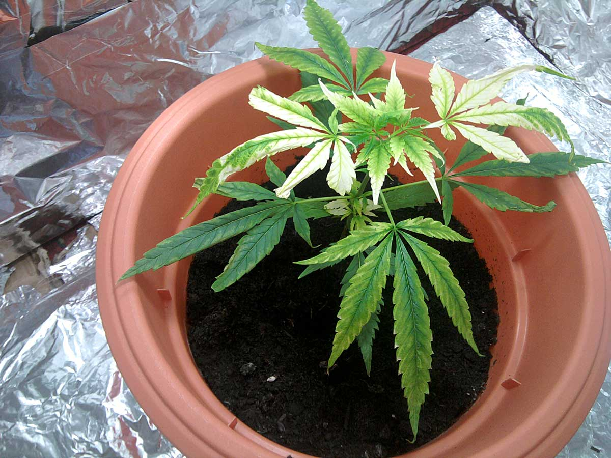

](https://www.growweedeasy.com/wp-content/uploads/2010/06/cannabis-potassium-deficiency-overwatered.jpg)

Sometimes you'll get something that looks a lot like tip burn with a potassium deficiency, but it goes in further than nutrient burn, and with a potassium deficiency you also see yellowing between the leaf margins

[

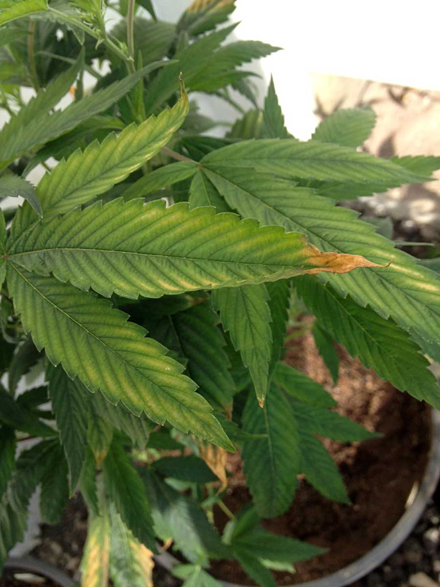

](https://www.growweedeasy.com/wp-content/uploads/2010/10/potassium-deficiency-marijuana-brown-tips.jpg)

Sometimes the burn can appear pale, bleached or yellow, instead of brown. If you look in the background of this pic, you can see some of the leaves have turned brown in addition to the bright yellow leaf in the front. These are all signs of a marijuana potassium deficiency.

[

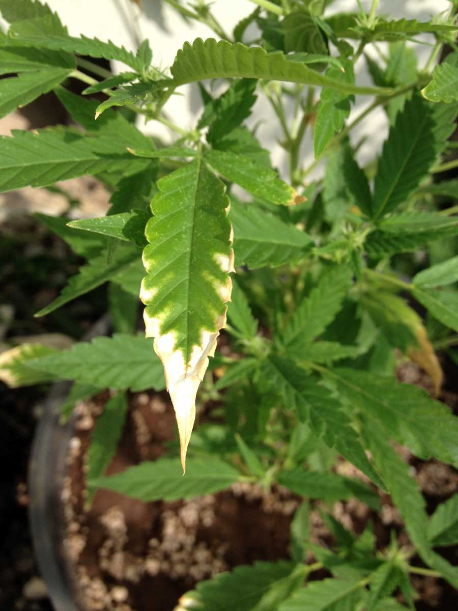

](https://www.growweedeasy.com/wp-content/uploads/2010/10/marijuana-potassium-deficiency-yellow-edges-tips.jpg)

[

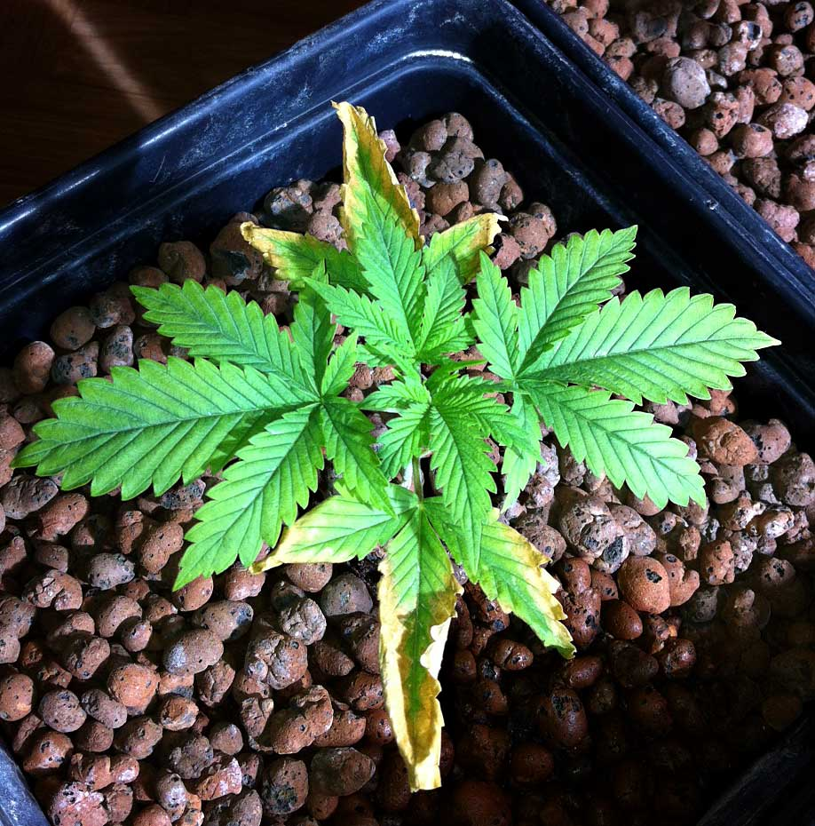

](https://www.growweedeasy.com/wp-content/uploads/2010/06/potassium-deficiency-young-cannabis.jpg)

Potassium deficiencies are commonly mistaken for other nutrient problems!

Sometimes the first symptoms of a cannabis potassium deficiency look a lot like nutrient burn. One difference is the edges of the leaves will also start turning brown, where nutrient burn usually only affects the tips. And unlike with nutrient burn the leaves of a potassium deficiency turn yellow in the margins, especially near the burn edges.

This is not [nutrient burn](https://www.growweedeasy.com/nutrient-burn-cannabis), it's actually the first stage of potassium deficiency!

[

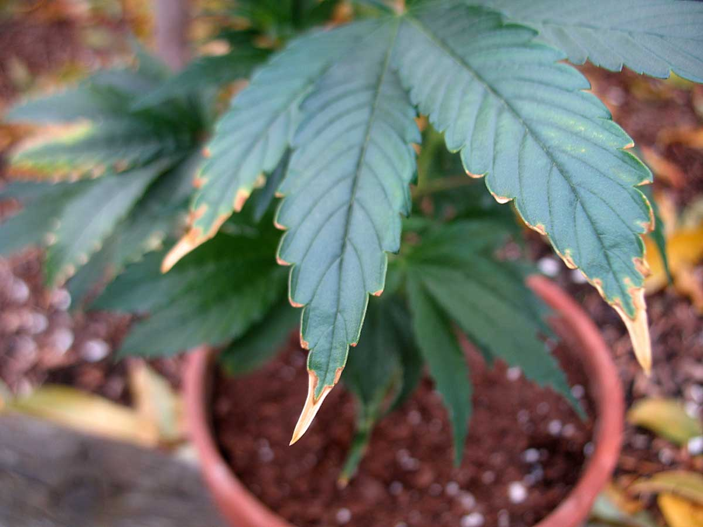

](https://www.growweedeasy.com/wp-content/uploads/2010/10/potassium-deficiency-first-signs-brown-edges.jpg)

### **Could it actually be light burn?**

Keeping your grow lights too close, for example with powerful LEDs and HPS grow lights can give your plants "sunburn" even if the temperature is cool! This can sometimes look like exactly like a cannabis potassium deficiency when the true problem is your grow lights are too close to your leaves.

These leaves look like they have a potassium deficiency but the symptoms are actually caused by [light burn](https://www.growweedeasy.com/cannabis-light-burn) (grow lights being kept too close)

[Is it actually light burn?](https://www.growweedeasy.com/cannabis-light-burn)

## **Solution for Potassium Deficiency in Cannabis**

*Note: *Sometimes a cannabis potassium deficiency (like all deficiencies) can be triggered by stressful conditions (for example [overwatering](https://www.growweedeasy.com/overwatering), [heat](https://www.growweedeasy.com/heat-light-stress), [transplant](https://www.growweedeasy.com/transplant), etc) and may clear up on its own after the period of stress is over. If you only see one or two affected leaves near the bottom of the plant, and the problem isn't spreading, I wouldn't worry too much about it!

### 1.) Make Sure It's Not Light Burn

When a cannabis plant is kept too close to the grow lights, it can get light burn which looks almost exactly like a potassium deficiency. If you're using powerful lights like an LED or MH/HPS, consider moving the light away a few inches further away to see if that stops the problem from spreading. LEDs or MH/HPS should never be kept closer than 12&#8243; away, and most models should be kept further. [How far away do I keep my grow lights?](https://www.growweedeasy.com/how-far-grow-lights)

[Learn more about cannabis light burn](https://www.growweedeasy.com/cannabis-light-burn)

### 2.) Use Good Sources of Nutrients

Most cannabis growers don't need to add more nutrients if their leaves are experiencing a nutrient deficiency. In fact, most growers have actually already given plenty of potassium to their cannabis plants, whether they meant to or not. If you're using [quality soil](https://www.growweedeasy.com/organic-super-soil) or [cannabis-friendly nutrients](https://www.growweedeasy.com/nutrients), you probably don't need to worry about adding more patassium.

Potassium deficiencies are generally more likely to appear when a grower is using heavily filtered or reverse osmisis (RO) water to feed plants, but as long as you're giving your plants a good source of nutrients, you probably need to&#8230;

### 3.) Adjust pH to Correct Range

But the reason most growers see potassium deficiencies is because potassium is best absorbed at lower pH ranges. When the pH gets too high, your plant may exhibit signs of a potassium deficiency even if it's physically there near the roots.

[Learn how to manage your pH](https://www.growweedeasy.com/how-do-i-check-the-pH-of-my-water) when growing cannabis.

In **soil**, potassium is best absorbed by the roots in the **6.0 - 7.0 pH** range

In **hydro** or **coco coir**, potassium is best absorbed by the roots in the **5.5 - 6.5 pH** range

### 4.) Watch Leaves for Recovery

If you suspect your growing cannabis plant has a potassium deficiency, flush your system with clean, pH'd water that contains a regular dose of [cannabis-friendly nutrients](https://www.growweedeasy.com/best-marijuana-nutrients-review). Old damaged growth will likely not recover. Watch plant over next few days to make sure that the problem stops spreading to new growth.

If you cannot get rid of your potassium deficiency and want to look at more pictures of cannabis leaf symptoms&#8230;

[Diagnose my sick plant!](https://www.growweedeasy.com/cannabis-symptoms-pictures)

## Root Problems

by Nebula Haze

**Table of Contents**

[Root Problem Symptoms](https://www.growweedeasy.com/cannabis-root-problems#symptoms) (many different symptoms)

[Triggers for Root Problems](#triggers-for-root-problems)

[How to Treat Root Problems](#how-to-treat-root-problems)

**Cannabis Plants With Root Problems Show Many Symptoms**

* Cannabis may appear [overwatered](https://www.growweedeasy.com/overwatering-cannabis) or droopy
* Curling or cupping of leaves
* Wilting - either individual stems wilt or the whole plant may wilt
* Slow growth, or staying very small for weeks
* Leaf yellowing, or sometimes even other colors like purple or red
* Brown spots / Burnt spots
* Other strange nutrient problems
* Brown or slimy roots - this is often a sign of [root rot](https://www.growweedeasy.com/root-rot-cannabis)
* Smelly runoff water (smells rotting or musty)
* Leaves may start dying and falling off rapidly
* Plants drink much less water than usual

 

Example of extreme overwatering on an adult cannabis plant

This seedling was being grown in pure perlite, which is not a suitable growing medium for cannabis, and as a result the roots were not getting the proper levels of air and water. This seedling needs to be transplanted to [soil](https://www.growweedeasy.com/what-soil-is-good-for-growing-cannabis) or [coco](https://www.growweedeasy.com/coco-coir) (or even into [hydro](https://www.growweedeasy.com/high-yield-bubbleponics-technique)) in order to get better.

[

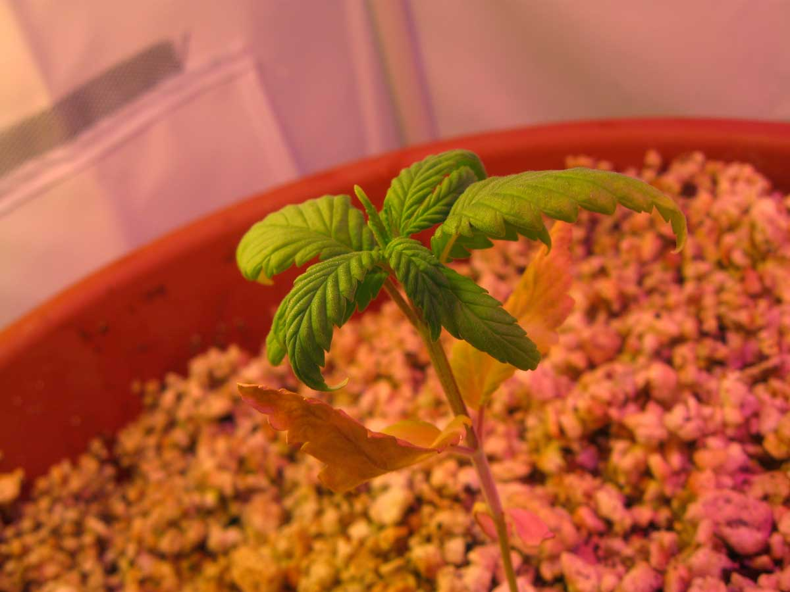

](https://www.growweedeasy.com/wp-content/uploads/2013/12/seedling-root-problems-need-new-growing-medium.jpg)

This clone was give the same amount of water from when it first sprouted. As the plant started getting bigger and drinking more, this wasn't enough and became chronically [underwatered](https://www.growweedeasy.com/underwatering) (a different type of root problem, with similar symptoms). What this particular plant needed was to be given more water at a time. One warning flag was that the plant was drying out every day (you should only have to water your plant every few days, if it's drying out in just one it likely needs more water at a time). It's always a good idea to listen to your plants when deciding when to water, as opposed to following a set schedule. Each plant and environment is different, and what works for some plants may not work as well for others!

[

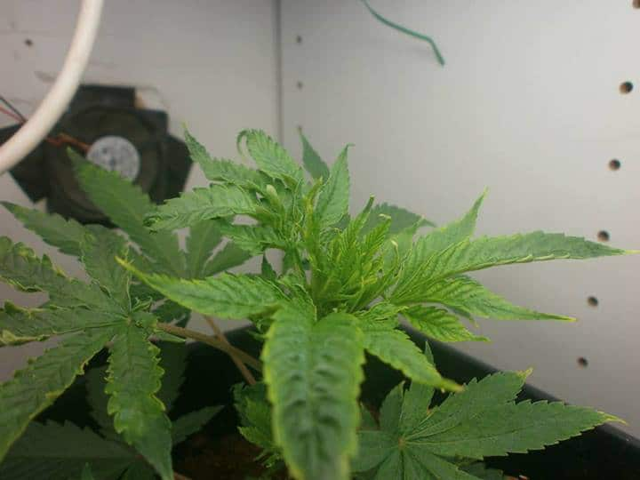

](https://www.growweedeasy.com/wp-content/uploads/2013/12/clones-root-problems-no-runoff-when-watering.jpg)

The cannabis plant **below **did not have any drainage holes (water could not drain out the bottom of the pot). Notice the strange twisting of some of the leaves. When roots are left in stagnant water for too long, they cannt get enough oxygen and tend to develop root problems.

More overwatered marijuana seedlings - these were overwatered since theyf first germinated. If leaves are drooping down in normal heat, but still seem kind of "fat" it's often something with watering or roots!

 

Example of a cannabis seedling with what appears to be a nutrient deficiency, but the symptoms are actually caused by overwatering / root problems

[

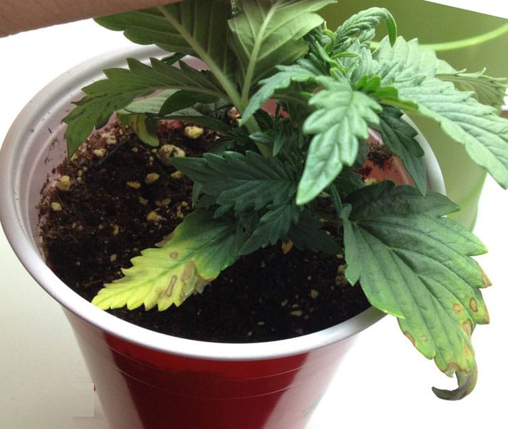

](https://www.growweedeasy.com/wp-content/uploads/2013/12/overwatering2b.jpg)

This particular type of cupping of the leaves **below **is common among cannabis plants with root problems. In this case, the plant had no drainage from the bottom of the solo cup, so water was just pooling at the bottom for the roots to sit in. Once the grower poked holes in the bottom of the cup, this problems went away (the cupped leaves didn't recover, but new leaves started growing in happy and healthy).

[

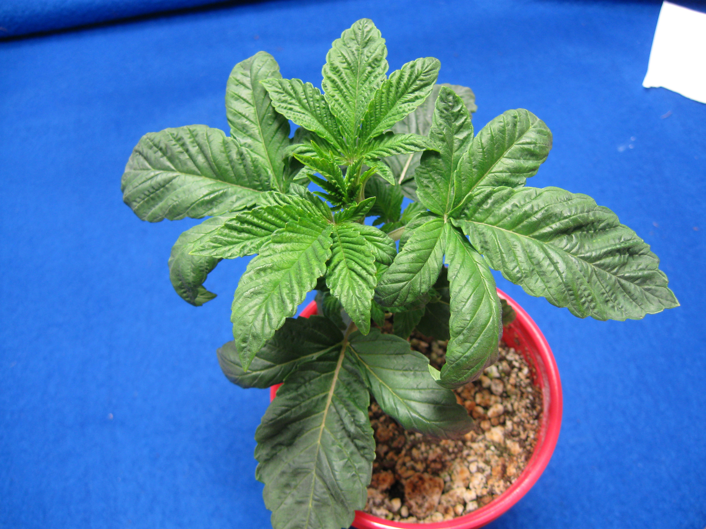

](https://www.growweedeasy.com/wp-content/uploads/2017/02/root-problems-cupping-leaves.jpg)

Sometimes leaves will tend to cup or curl down due to root problems, like the plant above, but sometimes the curl upwards too, like the poor plant **below **(this was caused by poor drainage and plant was overwatered, leading to a pretty severe case of root problems):

[

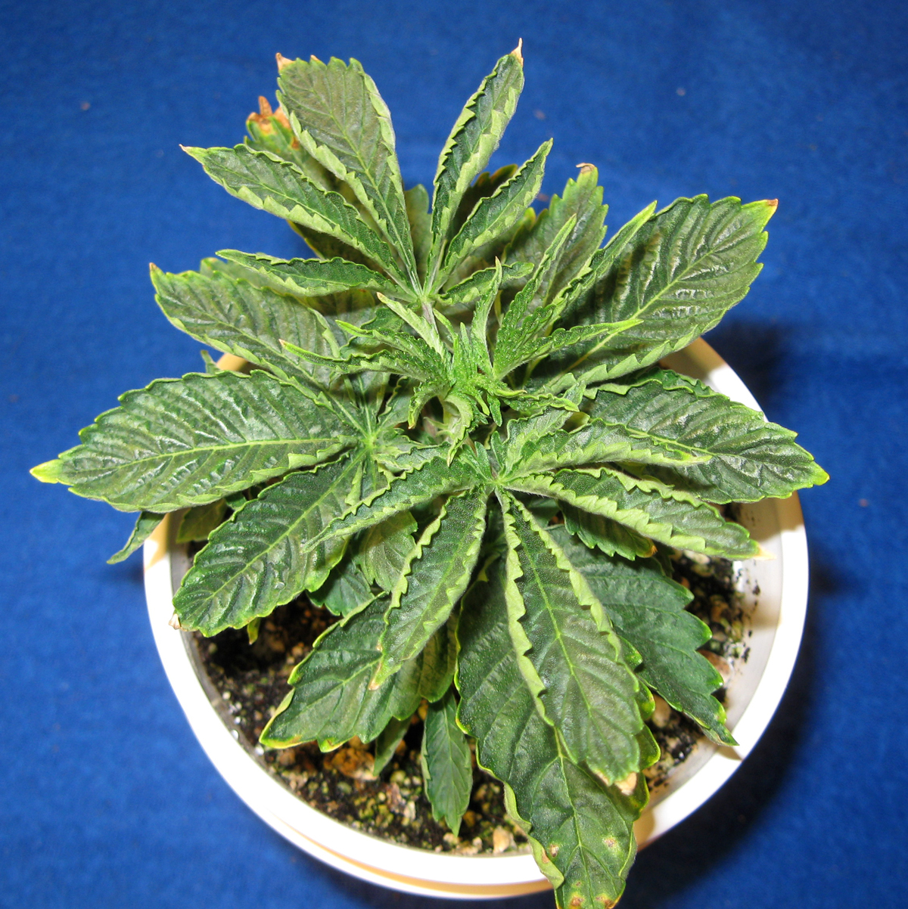

](https://www.growweedeasy.com/wp-content/uploads/2017/02/root-problems-coco-coir.jpg)

This next plant was also overwatered and had no drainage. Notice how dark the soil is and the green algae growing all along the top of the soil - these are more signs the plant has been overwatered for quite a while. You should never water your plant when the soil is still wet at the top, and if you notice lots of algae growing on top of your soil, it may be a sign that you're overwatering on a regular basis.

[

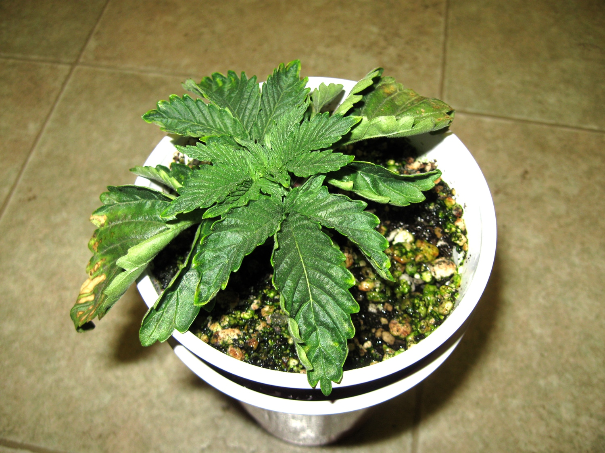

](https://www.growweedeasy.com/wp-content/uploads/2011/02/root-problems-green-algae-on-soil.jpg)

The grower went away for a few days, so they chose to overwater their plant in hopes it would be enough water until they got back. While they were gone, they had a huge heat wave. So this plant was subjected to overwatering plus heat. A few days later, when the grower came back, they saw that the leaves were cuppping upwards and had turned lime green. The stems and veins of the leaves were turning red. You can see the soil is still dark and wet because the plant stopped drinking after developing root problems.

[

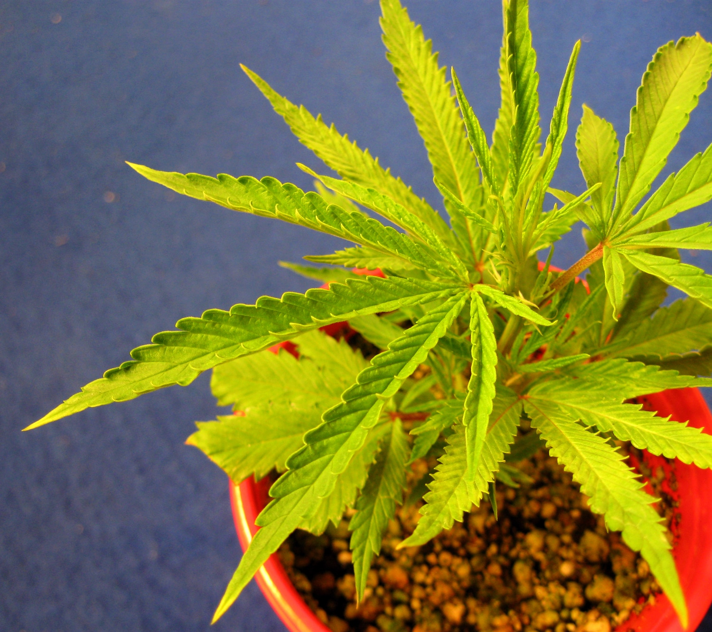

](https://www.growweedeasy.com/wp-content/uploads/2017/02/lime-green-root-problems.jpg)

Another plant from that same batch which reacted differently

[

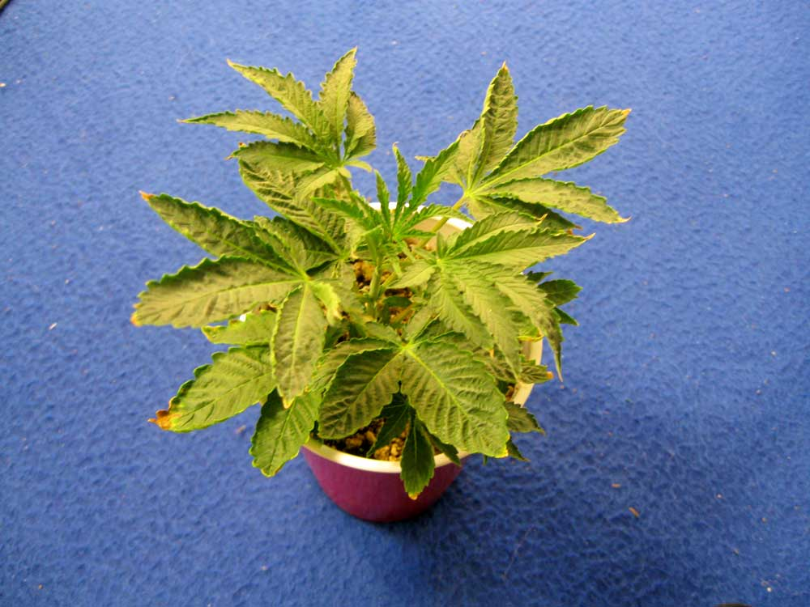

](https://www.growweedeasy.com/wp-content/uploads/2013/05/yellow-leaves-root-problems-from-heat.jpg)

Chronic overwatering in thick soil led to these symptoms. The main thing that alerts you to the fact that the yellowing is caused by overwatering is the fact that it's droopy. It's very easy to overwater young plants when you have a small seedling in a big container. When that's the case, don't soak the whole growing medium. Water in just a circle around the plant until its leaves are up and growing fast. At that point you can start watering more thoroughly 🙂

[

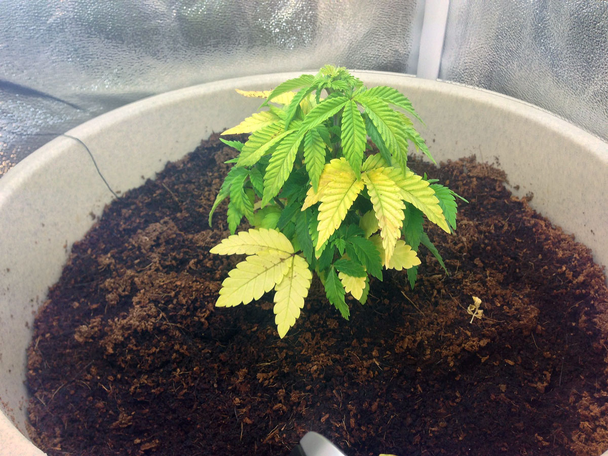

](https://www.growweedeasy.com/wp-content/uploads/2017/02/sick-cannabis-plant-overwatering-too-big-pot.jpg)

The following seedling is almost a month old, but it's been overwatered its whole life. As a result, it's stunted and small. The biggest hint that the roots are at fault is the fat, droopy leaves. The fact that it's a small plant in a big container also makes it more likely for plants to develop root problems.

The strange yellow and red growth in this picture has been caused by giving the plant too much water, too often. Overwatering can often causes what appears to be nutrient deficencies in young plants! Older plants tend to just droop, but especially seedlings can have really odd reactions to overwatering.

[

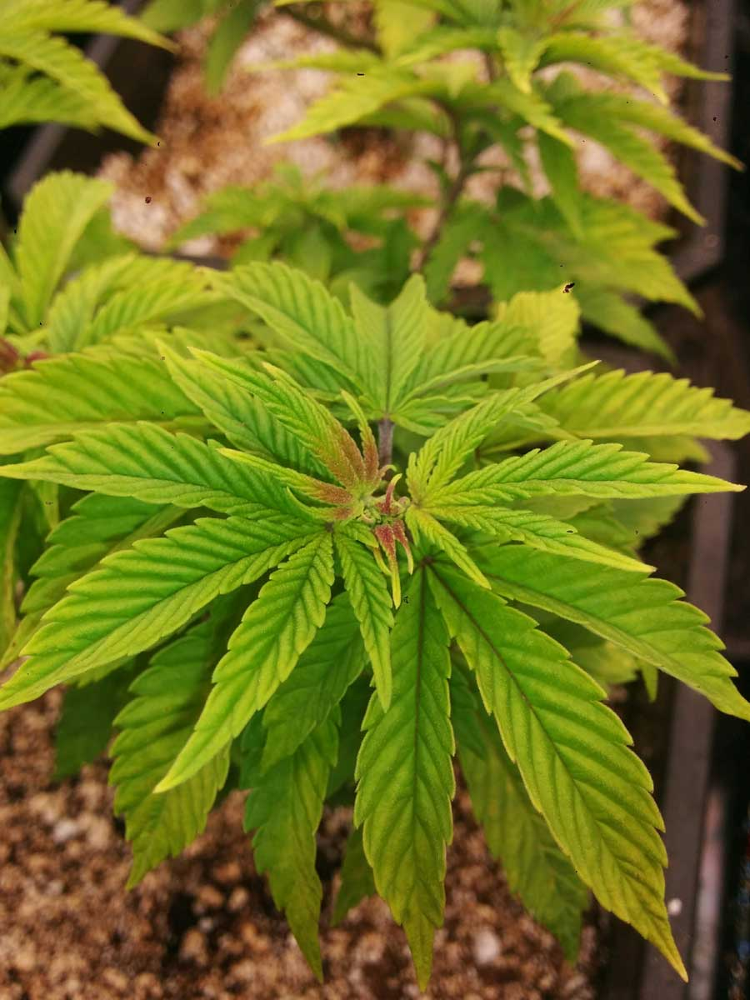

](https://www.growweedeasy.com/wp-content/uploads/2017/02/yellow-and-red-growth-caused-overwatering.jpg)

The plants below developed [root rot](https://www.growweedeasy.com/root-rot-cannabis) in a hydroponic setup. This is usually triggered when the roots can't get enough oxygen, usually due to high temps or poor oxidation of the water. Notice the strange burnt appears on some of the bottom leaves. They turned almost white. The whole plant was drooping, especially towards the bottom. The roots turned brown (pictures below).

[

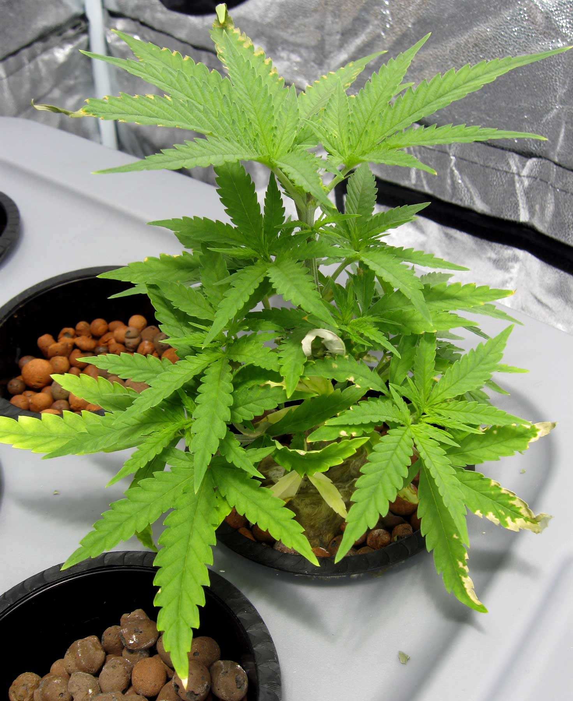

](https://www.growweedeasy.com/wp-content/uploads/2010/10/hydro-root-problems.jpg)

The plant on the right is healthy, and the plant on the left has root rot. It's interesting how the symptoms from root problems are often similar, whether the problem is in soil or hydro!

[

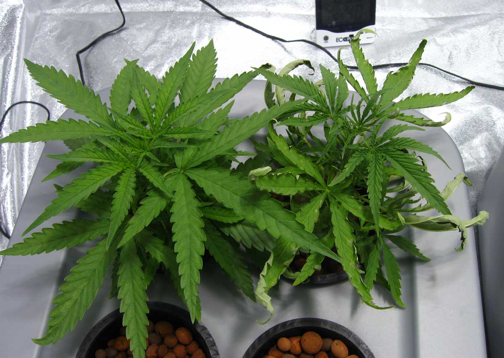

](https://www.growweedeasy.com/wp-content/uploads/2010/10/effects-of-root-rot.jpg)

More side effects of root rot

[

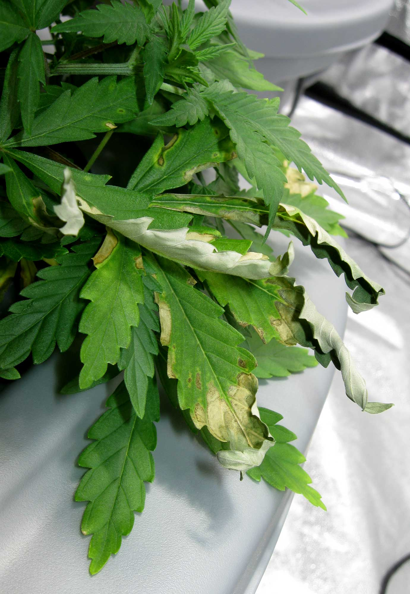

](https://www.growweedeasy.com/wp-content/uploads/2013/12/root-rot-leaf-damage.jpg)

[Root rot](https://www.growweedeasy.com/root-rot-cannabis)! No wonder the leaves were having so much trouble on top.

[

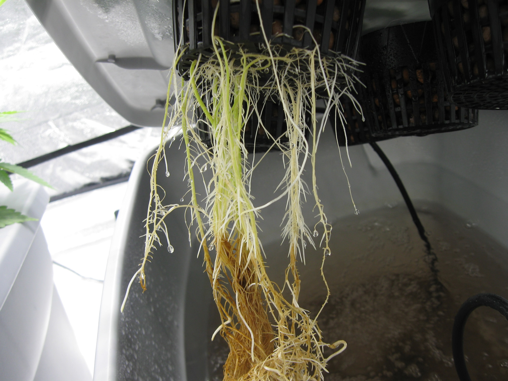

](https://www.growweedeasy.com/wp-content/uploads/2010/10/bad-root-rot-closeup.jpg)

[Learn How to Get Rid of Root Rot](https://www.growweedeasy.com/root-rot-cannabis) (common in hydroponic setups)

[See even more pictures of cannabis root problem symptoms caused by over-watering, too much heat, and small containers](https://www.growweedeasy.com/overwatered-roots-heat-small-container)

**Possible Triggers For Root Problems**

* **Heat** - cannabis is more likely to have root problems at higher temperatures
* **Cold** - cold roots are unhappy roots - cold shock can cause wilting and other problems
* **Over-watering potted plants **- too much watering tends to cause root problems
* **No drainage hole at the bottom of the container **- if water can't get out and water is sitting at the bottom of the pot, the roots can "drown"
* **Muddy or thick soil **- if your soil is muddy and thick instead of rich and fluffy, it may mean the soil doesn't hold enough oxygen to support your roots.
* **Small plant in a big container **- When a seedling (or small plant) is in a big container, it often has trouble getting enough oxygen at the roots. Until the plant has grown bigger and started to fill up the container, it's important to avoid overwatering. It can help to water just a little bit at a time, in a circle around the seedling, until it starts growing faster.
* **Plant has "overgrown" it's container **(become rootbound) - The roots of a rootbound plant have started circling the outside of the container, causing watering and nutrient problems even if you're doing everything right. When this happens, you may need to [transplant](https://www.growweedeasy.com/transplant) to a bigger container to stop the plant from being "choked" by the roots.
* **Big plant in a small container **- any time you have a big plant in a small container, even if the plant isn't root bound, you increase the chance of underwatering since the plant quickly drinks up all the water in the soil!
* **Hydroponics** - Root problems are caused when there's not enough oxygen in the water, usually caused because it's either too hot or there isn't enough bubbles/aeration

Certain strains are more prone to root problems than others, but good root practices will allow every plant to thrive!

**How to Treat Root Problems:**

**Step 1:** Identify what may have caused the root problem (refer to list of possible triggers above)

**Step 2: **Address this underlying issue

* Happy temps - Make sure your grow area maintains a comfortable room temperature during the day, and is a few degrees cooler at night. [Learn more about how temperature affects your cannabis plants](https://www.growweedeasy.com/temperature-growing-cannabis).
* Only water your plants when they need it. [How often should I water my potted cannabis plants?](https://www.growweedeasy.com/how-often-water-marijuana)
* Make sure potted plants have plenty of drainage, and there must be drainage holes at the bottom. If soil or growing medium holds a lot of water, consider mixing in 1/3 to 1/2 extra [perlite](https://www.amazon.com/dp/B002Y0AK6S?tag=growwcom07-20&camp=0&creative=0&linkCode=as4&creativeASIN=B002Y0AK6S&adid=17MZHEK8P3XK07C7NX67&) to "loosen things up" and improve drainage at the roots.
* Put plants in the right sized container to give the roots the best environment to spread out and grow. You may need to [transplant](https://www.growweedeasy.com/transplant) to a bigger container if your plant has gotten too big or its roots are rootbound.
* Brown, smelly roots? [Learn how to get rid of root rot](https://www.growweedeasy.com/root-rot-cannabis)

**Step 3:** (Optional) Provide your plant with a beneficial bacteria like [Hydroguard](https://www.amazon.com/Botanicare-Hydroguard-Bacillus-Inoculant-1-Quart/dp/B00IGFH25M/ref=as_sl_pc_ss_til?tag=growwcom07-20&linkCode=w01&linkId=OOZNJQGQFEH3N32W&creativeASIN=B00IGFH25M) to help roots recover quickly (more info about root supplements below). Hydroguard will help fight root rot by creating a colony of good organisms to outcompete the root rot.

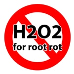

**You May Not Want to Use Hydrogen Peroxide (H2O2) for Root Problems! **H2O2 is temporarily effective at best when it comes to root problems. By it's nature, even commercial grade H2O2 will be completely gone from a water reservoir after about 24 hours as it reacts with the water to form oxygen (decomposes) until the H2O2 is completely gone.

If H2O2 is added to a water source, it kills most of the bacteria in the water, including any good bacteria, but will not usually be able to kill all bacteria, so some bad bacteria will still be left to repopulate. Because of it's nature, hydrogen peroxide does absolutely nothing to fix the underlying issue that causes root problems, and it kills any postive bacteria in your soil or water so sometimes it can actually make things worse. I think of H2O2 as a temporary bandaid.

[

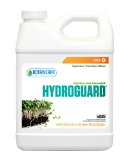

](https://www.amazon.com/gp/product/B00IGFH25M/ref=as_li_tl?ie=UTF8&camp=1789&creative=390957&creativeASIN=B00IGFH25M&linkCode=as2&tag=growwcom07-20&linkId=555U7P3ZXJ375HPJ)**I personally recommend** using a supplement called Botanicare [Hydroguard](https://www.amazon.com/Botanicare-Hydroguard-Bacillus-Inoculant-1-Quart/dp/B00IGFH25M/ref=as_sl_pc_ss_til?tag=growwcom07-20&linkCode=w01&linkId=OOZNJQGQFEH3N32W&creativeASIN=B00IGFH25M) for root problems because I've used it successfully to get rid of a terrible case of Root Rot

*Note: *Botanicare used to have an awesome root innoculant called [Aquashield](https://www.amazon.com/dp/B00286QSUK?tag=growwcom07-20&camp=0&creative=0&linkCode=as4&creativeASIN=B00286QSUK&adid=1JJ73MJ0QYMWBAKBX4DV&), but in our tests Hydroguard works even better to create healthier roots and get rid of root rot!

Hydroguard is also much cheaper than most other similar root treatments and is proven to work well at supporting root health in cannabis. Take a look at our [root rot page](https://www.growweedeasy.com/root-rot-cannabis) to see pictures of how Hydroguard was able to completely cure a terrible case of root rot.

Other examples of beneficial root supplements include [Piranha](https://www.amazon.com/Advanced-Nutrients-Piranha-250mL/dp/B01D1YA2Y0?keywords=Piranha+root&qid=1638326731&sr=8-5&linkCode=ll1&tag=4200a7-20&linkId=e0cfd2869fc4d6c1183d968d1705a55d&language=en_US&ref_=as_li_ss_tl), [VooDoo Juice](https://www.amazon.com/gp/product/B002JH57QO?ie=UTF8&tag=growwcom07-20&linkCode=as2&camp=1789&creative=390957&creativeASIN=B002JH57QO), [Great White](https://www.amazon.com/dp/B00A8PG6RI?adid=15PBY1YGBXGB9PBHBC4C&th=1&linkCode=ll1&tag=4200a7-20&linkId=f6d23abfcde9ee589ef55c97f8729e55&language=en_US&ref_=as_li_ss_tl) (Great White has great reviews, yet is obscenely expensive), and [Rooters](https://www.amazon.com/gp/product/B001GE8GY6?ie=UTF8&tag=growwcom07-20&linkCode=as2&camp=1789&creative=390957&creativeASIN=B001GE8GY6). Most of these can be used with both hydro and soil grows. I personally recommend [Hydroguard](https://www.amazon.com/Botanicare-Hydroguard-Bacillus-Inoculant-1-Quart/dp/B00IGFH25M/ref=as_sl_pc_ss_til?tag=growwcom07-20&linkCode=w01&linkId=OOZNJQGQFEH3N32W&creativeASIN=B00IGFH25M) because I've used it successfully to treat Root Rot (and it's also very affordably priced, you can use it throughout your grow without breaking the bank).

One important thing to note is that after you treat the cause of root problems, the old damaged leaves may never recover! With recovery, you should be looking for the problem to stop spreading, and for new leaves to be growing in green and healthy.

*Jump to&#8230;*

[Diagnose my sick plants!](https://www.growweedeasy.com/cannabis-symptoms-pictures)

[7 Tips to Growing Top Shelf Buds](https://www.growweedeasy.com/7-tips-to-growing-top-shelf-buds)

[What supplies do I need to start growing indoors (or upgrade)?](https://www.growweedeasy.com/cannabis-supplies-get-started-growing)

[Pests, Bugs, and Cannabis Viruses](https://www.growweedeasy.com/bugs-pests-symptoms-marijuana-grow)

Enough of all the pics with sad or unhappy roots - before you go, here's a picture of healthy roots growing from a new clone!

[

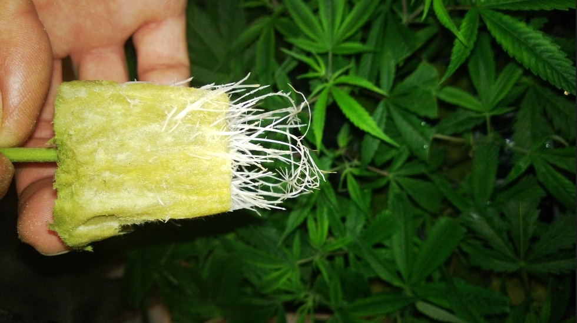

](https://www.growweedeasy.com/wp-content/uploads/2013/12/merrie-jayne-roots-10-days.jpg)

Taken by awesome grower **Merrie Jayne**

## Root Rot

by Sirius Fourside

**Table of Contents**

[Introduction to Root Rot](#marijuana-root-rot) (With Tons of Pictures!)

[What Triggers Root Rot?](#what-causes-marijuana-root-rot)

[Solution: Get Rid of Root Rot Forever](#solution-root-rot)!

**Cannabis Root Rot - Slimy, brown, twisted or unhealthy roots are caused by unwanted pathogens in your hydroponic tank!**

The marijuana plant on the left is healthy, and the plant on the right has root rot. The curled, drooping, unhealthy leaves are the result of the plant not being able to get enough oxygen through the roots. Root rot symptoms often look like a soil plant that has been severely over or under-watered.

[Go Straight to the Solutions for Root Rot!](#solution-root-rot)

An example of what cannabis root rot can look like "under the hood". Every infection looks a little different, but brown roots are usually the main symptom. It may affect all or just parts of the roots, and the sick sections usually become slimy or mushy and start twisting together.

[

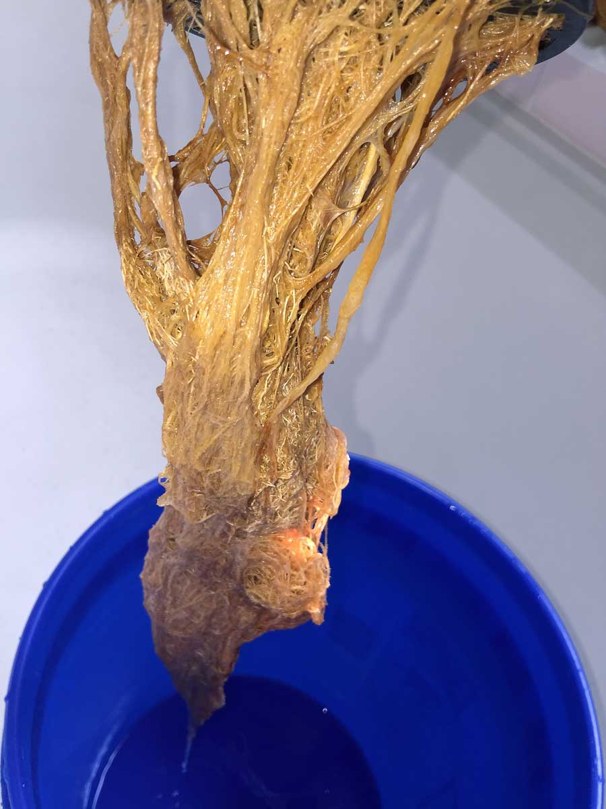

](https://www.growweedeasy.com/wp-content/uploads/2010/10/root-rot-slimy-roots.jpg)

Healthy Cannabis Roots Are White or Cream Colored!

[

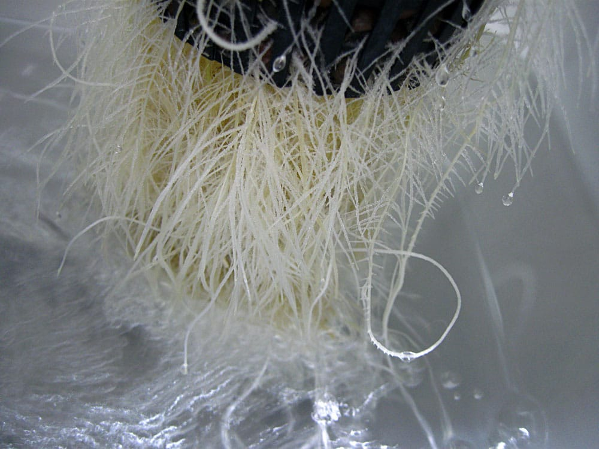

](https://www.growweedeasy.com/wp-content/uploads/2010/10/white-healthy-roots.jpg)

[Check out a quick Youtube video showing what a cannabis seedling with root rot looks like.](https://www.youtube.com/watch?v=-dcdcH0ob0U)

Root rot can be caused by several different organisms including types of bacteria, fungi, algae and parasitic oomycotes. Although the symptoms are similar between different types, they don't always look exactly the same. However, **growers generally refer to all types of unhealthy root browning as just "root rot."**

Root Rot causes droopiness and other symptoms similar to over or under-watering

[

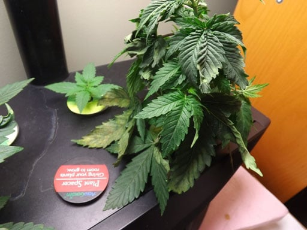

](https://www.growweedeasy.com/wp-content/uploads/2017/10/aerogarden-cannabis-plant-example-dwc-root-rot.jpg)

[

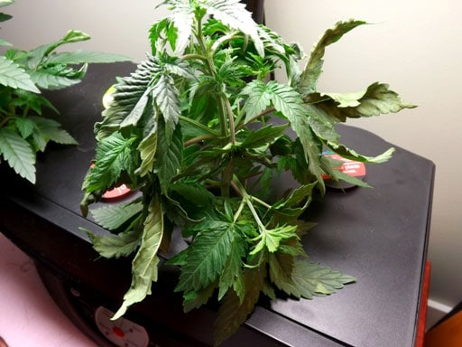

](https://www.growweedeasy.com/wp-content/uploads/2017/10/example-of-dwc-root-rot-on-cannabis-plant-in-aerogarden.jpg)

**Common Triggers for Root Rot: Light Leaks, Heat, & Lack of Oxygen in the Water**

Because cannabis root rot can be caused by different pathogens, a solution that solves the symptoms of root rot for one grower may not necessarily work for another grower. What's attacking your roots in California might be completely different from what's attacking the roots of a grower in Australia. That being said, there *are* tools to fight against root rot no matter what kind you have!

The first sign of root root is usually a brown tinge on the roots.

[

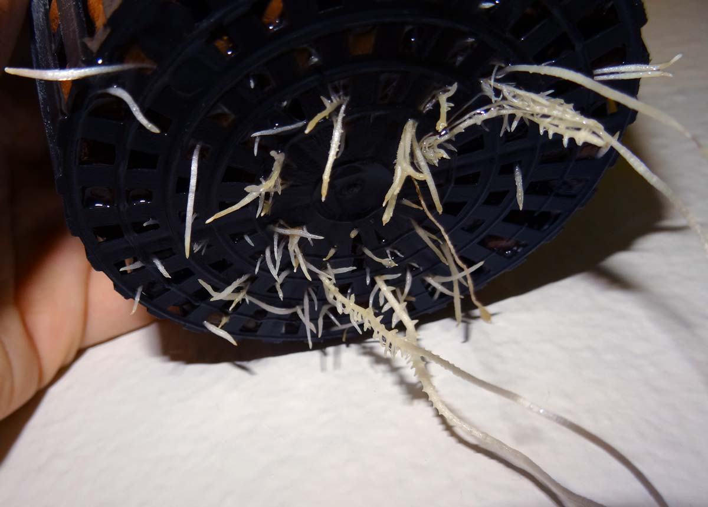

](https://www.growweedeasy.com/wp-content/uploads/2010/10/brown-tinge-on-marijuana-roots-first-sign-of-root-rot.jpg)

Some varieties of root rot mostly affect the roots below the surface of the water while the roots located above the waterline stay white and healthy. This phenomenon is part of why it's often recommended that hydro growers maintain at least a small amount of air gap under the net pots. Oxygen-rich moist environments (including that misty air gap) make it very difficult for root pathogens to grow.

Sometimes even the roots *above *the waterline appear brown. The white strands you see in this picture are actually new roots coming out of the old unhealthy stuff. When new white roots are growing, it's a sign the plant may be getting better! Even after roots have recovered, you may see the brown for a while until it's completely covered by new white roots again.

[

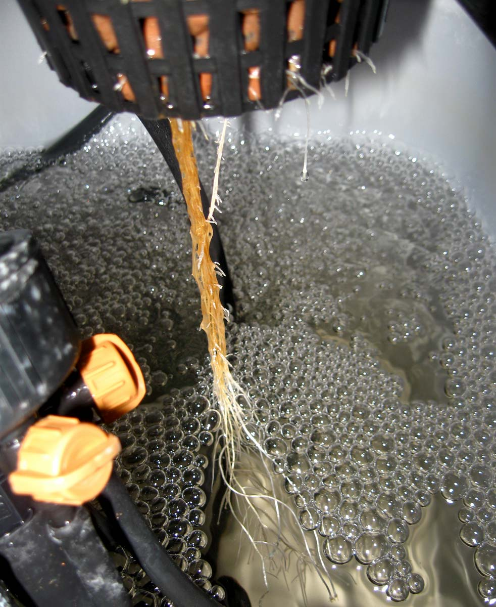

](https://www.growweedeasy.com/wp-content/uploads/2010/10/example-marijuana-root-rot-brown-above-the-waterline.jpg)

Brown, infected cannabis roots often appear twisted. In fact, sometimes them getting twisted up after being moved around by the grower is what triggers root rot in the first place.

If cannabis roots get twisted due to handling, it can trigger the roots below the "twist" to die.

[

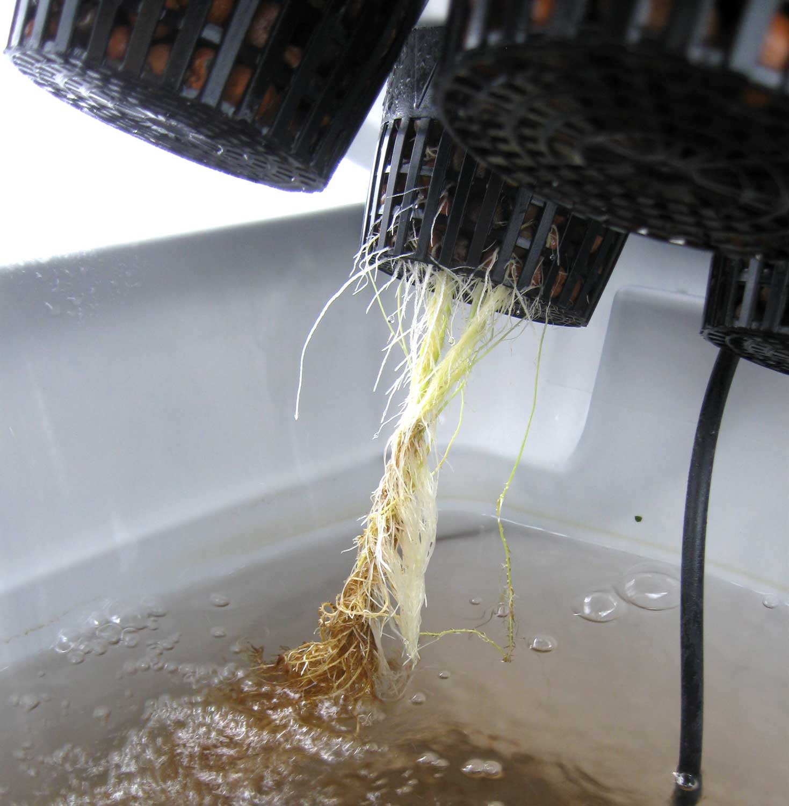

](https://www.growweedeasy.com/wp-content/uploads/2010/10/root-rot-cannabis.jpg)

Sometimes the twisting/bunching together is actually the result of the infection. Healthy roots have individual "strands" that tend to stay separated even when they're all floating together in a reservoir.

Sometimes the infection hits first, and roots start twisting as a result of the root rot.

[

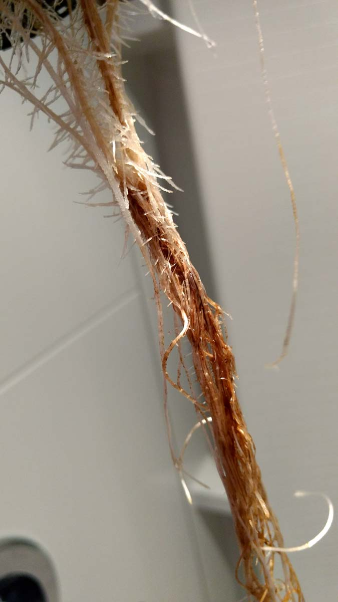

](https://www.growweedeasy.com/wp-content/uploads/2010/10/example-twisted-brown-roots-from-cannabis-root-rot.jpg)

A mass of root rot. The grower believes the main cause was that the water level in the reservoir was too high.

[

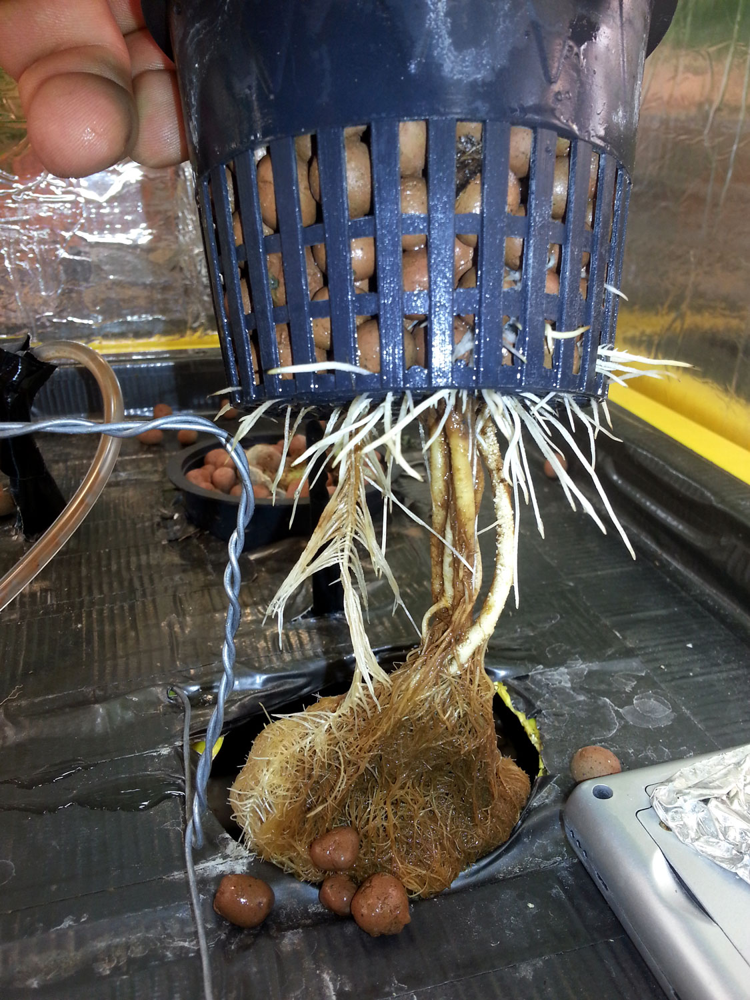

](https://www.growweedeasy.com/wp-content/uploads/2017/10/root-rot-water-level-too-high-dwc.jpg)

Depending on what pathogen in particular is attacking your marijuana roots, the symptoms may look different.

Cannabis roots with root rot sometimes look mushy or slimy and can almost look like they're covered in snot 🙁

[

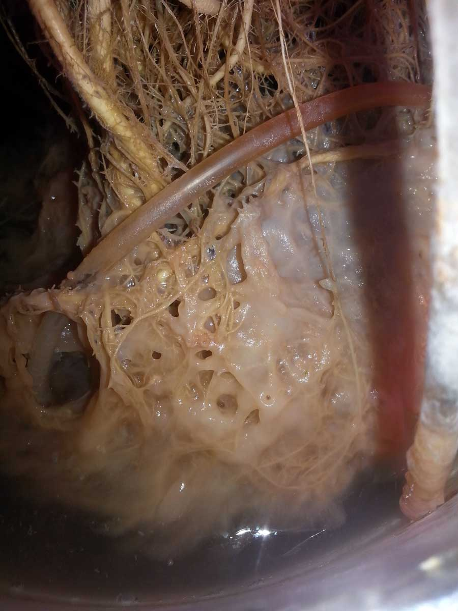

](https://www.growweedeasy.com/wp-content/uploads/2017/07/algae-bloom-reservoir-root-rot-no-hydroguard-roots-slimy.jpg)

This case of root rot was caused by a brown algae bloom. Brown or green algae is especially common in hot temperatures or when there are light leaks!

Algae started growing from light getting into the reservoir.

[

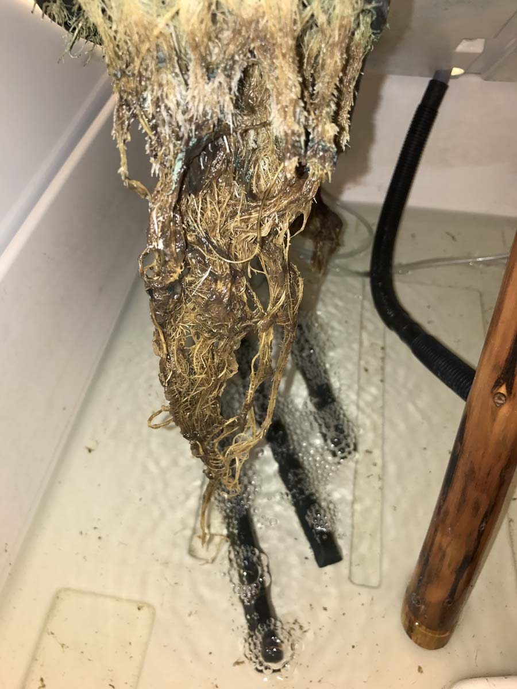

](https://www.growweedeasy.com/wp-content/uploads/2017/07/brown-algae-attacking-cannabis-roots.jpg)

Important: The Following* *Roots Are Stained from *Nutrients *- They Are NOT Brown from Root Rot

[

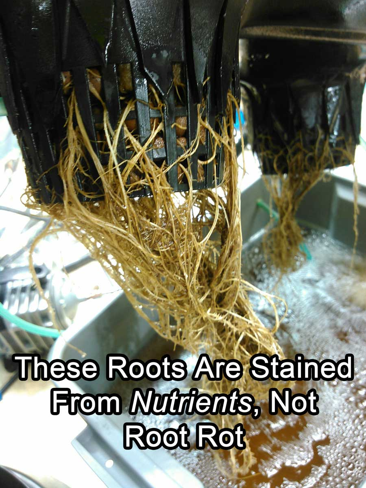

](https://www.growweedeasy.com/wp-content/uploads/2010/10/root-staining-from-nutrients.jpg)

Nutrient-stained roots are not slimy or smelly and all the roots are evenly dyed the same color. You'll be able to see each individual "strand" on healthy cannabis roots, as they won't be twisted together. You also won't see leaf symptoms or wilting on the plant itself.

The first sign of root rot is usually wilting or drooping, though sometimes you won't have any symptoms at first. Root rot often strikes immediately after disturbing the roots or completing a reservoir change, especially with young plants. It's a good idea to avoid disturbing young seedling roots when possible! This gives roots time to build up a biofilm that protects them against root rot.

[Learn how to care for hydroponic cannabis seedlings](https://www.growweedeasy.com/how-to-care-for-hydroponic-cannabis-seedlings)!

This cannabis plant was completely healthy the day before, but started looking weak after being transferred from one hydroponic reservoir to a different one. The thin, light colored plastic of the reservoir may have been letting light through, making the reservoir a haven for root rot. Additionally, the temperature was about 85°F (30°C) in the grow space!

[

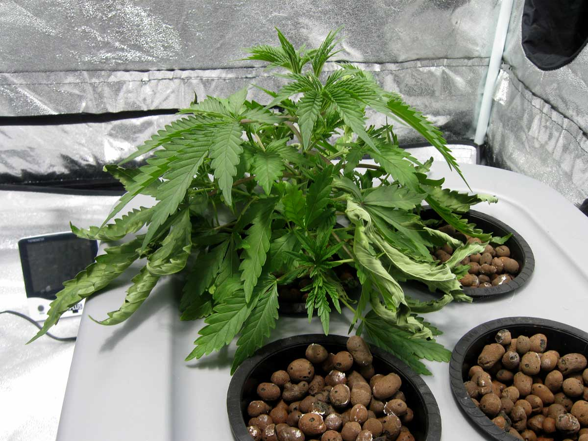

](https://www.growweedeasy.com/wp-content/uploads/2017/02/curling-leaves-from-cannabis-root-rot.jpg)

Cannabis root rot can cause leaf symptoms that can look like almost anything: cannabis leaves get burnt edges or tips; yellow / bronze / brown spots or stripes; nutrient deficiencies; clawing and curled edges; and other unusual leaf symptoms.

[

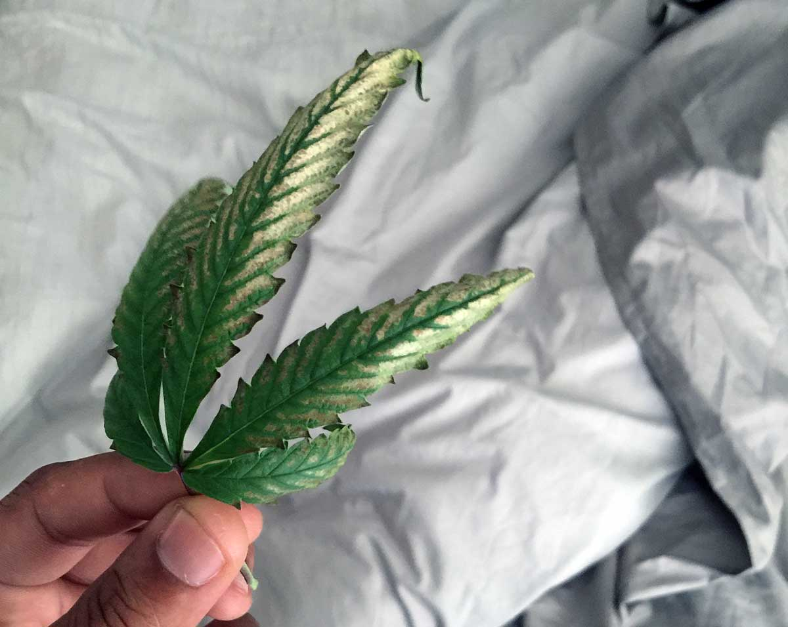

](https://www.growweedeasy.com/wp-content/uploads/2010/06/sick-leaves-caused-by-root-rot.jpg)

Typical signs of root problems, like unhealthy leaves, yellowing, or nutrient deficiencies, are often present.

[

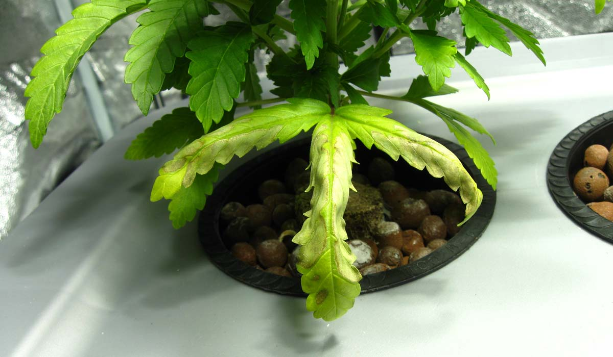

](https://www.growweedeasy.com/wp-content/uploads/2010/10/hydroponic-dwc-seedling-with-curled-leaves-from-root-rot.jpg)

Root rot can cause curling leaves and brown or burnt patches.

[

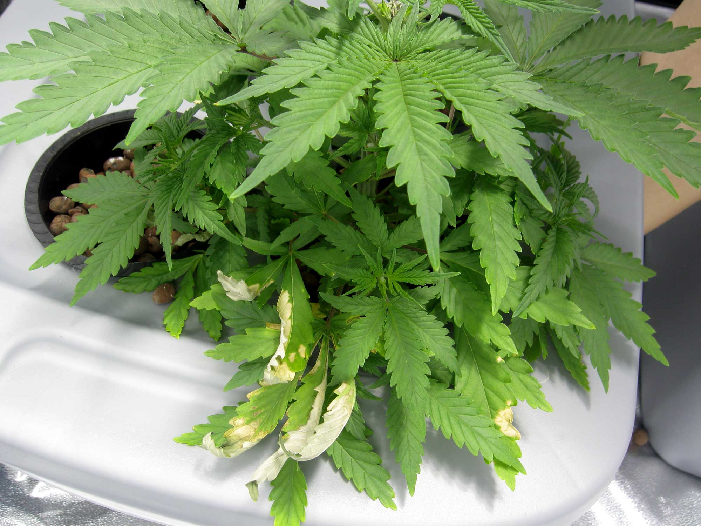

](https://www.growweedeasy.com/wp-content/uploads/2010/06/root-rot-leaves-hydroponic.jpg)

Sometimes you'll have a plant with root rot that looks completely healthy other than the roots. Don't ignore this problem as you will likely start getting symptoms!

# What Causes Root Rot in the First Place?

The plant ailment we think of as &#8216;Root Rot' is actually a bunch of similar symptoms caused by many different types of organisms. Since these organisms all cause the same problem - gross, brown roots - we group them together. In addition to these harmful organisms all causing similar symptoms, they also show up for the same reasons.

So what causes root rot? If you're growing in soil or coco coir, there's one main cause: stagnant water at the roots. If your plants are sitting in old water that's getting light (from the sun or otherwise), their roots are connected to a breeding ground for unwelcome organisms.

[

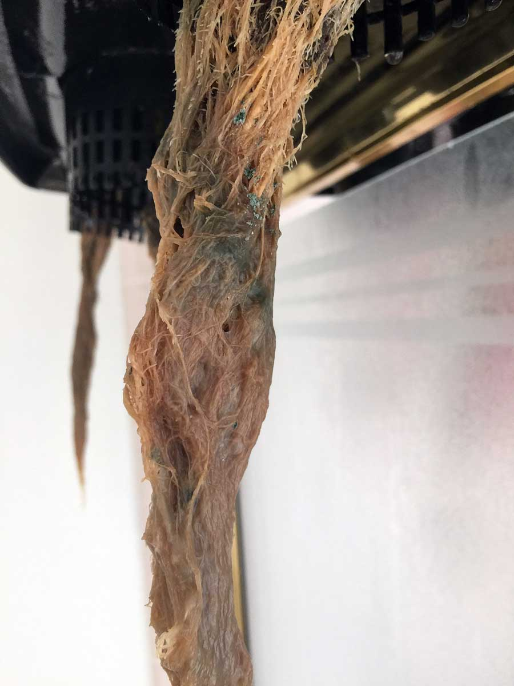

](https://www.growweedeasy.com/wp-content/uploads/2010/10/root-rot-wound-around-itself.jpg)

Root rot is a major problem to look out for in DWC many factors can cause it to show up. The most common are:

* **Heat** - A warm reservoir makes it easier for bacteria to reproduce. In fact, keeping a cool reservoir makes for an environment in which harmful bacteria/fungi/etc. just can't survive.
* **Light leaks** - [Light in your reservoir](https://www.growweedeasy.com/dwc-stop-light-leaks-in-reservoir) equates to a population boom for some of the smaller, unwanted populations living.
* **No air space** - There should be a space with air between the bottom of the net pots and the top of the water reservoir, about the width of a few fingers. If the water is touching the net pot, that can increase the chance of root rot.
* **Lack of oxygen in the water** - When you remove the air and agitation from your reservoir water, it's party time! A gross, smelly, sad party. Hydroponic roots need lots of bubbles full of oxygen-filled air.
* **Moving young roots** - Young roots need time to build up their defenses. Moving them around not only weakens them, but it potentially exposes them to new pathogens or getting twisted when put back in the water.
* **Decaying matter in the reservoir** - Old bits of dead leaves can be the start of something bad. Make sure you fish any plant matter out of your reservoir when you see it. Except for your roots&#8230;leave those in there.

Your cannabis plant has started drooping, leaves are getting sick, and roots are brown, twisted, smelly and/or slimy. These are all signs you have cannabis root rot 🙁

[

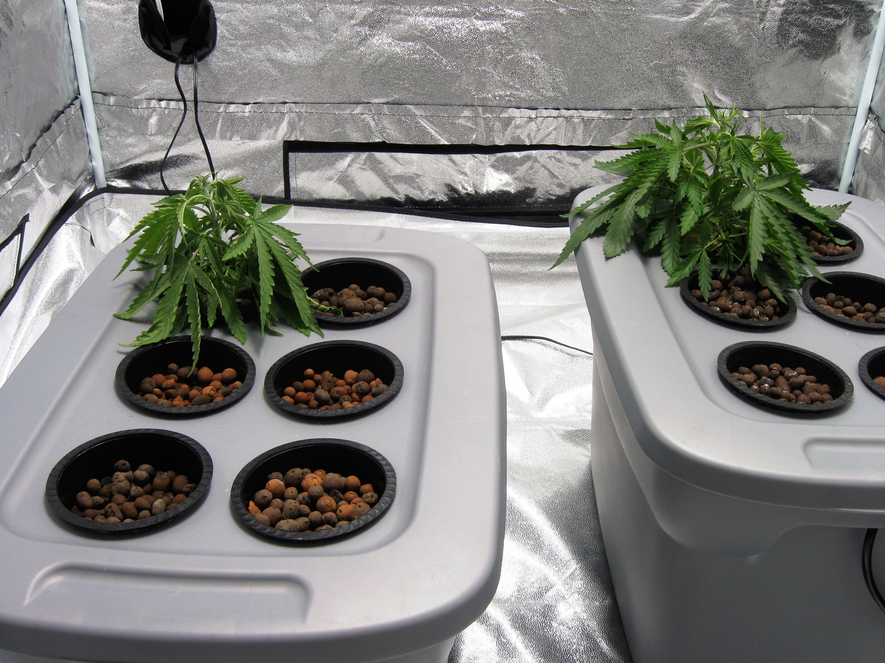

](https://www.growweedeasy.com/wp-content/uploads/2010/10/root-rot-wilting-hydro.jpg)

When a cannabis plant is wilting or drooping, whether it is in soil, coco or hydro, it is almost always a sign that's something is going on at the roots.

[

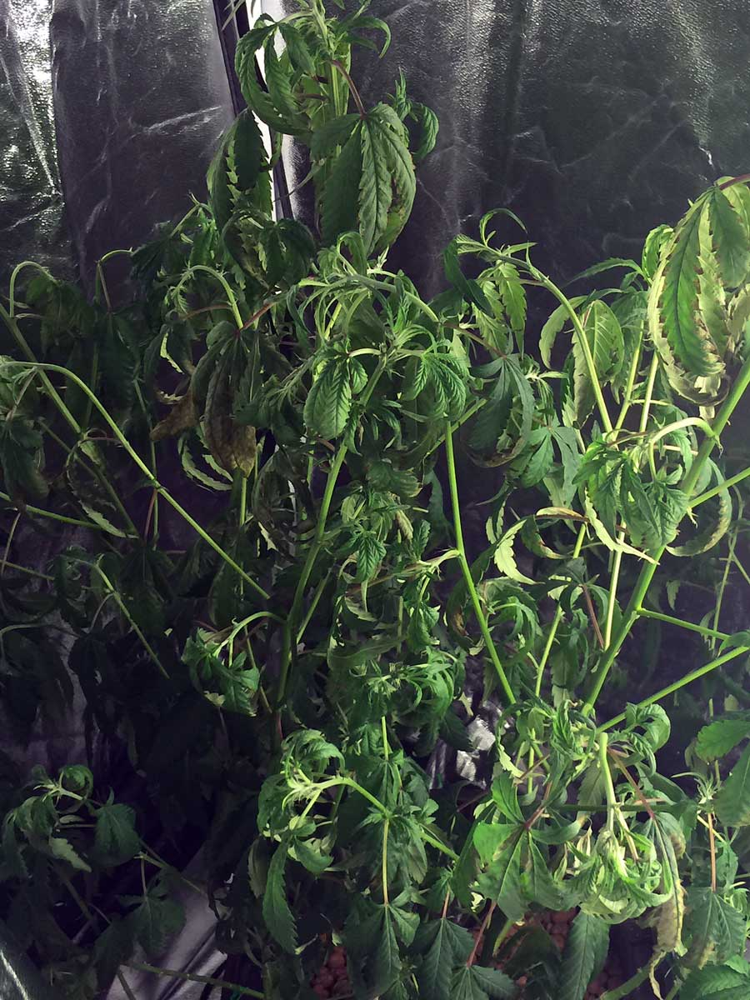

](https://www.growweedeasy.com/wp-content/uploads/2010/10/root-rot-drooping-leaves.jpg)

The wilting is often soon followed by other symptoms to the leaves, especially burning, brown spots, nutrient deficiencies, spotting, and other unusual leaf symptoms.

Root rot can cause a wide range of symptoms, because without the roots the plant is shutting down!

[

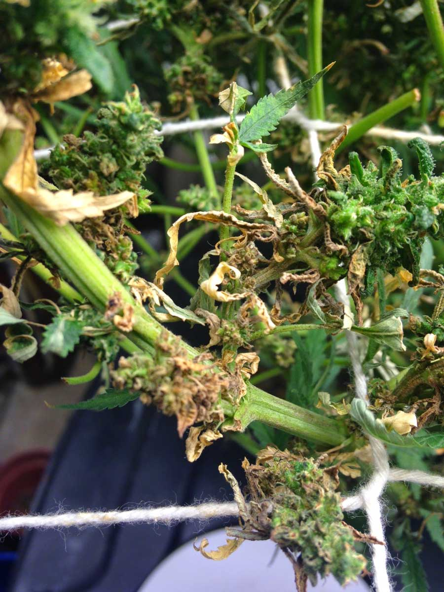

](https://www.growweedeasy.com/wp-content/uploads/2010/10/root-rot-leaf-damage-crispy.jpg)

Plants with root rot often start drinking less water. If you notice symptoms in your cannabis plant, make sure to take precautions to stop root rot from getting worse.

Some brown roots may eventually turn white again after the root rot is gone, but it's important to note that damage is permanent on the leaves. Brown leaves will never turn green again. You need to watch the roots and the **new leaf growth** for signs of root rot recovery.

Root rot mostly affects marijuana plants in hydroponic systems, but roots can also get pathogens as a result of [over watering](https://www.growweedeasy.com/overwatering) your plants in soil or other medium. Basically, anytime the roots are sitting in wet conditions for too long without any oxygen, they are at risk of developing root rot.

**Symptoms of Root Rot**

* **Droopy** - Cannabis plants with root rot almost always appear [overwatered](https://www.growweedeasy.com/overwatering-cannabis) or droopy (sometimes plants wilt overnight!)
* **Roots seem unhealthy** - Brown, slimy, or smelly roots.
* **Leaf symptoms (deficiencies)** - Plant leaves often start turning yellow/white or get brown patches. You may see what appears to be a random mix of nutrient deficiencies on the leaves. This is due to the fact that the plant can't absorb nutrients properly at the roots even if they're there
* **Dying leaves** - Leaves may start dying and falling off rapidly.
* **Drink less** - Plants may drink much less water than usual.

[

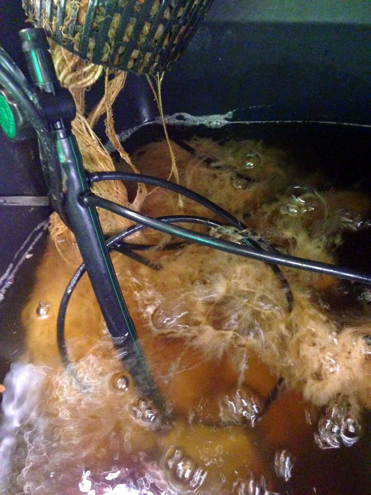

](https://www.growweedeasy.com/wp-content/uploads/2010/10/root-rot-slime.jpg)

Now that you know what root rot looks like and how to get it, it's time for cannabis root rot solutions!

# Solution: What to Do About Marijuana Root Rot, Algae Growth & Slime in the Reservoir

It can be tough to get rid of root rot and many growers feel it's easier to just scrap the plant and start over. However, if you're growing in the same spot you're likely to get it again unless you find a true solution, and there are proven techniques that will cure your plant of root rot problems!

In order to get rid of root rot successfully, you need to take a two-pronged approach. You will need to&#8230;

* **Treat the plant's root directly** with something that will help protect them against root rot
* **Ch****ange the plant's environment** so that root rot no longer has a good place to grow.

Go through the below list and make sure you're covering all your bases to get rid of root rot permanently and prevent a re-occurrence. It's also important to note that affected roots will likely never recover, just like how discolored leaves on the plant will never recover. What you're looking for is new, healthy white root growth coming out of the old sick roots.

Learn how to prevent and treat cannabis root rot&#8230;

## **1.) Add Beneficial Root Bacteria - Crucial!**

Some people (like me) add beneficial bacteria to their water to help prevent and treat root-related plant diseases and help make nutrients available to the plant. Some of the formulas available are [Hydroguard](https://www.amazon.com/Botanicare-HYDROGUARD-Bacillus-Inoculant-1-Quart/dp/B00IGFH25M/ref=as_li_ss_tl?ie=UTF8&qid=1525715681&sr=8-3&keywords=hydroguard&linkCode=ll1&tag=4200a7-20&linkId=fa4381829bc6432663131bf6ca629a1f), [VooDoo Juice](https://www.amazon.com/gp/product/B004TER268/ref=as_li_ss_tl?ie=UTF8&th=1&linkCode=ll1&tag=4200a7-20&linkId=c32cf8bbe3a6df95ff7a28ac42d0b7cf), or [Great White](https://www.amazon.com/dp/B00A8PG6RI/ref=as_li_ss_tl?_encoding=UTF8&psc=1&linkCode=ll1&tag=4200a7-20&linkId=8a5f344a874ddafba80e5ac7690a41aa). Most of these can be used with both hydro and soil grows.

**Hydroguard (Recommended)**

I personally recommend [Hydroguard](https://www.amazon.com/Botanicare-HYDROGUARD-Bacillus-Inoculant-1-Quart/dp/B00IGFH25M/ref=as_li_ss_tl?ie=UTF8&qid=1525715681&sr=8-3&keywords=hydroguard&linkCode=ll1&tag=4200a7-20&linkId=fa4381829bc6432663131bf6ca629a1f) because I've used it successfully to treat root rot in hydro, and I've also seen it work for many other hydroponic cannabis growers, too! It's pretty inexpensive, and concentrated enough that a single small bottle can last throughout your grow.

The "secret sauce" in Hydroguard is a specific type of bacteria called *Bacillus amyloliquefaciens*. It survives in hydroponic reservoirs better than other types of *Bacillus* bacteria and fights many root ailments including different types of fungi, bacteria, and oomycotes. It not only gets rid of and prevents root rot, but there's some [evidence](http://onlinelibrary.wiley.com/doi/10.1111/ppl.12441/abstract) *Bacillus a.* may actually help lower salt concentration in the plant tissue itself.

For my hydro plants, [Hydroguard](https://www.amazon.com/Botanicare-HYDROGUARD-Bacillus-Inoculant-1-Quart/dp/B00IGFH25M/ref=as_li_ss_tl?ie=UTF8&qid=1525715681&sr=8-3&keywords=hydroguard&linkCode=ll1&tag=4200a7-20&linkId=fa4381829bc6432663131bf6ca629a1f) has proven to be the most effective root rot prevention supplement.

[

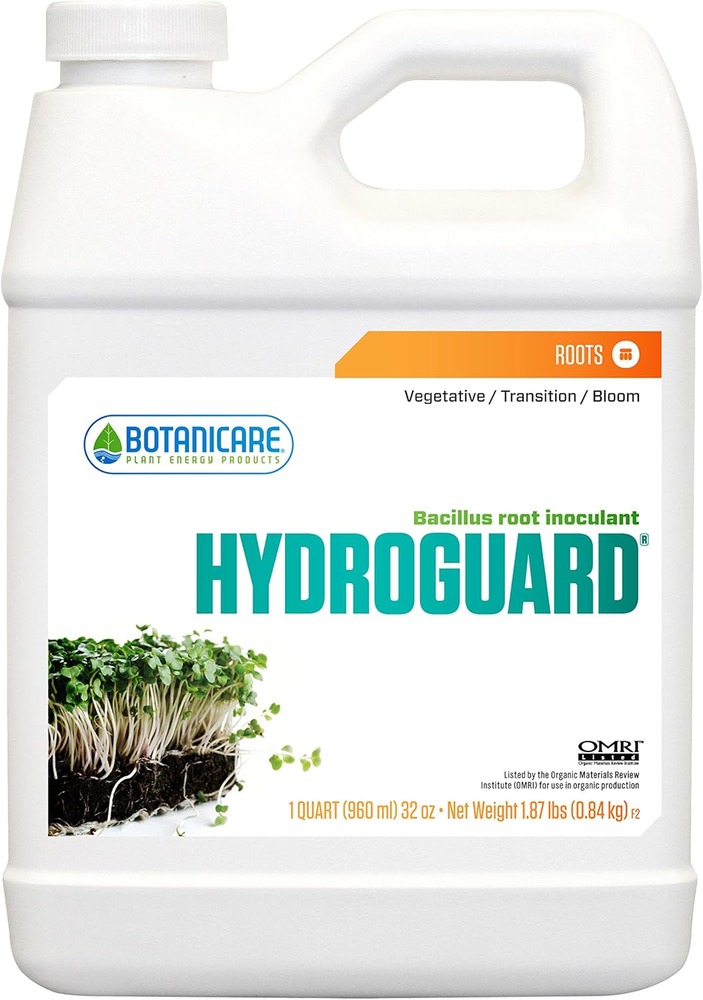

](https://www.amazon.com/Botanicare-HYDROGUARD-Bacillus-Inoculant-1-Quart/dp/B00IGFH25M?ie=UTF8&qid=1525715681&sr=8-3&keywords=hydroguard&th=1&linkCode=ll1&tag=4200a7-20&linkId=3a9d269ca6c391591dffa421ad2aa012&language=en_US&ref_=as_li_ss_tl)

**Great White Root Powder (If Hydroguard Doesn't Work)**

[Great White](https://www.amazon.com/dp/B00A8PG6RI?_encoding=UTF8&th=1&linkCode=ll1&tag=4200a7-20&linkId=6a2d1128847a34d6ece93346026ceb72&language=en_US&ref_=as_li_ss_tl) is another root supplement that works by giving your plant roots lots of good stuff to help it be more resistant to root rot. Some growers (myself included) have tried Great White without seeing any root rot recovery. However, other growers have had great results with this supplement! For example, in our [growing forum](http://forum.growweedeasy.com/forum/growing-community), just like Hydroguard, some hydroponic growers have been able to cure their root rot simply by adding Great White to their reservoir.

It all depends on exactly which organism is growing in your tank! What was growing in mine might not be the same as what's growing in yours, so when it comes to "good bacteria" supplements it can't hurt to try more than one if the first one doesn't work.

A [small sample of Great White](https://www.amazon.com/dp/B00A8PG6RI?_encoding=UTF8&th=1&linkCode=ll1&tag=4200a7-20&linkId=6a2d1128847a34d6ece93346026ceb72&language=en_US&ref_=as_li_ss_tl) doesn't cost much, so if you're still struggling with root rot after trying everything else, it's worth giving it a try to see if it works for you!

[

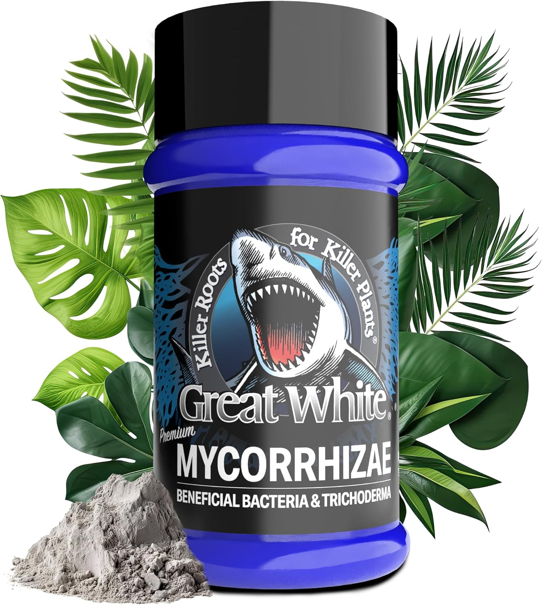

](https://www.amazon.com/dp/B00A8PG6RI?_encoding=UTF8&th=1&linkCode=ll1&tag=4200a7-20&linkId=d82dee6442d7846b011f3f2ff8506ac0&language=en_US&ref_=as_li_ss_tl)

Some hydro growers also swear by [VooDoo Juice](https://www.amazon.com/gp/product/B004TER268/ref=as_li_ss_tl?ie=UTF8&th=1&linkCode=ll1&tag=4200a7-20&linkId=c32cf8bbe3a6df95ff7a28ac42d0b7cf) but we haven't tried it ourselves for preventing root rot.

**SM-90**

*Note: SM-90 has been temporarily discontinued. See [this article](https://www.growweedeasy.com/what-happened-to-sm-90) for more info.*

## **2.) Lots of Bubbles**

As I mentioned, it is incredibly beneficial to try to get as much oxygen as possible dissolved in your water. Therefore, it's a good idea to buy a medium sized air pump and big air stones for your hydroponic system.

Up to a point, the more bubbles and surface agitation, the better, as this dissolves more oxygen into the water. As long as the roots are not being very disturbed, you can't really go wrong with adding more oxygen.

Root rot cannot thrive in an oxygen-rich environment and your plants will grow faster with lots of oxygen. I use one [EcoPlus 2 Air Pump w/ 2 Outlets](https://www.amazon.com/Sunlight-Supply-Eco-Adjustable-Pump/dp/B078YDFYFD/ref=as_li_ss_tl?ie=UTF8&qid=1527626771&sr=8-2&keywords=eco+air+2&linkCode=ll1&tag=4200a7-20&linkId=57ca7046ee8b96fd6ea0ff8fb4ca6584) for each 10-gallon container (which each holds 5 gallons of water), which I have connected to 2 [large air stones](https://www.amazon.com/EcoPlus-728405-Round-Stone-Large/dp/B002JLA83C/ref=as_sl_pc_ss_til?tag=growwcom07-20&linkCode=w01&linkId=25QFOVYVT3FHJWZE&creativeASIN=B002JLA83C) per air pump since this one has 2 outlets; this helps make sure there's plenty of oxygen in the water healthy roots and faster growth.

You need [3/16-inch standard aquarium tubing](https://www.amazon.com/AQUANEAT-Aquarium-Airline-Tubing-Standard/dp/B08N61GFCD?dchild=1&keywords=3%2F16-inch+standard+aquarium+tubing&qid=1628990502&sr=8-3&linkCode=ll1&tag=4200a7-20&linkId=dffc8f424ff2f64f2cc38f0446013bcc&language=en_US&ref_=as_li_ss_tl) to hook everything together. Try to get tubing in black if possible, to ensure light can't get through.

[Air stones](https://www.amazon.com/EcoPlus-728405-Round-Stone-Large/dp/B002JLA83C?&linkCode=ll1&tag=4200a7-20&linkId=83ad0ca9d32f4d21890727b51dec03e9&language=en_US&ref_=as_li_ss_tl) disperse the bubbles into the water.

[

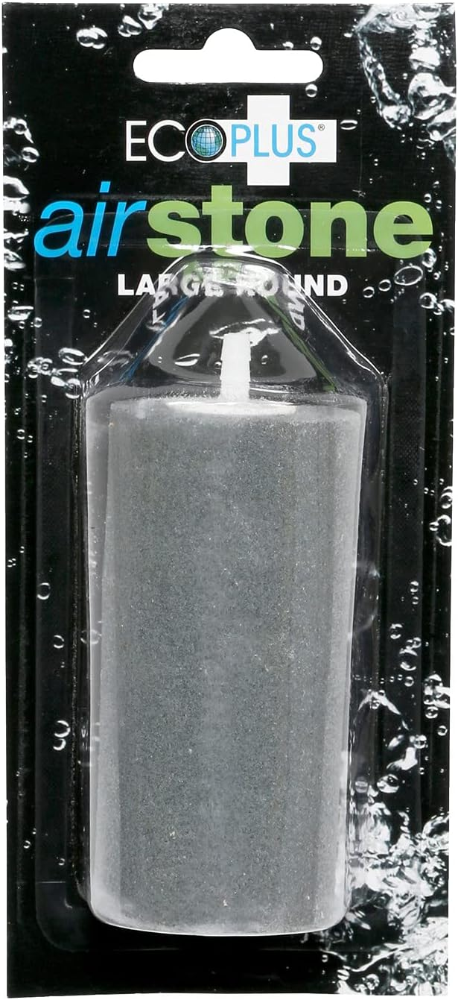

](https://www.amazon.com/EcoPlus-728405-Round-Stone-Large/dp/B002JLA83C?&linkCode=ll1&tag=4200a7-20&linkId=54ad31b250c6c472212dbe6f8fca9230&language=en_US&ref_=as_li_ss_tl)    

3/16&#8243; Flexible Airline Tubing for Aquariums is the standard size to connect an air stone to your air pump.

[

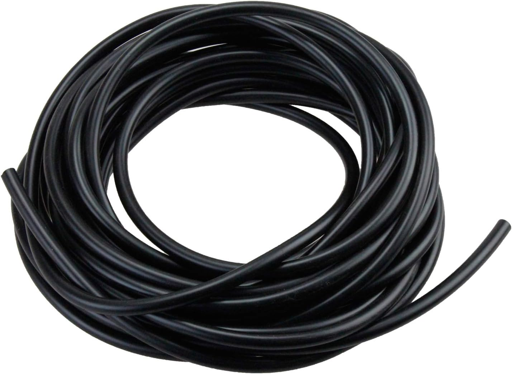

](https://www.amazon.com/AQUANEAT-Aquarium-Airline-Tubing-Standard/dp/B08N61GFCD?dchild=1&keywords=3%2F16-inch%2Bstandard%2Baquarium%2Btubing&qid=1628990502&sr=8-3&th=1&linkCode=ll1&tag=4200a7-20&linkId=1d7a4e886387f2dc1ad5fb8c256be378&language=en_US&ref_=as_li_ss_tl)

An air pump pumps air into your reservoir through the tubing where it gets turned into bubbles.

[

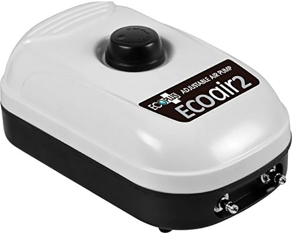

](https://www.amazon.com/Sunlight-Supply-Eco-Adjustable-Pump/dp/B078YDFYFD?ie=UTF8&qid=1527626771&sr=8-2&keywords=eco+air+2&linkCode=ll1&tag=4200a7-20&linkId=51695377c2f697ad546884d07bdd8f7b&language=en_US&ref_=as_li_ss_tl)

This has worked great for me. I haven't had root rot since I started using this air pump/air stone combination with Hydroguard. But lots of different pumps and types of air stones will work great. The important thing is to make sure that you're seeing lots of bubbles!

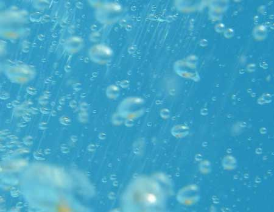

## **3.) No Light Leaks in the Reservoir!**

Your roots don't like light, which is reason enough, but the bad organisms that attack cannabis roots love the heat and light they receive from your grow lights!

Therefore, hydro growers want it to be completely pitch black in their DWC reservoirs. You should not be able to see even a tiny bit of light where your roots are!

You don't need to worry as much about repairing light leaks when using a dark, thick and sturdy tub as your water reservoir

[

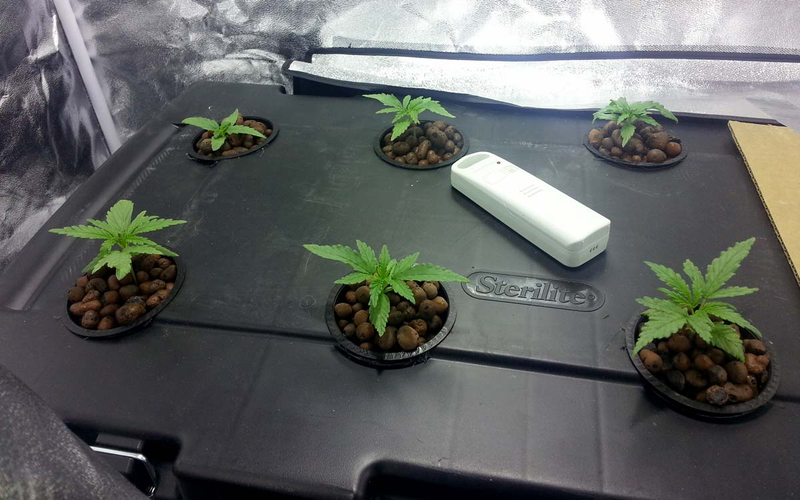

](https://www.growweedeasy.com/wp-content/uploads/2017/07/example-hydroponic-seedlings-in-sturdy-dwc-reservoir.jpg)

I love this idea from [Farmerjim420](https://www.instagram.com/farmerjim420/). Help block light and heat from the reservoir with a simple towel!

[

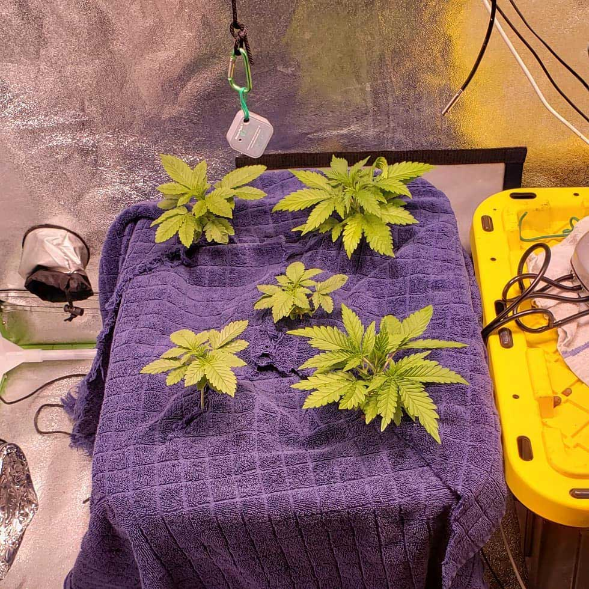

](https://www.growweedeasy.com/wp-content/uploads/2019/12/dwc-hydroponics-towel-to-block-light-farmerjim420.jpg)

In order to accomplish a totally dark reservoir for your marijuana plants, here are some things to keep in mind!

* **Consider the Material & Thickness of the Reservoir Tub** - Darker and thicker material will let less light through to the reservoir.
* **Consider Reflectivity** - Pale colors tend to reflect back more light and heat, but you can always increase the reflectivity later by covering the lid with a reflective material!
* **Check Thoroughly for Light Leaks! **You may need to get down low and look up to see them!
* **Use Opaque Tape to Cover Any Light Leaks **- Electrical tape and [reflective tape](https://www.amazon.com/XFasten-Reflective-White-Silver-Inches/dp/B01F2U2WQM/ref=as_li_ss_tl?rps=1&ie=UTF8&qid=1500018801&sr=8-4&keywords=reflective+tape&refinements=p_85:2470955011&linkCode=ll1&tag=4200a7-20&linkId=7e0bc62aed13542e96f0d64d15fcc812) are great options for covering up places where light is getting through.
* **Use Dark (Light-Proof) Tubing **- Another way to protect the water from light exposure
* **Light-Proof Your Net Pots.** [Neoprene net pot inserts](https://www.amazon.com/Pack-Black-xGarden-Clone-Collars/dp/B07Q3H78C5?pd_rd_i=B07Q3H78C5&psc=1&linkCode=ll1&tag=4200a7-20&linkId=4893d4d7453291d2314297b80a96e343&language=en_US&ref_=as_li_ss_tl) are great to fill in the net pot instead of using clay pebbles, and won't let any light get through.

All the [Hydroguard](https://www.amazon.com/Botanicare-HYDROGUARD-Bacillus-Inoculant-1-Quart/dp/B00IGFH25M/ref=as_li_ss_tl?ie=UTF8&qid=1525715681&sr=8-3&keywords=hydroguard&linkCode=ll1&tag=4200a7-20&linkId=fa4381829bc6432663131bf6ca629a1f), [Great White](https://www.amazon.com/dp/B00A8PG6RI?_encoding=UTF8&psc=1&linkCode=ll1&tag=4200a7-20&linkId=2497b632cd403110521480bd3b2565fb&language=en_US&ref_=as_li_ss_tl), H2O2, or other root supplements in the world often won't solve a root rot problem if there's a light leak!

[Read the Complete Tutorial on Preventing Light Leaks in a DWC Reservoir!](https://www.growweedeasy.com/dwc-stop-light-leaks-in-reservoir)

[

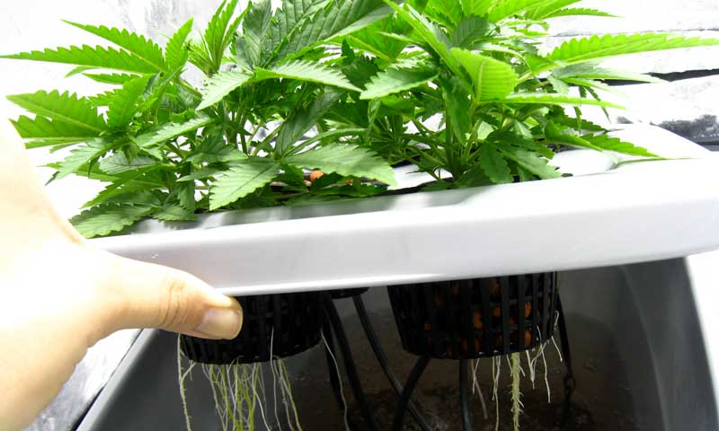

](https://www.growweedeasy.com/wp-content/uploads/2017/07/looking-inside-the-bubble-cloud-roots.jpg)

## **4.) Keep Grow Room Cool**

Lower the temperature of the grow space under 80°F, and even better under 75°F.  This also lowers the temperature of the water in your reservoir. Water can't hold much dissolved oxygen at higher temperatures and your plants need oxygen to "breathe."

Getting more oxygen to the roots not only helps fight root rot, it makes your plants grow much faster. If it's too hot in the grow space, you're much more likely to run into root rot as well as overall droopiness.

In an ideal world, the maximum recommended temperature for the water in your reservoir is around 72°F (22°C) and some growers will go to great lengths to keep their reservoirs very cool. However, when using a great supplement like [Hydroguard](https://www.amazon.com/Botanicare-HYDROGUARD-Bacillus-Inoculant-1-Quart/dp/B00IGFH25M/ref=as_li_ss_tl?ie=UTF8&qid=1525715681&sr=8-3&keywords=hydroguard&linkCode=ll1&tag=4200a7-20&linkId=fa4381829bc6432663131bf6ca629a1f) that fights root pathogens directly, you can often keep the temperature quite a few degrees higher without as a problem.

[Learn how to control the temperature in the grow room](https://www.growweedeasy.com/temperature)

*Cannabis plants like about the same temperature as humans do!*

**5.) Avoid Disturbing Roots, Especially Young Plants**

When it comes to nutrients and plant growth in a hydroponic setup, it's important to watch over your roots and change your reservoir water regularly. This is especially important in the flowering stage when the plant is very sensitive to nutrients and pH. Regularly changing your water every 7-10 days will help your plants get better access to nutrients, and help prevent deficiencies and toxicities.

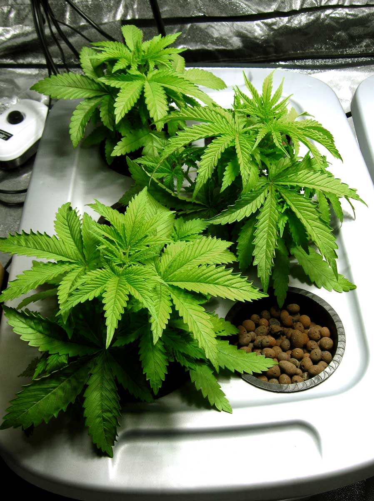

**However**, when your young seedling or clone is first getting established in your hydroponic system, it doesn't have an established a colony of good bacteria around the roots, and has not yet grown a biofilm that protects the roots against pathogens.

During this initial period, a full reservoir change can throw everything off balance, and your roots have to sort of "start over" from the beginning.

That's why if you historically struggle with root rot, it's recommended for the first 3-4 weeks of your cannabis plant's life to only top off the reservoir with additional nutrient water, and hold off on a full reservoir change until your plants have grown lots of roots with a healthy layer of biofilm over all the roots and sides/bottoms of the tank.

**6.) Keep Everything Extremely Clean & Sterile**

In a hydroponic system, make sure that any dead roots, dead leaves or other types of plant debris doesn't get into the reservoir because they will provide a breeding ground for bad bacteria as they start rotting. If you do notice organic matter in the reservoir, fish it out as soon as possible.

You also want to keep your grow area as clean as possible at all times to stop bacteria before it starts. Before you begin your grow, it's a great idea to clean all grow-related items to kill any bacteria or fungus.

**Hydrogen Peroxide (H2O2) Is Only a Temporary Solution: Use alongside something else for more long-lasting prevention!**

Some people recommend treating cannabis root rot with H2O2, also known as* hydrogen peroxide*. While adding hydrogen peroxide to your water will kill most bacteria and pathogens, including the ones that cause root rot, it is only effective in your system for a day or so or since the H2O2 is quickly converted to oxygen and water.

Therefore, if you use hydrogen peroxide as a treatment for root rot, you will need to treat your water *daily *to prevent re-occurrences until you actually fix the problem that is causing your root rot in the first place. I have used commercial grade H2O2 against root rot more than once, and I never saw any noticeable difference, so I would NOT RECOMMEND H202 as any type of long term cure!

**Why Not Use Hydrogen Peroxide?** H2O2 is only temporarily effective at best when it comes to getting rid of root rot. It makes me so sad when people tell growers to use H2O2 (hydrogen peroxide) to kill root rot because I know they will continue to struggle with it. Even the commercial grade stuff just doesn't work most of the time (and I've tried)!

All H2O2 does is cause bubbling near the dead brown roots (or any organic matter), which is why I think people believe it's helping. In my experience, it doesn't help the plants themselves (they don't look any better), and what's worse, all the H2O2 will be completely gone from the water within 24 hours.

H2O2 kills most of the bacteria in the reservoir, including any good bacteria you've added, and does nothing to address the underlying problem. You can't sterilize away root rot, it attacks people everywhere! Although H2O2 does kill bad organisms, it leaves enough of it there to repopulate your reservoir.

**I personally recommend Botanicare [Hydroguard](https://www.amazon.com/Botanicare-HYDROGUARD-Bacillus-Inoculant-1-Quart/dp/B00IGFH25M/ref=as_li_ss_tl?ie=UTF8&qid=1525715681&sr=8-3&keywords=hydroguard&linkCode=ll1&tag=4200a7-20&linkId=fa4381829bc6432663131bf6ca629a1f)** (the newer, improved version of Botanicare's popular "Aquashield" root supplement) for marijuana root problems because I've used it successfully to get rid of more than once case of Root Rot (and by &#8216;successful' I mean new white roots exploded out of the old mushy brown ones and I was able to eventually harvest the buds - look at the pics below).

[

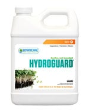

](https://www.amazon.com/Botanicare-HYDROGUARD-Bacillus-Inoculant-1-Quart/dp/B00IGFH25M/ref=as_li_ss_tl?ie=UTF8&qid=1525715681&sr=8-3&keywords=hydroguard&linkCode=ll1&tag=4200a7-20&linkId=fa4381829bc6432663131bf6ca629a1f)

Hydroguard (and their old supplement Aquashield) are also much cheaper than most other similar root treatments, and in my experience more effective.

Take a look at what happens with the roots from using a supplement like Hydroguard.

What you are looking for is **new healthy white roots** growing out of the old brown roots. Eventually, as the root ball gets bigger, you will no longer be able to see the old brown roots. After you start noticing a recovery, some growers will snip off old dead roots, but I often don't.

**Before - Roots *Just *Got Root Rot**

[

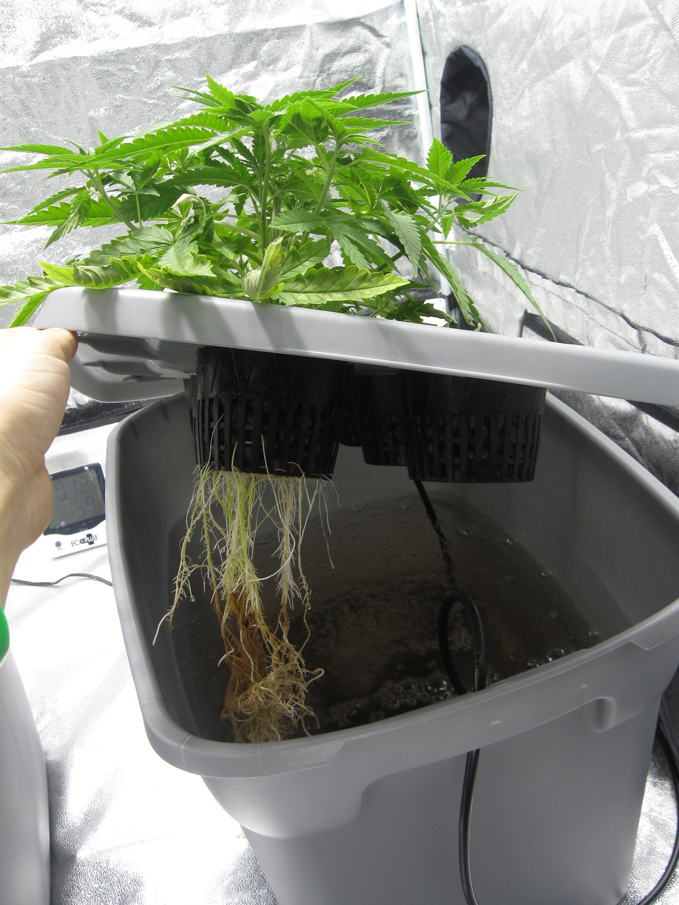

](https://www.growweedeasy.com/wp-content/uploads/2010/10/bad-root-rot-before.jpg)

**Roots are beginning to recover**&#8230;

Notice the new white roots growing out of the old brown dead ones within just a day or two of receiving Hydroguard in the reservoir. By this point, the plant has stopped showing any new symptoms and appears to be growing normally.

[

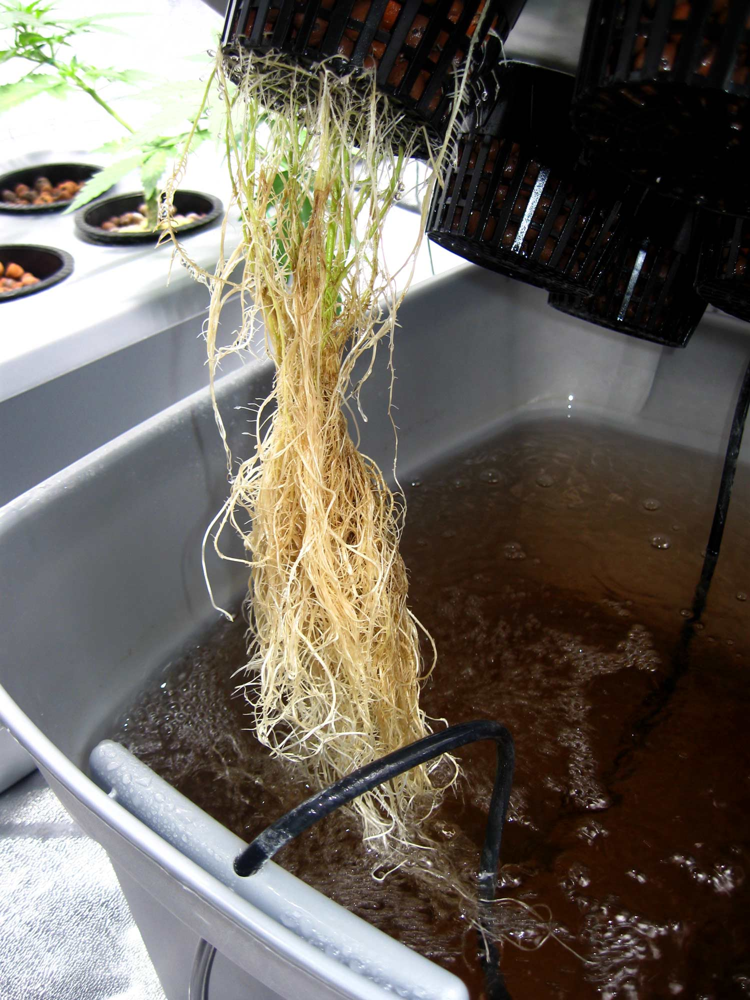

](https://www.growweedeasy.com/wp-content/uploads/2010/10/root-rot-recovering.jpg)

**Roots are now mostly recovered below**&#8230;

Notice that you can barely see any signs of the old brown, and all the new roots generally appear white and healthy. The plants on top are lush, healthy, and fast-growing, though the old burnt leaves never recovered.

[

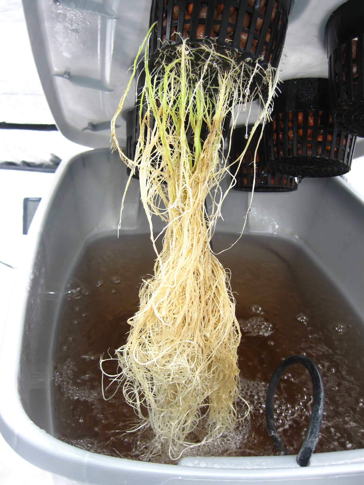

](https://www.growweedeasy.com/wp-content/uploads/2010/10/root-rot-recovery.jpg)

In addition to *treating *root rot, I like to use Hydroguard or as a preventative. It is surprisingly effective even in warm reservoirs. Hydroguard have definitely gotten me through a hot summer before.

Since I first started using Hydroguard in DWC, bubbleponics, and other hydroponics, it has successfully prevented me from getting root rot as long as I keep using it. I also use it when growing in soil if I suspect root problems.

[Read a case study about how another grower was able to get rid of cannabis root rot](https://www.growweedeasy.com/fix-root-rot)

[

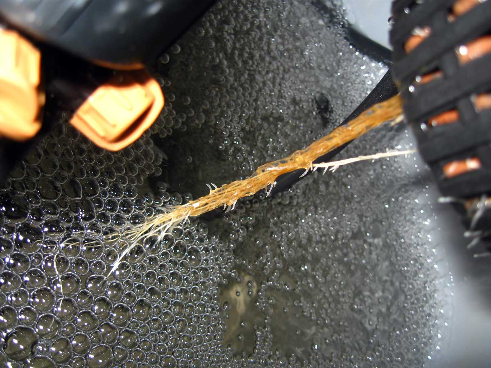

](https://www.growweedeasy.com/wp-content/uploads/2010/10/example-mushy-root-rot-colonize-roots-above-water.jpg)

*Jump to&#8230;*

[Case Study: Root Rot Recovery](https://www.growweedeasy.com/fix-root-rot)

[Other Cannabis Root Problems](https://www.growweedeasy.com/cannabis-root-problems)

[Over-watering Cannabis](https://www.growweedeasy.com/overwatering-cannabis)

[How to Grow Hydroponic Cannabis](https://www.growweedeasy.com/high-yield-bubbleponics-technique)

Yuck! Follow This Tutorial and Never Get Root Rot Again!

## Sulfur Deficiency

**Problem:** A sulfur deficiency is relatively rare and will manifest itself as all-over chlorosis (yellowing of leaves), usually starting with the newer leaves and at first may look like a nitrogen deficiency.

The parts underneath the leaves may take on a pinkish red or orange color. The buds on a flowering plant may start dying off. Unlike most other deficiencies that cause yellowing of the leaves, a sulfur deficiency will start at the back of the leaf and move it's way forward as opposed to starting at the tips.

[

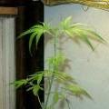

](https://www.growweedeasy.com/wp-content/uploads/2010/04/sulphur-deficiency.jpg)[

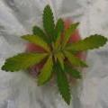

](https://www.growweedeasy.com/wp-content/uploads/2010/04/sulphur-deficiency2.jpg)[

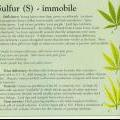

](https://www.growweedeasy.com/wp-content/uploads/2010/04/sulphur-info-marijuana.jpg)

**Solution:** Check and correct your pH to make sure that your sulfur isn't being locked out. Sulfur moves slowly through the plant so it may take a few days after you fix the problem before you start noticing an improvement in your plant.

## Tobacco Mosaic Virus (TMV)

by Nebula Haze

Can Tobacco Mosaic Virus (TMV) spread to cannabis plants? Yes. Several mosaic viruses have been detected in cannabis plants (including tobacco mosaic virus, cucumber mosaic virus, and alfalfa mosaic virus) by the [Canadian government](https://www2.gov.bc.ca/assets/gov/farming-natural-resources-and-industry/agriculture-and-seafood/animal-and-crops/plant-health/disease-factsheets/specialty-crops/diseases_of_cannabis_in_british_columbia.pdf). However, there isn't much evidence of widespread transmission of mosaic virus in cannabis plants. Unfortunately, some plants that test positive may not have visible symptoms, and some plants that test negative may actually have the virus. *Note:* [Hop latent viroid](https://www.growweedeasy.com/how-serious-is-hop-latent-viroid-for-growing-cannabis) and [beet curly top virus](https://www.growweedeasy.com/cannabis-plant-problems/beet-curly-top-virus) can also affect cannabis plants.

Should you be worried about TMV infecting your cannabis plants? Probably not.

[

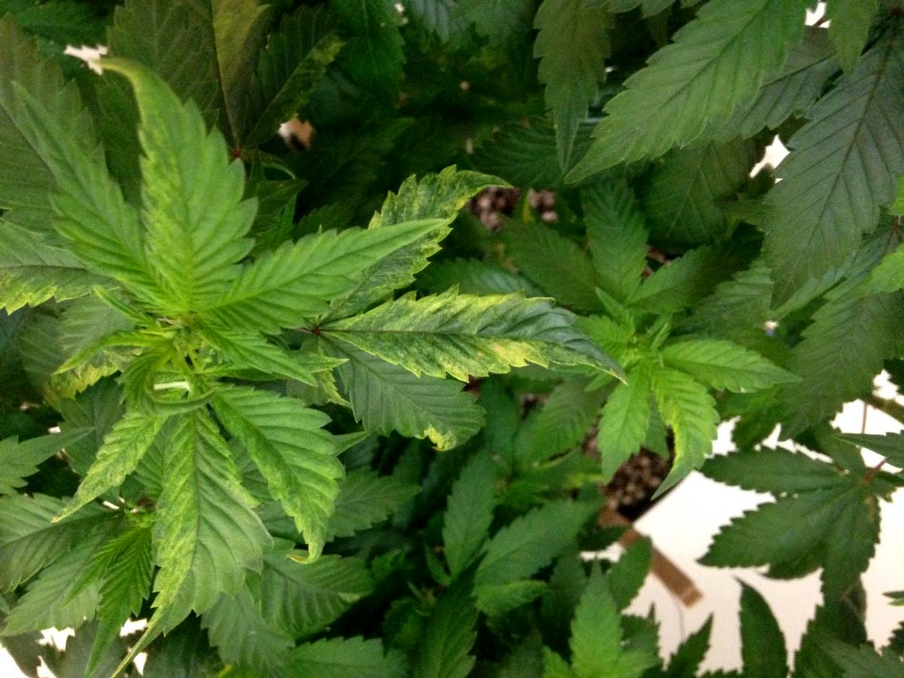

](https://www.growweedeasy.com/wp-content/uploads/2016/01/tmv-tobacco-mosaic-virus-marijuana-plant.jpg)

**What is Tobacco Mosaic Virus anyway?** TMV is a virus that is commonly found in tobacco plants which causes splotchy or twisted leaves, strange mottling symptoms (a "mosaic"), slowed growth, and reduced yields. Mosaic virus has spread to several other species of plants besides tobacco, including cannabis plants.

*Note:* Mosaic virus doesn't affect humans, but plants that get infected by mosaic virus may not grow as fast or yield as well as they could have.

**Did you Know? Tobacco Mosaic Virus was the first virus *ever* to be discovered.**

The mosaic virus was [first identified in tobacco plants in 1892](https://www.ncbi.nlm.nih.gov/pubmed/11570281) but is now known to infect at least 125 species of plants, including tomatoes, peppers, cucumbers, and many types of flowers. It can live in the soil but mainly travels from plant to plant by direct contact. It can also be transferred from one plant to another via your hands. Some growers have claimed to see the symptoms after exposing their plants to tobacco.

The mosaic virus can attack a wide range of plants, but has it spread to our beloved herb marijuana?

Here's a pic of a **tobacco plant** with confirmed TMV - the mottled leaves are the main symptom of the virus besides overall slow growth.

[

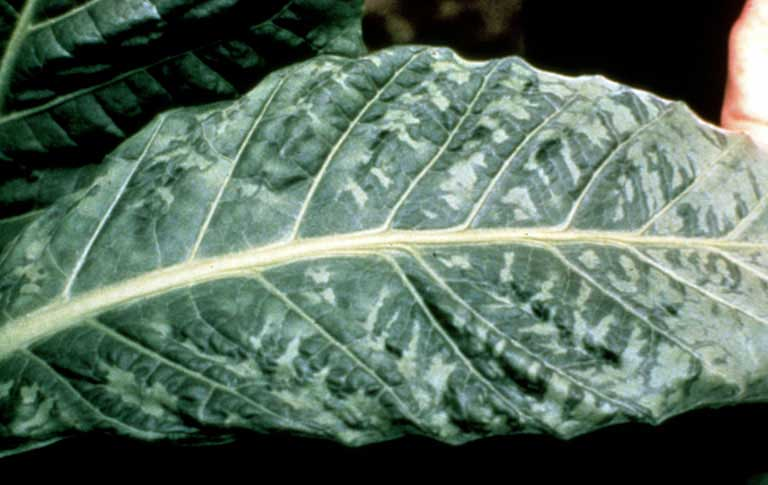

](https://www.growweedeasy.com/wp-content/uploads/2016/01/tobacco-mosaic-virus-symptoms-tobacco.jpg)

Here's a pic of a squash plant that has caught Mosaic Virus

[

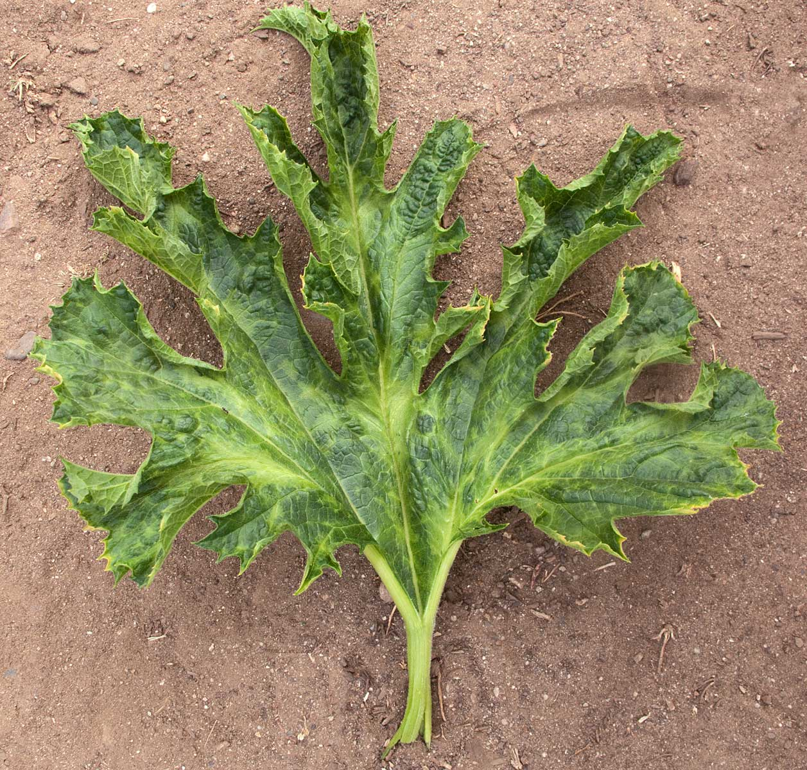

](https://www.growweedeasy.com/wp-content/uploads/2016/01/squash-mosaic-virus.jpg)

*Euphorbia viguieri* plant infected with mosaic virus

[

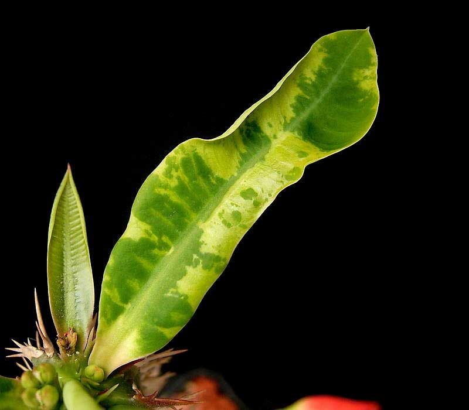

](https://www.growweedeasy.com/wp-content/uploads/2016/01/tmv-mosaic-virus-euphorbia-viguieri.jpg)

Several leaves throughout the plant can display symptoms, or it may just be one or two leaves. Typically the twisted growth is accompanied by a speckling/mosaic pattern. To make things complicated, some plants are silent carriers and may never show any symptoms.

Can Cannabis Plants Catch Mosaic Virus?

Now the real mystery. Can mosaic virus spread to cannabis plants? And if it can, what are the symptoms and how do you get rid of it?

Is there a "cannabis mosaic virus" out there? Some growers believe mottled leaves could be signs of the virus in cannabis plants

[

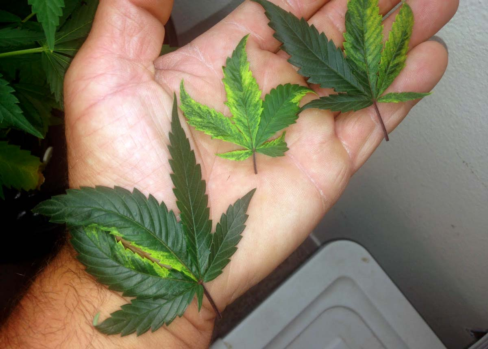

](https://www.growweedeasy.com/wp-content/uploads/2016/01/mosaic-pattern-on-cannabis-leaves-caused-by-tmv.jpg)

The following pictures display the symptoms that many marijuana growers believe to be the result of mosaic virus. Symptoms may include twisted or curved leaves, yellow stripes, spots, and a mosaic pattern. Yet these symptoms could also be caused by plant problems such as [heat](https://www.growweedeasy.com/cannabis-plant-problems/heat-light-stress), [root problems](https://www.growweedeasy.com/cannabis-plant-problems/root-problems-cannabis), general stress, [nutrient deficiencies](https://www.growweedeasy.com/cannabis-symptoms-pictures), etc. There's also the possibility of a mutation or other genetic factors.

The most common symptom attributed to TMV is the appearance of uneven stripes on leaves of light and dark green. Yellowing is worse on the parts of the leaves that are deformed and twisted. The dark green areas tend to be somewhat thicker than the lighter portions of the leaf.

Curved leaves with yellow stripes or mottling are the most common symptom attributed to mosaic virus.

[

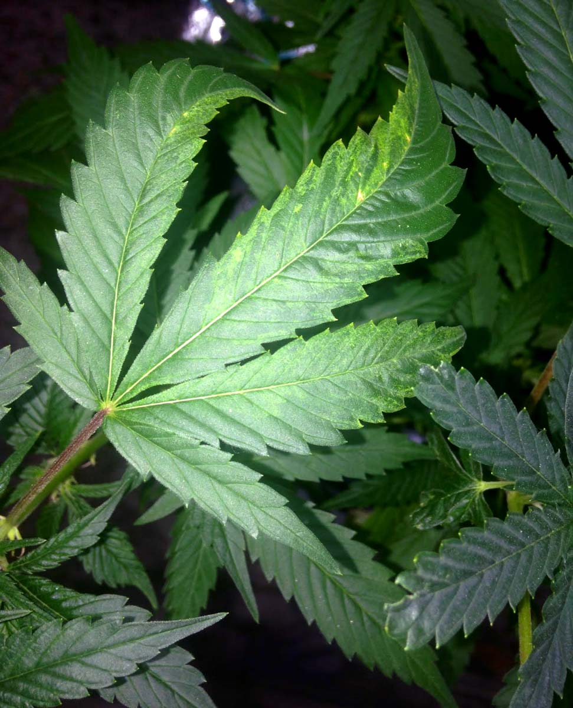

](https://www.growweedeasy.com/wp-content/uploads/2016/01/twisted-leaf-yellow-stripes-spots-caused-by-tmv.jpg)

TMV-affected plants are said to grow slow, seem sickly, and generally produce poor yields.

Some growers swear their crops have been greatly affected by TMV, while others deny that it's actually even spread to cannabis plants at all. The mosaic virus can be difficult to test for, even in a lab. The main problem with TMV from a grower's perspective is that it may cause plants to grow slowly and produce poorly. If your plant is growing fast and healthy, with no other symptoms, and you're not noticing it spreading from plant to plant, you probably don't need to worry.

The cannabis pictures presented today appear to follow the symptoms of mosaic virus in other plant species, but so far I haven't confirmed any cases of a positive TMV test that *also *displayed these symptoms. What do you think? Just regular plant variation or something more?

Do these cannabis plants have mosaic virus?

[

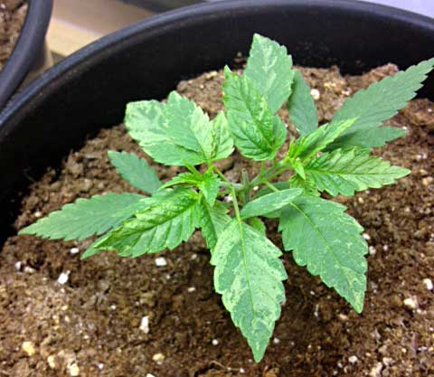

](https://www.growweedeasy.com/wp-content/uploads/2016/01/possibly-tmv-tobacco-mosaic-virus.jpg)

At this point, cannabis growers haven't confirmed that these leaf symptoms are caused by mosaic virus or something else

[

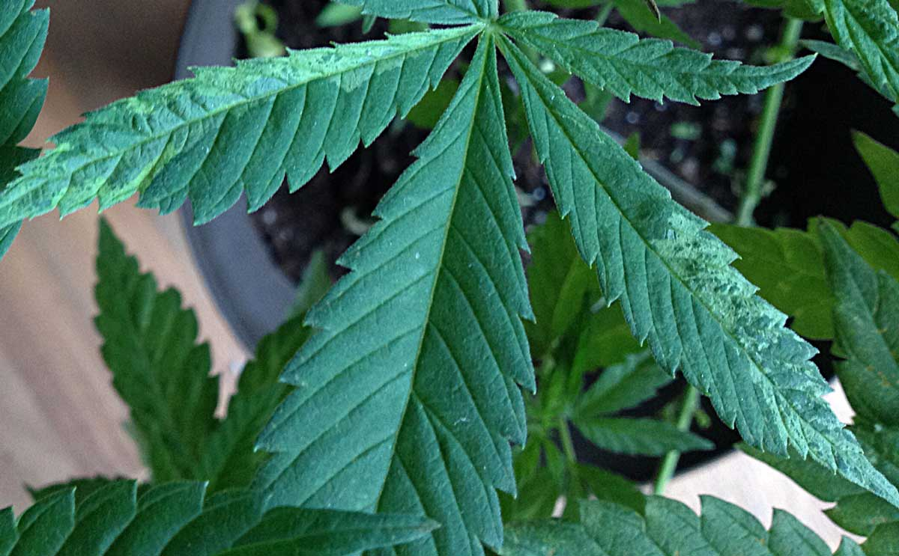

](https://www.growweedeasy.com/wp-content/uploads/2016/01/could-it-be-tmv-marijuana.jpg)

Unfortunately, few cannabis growers have the equipment or the means to test if a plant actually has TMV.

**Can TMV spread to cannabis plants?** Yes, but&#8230;

* **Not much evidence for symptoms** - Although mosaic virus has been found in cannabis plants, I haven't confirmed any cases of the TMV plants showing symptoms of stripes. There is still a lot to learn.
* **Tests often come back negative** - The Florida Department of Agriculture has tested several cannabis and hemp plants showing symptoms, yet none tested positive for mosaic virus. However, the [Canadian government](https://www2.gov.bc.ca/assets/gov/farming-natural-resources-and-industry/agriculture-and-seafood/animal-and-crops/plant-health/disease-factsheets/specialty-crops/diseases_of_cannabis_in_british_columbia.pdf) did find both multiple types of mosaic virus including tobacco mosaic virus in some cannabis plant samples. If you know of any other positive tests for mosaic virus in cannabis, please [let us know!](https://www.growweedeasy.com/website-feedback)
* **Similar symptoms to other problems **- Many common issues can cause similar symptoms, including [incorrect pH](https://www.growweedeasy.com/ph), [watering problems](https://www.growweedeasy.com/how-often-water-marijuana), [root problems](https://www.growweedeasy.com/cannabis-root-problems), [deficiencies](https://www.growweedeasy.com/cannabis-symptoms-pictures), etc.
* **Affected plants don't always seem infectious** - I've had a few plants display these symptoms over the years. When I saw the symptoms, I tried to "infect" other plants in the grow tent by rubbing their leaves together with the affected seedlings, and it never spread to the other plants. I've spoken to several other growers who've had similar experiences where they see symptoms on one plant but it never infects the rest of the grow room.
* **Could be genetics -** Following on the last point, it's possible the symptoms are sometimes the result of genetic variation. For example, I grew a few plants of a strain called "Purple Sunset" and all the seedlings displayed the mottling and stripes. Yet the symptoms never spread to the several other plants in the grow tent. About a year later, I germinated more Purple Sunset seeds and saw the symptoms again. Just like the first set, the seedlings grew fast and healthy, but some of the leaves showed the odd stripes. I contacted the breeder about it, and he told me that he's noticed some seedlings of this strain do that when grown under LEDs. To me, this is evidence the symptoms may be triggered by genetic factors as opposed to a virus.

The red arrow in the picture below points to a Purple Sunset seedling with mosaic stripes on the leaves. I tried rubbing the leaves on the other plants, but the symptoms never spread. The seedling grew fast and healthy despite the stripes, and after a few weeks the leaves started growing normally.

[

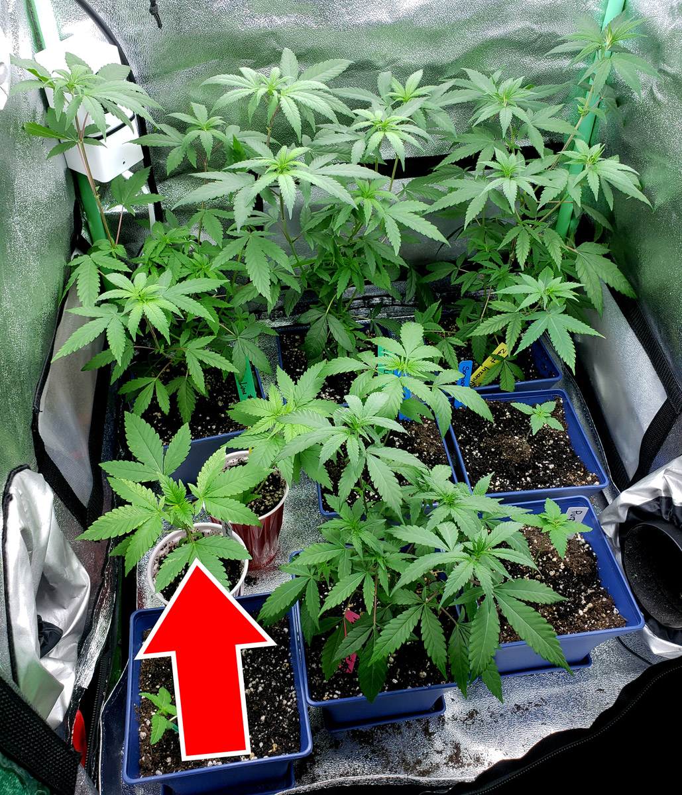

](https://www.growweedeasy.com/wp-content/uploads/2018/07/plant-with-mosaic-stripes-but-no-tmv-sm.jpg)

Here's a closeup. Other Purple Sunset plants from the same batch of seeds produced the same markings as seedlings, but (again) didn't seem contagious. Were the markings the result of genetics?

[

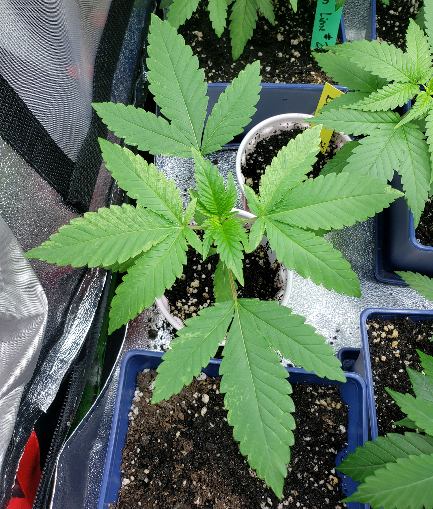

](https://www.growweedeasy.com/wp-content/uploads/2018/07/not-tmv-mosaic-stripes-on-leaves.jpg)

**Conclusion:** There isn't much information about how often mosaic virus spreads to cannabis plants, and exactly what symptoms it may cause. The traditional TMV symptoms can be caused by other factors and sometimes appear on otherwise healthy plants without signs of spreading. That doesn't mean cannabis plants can't get mosaic disease, but the appearance of mottling isn't necessarily a cause for alarm.

This cannabis plant has yellow spots or speckles that appear on the unhealthy parts of the leaves. Is it mosaic virus? It could be, but probably not.

[

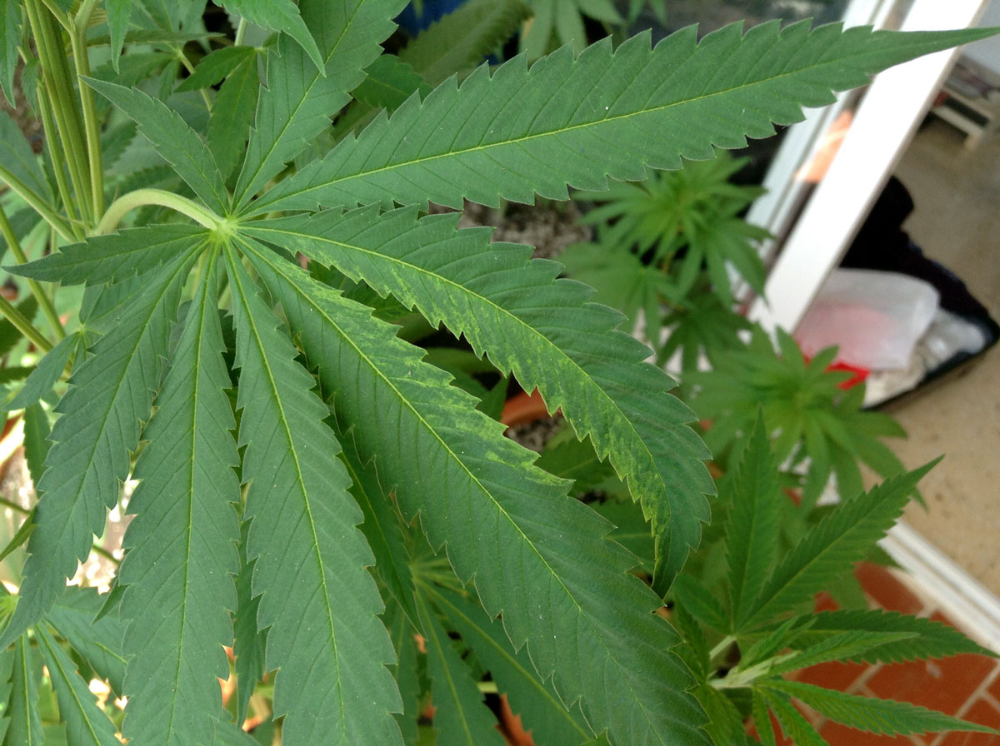

](https://www.growweedeasy.com/wp-content/uploads/2016/01/marijuana-tmv-mosaic-virus-twisted-leaf.jpg)

But the virus can infect cannabis plants. Just because the symptoms aren't *always* caused by mosaic virus doesn't mean the symptoms are *never* caused by mosaic virus. Should you be worried?

If you look at the big picture, the main worry with mosaic virus is that your plants become sick and slow-growing. That means there's not much to worry about if plants are otherwise healthy and fast-growing without any sign of symptoms spreading.

**Don't worry about TMV if&#8230;**

* Plants with mottle leaves are otherwise healthy and fast-growing
* Symptoms aren't spreading from plant to plant
* It seems to be genetic (for example common among all plants of a strain) but you're not seeing symptoms on unrelated plants
* You think [another problem](https://www.growweedeasy.com/cannabis-symptoms-pictures) may be causing the symptoms, such as nutrient deficiencies, root problems, heat stress, etc.

A plant virus can be hard to pin down, since many factors cause similar symptoms. Just remember that (if it does exist) mosaic virus appears to be relatively rare in marijuana plants.

**How do you treat a cannabis plant that has mosaic virus? **

If you believe you're seeing an infection, you likely should treat cannabis the same as other species of plants that can catch mosaic virus.

Now here's the bad news. Unfortunately, when it comes to mosaic virus, there is no cure. An infected plant will have TMV forever, even if it's not actively showing symptoms. If you believe you have a marijuana plant with TMV, your main goal is to carefully remove the plant while preventing the virus from spreading to other plants.

In greenhouse and commercial operations, the main way to deal with mosaic virus is to dispose of all affected plants, including any soil they were growing in, and enforce a strict policy of hand-washing between touching plants. Luckily TMV probably won't kill your plants, and there's no evidence it will hurt you, but if infected plants grow slower and end up producing smaller yields, you definitely want to keep them out of your marijuana garden.

Have you ever seen cannabis plants infected by Mosaic Virus? [Let us know!](https://www.growweedeasy.com/website-feedback)

**Could the Symptoms be Caused by Something Else?**

Some cannabis plants may show mutations such as variegation (two-toned leaves), and this normal and natural phenomenon may be confused for TMV. One difference is the plant otherwise grows fast and healthy.

[Two-toned leaves](https://www.growweedeasy.com/weird-or-what#two-toned-leaves) (variegation) are a common mutation. Nothing to worry about if plants are otherwise healthy and fast-growing.

[

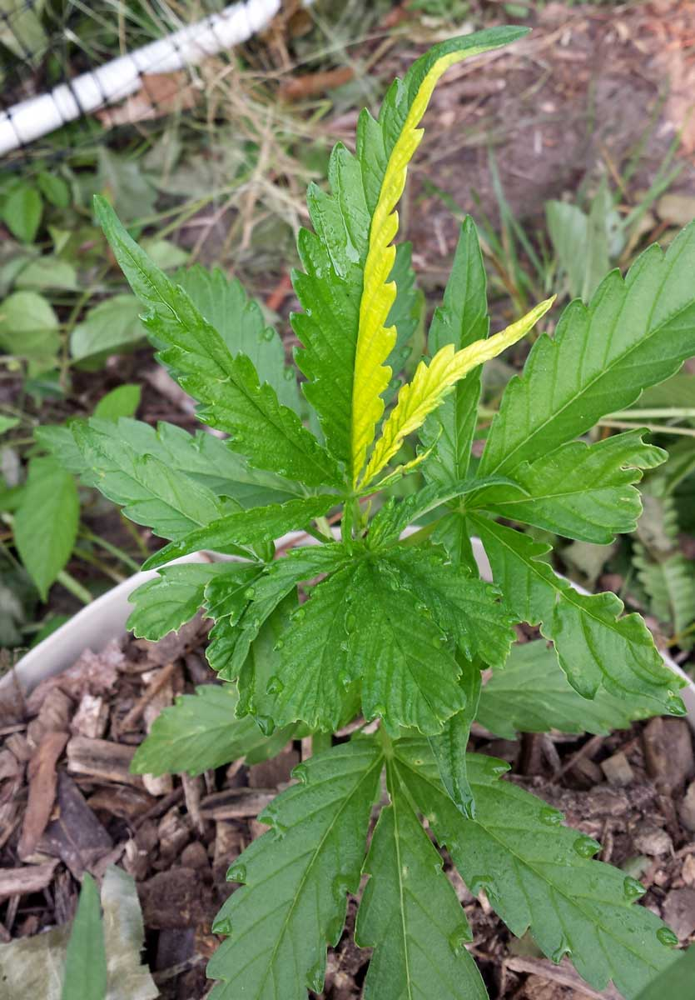

](https://www.growweedeasy.com/wp-content/uploads/2013/12/two-tone-marijuana-leaf.jpg)

[Thrips](https://www.growweedeasy.com/cannabis-plant-problems/thrips) are a common plant pest which may cause leaf symptoms that are reminiscent of mosaic disease symptoms

[

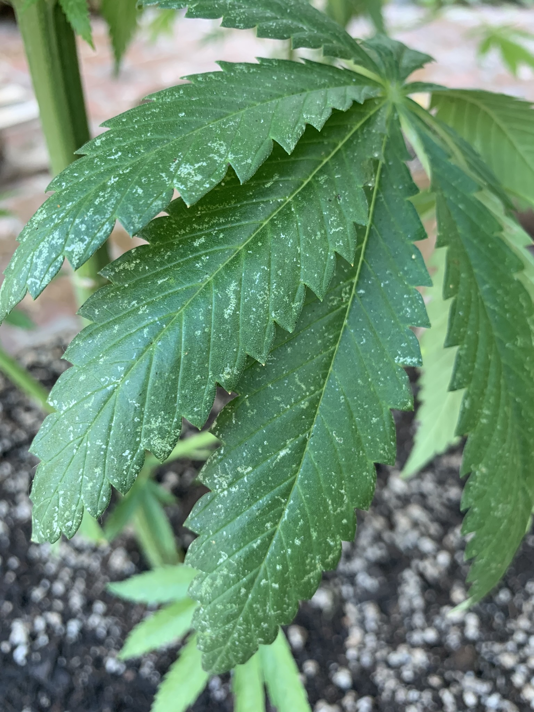

](https://www.growweedeasy.com/wp-content/uploads/2019/08/thrips-leaf-damage-jennybee698.jpg)

Because other plant problems can cause similar symptoms, it's always a good idea to investigate and see if it might be something else!

[Diagnose Your Sick Plant!](https://www.growweedeasy.com/cannabis-symptoms-pictures)

[

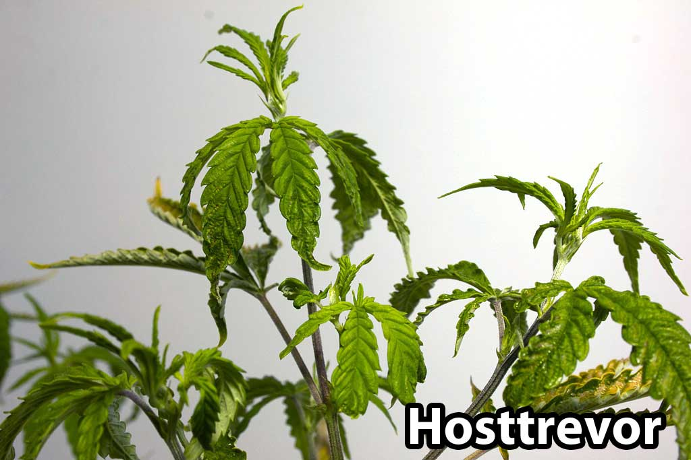

](https://www.growweedeasy.com/cannabis-broad-mites)

Background: How Does TMV Spread?

"Mosaic" disease is caused by a virus. The tobacco mosaic virus is very stable and can persist in contaminated soil, in infected plant debris, on or in the seed coat, and in manufactured tobacco products. The virus is transmitted readily from plant to plant by mechanical means.

This may simply involve picking up the virus while working with infected plant material, then introducing it to healthy plants by rubbing or brushing against them with contaminated tools, clothing, or hands.

**Virus plant diseases cannot be "cured" once a plant is infected!**

Therefore, every effort should be made to prevent the introduction of virus diseases into the garden.

Sanitation and cleanliness are the primary means of controlling virus diseases. Infected plants should be removed immediately to prevent the spreading of the pathogen. The use of tobacco products during cultural practices should be avoided to prevent infecting plants with tobacco mosaic virus. Anyone who uses tobacco or works with infected plant material should wash their hands thoroughly in soapy water before handling marijuana plants.

[More Cannabis Pests, Bugs & Viruses](https://www.growweedeasy.com/bugs-pests-symptoms-marijuana-grow)

*Jump to&#8230;*

[Cannabis bugs, mold, and other annoying pests!](https://www.growweedeasy.com/bugs-pests-symptoms-marijuana-grow)

[Diagnose Your Sick Plant!](https://www.growweedeasy.com/cannabis-symptoms-pictures)

[How to stop marijuana nutrient deficiencies](https://www.growweedeasy.com/ph)

[7 Steps to Cure Most Marijuana Growing Problems](https://www.growweedeasy.com/growing-marijuana-plant-problem-deficiency)

## Under-watering

**Problem:** If your plant is drooping, then it's usually a sign of either **over **or **under**-watering.

**Cannabis Underwatering Symptoms**

* drooping (plants often get better after being watered)
* leaves often seem "papery" and thin because they don't have any water inside them. (This is opposed to [overwatering](https://www.growweedeasy.com/overwatering) where the leaves often feel bloated and "fat" from all the water contained inside)
* chronic underwatering eventually leads to yellowing leaves and nutrient deficiencies

If your soil or soilless medium looks bone dry every time you water, or if you know that your roots have dried out, than skip right down the the [solution](#underwatering-cannabis-solution) section, as you definitely have a case of underwatering.

Under-Watered Cannabis Seedlings - Leaves feel papery and thin, growing medium is dry

[

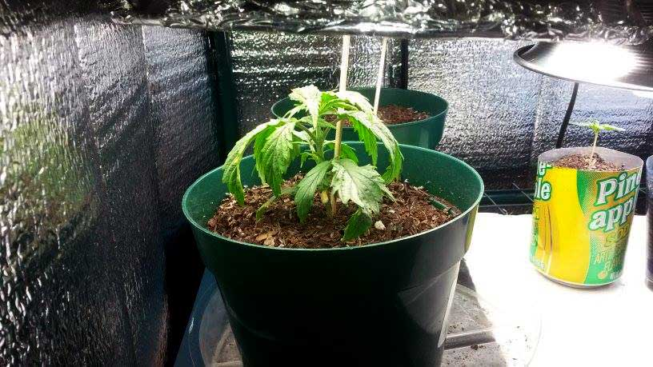

](https://www.growweedeasy.com/wp-content/uploads/2011/02/under-watered-cannabis.jpg)

If it gets worse&#8230;.

[

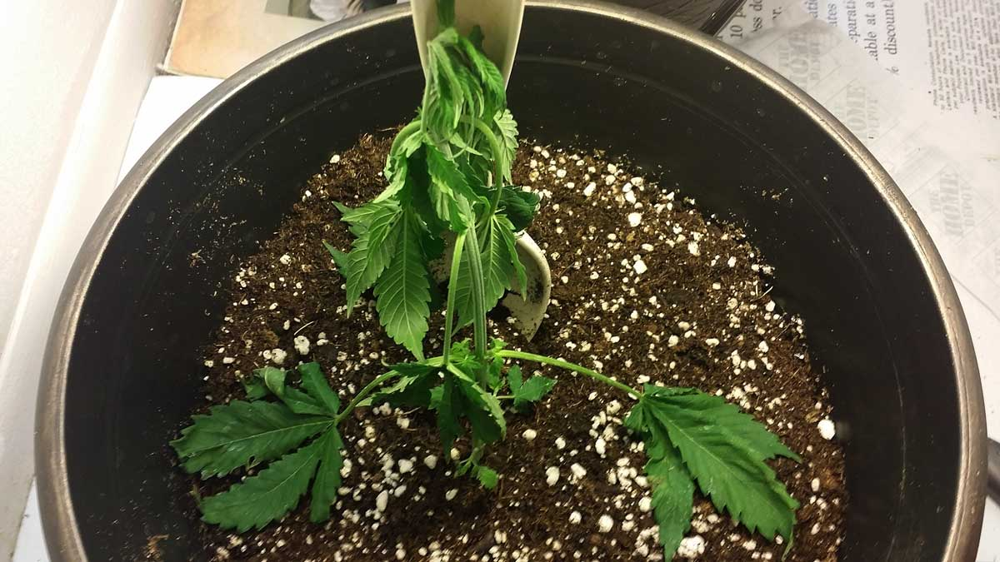

](https://www.growweedeasy.com/wp-content/uploads/2011/02/example-underwatered-cannabis.jpg)

The marijuana plant in the middle is under-watered, causing it to droop. Because it was taller and directly under the grow light, it became underwatered even though it was getting the same amount of water as its siblings. Sometimes you'll see signs of under-watering immediately after upgrading your grow lights (if you don't change your watering habits), because all the plants start drinking more due to the extra light and heat.

[

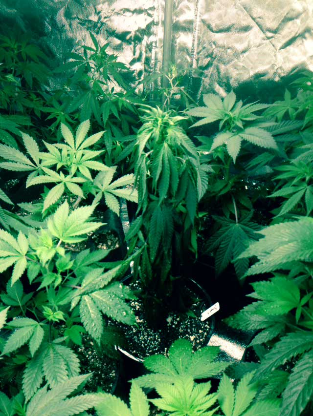

](https://www.growweedeasy.com/wp-content/uploads/2010/10/under-watered-marijuana-plant.jpg)

**Chronic Under-Watering (Under-Watering on a Regular Basis)**

Most growers tend to give too much - not too little - water to their plants. However, if you're spending long periods away from your marijuana plants or the containers are drying up in less than a day or two, it may mean that your plant needs to be watered **more often**, or be given **more water at a time**.

It's also common to under-water when plants start overgrowing their pots, or if growers get on a schedule of giving a specific amount of water as opposed to paying attention to the soil.

* plant may need to be watered more often
* plant may need more water at a time
* plant may have overgrown its pot and need to be [transplanted](https://www.growweedeasy.com/transplant)

It can be difficult to diagnose chronic underwatering because problems may look like nutrient deficiencies. One big clue is that plants perk up every time after you water.

Chronically Under Watered Seedlings - These yellow leaves are actually caused by the plants being slightly under-watered on a regular basis

[

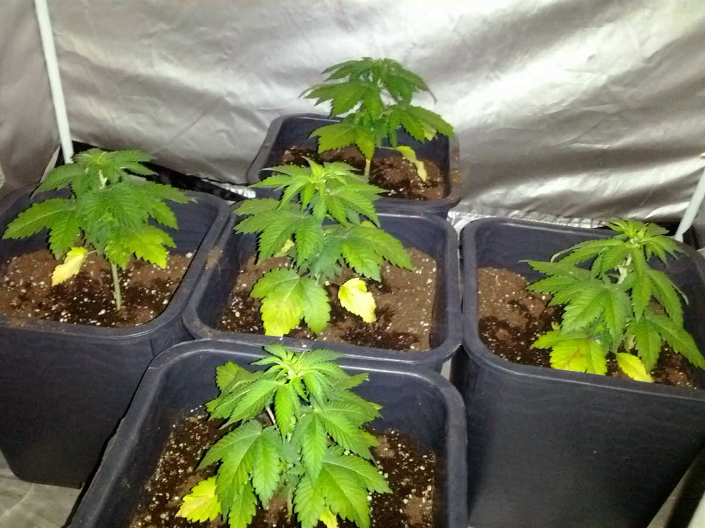

](https://www.growweedeasy.com/wp-content/uploads/2010/10/chronic-underwatering-causes-yellow-leaves.jpg)

The curling/clawing and burnt tips on the following two plants may look like it could be caused by another problem, but in this case the symptoms are the result of the plant being regularly under-watered

[

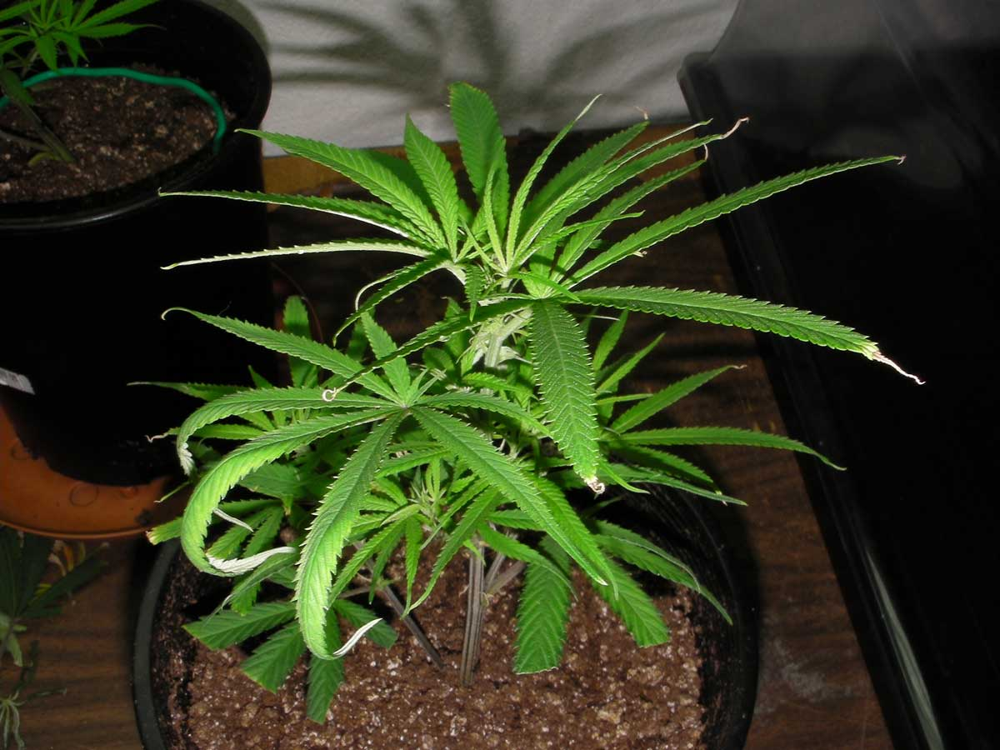

](https://www.growweedeasy.com/wp-content/uploads/2010/10/underwatered-cannabis-plant-curling-leaves-burned-tips2.jpg)

Notice how the leaves are clawing and tips appear burnt alomost like [nutrient burn](https://www.growweedeasy.com/nutrient-burn-cannabis). It's happening because the plant isn't getting enough water on a regular basis.

[

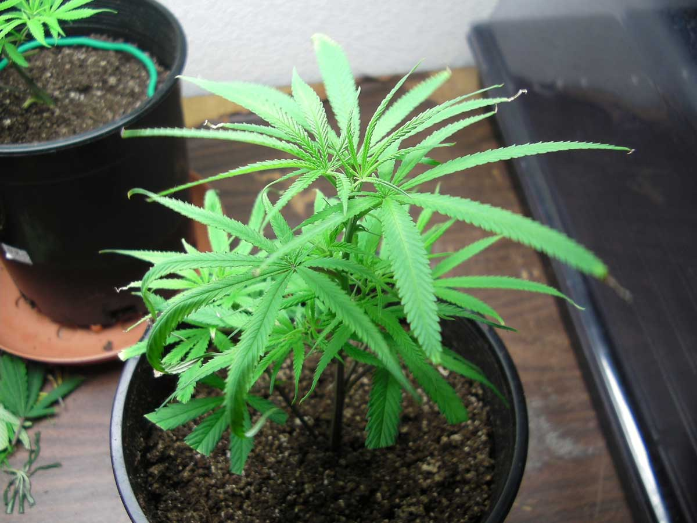

](https://www.growweedeasy.com/wp-content/uploads/2010/10/underwatered-cannabis-plant-curling-leaves-burned-tips.jpg)

The leaves near the buds of this male cannabis plant started turning yellow. In this case, the grower determined it was because the plant had overgrown its pot and was drinking more than expected, and as a result the soil was getting too dry between waterings.

[

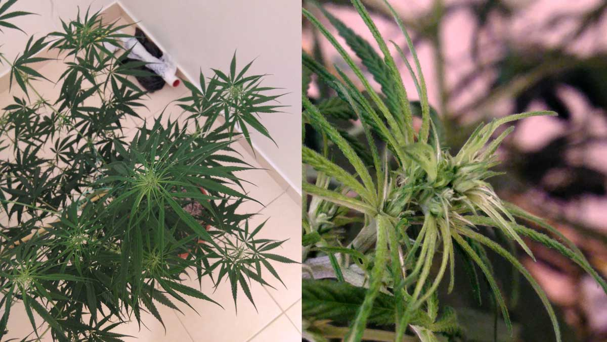

](https://www.growweedeasy.com/wp-content/uploads/2010/10/male-plant-root-problem-chronic-under-watering.jpg)

More examples of under-watered cannabis plants

[

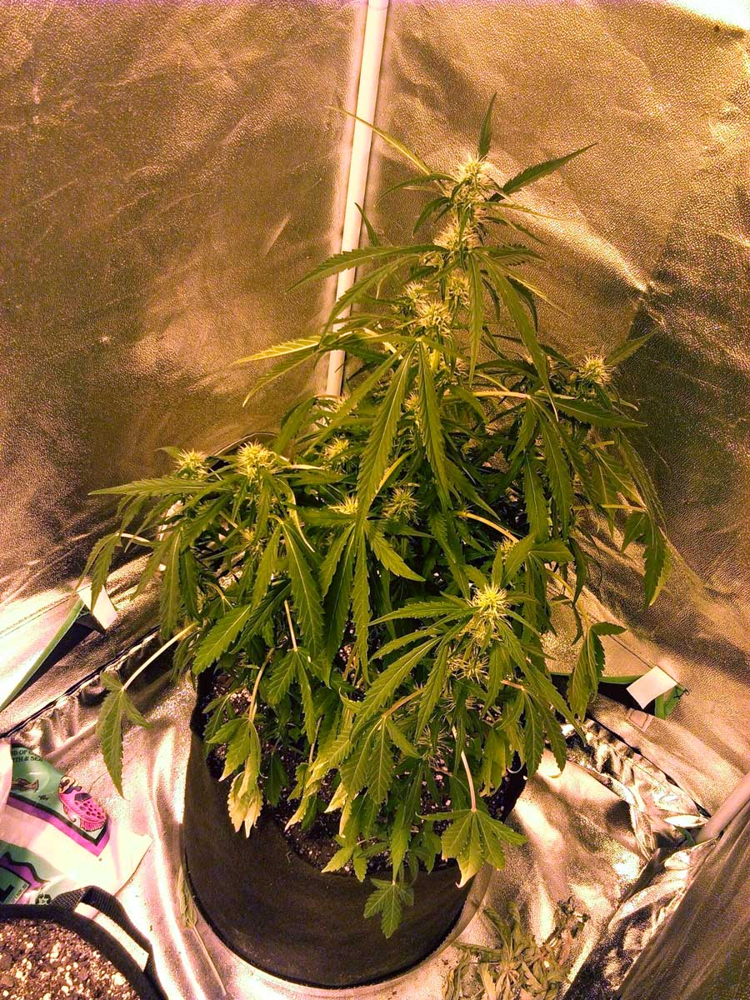

](https://www.growweedeasy.com/wp-content/uploads/2010/10/underwatered-wilting-droopy-cannabis.jpg)

Extreme underwatering on a big plant

[

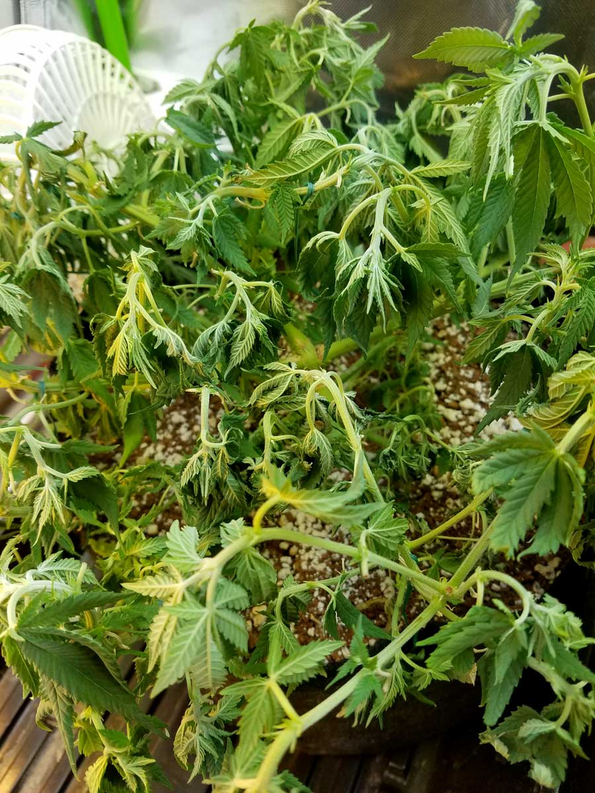

](https://www.growweedeasy.com/wp-content/uploads/2010/10/extremely-underwatered-cannabis-plant.jpg)

*Not Sure?* If you're not sure whether your plant needs more or less water, how do you figure out exactly why your plant is drooping?

**1.) Determine: Is my plant *over*-watered?**

A cannabis plant does not get over-watered because it's given too much water at once - overwatering is caused by the plant being watered too often, or if the plant does not have proper drainage (which means the growing medium is taking too long to dry out).

**2.) If not over-watered, does my plant have root problems?**

Growing hydroponically? When you see signs of wilting and overwatering in a plant that is growing hydroponically with the roots in water, usually that's a sign of a root problem like [root rot](https://www.growweedeasy.com/root-rot-cannabis).

In fact, all cannabis plants can sometimes display wilting/drooping symptoms that are actually the result of [root problems](https://www.growweedeasy.com/cannabis-root-problems).

**3.) You may be seeing symptoms of under-watering**

So if you read the short description in step 1 about what causes overwatering (and you're sure you haven't overwatered your cannabis plants), and you're certain you're not seeing signs of root problems, than your cannabis plant might be drooping or wilting because it needs more water.

If you've been underwatering your plant, its leaves will look limp and lifeless, like these plants.

[

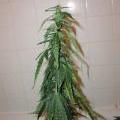

](https://www.growweedeasy.com/wp-content/uploads/2010/04/underwatering-marijuana-plant.jpg)[

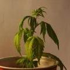

](https://www.growweedeasy.com/wp-content/uploads/2010/04/weed-under-watered.jpg)

Symptoms of underwatering look the same whether your cannabis plant is growing in **soil **or a **soilless growing medium** like coco coir or perlite.

[How can I tell if my cannabis plant is over or under-watered?](https://www.growweedeasy.com/drooping-over-water-cannabis-vs-under-water-cannabis)

[Does my plant actually have root problems?](https://www.growweedeasy.com/cannabis-root-problems)

**Solution**: 

Don't wait until leaves droop to water your potted cannabis plant! While it is generally a good idea to let your potted cannabis plant dry out a bit after watering (watering too often causes its own problems), you should always water your cannabis plants again before the leaves start drooping.

This is the case for cannabis plants grown in both soilless growing mediums and soil.

First-time growers tend to overwater their plants, but underwatering happens too.

**So you're pretty sure your plant is under-watered. **A thirsty cannabis plant will usually perk up quickly after the roots are given water.

[Click here to see time-lapse of under-watered marijuana plant coming back to life](https://www.growweedeasy.com/wp-content/uploads/2010/04/time-lapse-of-under-watered-marijuana-plant-coming-to-life.gif)
 1 picture taken every 75 minutes. Strain is Island Sweet Skunk. [Used with permission](http://www.reddit.com/r/trees/comments/byg53/a_time_lapse_of_my_under_watered_plant_coming/). By micks_trichs.

[Watch another time-lapse - middle plant is very under-watered and perks up after getting water](https://www.growweedeasy.com/wp-content/uploads/2010/10/underwatered-back-to-life-mikes_trichs.gif)
 6 plants, 1 photo per minute for 125 minutes. [Used with permission](http://www.reddit.com/r/trees/comments/bzjqg/6_plants_1_photo_per_minute_for_125_minutes/). By micks_trichs.

Learn about ones of the best ways to properly water your potted cannabis plant every time&#8230;

**How to water cannabis properly** (for soil and most soilless mediums)

* 

**Wait Until Plant Needs Water **- Wait until the top of the growing medium is dry about a half inch deep (up to your first knuckle). Preventing the topsoil from staying wet for long periods of time can also help prevent bugs like [fungus gnats](https://www.growweedeasy.com/fungus-gnats). Some growers prefer the "lift the pot" method to figure out when plants want water, where they actually lift the plant to see if it feels light from lack of water. Some non-soil growers, especially in coco or a very high-drainage growing medium, may water a little earlier when the top is just starting to dry out because it's more difficult to overwater plants in that type of environment. If you continue running into problems with underwatering, you might consider watering more often than is generally recommended. It may be you need extra watering due to small pot size, rootbound plants, temperature, humidity, etc.

* 

**Water until you get a little runoff.** If using nutrients in the water, add water until you see 10-20% extra runoff water drain out the bottom of your pot. This helps prevent nutrient buildup in the soil and if you have good drainage this type of watering schedule causes plants to grow faster than if you don't water to runoff (it also makes it much harder to under-water your plants). If *not* using added nutrients (plants getting all nutrients from the soil, for example in a [super soil](https://www.growweedeasy.com/organic-super-soil) setup), then only water until you get just a tiny bit of runoff out the bottom, so you're not washing out your nutrients. However, you still want to make sure you're saturating your medium - you don't want dry spots in the soil!

* 

**Go back to step 1. **If water does not come out quickly or pots take more than 5 days to dry out for step 1, you may have a [drainage](https://www.growweedeasy.com/how-often-water-marijuana#drainage) problem or need to give less water at a time until your plant is drinking more. If pots are drying out in just 1-2 days, you may need to give more water at a time, or [transplant](https://www.growweedeasy.com/transplant) to a bigger [pot](https://www.growweedeasy.com/choose-right-pot).

[Learn more about how to water your cannabis plants perfectly every time](https://www.growweedeasy.com/how-often-water-marijuana)

A simple way to tell if a potted plant is ready to be watered is to pick it up and tell if it feels heavy or not.

As plants use up all the water in their pot, it will get lighter. If you need something for comparison, you can get an extra pot and fill it with your growing medium. Now you can use this extra container for comparison with your potted plants as it represents the &#8216;dry weight' of your growing medium. If you pick up a potted plant and its feels just slightly heavier than your dry pot, then you know it's time to water your plant. After a while you get a feel for how heavy your plants need to be and you may not even need the extra pot anymore.

**Need more help?**

If your plant is experiencing "the claw" and not just normal drooping (the ends of leaves are curling like a claw or pointing down like talons), then you may actually have a [nitrogen toxicity](https://www.growweedeasy.com/nitrogen-toxicity-cannabis) (too much nitrogen).

**These Plants Are NOT Over or Underwaterd, These Leaves Show Signs of
 [Nitrogen Toxicity](https://www.growweedeasy.com/nitrogen-toxicity-cannabis)
 ("The Claw", tips bent down, curling / clawing, dark green leaves)**

 

*Jump to&#8230;*

[Cannabis plant problems by picture](https://www.growweedeasy.com/cannabis-symptoms-pictures)

[7 Steps to Cure 99% of Cannabis Growing Problems](https://www.growweedeasy.com/growing-marijuana-plant-problem-deficiency)

[Am I overwatering my cannabis?](https://www.growweedeasy.com/overwatering-cannabis)

[Prevent nutrient problems by managing pH](https://www.growweedeasy.com/how-do-i-check-the-pH-of-my-water)

## White Powdery Mildew

*by Sirius Fourside*

Have you seen white spots on your leaves? Are your leaves dusted with round patches of powder that look like flour?

If so, you're most likely dealing with White Powdery Mildew, also known as White Powdery Mold or just "WPM" to cannabis growers.

White Powdery Mildew is usually a minor annoyance that can be easily fixed, but if you don't catch it early, WPM can turn into a catastrophe that ruins an entire marijuana harvest!

For those who haven't experienced WPM, imagine circular patches of a living, breathing, fuzzy, flour-looking substance showing up on your plant’s leaves without any warning. From there, the mildew can easily spread to other leaves and buds, rendering the buds unusable.

You'll see "powder" on your leaves&#8230;

[

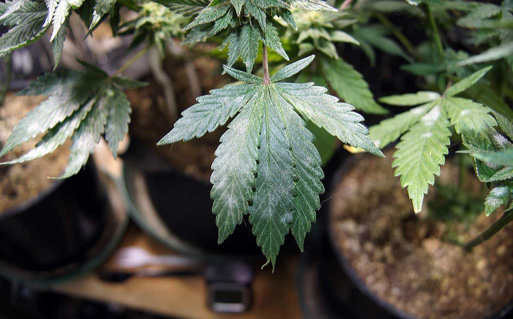

](https://www.growweedeasy.com/wp-content/uploads/2013/08/cannabis-white-powdery-mold-on-leaf.jpg)

White Powdery Mildew has such an easy time spreading that even careful growers who take proper precautions can still experience it.

*Picture courtesy of [Outer Elements Photography](https://www.outerelementsphotography.com/) ([Instagram](https://www.instagram.com/outer_elements/))*

Luckily, the issue in the picture above was easily resolved because it was caught early and because White Powdery Mildew is completely reversible up to a point.

This article will arm you with the information to stop WPM's proliferation before it even has a chance to take hold!

[

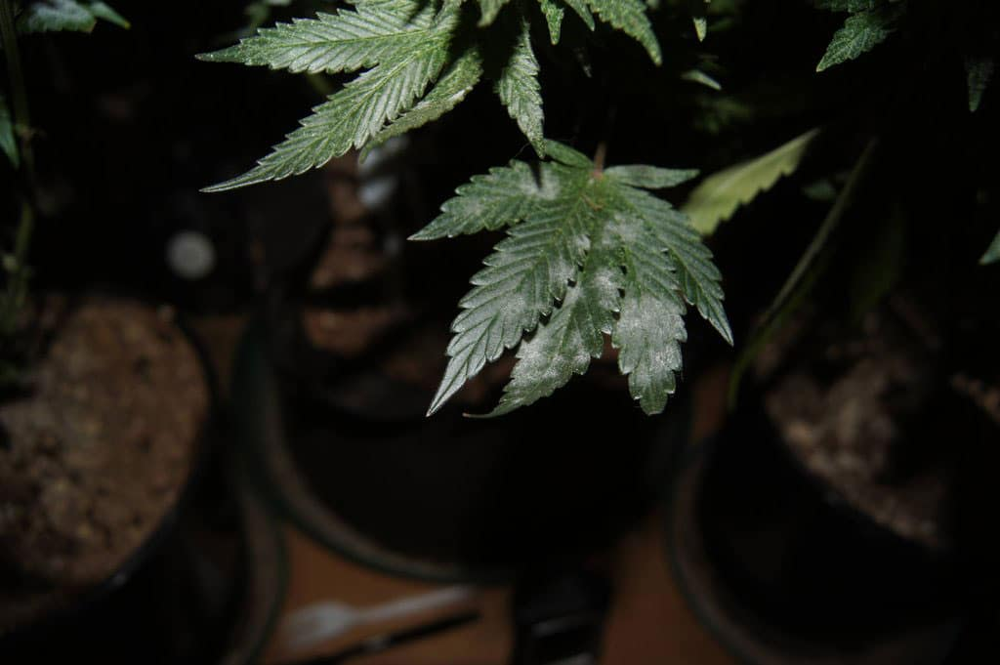

](https://www.growweedeasy.com/wp-content/uploads/2013/08/marijuana-leaves-white-powder-mold.jpg)

*Picture courtesy of [Outer Elements Photography](https://www.outerelementsphotography.com/) ([Instagram](https://www.instagram.com/outer_elements/))*

## **
 What IS White Powdery Mildew?**

White Powdery Mildew is a rapidly reproducing (both sexually AND asexually) fungus that only knows how to do two things:

* Eat your plants
* Make more White Powdery Mildew

Fortunately, White Powdery Mildew is easy to spot since it creates white patches of fungal growth that stand out against the green leaves of a cannabis plant.

It can be removed from plants with proper treatment if spotted early on, but any buds with WPM should be discarded as they most likely contain **many **more spores than your eyes can see.

[

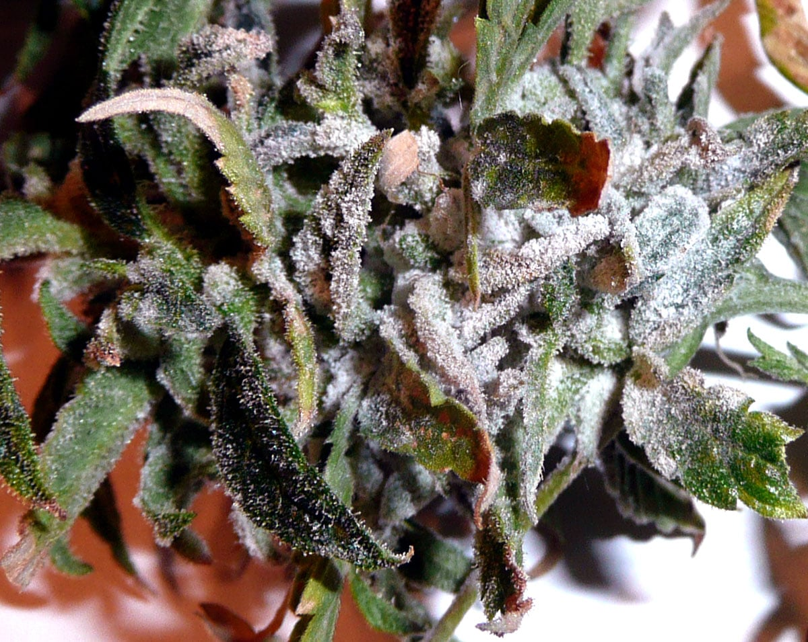

](https://www.growweedeasy.com/wp-content/uploads/2013/08/white-powdery-mold-closeup-marijuana-buds.jpg)

[

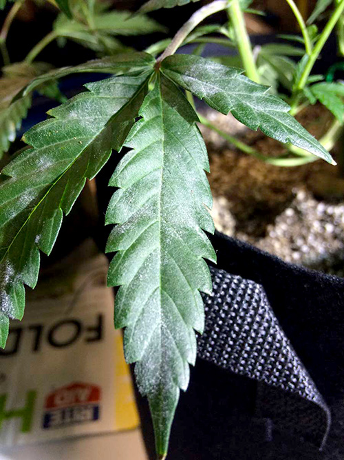

](https://www.growweedeasy.com/wp-content/uploads/2019/07/bad-wpm-white-powdery-mildew-mold-on-cannabis-leaves-mid.jpg)

## **What causes White Powdery Mildew?**

### **High Humidity**

* 

WPM needs moisture to thrive, but that doesn’t necessarily mean it needs water. Having a grow area with high humidity is all WPM needs to get started. This seems to be a bit problematic since young cannabis plants grow best in relatively humid environments (40% -60% RH). Luckily, high humidity usually only becomes an issue when it’s combined with the next cause (low/no airflow).

* 

People who live in environments with extremely high humidity (such as the southern US or anywhere in the UK) can purchase a dehumidifier to control humidity in the grow area. This is especially important during the flowering phase when humidity needs to be much lower (45% rh) to prevent the rampant growth of WPM **and** bud mold.

### **Low/No Airflow**

* 

White Powdery Mildew has a hard time settling in a grow room where the air is being moved. High humidity will give WPM the conditions it needs to survive, but poor airflow is what gives it the ability to settle down in the first place. In fact, a small (preferably oscillating) fan moving air in a grow area will prevent the vast majority of White Powdery Mildew woes.

### **Poor Ventilation**

* 

If you have WPM spores in your grow area and the air in grow area is never exchanged for fresh air, the spores get multiple chances to land on your plants and reproduce. This happens most often in conditions where cannabis is being grown in a closed, unventilated space - such as a closet - and precautions aren’t taken to exchange old stale air for new fresh air.

### **Leaf-on-Leaf Contact**

* 

Leaves that are touching each other will form moisture between them, and thus they become more likely to contract WPM. Untrained bushy/leafy plants with lots of new vegetative growth are especially prone since they will often have their leaves mashed up against each other as they try to reach toward the light.

* 

Advanced growers can [defoliate](https://www.growweedeasy.com/marijuana-defoliation-tutorial) some of the fan leaves that are completely shaded from the grow light to make fewer choice landing spots for White Powdery Mildew. Also, defoliation frees up energy for the plant to use when done correctly and increases yields! See our [article on defoliation](https://www.growweedeasy.com/marijuana-defoliation-tutorial) for more info.

[

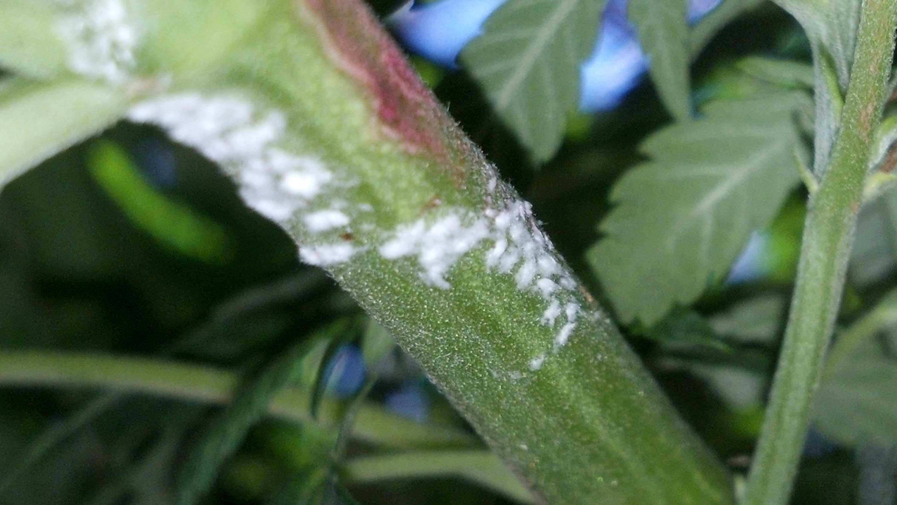

](https://www.growweedeasy.com/wp-content/uploads/2013/08/white-powdery-mold-stem.jpg)

## **How to Eliminate White Powdery Mildew**

As I mentioned earlier, I recently had a battle with White Powdery Mildew. Rather, it *might *have been a battle if I noticed it later or waited to fix the problem. That’s the one good thing about WPM: in most cases when WPM is caught early, you can remove all traces of the mildew without harming your plants.

There are quite a few products and homemade concoctions people use to treat WPM. Among the effective treatments are:

* **Milk** - Mix 1 part milk to 3 parts water and spray liberally while your grow lights are on. The type of milk (skim, 2%, whole, etc.) doesn't matter. Wet both sides of leaves if possible.
* [**Potassium bicarbonate**](https://www.amazon.com/Potassium-Bicarbonate-Earthborn-Elements-Pharmaceutical/dp/B07B8W4LFX?dchild=1&keywords=Potassium+bicarbonate+white+powdery+mildew&qid=1632025073&sr=8-2&linkCode=ll1&tag=4200a7-20&linkId=222f4ad92b3d52b1a03411bb0469b77b&language=en_US&ref_=as_li_ss_tl) - Dissolve 1 tbsp of potassium bicarbonate in 1 gallon of water.* Optional:* Add 1 tbsp vegetable oil and 3 drops of liquid dish soap. Spray plants lightly but evenly
* [**Baking soda**](https://www.amazon.com/HAMMER-Pure-Baking-Soda-Pack/dp/B00860VYYC?dchild=1&keywords=baking+soda&qid=1632025824&sr=8-1-spons&psc=1&smid=ASEVS99O6FS73&spLa=ZW5jcnlwdGVkUXVhbGlmaWVyPUEyVEI5OTFFWTNSWkxZJmVuY3J5cHRlZElkPUEwNjA1MzkyMVdaN1QwQ0tUS0hOMSZlbmNyeXB0ZWRBZElkPUEwNzgyMDQ2Mk9DNjZCNFA0MlJNRSZ3aWRnZXROYW1lPXNwX2F0ZiZhY3Rpb249Y2xpY2tSZWRpcmVjdCZkb05vdExvZ0NsaWNrPXRydWU%3D&linkCode=ll1&tag=4200a7-20&linkId=1eabdb5dc37e3ccdcf30e5471761741c&language=en_US&ref_=as_li_ss_tl) (not as effective as the other 2)- Mix 1 tbsp baking soda, 1 tsp liquid dish soap, and 1 gallon of water. Spray all the leaves top and bottom

Here's the simple strategy I use that gets rid of White Powdery Mildew on the first try, every time! Here’s my trusted **3-Step White Powdery Mold cure:**

* 

**Remove White Powdery Mildew from leaves** - Get some water (tap water works fine) and some paper towels. Wet the paper towels and use them to gently wipe the mildew off the affected leaves whilst being careful not to jostle any leaves with spores on them. Using a wet cloth will ensure that more spores stick to the cloth instead of becoming airborne. Note: While it isn’t necessary to use paper towels, their disposability helps to curb the spread of spores from one leaf to another.

* 

**Ensure plants have proper airflow and ventilation** - Even if you have absolutely no airflow or ventilation in your grow room, having just two fans will drastically reduce your chances of encountering WPM while also benefitting your plant's overall health. One fan should be oscillating if possible and should gently blow air over your plants. All the plants need is enough air to gently rustle their leaves which will make it hard for WPM to settle down. The second fan should be in your grow room pointing outward to exchange old air with fresh air. Having a fan pointing out of your grow room will force old air out of the room, and in turn, pull new air into the room. At this point, you’ll have new air coming in, being used and circulated, then kicked out. Keep in mind that two fans is a **minimum**.

* 

**Treat the infected plant with one of the options below to kill spores prevent future growth** - Mix up your treatment of choice in a clean [sprayer/mister](https://www.amazon.com/Chapin-1002-48-Ounce-Sprayer-Multi-purpose/dp/B00002N8OB/ref=as_li_ss_tl?_encoding=UTF8&pd_rd_i=B00002N8OB&pd_rd_r=W4A5MVZWMFWH74AT55F1&pd_rd_w=UPVXy&pd_rd_wg=EwzKa&psc=1&refRID=W4A5MVZWMFWH74AT55F1&linkCode=ll1&tag=4200a7-20&linkId=a2d7c98e205d36298c69fe10d350e28b). Spray all the leaves top and bottom, even if you don't see WPM on them.

There you have it! If you end up running into White Powdery Mildew, give this advice a shot and you won’t have to deal with it past that first day. If you do end up using these steps, feel free to let us know if it helped you or not, or how you did it differently. When growers know just a little bit about this plant disease, it doesn’t have a chance!

[

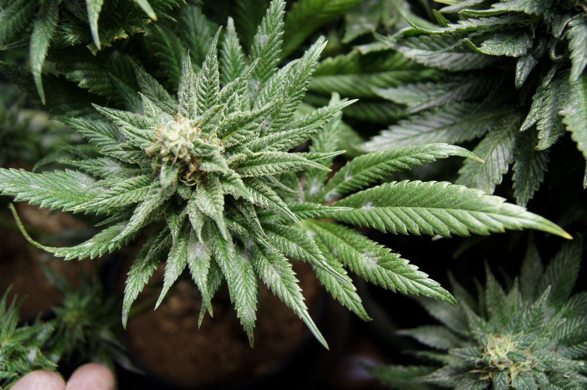

](https://www.growweedeasy.com/wp-content/uploads/2013/08/marijuana-buds-with-white-powdery-mildew.jpg)

## **White Powdery Mildew Defense**

What's the easiest way to fight against White Powdery Mildew? 

**Have it completely outgunned!**

Get the right stuff to let White Powdery Mildew know that your grow room is off-limits.

**[Handheld Mister/Sprayer](https://www.amazon.com/Chapin-1002-48-Ounce-Sprayer-Multi-purpose/dp/B00002N8OB/ref=as_li_ss_tl?_encoding=UTF8&pd_rd_i=B00002N8OB&pd_rd_r=W4A5MVZWMFWH74AT55F1&pd_rd_w=UPVXy&pd_rd_wg=EwzKa&psc=1&refRID=W4A5MVZWMFWH74AT55F1&linkCode=ll1&tag=4200a7-20&linkId=a2d7c98e205d36298c69fe10d350e28b) **- A mister is awesome for applying treatment. Also, it's the best way to foliar feed your plants.

Here are the most common white powdery mildew remedies:

**Milk **- Mix 1 part milk to 3 parts water and spray liberally while your grow lights are on. The type of milk (skim, 2%, whole, etc.) doesn't matter. Wet both sides of leaves if possible.

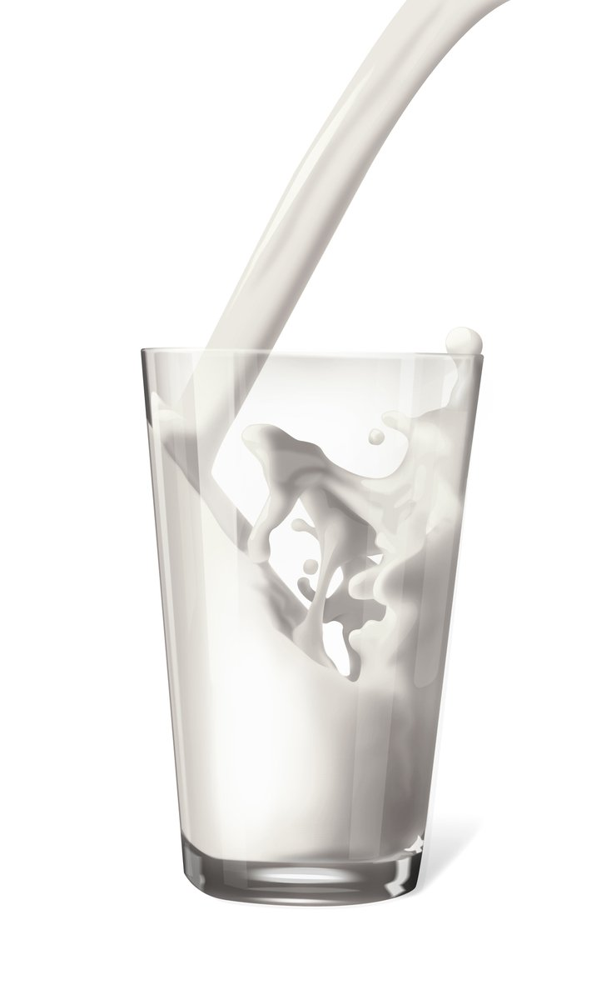

[**Potassium bicarbonate **](https://www.amazon.com/Potassium-Bicarbonate-Earthborn-Elements-Pharmaceutical/dp/B07B8W4LFX?dchild=1&keywords=Potassium+bicarbonate+white+powdery+mildew&qid=1632025073&sr=8-2&linkCode=ll1&tag=4200a7-20&linkId=222f4ad92b3d52b1a03411bb0469b77b&language=en_US&ref_=as_li_ss_tl)- Dissolve 1 tbsp of potassium bicarbonate in 1 gallon of water. Optional: Add 1 tbsp vegetable oil and 3 drops of liquid dish soap. Spray plants lightly but evenly. Do this during lights off.

[

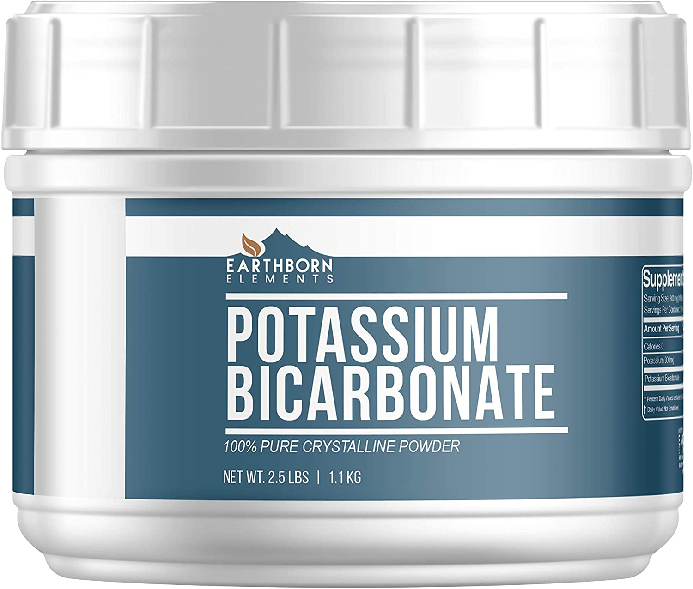

](https://www.amazon.com/Potassium-Bicarbonate-Earthborn-Elements-Pharmaceutical/dp/B07B8W4LFX?dchild=1&keywords=Potassium+bicarbonate+white+powdery+mildew&qid=1632025073&sr=8-2&linkCode=ll1&tag=4200a7-20&linkId=222f4ad92b3d52b1a03411bb0469b77b&language=en_US&ref_=as_li_ss_tl)

[**Baking soda **](https://www.amazon.com/HAMMER-Pure-Baking-Soda-Pack/dp/B00860VYYC?dchild=1&keywords=baking+soda&qid=1632025824&sr=8-1-spons&psc=1&smid=ASEVS99O6FS73&spLa=ZW5jcnlwdGVkUXVhbGlmaWVyPUEyVEI5OTFFWTNSWkxZJmVuY3J5cHRlZElkPUEwNjA1MzkyMVdaN1QwQ0tUS0hOMSZlbmNyeXB0ZWRBZElkPUEwNzgyMDQ2Mk9DNjZCNFA0MlJNRSZ3aWRnZXROYW1lPXNwX2F0ZiZhY3Rpb249Y2xpY2tSZWRpcmVjdCZkb05vdExvZ0NsaWNrPXRydWU%3D&linkCode=ll1&tag=4200a7-20&linkId=1eabdb5dc37e3ccdcf30e5471761741c&language=en_US&ref_=as_li_ss_tl)(not as effective as milk or Potassium bicarbonate )- Mix 1 tbsp baking soda, 1 tsp liquid dish soap, and 1 gallon of water. Spray all the leaves top and bottom.

Now on to some bottled cures&#8230;

[**Garden Safe Brand Fungicide3 **](https://www.amazon.com/Garden-Safe-Fungicide3-Ready-24-Ounce/dp/B000HHO110?hvadid=167152075853&hvpos=&hvnetw=g&hvrand=15933789978588863259&hvpone=&hvptwo=&hvqmt=&hvdev=c&hvdvcmdl=&hvlocint=&hvlocphy=9061219&hvtargid=pla-305977007403&psc=1&linkCode=ll1&tag=4200a7-20&linkId=ab606888fd7f94b28f345413f01b729d&language=en_US&ref_=as_li_ss_tl)- Organic (OMRI listed) - Follow the instructions on the label

[**Lost Coast Plant Therapy**](https://www.amazon.com/Lost-Coast-Plant-Therapy-Insecticide/dp/B076ZSZGRJ?crid=R6AB5QNKCWXJ&keywords=lost+coast+plant+therapy&qid=1562967478&s=gateway&sprefix=lost+coast+plant%2Caps%2C174&sr=8-1-spons&th=1&linkCode=ll1&tag=4200a7-20&linkId=8e46cf6ea45c3bf6a763af9a2ff34b77&language=en_US&ref_=as_li_ss_tl) (expensive) - Kills white powdery mildew as well as several other pests and it's safe for flowers, pets, and people. Handy to have around the grow room.

[

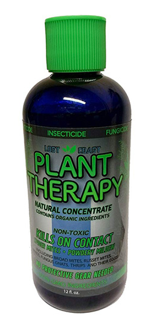

](https://amzn.to/2NURtAG)

[**GrowSafe**](https://amzn.to/2l5g0VB) (expensive) - Another safe-for-buds pesticide that kills WPM and other pests. OMRI-listed as organic

[

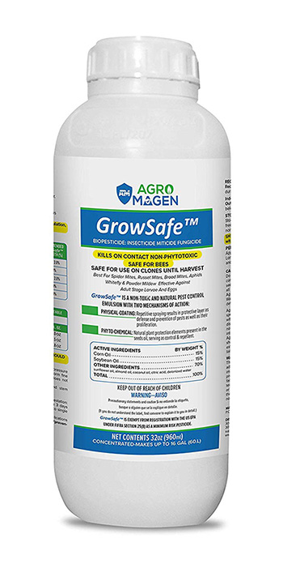

](https://amzn.to/2l5g0VB)

*Note: SM-90 is no longer available! Find out more here: [What happened to SM-90?](https://www.growweedeasy.com/what-happened-to-sm-90)*

**Bonus:** [Glookies](https://www.seedsman.com/us-en/glookies-feminised-seeds-bfs-glook-fem?a_aid=536dc52ef2d64) strain is resistant to mold and poor environmental conditions. This one survived high humidity to produce great yields with *strong* bud effects.

## [

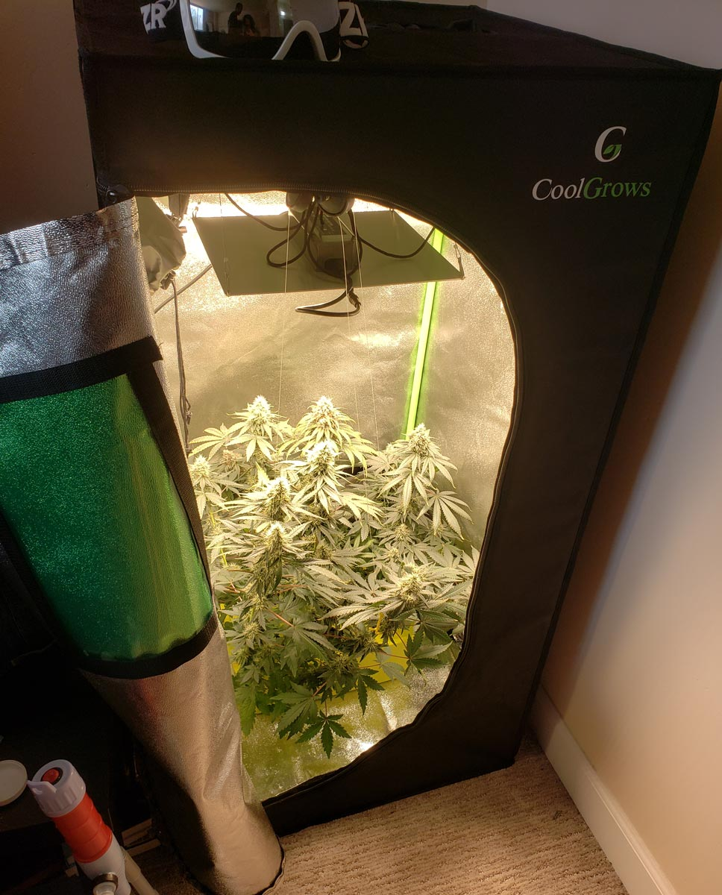

](https://www.growweedeasy.com/wp-content/uploads/2021/01/hydro-dwc-mini-tent.jpg)

*You might like&#8230;.*

[Cannabis Problems Guide](https://www.growweedeasy.com/marijuana-symptoms)

* [How to Help Yellow Seedlings](https://www.growweedeasy.com/how-to-help-yellow-cannabis-seedlings)
* [How to Fix Yellow Cannabis Leaves](https://www.growweedeasy.com/why-cannabis-leaves-yellow)
* [How to Fix Curling and Clawing Cannabis Leaves](https://www.growweedeasy.com/curling-or-clawing-cannabis-leaves)
* [What Causes Dry or Crispy Leaves?](https://www.growweedeasy.com/what-causes-leaves-to-get-dry-or-crispy-and-how-do-I-fix-it)

[Diagnose Your Sick Plant](https://www.growweedeasy.com/cannabis-symptoms-pictures)

[Bugs & Other Cannabis Pests](https://www.growweedeasy.com/bugs-pests-symptoms-marijuana-grow)

[How to Prevent Nutrient Deficiencies](https://www.growweedeasy.com/ph)

[7-Step Remedy That Fixes 99% of Grow Problems](https://www.growweedeasy.com/5-step-solution-to-most-cannabis-growing-problems)

## Wind Burn

by Nebula Haze

Most indoor cannabis growers use fans to blow air around within the grow area. This creates a nice breezy environment that cannabis plants love. But sometimes there can be too much breeze!

Be Careful! **Too Much** Wind Causes Clawed Leaves and Sometimes Spots

When there’s too much breeze, the affected marijuana leaves will start getting “wind-burned.”

[

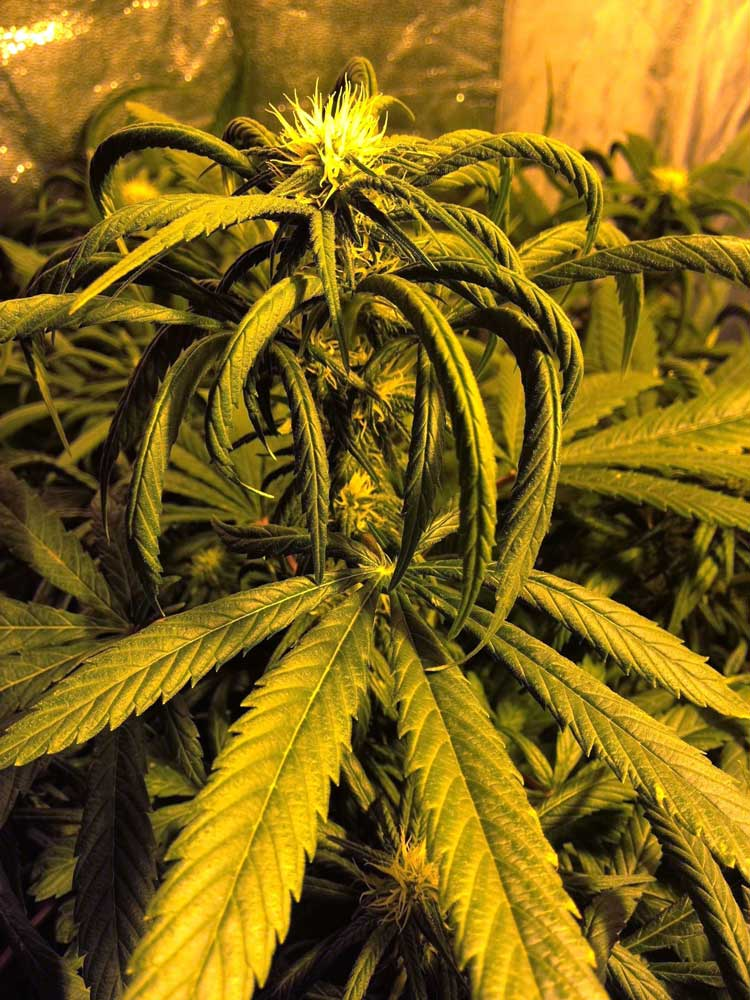

](https://www.growweedeasy.com/wp-content/uploads/2017/02/wind-burned-leaves-clawing.jpg)

Wind-burned leaves are often curved under and form “claws.” They can look like they’re droopy from [overwatering](https://www.growweedeasy.com/overwatering-cannabis), [underwatering](https://www.growweedeasy.com/underwatering-cannabis), or possible a [nitrogen toxicity](https://www.growweedeasy.com/nitrogen-toxicity-cannabis), but you know you’ve got wind-burn when the leaves in front of the fan are clawing, and leaves further away from the fan look fine.

[

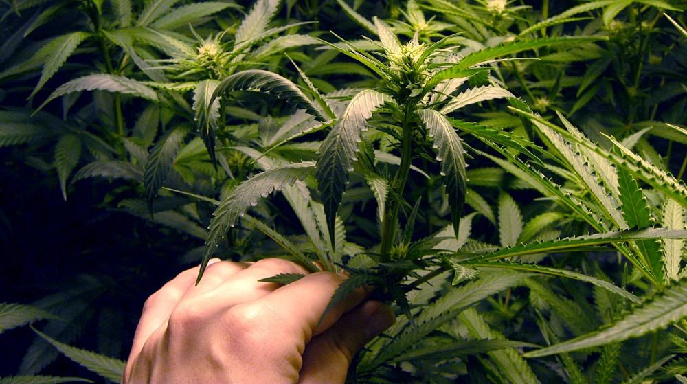

](https://www.growweedeasy.com/wp-content/uploads/2017/02/wind-burn.jpg)

Just for reference, here’s what too much wind/fan looks like!

**Too Much Fan!**

*

Sometimes too high levels of wind can cause other unusual problems on the affected leaves, such as brown or bronze spots that almost look like burn marks. These are the result of the leaf not being able to fulfill all its normal processes.

[

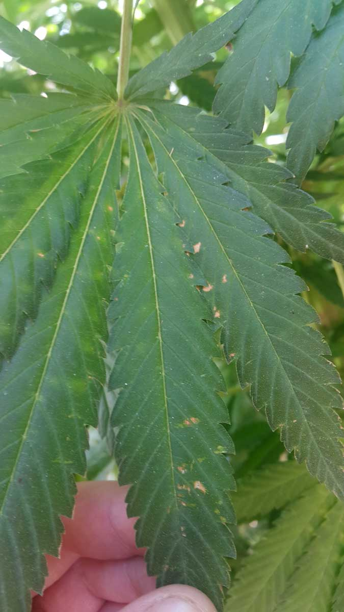

](https://www.growweedeasy.com/wp-content/uploads/2017/02/cannabis-wind-leaf-damage.jpg)[

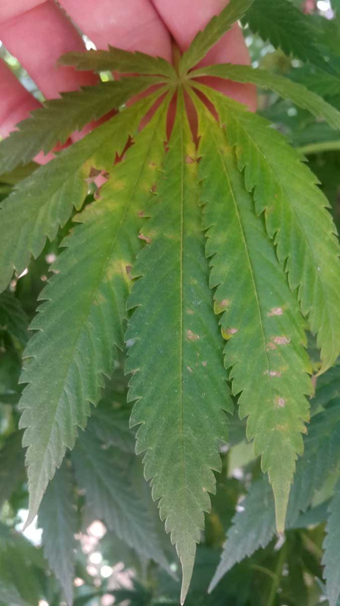

](https://www.growweedeasy.com/wp-content/uploads/2017/02/wind-leaf-damage-spots.jpg)

A closeup of those wind burn leaf spots - not bugs, not a [nutrient deficiency](https://www.growweedeasy.com/cannabis-symptoms-pictures)!

[

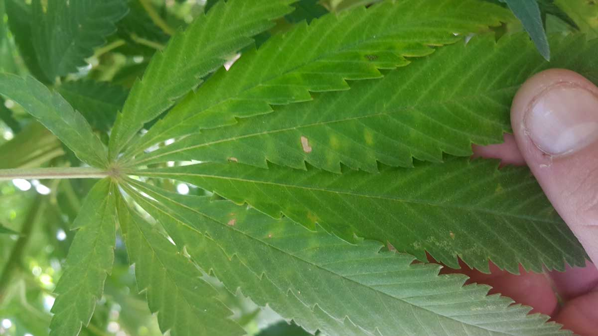

](https://www.growweedeasy.com/wp-content/uploads/2017/02/wind-leaf-damage-spots-cannabis.jpg)

**Placing Fans**

* 

Ideally you’d like a nice breeze surrounding the main canopy, which means you want air blowing above and under the plants.

* 

All the leaves should be gently rustling in the best-case scenario, but should never be waving around.

* 

Don’t point a strong fan directly at a plant, because too much wind can start to damage the leaves and stems. Sometimes if you have a small space it's better to point the fan at the wall than directly at the plants.

* 

After placing fans, check around the grow area to make sure that all parts get a slight breeze. If you feel stagnant air or a lack or breeze, you may want to adjust your fans.

* 

Small oscillating fans are great for the grow space since they’re cheap and can be used to provide a nice gentle breeze to a relatively wide area without blowing on any one part too long.

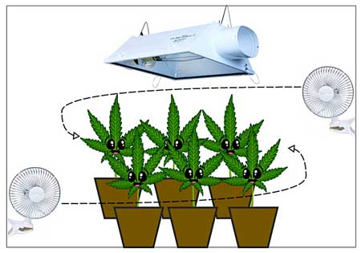

If you cannot get rid of the clawing symptoms from marijuana wind burn, please consult our [7-Step Remedy to 99% of Cannabis Growing Problems](https://www.growweedeasy.com/growing-marijuana-plant-problem-deficiency) for more help!

## Zinc Deficiency

**Problem:** With a cannabis zinc deficiency, younger leaves start yellowing in between the veins. Leaf tips get discolored and start dying. the leaves may take on a unique banded appearance and the plant may stop growing vertically. There may be much less space between new nodes, which can cause new leaves to start bunching together. If the plant is budding, its flowers may stop growing or even start dying if the problem isn't corrected.

[

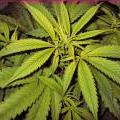

](https://www.growweedeasy.com/wp-content/uploads/2010/04/zinc-deficiency-cannabis.jpg)[

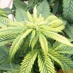

](https://www.growweedeasy.com/wp-content/uploads/2010/04/zinc-deficiency-marijuana.jpeg)

**Solution For Cannabis Zinc Deficiency**

*Note: *Sometimes a cannabis zinc deficiency (like all deficiencies) can be triggered by stressful conditions and may clear up on its own after the period of stress is over. However, to minimize damage it's important to react to any growing problem as quickly as possible, especially in the flowering stage.

1.) Adjust pH to Correct Range

The most common reason growers will see a zinc deficiency is when the pH at the roots is too high. Zinc tends to get locked at higher pH levels and is better absorbed by the plant in a more acidic root environment.

**If you suspect your growing cannabis plant has a zinc deficiency due to too-high pH, **flush your system with clean, pH'd water. This will remove any nutrient salts that may be affecting the uptake of zinc and help restore pH to the proper levels.

* In **soil**, zinc is best absorbed by the roots in the **6.0 - 6.5 pH** range (although it's generally recommended for soil growers to keep pH in the 6.0-7.0 range, zinc tends to be absorbed better on the lower side)
* In **hydro**, zinc is best absorbed by the roots in the** 5.5 - 6.0 pH** range (although it's generally recommended for hydro growers to keep pH in the 5.5-6.5 range, zinc tends to be absorbed better on the lower side)

[Learn how to manage your pH](https://www.growweedeasy.com/how-do-i-check-the-pH-of-my-water) for growing cannabis.

2.) Give the Right Nutrients

The truth is, most cannabis growers **don't **need to add more zinc in response to a zinc deficiency!

In fact, most growers have actually already given plenty of zinc to their cannabis plants since it is found abundantly in most tap water. If you're using [quality soil](https://www.growweedeasy.com/organic-super-soil) or [cannabis-friendly nutrients](https://www.growweedeasy.com/nutrients), you probably don't need to worry about adding more zinc. In general, zinc deficiencies are more likely to appear when a grower is using heavily filtered or reverse osmosis (RO) water to feed plants since any zinc has been removed, but pH is a much more common reason growers see zinc deficiencies in their cannabis plants.

3.) Take Good Care of the Roots

Zinc deficiencies can show up with the plant is having [root problems](https://www.growweedeasy.com/cannabis-root-problems) or if the plant is [overwatered](https://www.growweedeasy.com/overwatering), even if the pH is right and the zinc is there. [Proper watering practices](https://www.growweedeasy.com/how-often-water-marijuana) help plants grow healthy and avoid a host of problems!

4.) Watch for Recovery

After going through all the above steps, watch to make sure that the zinc deficiency starts to clear up within a few days to a week or so. The damaged leaves may not recover completely, but you know you're in the clear when you stop seeing symptoms on new leaves.

If you cannot get rid of a cannabis zinc deficiency, please consult our [7-Step Cure to 99% of Cannabis Growing Problems](https://www.growweedeasy.com/growing-marijuana-plant-problem-deficiency)

 

[Share](https://www.facebook.com/sharer/sharer.php?u=https%3A%2F%2Fdevelopers.facebook.com%2Fdocs%2Fplugins%2F&src=sdkpreparse)

* Company

This field is for validation purposes and should be left unchanged.

* Was this article helpful?

  Yes
*   No

* Oh no! How can we improve?

* 

 Get Your Free
Grow Guide!

5 Keys to Growing Weed

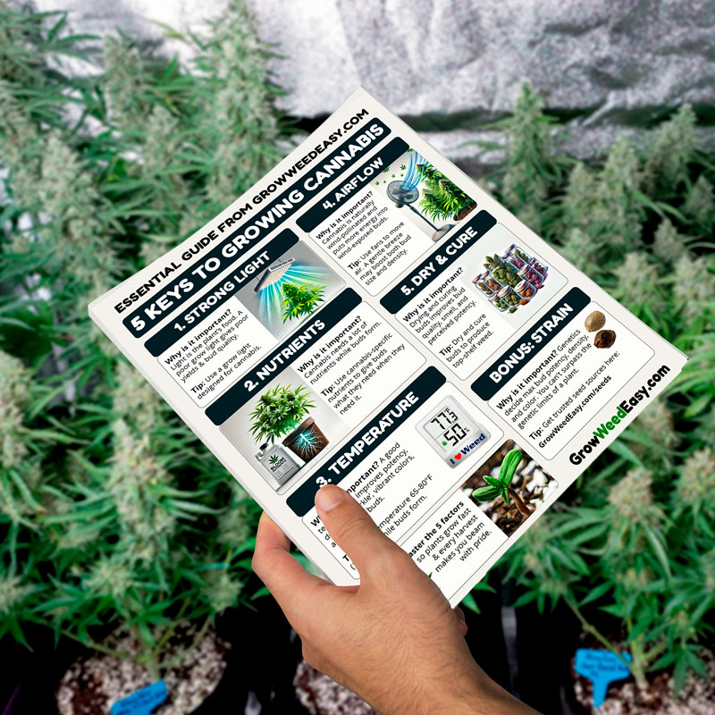

  Enter Your Email Here:  Turn Seeds into Weed!

 We respect your [email privacy](https://www.growweedeasy.com/message/email-privacy-policy).

[

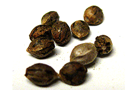

](https://seedsupreme.com/#grower)

[See OUR favorite seed sources!](https://www.growweedeasy.com/seeds)

  [Get Extra Growing Help](http://forum.growweedeasy.com/forum/growing-community)

**May 2026**

* [What’s confusing you about your grow?](https://www.growweedeasy.com/whats-confusing-you-about-your-grow)
* [Mr. Miyagi Wants You to Become a Black Belt Grower](https://www.growweedeasy.com/mr-miyagi-wants-you-to-become-a-black-belt-grower)
* [Harvest Rescue: How to Beat the Mid-Flower Curse](https://www.growweedeasy.com/mid-flower-yellow-leaves-cannabis)
* [Your soil might be ruining your cannabis grow](https://www.growweedeasy.com/cannabis-bad-soil)
* [Best Soil Nutrients & Supplements for Cannabis?](https://www.growweedeasy.com/best-soil-nutrients-for-cannabis)
* [How to Grow World-Class Weed for Under $150 (with $5 Cannabis Seeds)](https://www.growweedeasy.com/cheapest-way-to-grow-weed-indoors)

**April 2026**

* [Nebula’s Best Autoflower Seeds of 2026 (Fast, Potent, High Yields)](https://www.growweedeasy.com/2026-guide-to-cannabis-auto-flowering-strains)
* [Fast Outdoor Strains for a Quicker Cannabis Harvest (Short Summer, Late Planting…)](https://www.growweedeasy.com/fastest-outdoor-cannabis-strains-for-late-planting)
* [How to Prevent Bugs (Outdoor Cannabis Pest Guide)](https://www.growweedeasy.com/how-to-prevent-bugs-outdoor-cannabis-pest-guide)
* [What’s going on with the new U.S. cannabis seed law?](https://www.growweedeasy.com/whats-going-on-with-the-new-u-s-cannabis-seed-law)
* [How Often Do I Water Indoor Marijuana Plants?](https://www.growweedeasy.com/how-often-water-marijuana)
* [My Experience Growing GG4 x Zkittles Seeds](https://www.growweedeasy.com/my-experience-growing-gg4-x-zkittles)
* [My cannabis seeds are soooo small and flimsy…. Are they viable?](https://www.growweedeasy.com/small-flimsy-cannabis-seed-viability)
* [What Successful Outdoor Growers Did Differently](https://www.growweedeasy.com/outdoor-grow-success-factors-2026)
* [Why Weed Doesn’t Smell Like It Used To (Skunk vs Sweet)](https://www.growweedeasy.com/why-weed-doesnt-smell-like-it-used-to-skunk-vs-sweet)
* [Is it safe to buy cannabis clones online?](https://www.growweedeasy.com/is-it-safe-to-buy-cannabis-clones-online)
* [“F1” Cannabis Seeds: Best-kept secret in cannabis genetics?](https://www.growweedeasy.com/f1-cannabis-strain-best-kept-secret-in-cannabis-genetics)
* [Why Identical Grows Produce Totally Different Results (It’s the Seeds)](https://www.growweedeasy.com/same-grower-same-setup-why-totally-different-results)

**March 2026**

* [How to Make Cannabis Gummies (Weed Gummy Bears)](https://www.growweedeasy.com/cannabis-gummies-weed-gummy-bears)
* [Best Marijuana Strains for Beginner Growers](https://www.growweedeasy.com/best-marijuana-strains-beginners)
* [What happens if I grow seeds from a hermie plant?](https://www.growweedeasy.com/what-happens-if-i-grow-seeds-from-a-hermie-plant)
* [How to Make Fantastic Bubble Hash from Bud or Trim](https://www.growweedeasy.com/cannabis-bubble-hash)
* [Portable cup bong – Stealthiest device to smoke weed on the go](https://www.growweedeasy.com/portable-cup-bong-stealthiest-device-to-smoke-weed-on-the-go)
* [How to Hide Weed Smell (Smoking, Traveling & Growing)](https://www.growweedeasy.com/hide-weed-smell)
* [Why Harvest Timing Isn’t Always Clear (And How to Tell Anyway)](https://www.growweedeasy.com/why-harvest-timing-isnt-always-clear-and-how-to-tell-anyway)
* [10 Unexpected Tools That Make Growing Weed Easier](https://www.growweedeasy.com/unexpected-grow-tools)

**February 2026**

* [GrowWeedEasy.com Harvest Survey – Spring 2026](https://www.growweedeasy.com/harvest-survey-spring-2026)
* [Best Soil Nutrients for Cannabis](https://www.growweedeasy.com/best-soil-nutrients-for-cannabis)
* [What’s the Best Soil for Growing Cannabis?](https://www.growweedeasy.com/what-soil-is-good-for-growing-cannabis)
* [Mars Hydro TSL2000 LED Grow Setup (300W)](https://www.growweedeasy.com/mars-hydro-tsl2000-led-cannabis-grow-setup-tutorial-300w-led)
* [5 Best LED Grow Lights 2026](https://www.growweedeasy.com/5-best-led-grow-lights-2026-cannabis-yields-speed-bud-quality)
* [Nebula’s Cannabis Grow Journals & Experiments](https://www.growweedeasy.com/side-by-side-cannabis-grow-journal-experiments-by-nebula-haze)
* [“Defoliation Deep Dive” Cannabis Yield Multiplier](https://www.growweedeasy.com/nebulas-flowering-stage-defoliation-tutorial)
* [How To Get To Harvest Faster](https://www.growweedeasy.com/how-to-get-to-harvest-as-fast-as-possible)
* [Difference Between “Fast” and Autoflower Strains](https://www.growweedeasy.com/difference-fast-strains-auto-flowering-cannabis-strains)
* [Best Outdoor Autoflowering Cannabis Strains (2026)](https://www.growweedeasy.com/best-outdoor-autoflowering-cannabis-strains-2026)
* [The 5 Microskills Every Grower Eventually Learns](https://www.growweedeasy.com/the-5-microskills-every-grower-eventually-learns)
* [How Many Cannabis Plants Should I Grow?](https://www.growweedeasy.com/how-many-plants-to-grow)
* [5 Steps to Give Cannabis Plants the Best Start](https://www.growweedeasy.com/5-steps-to-give-cannabis-plants-the-best-start)
* [Why Hydro Feels Like Cheating (Plus 7 Tips)](https://www.growweedeasy.com/7-secrets-no-problems-cannabis-hydroponic-dwc-cultivation)

**January 2026**

* [“Sweet Dreams” Photoperiod Grow Journal](https://www.growweedeasy.com/sweet-dreams-photoperiod-grow-journal-in-progress)
* [Fast Outdoor Strains for a Quicker Harvest](https://www.growweedeasy.com/fastest-outdoor-cannabis-strains-for-late-planting)
* [How to Grow Cannabis Outdoors (Easier Method)](https://www.growweedeasy.com/beginner-guide-to-growing-cannabis-outdoors)
* [How to Make Cannabis Clones with an Aero Cloner](https://www.growweedeasy.com/how-to-make-cannabis-clones-aero-cloner)
* [Best Marijuana Strains for Beginner Growers](https://www.growweedeasy.com/best-marijuana-strains-beginners)
* [How to Increase “DLI” for Bigger Yields](https://www.growweedeasy.com/how-to-increase-dli-for-bigger-yields-daily-light-integral-tips)
* [When Are Marijuana Buds Ready to Harvest?](https://www.growweedeasy.com/harvest)
* [Complete Drying & Curing Marijuana Guide](https://www.growweedeasy.com/drying-curing)
* [The 3 Signs of a Great Grower](https://www.growweedeasy.com/the-3-signs-of-a-great-grower)
* [The First 3 Weeks Decide Everything](https://www.growweedeasy.com/the-first-3-weeks-decide-everything)
* [What Is VPD and Why Do Growers Care?](https://www.growweedeasy.com/vpd)
* [What Do Good Cannabis Seeds Look Like?](https://www.growweedeasy.com/what-do-cannabis-seeds-look-like)
* [My Experience with White Rhino Seeds (Hydro)](https://www.growweedeasy.com/my-experience-white-rhino-cannabis-seeds-hydro)
* [What Is the Solo Cup Challenge?](https://www.growweedeasy.com/solo-cup-challenge-grow-weed-in-a-cup)
* [How to Clone Weed in a Cup of Water](https://www.growweedeasy.com/how-to-clone-weed-in-a-cup-of-water-easy)
* [Grow Better Weed: The 5 Core Principles](https://www.growweedeasy.com/how-to-grow-better-weed-at-home)
* [Why Are My Cannabis Buds Growing So Small?](https://www.growweedeasy.com/why-are-my-cannabis-buds-so-small)
* [My Review of the Volcano Vaporizer](https://www.growweedeasy.com/review-volcano-tabletop-vaporizer-cannabis)
* [GrowWeedEasy Strain Library](https://www.growweedeasy.com/strain-library)

**[View list of ALL articles!](https://www.growweedeasy.com/the-basics)**

 [Return to Top of Page](javascript:void(0))

* [Recent Updates](/the-basics)
* [About Us](/about)
* [Privacy Policy &#038; Disclaimers](/privacy-policy)
* [Newsletter / Email Policy](/email-privacy-policy)
* [Free Ways to Help Grow Weed Easy](https://www.growweedeasy.com/how-to-support-growweedeasy-com)
* [Contact Us](/website-feedback/)
 [*](https://www.instagram.com/growweedeasy/) [**](https://www.facebook.com/growweedeasy/) [**](https://www.pinterest.com/growweedeasy/) [**](https://www.linkedin.com/in/nebula-haze/)

GrowWeedEasy.com was [founded in 2010](https://www.growweedeasy.com/about) by Nebula Haze and Sirius Fourside. Featured in *High Times*, Ed Rosenthal’s books, *Cannabis Business Times*, and *Skunk Magazine*, GrowWeedEasy.com is the **#1 free resource in the world** for learning how to grow cannabis at home. Our simple step-by-step tutorials make it easy for anyone to grow great weed. **[Sign up for our free newsletter](https://www.growweedeasy.com/message/news)** to get grow tips delivered every Sunday at 4:20 AM.

Copyright &copy; 2010 - 2026. All rights reserved. 
 Note: As an Amazon Associate, GrowWeedEasy.com earns a commission from qualifying purchases.

 [**](#slide_menu)  

* [Home](/)
* [Start Here](#)
[The Beginner's Guide](https://www.growweedeasy.com/basics)
* [How to Grow Cannabis in 10 Steps](/10-step-grow-guide)
* [Germinate Your Seeds!](/germinate)
* [Use the Right Nutrients](/nutrients)
* [Cannabis Grow Lights](/cannabis-grow-lights)
* [When Do I Harvest?](/harvest)
* [How to Dry &#038; Cure Buds](/drying-curing)
* [New Grower Shopping List](/growing-cannabis-setup-examples)
* [Ask Questions!](/forum/growing-community)

* [Problems &#038; Symptoms](#)
[Cannabis Problems Guide](/marijuana-symptoms)
* [Diagnose Your Sick Plant](/cannabis-symptoms-pictures)
* [Bugs, Mold, &#038; Other Cannabis Pests](/bugs-pests-symptoms-marijuana-grow)
* [Stop Nutrient Deficiencies](/ph)
* [5-Step Cure to Most Plant Problems](/5-step-solution-to-most-cannabis-growing-problem)

* [Tutorials](#)
[Examples of Good Grow Setups](/growing-cannabis-setup-examples)
* [Marijuana Growth Timeline](/how-long-does-it-take-to-grow-weed)
* [Tiny LED Grow for $300 Guide](/how-to-grow-cannabis-for-300-in-this-mini-grow-kit-up-to-3-oz-harvest-shopping-list-grow-tutorial)
* [Cheapskate Grow for $150 Guide](https://www.growweedeasy.com/cheapest-way-to-grow-weed-indoors)
* [Organic Super Soil Guide](/organic-super-soil)
* [Bubbleponics Grow Guide](/high-yield-bubbleponics-technique)
* [200W LED Grow 5-11 oz Guide](/200w-led-spider-farmer-sf-2000-cannabis-setup-shopping-list-grow-tutorial)
* [How to Grow 1 lb of Weed Indoors](https://www.growweedeasy.com/how-to-grow-1-pound-of-weed-indoors-proven-method-grow-tent)
* [List of ALL Tutorials](/the-basics)

* [Growing Topics](#)
[5 Ways to Increase Yields](/how-to-increase-yields-indoors)
* [How to Improve Bud Quality](/7-tips-to-growing-top-shelf-buds)
* [Nebula’s Cannabis Grow Journals](https://www.growweedeasy.com/side-by-side-cannabis-grow-journal-experiments-by-nebula-haze)
* [Male vs Female Plants](/marijuana-boy-girl)
* [How to Control Smell](/smell)
* [The Perfect Environment](/perfect-growing-environment)
* [Plant Training Yield Guide](/cannabis-plant-training)
* [Grower's Glossary](https://www.growweedeasy.com/growweedeasys-growers-glossary)
* [&#8230;and LOTS more!](/the-basics)

* [Seeds](/seeds)
* [Grow Tools &#038; Calculators](https://www.growweedeasy.com/grow-tools-calculators)
[Plant Doctor](https://www.growweedeasy.com/cannabis-symptoms-pictures)
* [Electricity Usage Calculator](https://www.growweedeasy.com/electricity-usage-calculator)
* [Nutrient Schedule Calculator](https://www.growweedeasy.com/nutrient-schedule-calculator)
* [LED Selector](https://www.growweedeasy.com/led-selector)
* [All Tools &#038; Calculators](https://www.growweedeasy.com/grow-tools-calculators)

* [Harvest Book](https://homegrowmasterclass.com/product/harvest-your-guide-to-the-good-part/?utm_source=mobilemenu&#038;utm_medium=content&#038;utm_campaign=bookgreen&#038;utm_content=harvestbook)
* [Submit PIcs](/submit-trophy-pics)
* [Harvest Book](https://homegrowmasterclass.com/product/harvest-your-guide-to-the-good-part/)
* [Sitemap](/link-guide-growing-cannabis)
* [Newsletter signup](https://www.growweedeasy.com/message/news)
* [Glossary](https://www.growweedeasy.com/growweedeasys-growers-glossary)
* [About](https://www.growweedeasy.com/about)
* [Contact](https://www.growweedeasy.com/website-feedback)
* [GIVE ME GROW TIPS!](https://www.growweedeasy.com/message/news)